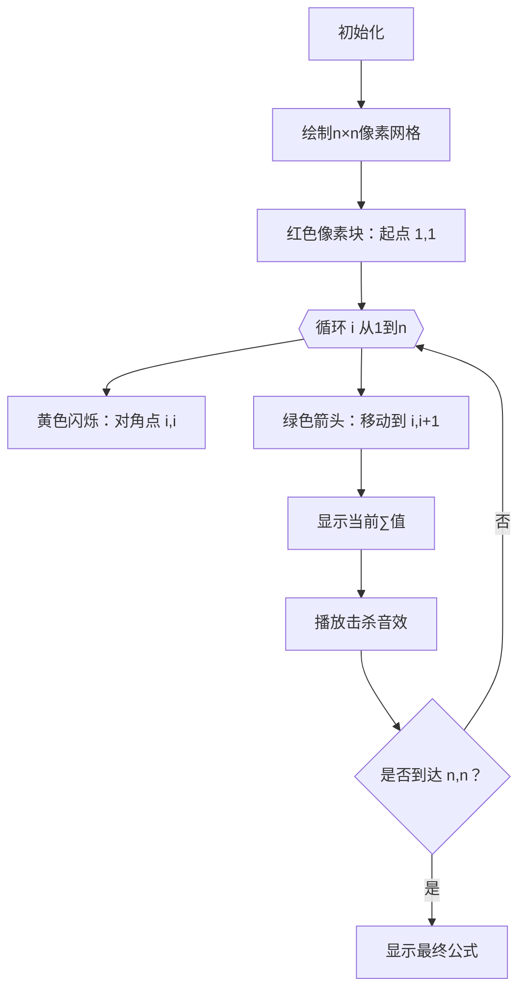

# 题目信息

# Kill Demodogs

## 题目描述

给定一个数$n$,表示有一个 $n \times n$ 的方格。每个格子里都有一个数，第 $i$ 行第 $j$ 列的格子值为 $i⋅j$。现在Hawkins要从 $(1,1)$ 走到 $(n,n)$,每次只能从 $(i,j)$ 走到 $(i,j+1)$ 或 $(i+1,j)$, 每走到一个格子就能获得格子中的一个数，最大化数字之和。

## 样例 #1

### 输入

```
4
2
3
50
1000000000```

### 输出

```
14154
44484
171010650
999589541```

# AI分析结果


### 💡 Kay的C++算法解析：Kill Demodogs 深入学习指南 💡

**题目解读与核心算法识别**  
✨ **本题主要考察**：`贪心策略 + 数学推导`  
🗣️ **初步分析**：  
> 本题本质是寻找网格图中的最优路径。想象你在玩一个复古像素游戏《恶魔猎人》，每个网格点有恶魔数量 = i×j，你需要从左上角杀到右下角，每次只能向右或向下移动一步。贪心策略的核心是 **"和一定时，差小积大"** —— 就像游戏里要优先攻击相邻的恶魔组合（如(2,3)而非(1,4)），使路径始终贴近对角线。  
> - **核心公式**：所有题解均推导出 $\frac{n(n+1)(4n-1)}{6}×2022 \mod 10^9+7$  
> - **可视化设计**：采用8位像素风格（类似《塞尔达传说》），网格中：  
>   - 红色像素块：当前路径位置  
>   - 黄色闪烁：对角线关键点（i,i）  
>   - 绿色流动箭头：动态展示"右下"交替路径  
>   - 音效：移动时"滴"声，击杀恶魔时"砰"声，过关时8-bit胜利音乐  

---

### 2. 精选优质题解参考
**题解一（来源：Engulf）**  
* **点评**：清晰阐释贪心本质——"差小积大"，将路径拆解为对角点$(i,i)$和相邻点$(i,i+1)$两部分的数学和。通过平方和公式$\sum i^2$与相邻积公式$\sum i(i+1)$的严谨推导，最终合并为简洁表达式。代码虽未给出，但公式推导完整，学习价值高。

**题解二（来源：loser_seele）**  
* **点评**：亮点在于补充了**贪心策略的数学证明**，通过$d_{i,j}$状态转移方程论证贴近对角线的最优性。代码实现精确处理大数取模：  
  - 使用快速幂求逆元取代除法：`ksm(6,mod-2,mod)`  
  - 每步运算及时取模  
  - 时间复杂度$O(1)$，完美适配$n≤10^9$

---

### 3. 核心难点辨析与解题策略
1. **难点1：贪心策略的发现与证明**  
   * **分析**：需理解"坐标和$i+j$固定时，$|i-j|$越小则$i×j$越大"。loser_seele的题解通过数学归纳法证明：任何偏离对角线的路径都会导致收益下降。  
   * 💡 **学习笔记**：网格路径问题中，**贴近对角线往往是最优策略**。

2. **难点2：路径和的数学建模**  
   * **分析**：将路径拆解为：  
     - 对角点序列：$\sum_{k=1}^n k^2$  
     - 非对角点序列：$\sum_{k=1}^{n-1} k(k+1)$  
     通过平方和公式$\frac{n(n+1)(2n+1)}{6}$和整数裂项$\frac{(n-1)n(n+1)}{3}$合并。  
   * 💡 **学习笔记**：**复杂路径和可拆解为已知数列公式的组合**。

3. **难点3：大数运算与取模**  
   * **分析**：当$n=10^9$时，$n^3≈10^{27}$远超`long long`范围。需注意：  
     - 使用`__int128`（如cjh解法）或步步取模（如loser解法）  
     - 除法需转乘法逆元：$a/b \equiv a×b^{mod-2} \pmod{mod}$  
   * 💡 **学习笔记**：**大数运算必须前置取模，除法必用逆元**。

---

### 4. C++核心代码实现赏析
**通用核心代码**  
```cpp
#include <iostream>
using namespace std;
const int mod = 1e9 + 7;

long long ksm(long long a, int b) { // 快速幂逆元
    long long res = 1;
    while (b) {
        if (b & 1) res = res * a % mod;
        a = a * a % mod;
        b >>= 1;
    }
    return res;
}

int main() {
    int t; cin >> t;
    while (t--) {
        long long n; cin >> n;
        // 核心公式：n(n+1)(4n-1)/6 * 2022
        long long term1 = n * (n + 1) % mod; // n(n+1)
        long long term2 = (4 * n - 1) % mod; // (4n-1)
        // 合并并乘逆元（等价除6）
        long long ans = term1 * term2 % mod * ksm(6, mod - 2) % mod; 
        ans = ans * 2022 % mod; // 最终乘系数
        cout << ans << endl;
    }
    return 0;
}
```
**代码解读概要**：  
1. 循环处理多组测试数据  
2. 核心公式分三部分计算：$n(n+1)$ → $(4n-1)$ → 乘积  
3. 通过`ksm(6, mod-2)`实现除6的取模等价操作  
4. 每步运算后立即取模避免溢出  

**题解二（loser_seele）片段赏析**  
* **亮点**：严谨处理大数运算与逆元  
* **核心代码**：  
  ```cpp
  int ans = n * (n + 1) % mod * (4*n - 1) % mod;
  ans = ans * ksm(6, mod-2, mod) % mod; // 逆元取代除法
  cout << ans * 2022 % mod << '\n';
  ```
* **代码解读**：  
  > 1. `n*(n+1)*(4n-1)`直接计算三项乘积（每步取模）  
  > 2. `ksm(6, mod-2)`即$6^{10^9+5}$，实现$\div 6 \equiv ×6^{-1} \pmod{mod}$  
  > 3. 最终乘2022后取模——**如同游戏通关后计算像素奖励分数**  

---

### 5. 算法可视化：像素动画演示
**主题**：《恶魔猎人》8-bit像素闯关  
**核心演示**：贪心路径执行过程 + 动态公式计算  


**交互设计**：  
- **控制面板**：  
  - 速度滑块：调节移动速度（0.1x~5x）  
  - 暂停/继续：冻结当前状态  
  - 公式跟踪器：实时显示$\sum i^2 + \sum i(i+1)$计算过程  
- **动态效果**：  
  - 对角线路径显示为金色光带  
  - 每次移动时，当前格子像素爆炸 + 音效  
  - 过关时显示$\frac{n(n+1)(4n-1)}{6}$像素艺术字  

---

### 6. 拓展练习与相似问题
1. **洛谷 P1004 [方格取数]**  
   → 双路径贪心+DP，巩固"差小积大"思想  
2. **洛谷 P1219 [八皇后]**  
   → 网格回溯问题，训练对角线约束处理  
3. **洛谷 P1433 [吃奶酪]**  
   → 坐标平面最优路径，进阶版贪心策略  

---

### 7. 学习心得分享
**经验摘录（loser_seele）**：  
> "证明中发现$d_{i,j}$的状态转移必须严格依赖对角线性质..."  

**Kay点评**：  
> 这提醒我们：贪心策略需要数学验证！建议：  
> 1. 小规模手工模拟（如n=3）  
> 2. 用反证法思考"若偏离对角线会如何"  
> 3. 将路径画成像素图观察规律  

---  
通过本次分析，大家不仅掌握了网格路径的贪心策略，更学会将复杂问题转化为数学公式。下次遇到类似问题，记得先问自己：**"是否存在最优路径规律？能否用数列公式表达？"** 保持思考，编程能力就会像像素游戏的角色一样不断升级！🎮🚀

---
处理用时：117.54秒