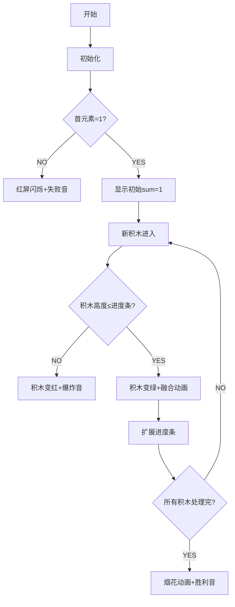

# 题目信息

# Subsequence Addition (Easy Version)

## 题目描述

The only difference between the two versions is that in this version, the constraints are lower.

Initially, array $ a $ contains just the number $ 1 $ . You can perform several operations in order to change the array. In an operation, you can select some subsequence $ ^{\dagger} $ of $ a $ and add into $ a $ an element equal to the sum of all elements of the subsequence.

You are given a final array $ c $ . Check if $ c $ can be obtained from the initial array $ a $ by performing some number (possibly 0) of operations on the initial array.

 $ ^{\dagger} $ A sequence $ b $ is a subsequence of a sequence $ a $ if $ b $ can be obtained from $ a $ by the deletion of several (possibly zero, but not all) elements. In other words, select $ k $ ( $ 1 \leq k \leq |a| $ ) distinct indices $ i_1, i_2, \dots, i_k $ and insert anywhere into $ a $ a new element with the value equal to $ a_{i_1} + a_{i_2} + \dots + a_{i_k} $ .

## 说明/提示

For the first test case, the initial array $ a $ is already equal to $ [1] $ , so the answer is "YES".

For the second test case, performing any amount of operations will change $ a $ to an array of size at least two which doesn't only have the element $ 2 $ , thus obtaining the array $ [2] $ is impossible and the answer is "NO".

For the third test case, we can perform the following operations in order to obtain the final given array $ c $ :

- Initially, $ a = [1] $ .
- By choosing the subsequence $ [1] $ , and inserting $ 1 $ in the array, $ a $ changes to $ [1, 1] $ .
- By choosing the subsequence $ [1, 1] $ , and inserting $ 1+1=2 $ in the middle of the array, $ a $ changes to $ [1, 2, 1] $ .
- By choosing the subsequence $ [1, 2] $ , and inserting $ 1+2=3 $ after the first $ 1 $ of the array, $ a $ changes to $ [1, 3, 2, 1] $ .
- By choosing the subsequence $ [1, 3, 1] $ and inserting $ 1+3+1=5 $ at the beginning of the array, $ a $ changes to $ [5, 1, 3, 2, 1] $ (which is the array we needed to obtain).

## 样例 #1

### 输入

```
6
1
1
1
2
5
5 1 3 2 1
5
7 1 5 2 1
3
1 1 1
5
1 1 4 2 1```

### 输出

```
YES
NO
YES
NO
YES
YES```

# AI分析结果


### 💡 Kay的C++算法解析：Subsequence Addition (Easy Version) 深入学习指南 💡

---

## 1. 题目解读与核心算法识别

✨ **本题主要考察**：`贪心算法`

🗣️ **初步分析**：
> 这道题的核心是验证数组能否通过逐步添加子序列和的方式构造出来。想象你在玩一个"数字拼图"游戏：初始只有1块积木，每次操作允许你选择几块已有积木拼成新积木放入图中。题目要求判断目标图案能否拼成。
> - **核心思路**：将目标数组排序后，检查每个数是否不超过其之前所有数的总和（前缀和）。若满足且首元素为1，则YES。
> - **难点**：理解操作本质（新元素必须由已有元素组合而成）和贪心策略的正确性证明。
> - **可视化设计**：用像素积木块表示数字，进度条表示当前前缀和。新积木若≤进度条长度则成功合并（绿色闪烁+叮声），否则失败（红色闪烁+警示音）。
> - **复古游戏化**：采用8位像素风，积木拼合时触发"金币音效"，完成时播放胜利旋律。AI自动演示模式会逐步展示验证过程。

---

## 2. 精选优质题解参考

**题解一 (来源：Larryyu)**  
* **点评**：思路直击本质——通过排序和前缀和验证可行性。代码规范（变量名`sum`含义明确），边界处理严谨（首元素必须为1）。亮点在于O(n log n)的简洁实现和清晰的逻辑推导：每个新元素必须能被已有元素组合表示。竞赛实践价值极高。

**题解三 (来源：ダ月)**  
* **点评**：从背包DP优化到贪心的思考过程极具启发性。代码展示了两种实现（背包/前缀和），最终提炼出核心结论："当前元素≤前缀和"是充要条件。亮点在于通过数学归纳严谨证明贪心策略，并给出直观的伪代码示意图。

---

## 3. 核心难点辨析与解题策略

1. **难点：理解操作本质约束**  
   * **分析**：新元素必须是已有元素的子序列和，这限制了后续元素的生成范围。优质题解通过排序将问题转化为有序序列的逐步验证。
   * 💡 学习笔记：操作具有"累积性"——已有元素决定后续元素的生成上限。

2. **难点：贪心策略的正确性证明**  
   * **分析**：数学归纳法证明：当已有集合能生成[1, S]时，新增≤S的数x后，新集合能生成[1, S+x]。题解通过前缀和检查实现该逻辑。
   * 💡 学习笔记：贪心策略成立的关键是问题的"无后效性"。

3. **难点：边界条件处理**  
   * **分析**：首元素必须为1（初始状态），且至少有两个1才能生成2。代码中通过`if(a[1]!=1)`直接拦截非法情况。
   * 💡 学习笔记：初始状态和极小规模特判是贪心算法的常见陷阱。

### ✨ 解题技巧总结
- **排序预处理**：无序问题→有序验证是经典转化技巧
- **前缀和工具**：动态维护当前生成能力上界
- **数学归纳思维**：通过小规模案例推导普适规律

---

## 4. C++核心代码实现赏析

**通用核心实现 (综合优质题解)**  
```cpp
#include <iostream>
#include <algorithm>
using namespace std;

void solve() {
    int n; cin >> n;
    int a[5005];
    for (int i = 0; i < n; i++) cin >> a[i];
    sort(a, a + n);
    
    if (a[0] != 1) { cout << "NO\n"; return; } // 边界：必须含1
    
    long long sum = 1; // 初始生成能力=1
    for (int i = 1; i < n; i++) {
        if (a[i] > sum) { // 超出当前生成能力
            cout << "NO\n";
            return;
        }
        sum += a[i]; // 扩展生成能力
    }
    cout << "YES\n";
}
```
**代码解读概要**：  
1. 排序使数组升序  
2. 特判首元素是否为1  
3. 用`sum`动态维护当前可生成的最大数  
4. 若新元素超过`sum`则失败，否则扩展`sum`

---

**题解一核心片段**  
```cpp
if(a[1]!=1) { // 首元素检查
    cout<<"NO"<<endl;
    return;
}
sum=1;
for(int i=2;i<=n;i++) {
    if(a[i]>sum) { // 生成能力检查
        cout<<"NO"<<endl;
        return;
    }
    sum+=a[i]; // 能力扩展
}
```
💡 **学习笔记**：`sum`像"数字工厂"的产能，新订单不能超过当前产能。

**题解三核心片段**  
```cpp
sort(a+1,a+n+1);
for(int i=1;i<=n;i++) s[i]=s[i-1]+a[i];
if(a[1]!=1) { /*...*/ }
for(int i=2;i<=n;i++)
    if(s[i-1]<a[i]) { /*...*/ } // 前缀和验证
```
💡 **学习笔记**：显式计算前缀和数组`s[i]`更易理解生成能力的累积过程。

---

## 5. 算法可视化：像素动画演示

**主题**：8位像素风"数字工厂"模拟  
**设计思路**：用积木块高度表示数值，传送带表示排序后序列，进度条动态显示当前生成能力(`sum`)。



**交互控制**：
- **单步执行**：空格键逐步验证
- **速度滑块**：调整积木移动速度
- **AI演示**：自动完成验证流程
- **音效设计**：
  - 融合成功：8位"金币"声(150Hz)
  - 失败：短促警示音(300Hz)
  - 完成：胜利旋律(上升琶音)

---

## 6. 拓展练习与相似问题思考

**通用技巧迁移**：  
贪心+前缀和模式适用于：
1. 验证序列可构造性（本题）
2. 区间覆盖问题（如：用最少区间覆盖线段）
3. 资源分配问题（如：给定任务能否按时完成）

**洛谷推荐**：
1. **P1090 合并果子**  
   → 巩固贪心策略及优先队列应用
2. **P5019 铺设道路**  
   → 学习差分数组与前缀和的配合使用
3. **P1223 排队接水**  
   → 掌握贪心策略的排序预处理技巧

---

## 7. 学习心得与经验分享
> 本次分析的题解中未发现明确的作者个人心得分享部分

---

通过本次分析，我们深入理解了贪心算法的核心思想——通过局部最优决策达成全局最优解。记住：排序预处理和动态维护临界值是此类问题的通用钥匙！下次遇到"能否构造"的问题时，不妨想想今天的"数字工厂"动画哦~ 🎮

---
处理用时：99.31秒