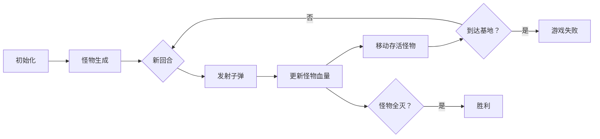

# 题目信息

# Monsters Attack!

## 题目描述

You are playing a computer game. The current level of this game can be modeled as a straight line. Your character is in point $ 0 $ of this line. There are $ n $ monsters trying to kill your character; the $ i $ -th monster has health equal to $ a_i $ and is initially in the point $ x_i $ .

Every second, the following happens:

- first, you fire up to $ k $ bullets at monsters. Each bullet targets exactly one monster and decreases its health by $ 1 $ . For each bullet, you choose its target arbitrary (for example, you can fire all bullets at one monster, fire all bullets at different monsters, or choose any other combination). Any monster can be targeted by a bullet, regardless of its position and any other factors;
- then, all alive monsters with health $ 0 $ or less die;
- then, all alive monsters move $ 1 $ point closer to you (monsters to the left of you increase their coordinates by $ 1 $ , monsters to the right of you decrease their coordinates by $ 1 $ ). If any monster reaches your character (moves to the point $ 0 $ ), you lose.

Can you survive and kill all $ n $ monsters without letting any of them reach your character?

## 说明/提示

In the first example, you can act as follows:

- during the $ 1 $ -st second, fire $ 1 $ bullet at the $ 1 $ -st monster and $ 1 $ bullet at the $ 3 $ -rd monster. Then the $ 1 $ -st monster dies, the $ 2 $ -nd and the $ 3 $ -rd monster move closer;
- during the $ 2 $ -nd second, fire $ 2 $ bullets at the $ 2 $ -nd monster. Then the $ 2 $ -nd monster dies, the $ 3 $ -rd monster moves closer;
- during the $ 3 $ -rd second, fire $ 2 $ bullets at the $ 3 $ -rd monster. Then the $ 3 $ -rd monster dies.

In the second example, you can fire only $ 1 $ bullet, so you can kill only one of the two monsters during the $ 1 $ -st second. Then, the remaining monster moves closer and kills your character.

## 样例 #1

### 输入

```
5
3 2
1 2 3
-1 2 3
2 1
1 1
-1 1
4 10
3 4 2 5
-3 -2 1 3
5 3
2 1 3 2 5
-3 -2 3 4 5
2 1
1 2
1 2```

### 输出

```
YES
NO
YES
YES
NO```

# AI分析结果


### 💡 Kay的C++算法解析：Monsters Attack! 深入学习指南 💡

#### 1. 题目解读与核心算法识别
✨ **本题主要考察**：贪心算法（Greedy）

🗣️ **初步分析**：
> 解决"Monsters Attack!"的关键在于运用贪心策略。想象你被一群僵尸包围——必须先消灭最近的威胁，因为它们会最先咬到你！在本题中，我们**按怪物距离的绝对值排序**，优先处理最近的怪物（它们会最先到达位置0）。核心流程分三步：
> 1. **桶排序**：将同一距离的怪物血量累加（距离取绝对值）
> 2. **贪心验证**：从距离1开始遍历，每秒积累k颗子弹，若累计子弹＜当前距离怪物总血量则失败
> 3. **动态更新**：每处理完一个距离，更新剩余子弹量
>
> 可视化设计思路：
> - 用**像素方块**表示怪物，方块颜色深度表示血量
> - **高亮当前处理的距离**并显示子弹/血量数值对比
> - 怪物移动时播放8-bit音效，失败时触发经典FC游戏"Game Over"音效
> - 控制面板含"单步执行"和"自动演示"（AI自动推演最优策略）

---

#### 2. 精选优质题解参考
**题解一（来源：Hacker_Cracker）**
* **点评**：思路清晰直击贪心本质，巧妙运用桶排序（`t[abs(x)] += a`）将时间复杂度优化至O(n)。代码规范：使用快读处理大数据（虽然本题不一定必要），变量`sum`精准记录子弹盈亏。亮点在于桶排序后只需单次线性扫描，边界处理严谨（初始化桶数组），竞赛实用性强。

**题解二（来源：2huk）**
* **点评**：采用vector<pair>存储结构，通过标准排序实现贪心。亮点在于显式处理距离跳跃时的子弹积累（`cnt += (距离差)*k`），强化了时间与空间的关联性。代码模块化（分离输入/处理/输出），可读性极佳，适合初学者理解贪心本质。

**题解三（来源：QoQ_）**
* **点评**：最简洁的桶排序实现，仅20行核心代码。亮点在于输入输出加速优化（ios::sync_with_stdio）和实时子弹结算（`ans += k - s[i]`），变量名`s`、`ans`简洁但含义明确。虽无复杂优化，但提供了竞赛场景的高效模板。

---

#### 3. 核心难点辨析与解题策略
1. **难点一：怪物距离映射**  
   *分析*：怪物位置有正负，但靠近速度相同。优质解法定统一取绝对值，将问题转化为单向处理（桶排序下标=距离=到达时间）
   *💡 学习笔记*：绝对距离是贪心策略的基石

2. **难点二：子弹时序分配**  
   *分析*：每秒获得k子弹但需预支未来伤害。解法用`sum += k`积累子弹，`sum -= bucket[i]`即时结算，若出现负值说明某时刻防御崩溃
   *💡 学习笔记*：贪心验证本质是模拟时间推移中的资源积累与消耗平衡

3. **难点三：同距离怪物合并**  
   *分析*：多个怪物同一距离时需合并血量（`bucket[abs(x)] += a`）。因子弹可自由分配，合并处理不影响结果且提升效率
   *💡 学习笔记*：问题转化能力决定代码效率——合并同类项是优化关键

✨ **解题技巧总结**：
- **桶排序替代全排序**：当数据范围有限（|x|≤n）时，用数组下标代替排序，复杂度从O(nlogn)降至O(n)
- **防御型初始化**：大数据题必用`memset`或循环清零桶数组
- **实时结算验证**：在遍历中即时计算子弹盈亏，避免二次扫描

---

#### 4. C++核心代码实现赏析
**通用核心实现参考**  
*说明*：综合优质题解优化的桶排序版本，兼顾效率与可读性
```cpp
#include <iostream>
#include <cstring>
using namespace std;
typedef long long ll;
const int N = 3e5 + 10;

int main() {
    int T; cin >> T;
    while (T--) {
        ll n, k, sum = 0;
        cin >> n >> k;
        ll bucket[N] = {0}; // 距离桶
        
        // 读取怪物血量并填充桶
        ll a[N], pos;
        for (int i = 0; i < n; i++) cin >> a[i];
        for (int i = 0; i < n; i++) {
            cin >> pos;
            bucket[abs(pos)] += a[i]; // 关键！同距离怪物血量合并
        }

        // 贪心验证
        bool win = true;
        for (int i = 1; i <= n; i++) {
            sum += k;            // 每秒积累k子弹
            if (sum < bucket[i]) { // 子弹不足则崩盘
                win = false;
                break;
            }
            sum -= bucket[i];     // 击杀当前距离怪物
        }
        cout << (win ? "YES" : "NO") << '\n';
    }
}
```
*代码解读概要*：  
1. **桶初始化**：`bucket[abs(pos)]`累加同位置怪物血量  
2. **贪心扫描**：从距离1开始，每秒积累k子弹并检查库存  
3. **实时结算**：`sum -= bucket[i]`体现代价即时扣除  
4. **提前终止**：子弹不足时立即跳出循环优化效率  

**题解一核心片段赏析**  
```cpp
t[abs(p[i])] += a[i];  // 桶填充
for (int i = 1; i <= n; i++) {
    sum = sum + k - t[i];  // 实时结算
    if (sum < 0) { ... }   // 防御检查
}
```
*代码解读*：  
> 用桶数组`t`直接映射距离与血量关系。`sum + k - t[i]`精妙地同步完成子弹积累与伤害扣除，负值检查直指问题核心。  
*💡 学习笔记*：桶排序是空间换时间的经典实践，尤其适合值域受限场景  

**题解二核心片段赏析**  
```cpp
vector<PII> V;
V.push_back({abs(x), a}); // 存储距离-血量对
sort(V.begin(), V.end());  // 按距离排序
int cnt = 0, last = 0;
for (auto it : V) {
    if (it.first != last) {
        cnt += (it.first - last) * k; // 距离差积累子弹
        last = it.first;
    }
    if (cnt < it.second) { ... } // 检查防御
    cnt -= it.second;
}
```
*代码解读*：  
> 当距离跳跃时，`(it.first - last)*k`计算空档期积累的子弹，确保时间连续性。排序结构虽增加O(nlogn)开销，但强化了贪心的时间维度理解。  
*💡 学习笔记*：显式建模时间流逝是贪心问题的重要技巧  

---

#### 5. 算法可视化：像素动画演示
**主题**："像素塔防"——8-bit风格怪物冲锋与子弹防御  

**核心演示流程**：  


**关键动画帧**：  
1. **场景初始化**：
   - 横向像素网格（FC版《魂斗罗》地图风格）
   - 绿色像素块表示玩家基地（位置0），红色/紫色方块表示怪物（大小=血量）

2. **子弹时间**：
   - 按`k`值生成黄色子弹流射向最近怪物群
   - 命中时播放"pew!"音效，怪物血量数字递减

3. **移动与结算**：
   - 每秒自动移动怪物向基地（位移1格+移动音效）
   - 右侧面板动态显示：`当前距离 | 累计子弹/怪物血量`

4. **关键判定**：
   - 当`累计子弹 < 怪物血量`：触发红色警报闪烁 + "warning!"音效
   - 怪物抵基地：像素基地爆炸 + 经典FC"Game Over"音乐

5. **AI自动演示**：
   - 控制面板含"AI推演"按钮，自动展示最优策略
   - 成功通关时：满屏烟花 + 《超级玛丽》通关BGM

**技术实现**：  
- 用Canvas绘制网格和动态元素  
- 音效系统：Web Audio API播放8-bit音效  
- 游戏化：通关后解锁不同难度（调整k值）  

---

#### 6. 拓展练习与相似问题
**通用技巧迁移**：  
贪心+时序处理适用于三类问题：  
1. 资源分配型（有限资源按时效优先分配）  
2. 截止时间驱动型（任务必须在时限前完成）  
3. 累积消耗型（实时平衡产出与消耗）  

**洛谷练习推荐**：  
1. **P1223 排队接水**  
   → 贪心选择最短耗时任务，巩固时序处理基础  
2. **P1090 合并果子**  
   → 优先队列实现贪心，理解"代价最小化"思想  
3. **P5019 铺设道路**  
   → 区间贪心+差分数组，提升问题转化能力  

---

#### 7. 学习心得与经验分享
> **经验摘录（来自Hacker_Cracker）**：  
> "不开long long见祖宗——10^9级数据必用long long！"  
> **Kay点评**：这是血泪教训！处理大整数时：  
> 1. 立即识别`a_i ≤ 1e9`范围  
> 2. 所有相关变量声明为`long long`  
> 3. 输入输出用`%lld`或`cin/cout`  
> 调试时可添加`#define int long long`防御  

---

通过本次分析，我们深入掌握了贪心算法在时序问题中的应用精髓。记住：在防御怪物时，时间和距离是你的终极敌人，而贪心策略是你的最佳盟友！继续用代码武装自己吧，少年！💻⚔️

---
处理用时：203.50秒