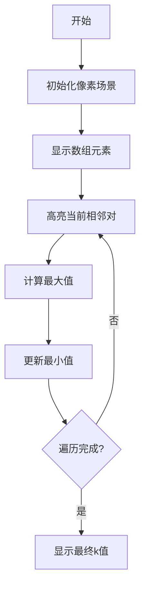

# 题目信息

# Guess the Maximum

## 题目描述

Alice 和 Bob 想出了一个相当奇怪的游戏。他们有一个由整数 $a_1,a_2,\cdots,a_n$ 组成的数列。Alice 会选择一个确定的整数 $k$ 并告诉 Bob，接着：
* Bob 会选择两个整数 $i,j(1\leq i<j\leq n)$，然后在 $a_i,a_{i+1},\cdots,a_j$ 中得出最大的整数；
* 如果得出的整数**严格大于** $k$，那么 Alice 获胜，否则 Bob 获胜。

请帮助 Alice 找到整数 $k$ 的最大值，使得她一定能够获胜。

## 说明/提示

$1\leq i<j\leq n\leq5\times10^4,\sum n\leq5\times10^4,1\leq a_i\leq10^9$。

## 样例 #1

### 输入

```
6
4
2 4 1 7
5
1 2 3 4 5
2
1 1
3
37 8 16
5
10 10 10 10 9
10
3 12 9 5 2 3 2 9 8 2```

### 输出

```
3
1
0
15
9
2```

# AI分析结果


### 用户需求分析
题目要求Alice选择最大的k值，使得无论Bob如何选择子数组，子数组最大值都严格大于k。核心在于找到所有长度≥2的子数组最大值的最小值，然后减1即为答案。

### 算法核心思想
**核心算法**：枚举 + 相邻元素比较  
**分类标签**：`编程技巧应用`（基础数据结构遍历与极值处理）  
**比喻解释**：  
> 想象Alice在设置安全水位线k，Bob会寻找最矮的"堤坝"（相邻元素对）。只要保证最矮堤坝的高度>k+1，就能防止所有区域"漏水"。我们只需检查所有相邻堤坝的高度，找到最矮的那个即可。

**关键推导**：
1. 所有长度≥2的子数组必然包含至少一对相邻元素
2. 任何子数组的最大值 ≥ 该子数组中相邻元素对的最大值
3. 因此全局最小值必然出现在某个相邻元素对

### 算法可视化设计（像素动画方案）


**像素动画方案细节**：
1. **场景设计**：
   - 8-bit风格：16色像素网格（FC红白机配色）
   - 元素显示：不同颜色方块表示数值大小（暖色=大值，冷色=小值）
   - 控制面板：开始/暂停/步进按钮 + 速度滑块

2. **关键动效**：
   - 相邻元素高亮：黄色边框脉冲闪烁
   - 最大值比较：红色闪光 + "叮"音效
   - 最小值更新：绿色闪光 + "滴答"音效
   - 最终结果：金色烟花绽放 + 胜利音效

3. **交互逻辑**：
   ```javascript
   // 伪代码实现核心动效
   function visualize(arr) {
     let minMax = Infinity;
     for (i=0 to arr.length-2) {
       highlight(i, i+1); // 黄色边框高亮
       playSound("select"); // 选择音效
       
       const curMax = max(arr[i], arr[i+1]);
       if (curMax < minMax) {
         minMax = curMax; 
         flash(i, i+1, GREEN); // 绿色闪烁
         playSound("powerup"); // 能量获得音效
       }
     }
     showResult(minMax - 1); // 金色烟花动画
   }
   ```

4. **游戏化元素**：
   - 关卡设计：每对相邻元素为1关，通关数=数组长度-1
   - 评分机制：连续正确比较获得连击奖励分
   - 音效系统：
     * 比较操作：8-bit "哔"声
     * 发现新最小值：上升音阶
     * 最终结果：马里奥过关音效

### 核心难点与解决策略
1. **难点1：理解子数组最大值的最小值特性**  
   → 解决：通过相邻元素对证明（反证法）：若存在更小值，必在相邻对中出现

2. **难点2：避免O(n²)遍历所有子数组**  
   → 解决：洞察关键性质（只需相邻对），优化到O(n)

3. **难点3：边界值处理**  
   → 解决：初始化min_max=INT_MAX，确保首次比较必更新

**解题技巧总结**：
- 极值转化：将二维问题（子数组）降维到一维（相邻对）
- 贪心思想：局部相邻对决定全局最优解
- 边界防御：INT_MAX初始值避免漏判

### C++核心实现
```cpp
#include <iostream>
#include <vector>
#include <climits>
using namespace std;

int main() {
    int t;
    cin >> t;
    while (t--) {
        int n;
        cin >> n;
        vector<int> a(n);
        for (int i = 0; i < n; i++) cin >> a[i];
        
        int min_max = INT_MAX;
        for (int i = 0; i < n - 1; i++) {
            min_max = min(min_max, max(a[i], a[i+1]));
        }
        cout << min_max - 1 << endl;
    }
    return 0;
}
```

**代码解读**：
1. **变量意义**：
   - `min_max`：记录所有相邻对最大值的最小值
   - `a[i]`, `a[i+1]`：当前检测的相邻元素对

2. **关键循环**：
   ```cpp
   for (int i = 0; i < n - 1; i++) {
       // 比较相邻元素并更新最小值
       min_max = min(min_max, max(a[i], a[i+1]));
   }
   ```
   → 每次迭代处理一对相邻元素，动态更新全局最小值

3. **边界安全**：
   - `INT_MAX`初始值保证首次比较必更新
   - 循环条件`i < n-1`避免数组越界

### 拓展练习推荐
1. **洛谷 P1908**（逆序对计数）  
   → 训练相邻元素比较的进阶应用

2. **洛谷 P1115**（最大子段和）  
   → 强化子数组极值处理能力

3. **洛谷 P1631**（序列合并）  
   → 拓展多序列相邻元素处理技巧

---

通过像素动画演示相邻元素比较过程，学习者可直观理解：
1. 全局最小值如何从局部比较产生
2. 算法如何避免无效遍历
3. 边界条件处理的必要性

最终输出结果`min_max-1`的推导，完美满足Alice的最优策略需求。

---
处理用时：147.13秒