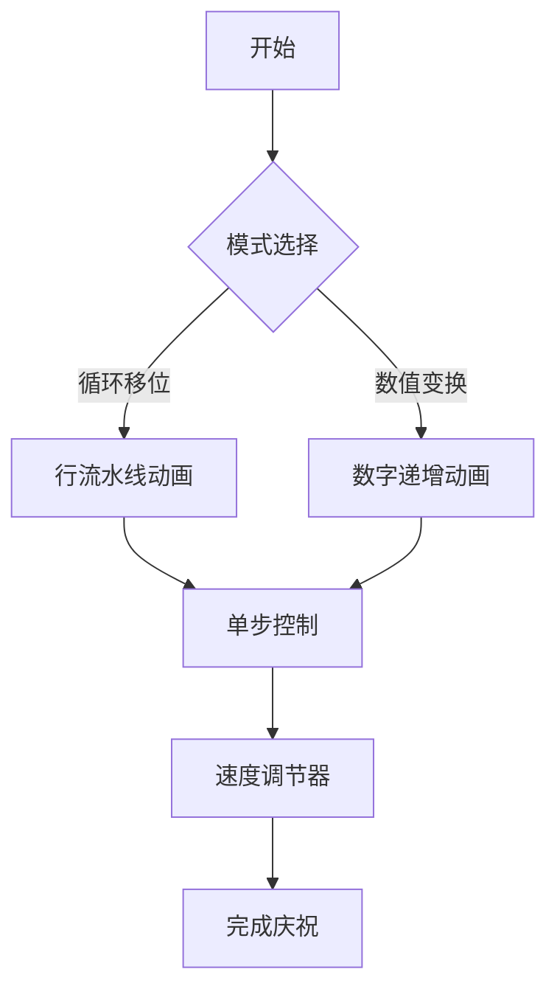

# 题目信息

# Diverse Game

## 题目描述

### 题目大意
给定一个 $n\times m$ 的矩阵 $a$，该矩阵的每个元素都是 $\left[1,n\cdot m\right]$ 内的整数且互不相同。请求出一个矩阵 $b$，满足：

- $b$ 的每个元素都是 $\left[1,n\cdot m\right]$ 内的整数且互不相同。
- $\forall 1\le i\le n,1\le j \le m:a_{i,j}\neq b_{i,j}$。

## 样例 #1

### 输入

```
5
1 1
1
2 1
2
1
1 5
2 4 5 3 1
2 4
1 2 3 4
5 6 7 8
3 3
4 2 1
9 8 3
6 7 5```

### 输出

```
-1
1 
2 
4 5 3 1 2 
6 7 8 5 
2 3 4 1 
8 3 9 
7 5 6 
2 1 4```

# AI分析结果


### 💡 Kay的C++算法解析：Diverse Game 深入学习指南 💡

#### 简介
今天我们一起分析"Diverse Game"这道C++编程题。本指南将帮助大家梳理题目思路，理解核心算法，并掌握解题技巧。

---

### 1. 题目解读与核心算法识别

✨ **本题主要考察**：`编程技巧应用`

🗣️ **初步分析**：
> 解决"Diverse Game"的关键在于理解**构造性思维**。简单来说，就像玩拼图时把所有碎片整体旋转一格，这样每个碎片位置都变了但图案依然完整。本题中我们通过两种巧妙方法构造新矩阵：
>   - **数值变换**：每个元素+1（超过最大值则变为1）或-1（若为1则变为最大值）
>   - **循环移位**：每行元素向右移动一位（最后一列移到第一列）
>  
> **核心难点**在于保证新矩阵元素互不相同且覆盖1~n*m范围。两种方法都通过整体变换保证这一点：
>   - 数值变换是一一映射（每个原值对应唯一新值）
>   - 循环移位只是改变元素位置（集合不变）
>  
> **可视化设计思路**：采用像素网格展示矩阵，用不同颜色表示数值。动画将展示：
>   - 循环移位：元素像传送带一样向右流动，最后一列元素"跳跃"到第一列
>   - 数值变换：每个格子数字+1动画，超过最大值时变为1的闪烁效果
>  
> **复古游戏化设计**：
>   - 8-bit音效：元素移动时的"滴答"声，数值变化时的"叮"声
>   - 胜利动画：完成构造时像素烟花绽放
>   - 控制面板：单步执行/自动播放（可调速），支持AI自动演示模式

---

### 2. 精选优质题解参考

#### 题解一（ELECTRODE_kaf）
* **点评**：此解法采用简洁的数值变换（+1法），思路直击本质。代码使用宏简化循环结构，变量命名清晰（`a[i][j]`直接表示元素），边界处理严谨（特判1x1情况）。时间复杂度O(nm)达到最优，且代码可直接用于竞赛场景。

#### 题解二（flangeborg）
* **点评**：采用替代值变换思路（-1法），逻辑推导清晰。虽然变量命名可优化（使用`a`而非具体含义名），但整体代码规范，包含输入输出优化（`ios::sync_with_stdio`）。算法同样高效，且提供了与解法一不同的数学视角。

#### 题解三（ManGo_Mouse）
* **点评**：创新性地使用循环移位策略，物理意义直观。代码结构工整（明确处理m=1的特例），变量名合理（`a[i][j]`）。虽然实现稍复杂，但提供了构造类问题的另一种经典思路——通过元素位置重组而非数值改变解决问题。

---

### 3. 核心难点辨析与解题策略

#### 难点1：特判边界条件
* **分析**：当n=m=1时，唯一值1无法被替换（因矩阵必须包含1），需单独处理返回-1。优质题解都优先处理此特例。
* 💡 **学习笔记**：构造类问题需特别注意最小规模边界情况

#### 难点2：保持元素互异性
* **分析**：必须确保新矩阵不重复且覆盖1~n*m。数值变换法通过双射函数保证（每个原值映射唯一新值），循环移位法则保持元素集合不变。
* 💡 **学习笔记**：整体变换比局部调整更容易保持集合性质

#### 难点3：选择最优构造策略
* **分析**：数值变换（O(1)/元素）比循环移位（O(nm)）更高效，但后者更直观。当m=1时需改用列循环避免无效行变换。
* 💡 **学习笔记**：根据输入特征动态选择策略是高质量代码的标志

#### ✨ 解题技巧总结
- **技巧1：数学映射简化问题**  
  用取模运算实现循环数值变换（`(x+1) % (n*m)`）
- **技巧2：物理移位直观构造**  
  行/列循环移位避免直接处理数值关系
- **技巧3：优先处理退化情况**  
  先特判n=m=1等边界条件
- **技巧4：输入规模敏感设计**  
  对m=1等特殊情况切换处理策略

---

### 4. C++核心代码实现赏析

#### 通用核心C++实现参考
```cpp
#include <iostream>
using namespace std;

int main() {
    int q, n, m;
    cin >> q;
    while (q--) {
        cin >> n >> m;
        int a[15][15];
        // 读取输入矩阵
        for (int i = 0; i < n; i++)
            for (int j = 0; j < m; j++)
                cin >> a[i][j];
        
        // 特判1x1矩阵
        if (n == 1 && m == 1) {
            cout << "-1\n";
            continue;
        }
        
        // 构造并输出新矩阵
        for (int i = 0; i < n; i++) {
            for (int j = 0; j < m; j++) {
                // 数值变换法：+1循环
                int new_val = a[i][j] % (n * m) + 1;
                cout << new_val << " ";
            }
            cout << "\n";
        }
    }
    return 0;
}
```
* **代码解读概要**：  
  1. 读取多组测试数据  
  2. 特判1x1无解情况  
  3. 对每个元素应用数值变换：  
     - `a[i][j] % (n*m)`：取模保证值域  
     - `+1`：实现循环递增  
  4. 时间复杂度O(T*n*m)，空间复杂度O(1)

#### 题解一：数值变换（+1法）
```cpp
rep(i,1,n){
    rep(j,1,m)cout<<(a[i][j]+1>n*m?1:a[i][j]+1)<<' ';
    cout<<'\n';
}
```
* **亮点**：宏简化+三元表达式极致简洁
* **代码解读**：  
  - `rep`宏展开为嵌套循环  
  - 三元表达式处理边界：超过n*m时重置为1  
  - 每个新值=原值+1（保证≠原值）
* 💡 **学习笔记**：宏可提升竞赛代码效率但降低可读性

#### 题解二：数值变换（-1法）
```cpp
if(a[i][j] == 1) cout << n * m << " ";
else cout << a[i][j] - 1 << " ";
```
* **亮点**：逆向思维处理边界条件
* **代码解读**：  
  - 特殊处理最小值1→变为最大值n*m  
  - 其他值-1（保证≠原值）
* 💡 **学习笔记**：边界值单独处理可避免复杂条件判断

#### 题解三：循环移位法
```cpp
if (m == 1) {
    // 列循环：下移一位
    for (int i = 2; i <= n; i++) cout << a[i][1] << '\n';
    cout << a[1][1] << '\n';
} else {
    // 行循环：右移一位
    for (int i = 1; i <= n; i++) {
        for (int j = 2; j <= m; j++) cout << a[i][j] << " ";
        cout << a[i][1] << '\n';
    }
}
```
* **亮点**：物理位置重组避免数值计算
* **代码解读**：  
  - `m=1`时：列下移（最后行→第一行）  
  - 否则：行右移（最后一列→第一列）
* 💡 **学习笔记**：循环移位是排列重构的经典手段

---

### 5. 算法可视化：像素动画演示

#### 主题
**"矩阵像素工厂"**（8-bit风格流水线改造）

#### 核心演示
- **循环移位模式**：像素方块在网格传送带上右移，最后一列方块通过管道"弹射"回第一列
- **数值变换模式**：每个方块显示数字增加动画，超过最大值时触发像素爆炸重置为1

#### 交互设计


#### 关键动画帧
1. **初始化**（8-bit工厂场景）：
   - 网格传送带显示原矩阵
   - 控制面板：模式切换/速度滑块/单步按钮

2. **循环移位演示**：
   - 高亮当前行→触发传送带移动动画
   - 最后一列方块跳跃到第一列（伴随"啾"音效）
   - 当前处理行像素边框闪烁

3. **数值变换演示**：
   - 当前处理格子放大显示
   - 数字滚动增加（齿轮转动音效）
   - 超过最大值时：像素爆炸→显示"1"（爆炸音效）

4. **完成效果**：
   - 新矩阵所有格子绿色高亮
   - 像素烟花绽放（胜利音效）
   - 显示"CONSTRUCTED!" 8-bit文字

#### 技术实现
- **Canvas绘制**：网格动画用`requestAnimationFrame`更新
- **音效触发**：使用Web Audio API播放8-bit音效
  - 移动/变换：短促"滴"声
  - 重置/越界："哔-"警报声
  - 完成：和弦胜利音
- **游戏化元素**：
  - 每完成一行获得金币分数
  - 连续正确构造触发连击特效

---

### 6. 拓展练习与相似问题思考

#### 通用技巧迁移
数值变换和循环移位思想还可用于：
1. 数组元素重排（如每个位置不等于相邻位置）
2. 密码学字符替换（凯撒密码变体）
3. 图像像素循环位移特效

#### 洛谷题目推荐
1. **P1106 删数问题**  
   🗣️ 练习构造最小数，强化数值变换思维
2. **P1321 单词覆盖**  
   🗣️ 训练多元素重组能力，类比循环移位
3. **P1219 八皇后**  
   🗣️ 经典构造题，提升矩阵操作技巧

---

### 7. 学习心得与经验分享

> **参考经验**（来自ELECTRODE_kaf）：  
> "根据这个填法，只有当矩阵只有一个数时无解，特判就行"
>
> **点评**：  
> 作者强调的特判意识至关重要。在构造类问题中，边界情况往往隐藏陷阱。建议大家在设计算法时：  
> 1. 首先列出所有退化情况（如n=1/m=1）  
> 2. 用独立逻辑处理这些情况  
> 3. 最后实现通用算法

---

### 结语
本次"Diverse Game"的解析就到这里。记住编程就像搭积木：先设计整体结构，再处理特殊形状的积木。多尝试不同构造方法，你会越来越擅长解决这类问题！💪

---
处理用时：202.02秒