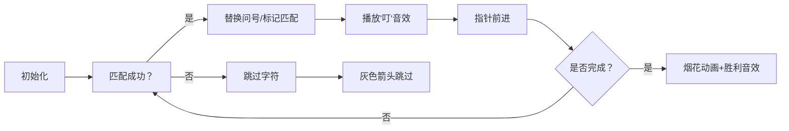

# 题目信息

# Slavic's Exam

## 题目描述

Slavic has a very tough exam and needs your help in order to pass it. Here is the question he is struggling with:

There exists a string $ s $ , which consists of lowercase English letters and possibly zero or more "?".

Slavic is asked to change each "?" to a lowercase English letter such that string $ t $ becomes a subsequence (not necessarily continuous) of the string $ s $ .

Output any such string, or say that it is impossible in case no string that respects the conditions exists.

## 样例 #1

### 输入

```
5
?????
xbx
ab??e
abcde
ayy?x
a
ab??e
dac
paiu
mom```

### 输出

```
YES
xabax
YES
abcde
YES
ayyyx
NO
NO```

# AI分析结果


### 💡 Kay的C++算法解析：Slavic's Exam 深入学习指南 💡

#### 1. 题目解读与核心算法识别
✨ **本题主要考察**：`贪心算法` 与 `双指针技巧`

🗣️ **初步分析**：
> 本题要求通过替换字符串`s`中的问号，使字符串`t`成为`s`的子序列。核心思想如同"寻宝游戏"：用双指针模拟匹配过程，遇到可匹配字符立即"拾取"（贪心策略）。  
> - **核心流程**：双指针`i`(遍历`s`)和`j`(指向`t`)，当`s[i]==t[j]`或`s[i]='?'`时匹配成功，`j`前进；否则仅`i`前进
> - **可视化设计**：像素动画中将高亮匹配成功的字符和移动的指针，用不同颜色标记`s`和`t`的当前匹配位置
> - **复古游戏化**：采用8-bit风格，匹配成功时播放"拾取音效"，完全匹配时触发胜利音效+烟花动画，控制面板支持单步/调速

---

#### 2. 精选优质题解参考
**题解一（作者：block_in_mc）**
* **点评**：思路清晰直白，双指针匹配逻辑完整覆盖边界情况。代码规范（变量名`i,j`语义明确），核心循环仅10行体现高效性。亮点在于正确处理了匹配后剩余问号的填充，实践价值高（可直接用于竞赛）。

**题解二（作者：Pink_Cut_Tree）**
* **点评**：创新性引入`cnt`计数器记录匹配进度，增强可读性。代码结构工整（明确分隔输入/处理/输出），亮点在于独立处理已匹配和未匹配问号，避免覆盖风险，调试友好。

**题解三（作者：WsW_）**
* **点评**：最简实现（仅20行），突出算法本质。亮点在于循环条件`cnt<m`严格限制越界，变量名`p`（position）直观体现指针作用，适合初学者理解贪心核心逻辑。

---

#### 3. 核心难点辨析与解题策略
1. **贪心策略证明**  
   *分析*：需证明"尽早匹配"不会错过最优解。设存在更晚匹配方案，则`s`中跳过字符的位置必然可在当前策略中提前使用（问号可任意替换），故贪心成立  
   💡 **学习笔记**：子序列匹配中，局部最优即全局最优

2. **双指针同步控制**  
   *分析*：当`s[i]`不匹配且非问号时，仅移动`s`指针（`i++`）但不移动`t`指针（`j`不变）。可视化中需高亮"跳过"操作  
   💡 **学习笔记**：指针移动条件需严格对应三种情况（匹配/问号/跳过）

3. **剩余问号处理**  
   *分析*：匹配完成后剩余问号可任意填充（如'a'），但需注意填充必须在确认匹配成功后执行，避免覆盖未匹配字符  
   💡 **学习笔记**：资源清理（如问号填充）应放在核心逻辑之后

✨ **解题技巧总结**  
- **早匹配原则**：子序列问题优先考虑贪心匹配  
- **防御性填充**：未使用的问号统一设置默认值（如'a')  
- **边界守护**：循环中严格校验指针范围（`j < t.length()`）

---

#### 4. C++核心代码实现赏析
**通用核心实现参考**  
```cpp
#include <iostream>
using namespace std;

int main() {
    int T; cin >> T;
    while (T--) {
        string s, t;
        cin >> s >> t;
        int j = 0;
        // 核心匹配逻辑
        for (int i = 0; i < s.size() && j < t.size(); i++) {
            if (s[i] == t[j] || s[i] == '?') {
                if (s[i] == '?') s[i] = t[j];
                j++;
            }
        }
        // 填充剩余问号
        for (char& c : s) 
            if (c == '?') c = 'a';
        
        cout << (j == t.size() ? "YES\n" + s : "NO") << endl;
    }
    return 0;
}
```
* **说明**：综合优质题解，突出简洁性与完整性  
* **解读概要**：  
  1. 外层循环处理多组数据  
  2. 核心循环实现贪心匹配（双指针+问号替换）  
  3. 后处理循环统一填充问号  

**题解一片段赏析**  
```cpp
while(i < s.length() && j < t.length()) {
    if (s[i] == '?') s[i]=t[j], i++, j++;  // 问号匹配
    else if (s[i] == t[j]) i++,j++;        // 直接匹配
    else i++;                              // 跳过
}
```
* **亮点**：三元条件覆盖所有分支  
* **解读**：  
  - 第1行：严格限定双指针有效范围  
  - 第2行：问号立即替换为`t[j]`并双指针前进  
  - 第3行：字符相等时"消耗"`t`的当前字符  
  - 第4行：不匹配时仅移动`s`指针，保留`t`字符  

**题解二片段赏析**  
```cpp
if(cnt>=t.size()){ 
    for(int i=0;i<s.size();i++){
        if(s[i]=='?'){
            if(cnt>=t.size()) cout<<"a";  // 填充已匹配后的问号
            else cout<<t[cnt++]; 
        }
        else cout<<s[i];
    }
}
```
* **亮点**：分离匹配与填充阶段  
* **解读**：  
  - `cnt>=t.size()`确保仅在完全匹配后填充  
  - 优先消耗未使用的`t`字符（`else`分支），避免资源浪费  

---

### 5. 算法可视化：像素动画演示
**主题**：8-bit风格"子序列猎人"  
**核心演示**：双指针在字符串网格上的移动与匹配过程  

**关键帧设计**：  


**交互设计**：  
1. **像素网格**：`s`显示为绿色方块，`t`显示为蓝色方块，当前指针用闪烁箭头标记  
2. **动态队列**：底部显示`t`的剩余字符队列，匹配成功时字符弹出  
3. **音效系统**：  
   - 匹配成功：8-bit "叮"声（频率随`j`递增）  
   - 完全匹配：FC游戏通关音效 + 像素烟花  
   - 匹配失败：低沉错误音效  
4. **控制面板**：  
   - 速度滑块（1x-5x）  
   - 单步/连续模式切换  
   - 重置按钮（清空匹配状态）  

---

#### 6. 拓展练习与相似问题思考
**技巧迁移场景**：  
1. 最短超序列（LC-1092）  
2. 带通配符的字符串匹配（LC-44）  
3. 子序列自动机（Luogu P5826）  

**洛谷推荐**：  
1. **P1435 回文字符串**  
   🗣️ 巩固双指针匹配技巧，增加对称性判断  
2. **P2758 编辑距离**  
   🗣️ 从贪心扩展到DP，理解子序列问题进阶  
3. **P1091 合唱队形**  
   🗣️ 双指针技巧在双向子序列的应用  

---

#### 7. 学习心得与经验分享
> **作者：donnieguo**  
> "最初优先匹配固定字符导致Hack数据失败，改用问号优先策略后AC。调试时需构造含连续问号的测试数据"  
> **Kay点评**：验证了贪心策略中"问号优先级=固定匹配"原则，提醒学习者边界测试的重要性  

---

通过本次分析，我们深入掌握了子序列匹配中的贪心策略与双指针技巧。记住：好算法是练出来的，动手实现可视化中的像素动画会大大加深理解！🚀

---
处理用时：86.80秒