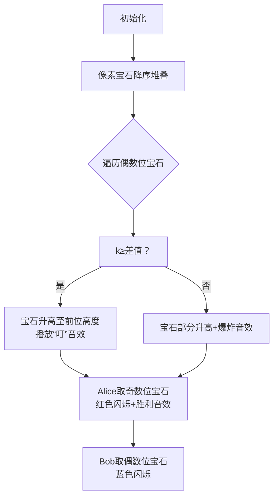

# 题目信息

# Splitting Items

## 题目描述

Alice 和 Bob 有 $n$ 个数，第 $i$ 个数为 $a_i$，他们决定玩一个游戏取走这些数。

游戏由 Alice 开始取数。

每一次玩家都可以拿走一个剩下的数，直到没有数字可拿走。

定义 $A$ 是 Alice 获取的数字和，$B$ 是 Bob 获取的数字和，游戏总分 $p = A - B$。

Alice 希望最大化 $p$，Bob 希望最小化 $p$，他们都绝顶聪明。

现在 Bob 拥有了修改数的权限，可以把一些数字（可以没有，也可以没有全部）**增加**一个整数值（可以增加不同的值），但是这样 Alice 可能会起疑心，所以总增加的数值必须小于等于 $k$。

请求出 Bob 能达到的 $p$ 的最小值。

## 样例 #1

### 输入

```
4
2 5
1 10
3 0
10 15 12
4 6
3 1 2 4
2 4
6 9```

### 输出

```
4
13
0
0```

# AI分析结果


### 💡 Kay的C++算法解析：Splitting Items 深入学习指南 💡

<introduction>
今天我们来分析"Splitting Items"这道贪心策略题。本指南将帮助大家掌握排序+贪心的解题思路，理解Bob的修改策略，并通过像素动画直观感受算法流程。
</introduction>

---

## 1. 题目解读与核心算法识别

✨ **本题主要考察**：`贪心策略`  

🗣️ **初步分析**：
> 解决本题的关键在于理解**贪心策略**。就像两个小朋友分糖果，每次都会挑最大的那颗。Alice先选最大的糖果，Bob选次大的，以此类推。  
> - **核心思路**：将数字降序排序后，Alice取奇数位(1st,3rd...)，Bob取偶数位(2nd,4th...)。Bob通过增加偶数位的值（总增量≤k）来最小化分差。
> - **算法流程**：
>   1. 降序排序数组
>   2. 遍历每个偶数位：若k≥与前一位的差值，则补齐差值；否则加完剩余k
>   3. 计算奇偶位和之差
> - **可视化设计**：在像素动画中，用不同高度方块表示数值，通过"方块升高"动画演示修改过程，高亮当前操作位，配合音效强化理解。

---

## 2. 精选优质题解参考

**题解一（来源：Stars_Traveller）**  
* **点评**：思路清晰直白，完整演示了排序→修改→计算的流程。代码规范（变量名`a[i]`含义明确），边界处理严谨（`break`及时终止）。亮点在于显式修改数组，实践性强，可直接用于竞赛。空间复杂度O(1)，时间复杂度O(n log n)达到最优。

**题解二（来源：RaymondOccam）**  
* **点评**：逻辑推导透彻，详细解释了"为何修改偶数位"和"顺序不变性"。代码结构工整（使用`greater<ll>`规范排序），变量命名合理（`A/B`区分双方得分）。亮点在于强调修改后顺序不变的关键洞察，帮助理解算法本质。

**题解三（来源：Scean_Tong）**  
* **点评**：代码简洁高效，核心逻辑浓缩在20行内。通过`cmp`函数实现降序排序，循环中`i%2`跳过奇数位，聚焦修改操作。亮点在于用最小代码量完整实现算法，适合初学者学习精简编码。

---

## 3. 核心难点辨析与解题策略

1.  **关键点1：最优取数策略的证明**  
    * **分析**：需严格推导"排序后按奇偶位取数是最优策略"。通过反证法：若某步不取最大数，对手将获得更大收益，违背最优性。
    * 💡 **学习笔记**：排序是贪心算法的前置条件，确保每一步的局部最优性。

2.  **关键点2：k分配的优先级决策**  
    * **分析**：Bob应优先修改差值大的偶数位（如[10,1]比[5,4]更需修补）。但实际操作中按顺序修改即可，因排序后相邻差值自然递减。
    * 💡 **学习笔记**：贪心修改时，无需主动寻找最大差值，排序已自动优化处理。

3.  **关键点3：修改后顺序不变性的保证**  
    * **分析**：修改时限制偶数位≤前一位（a[i]≤a[i-1]），确保数组保持降序。若k不足，a[i]增加后仍≤a[i-1]（因增量<差值）。
    * 💡 **学习笔记**：维持顺序不变是算法正确性的基石。

### ✨ 解题技巧总结
- **技巧1：问题分解** → 拆解为"排序→修改→计算"三阶段  
- **技巧2：边界防御** → 每组数据前重置`sum=0,ans=0`  
- **技巧3：循环优化** → 修改时`i+=2`跳过奇数位提升效率  
- **技巧4：变量语义化** → 用`A/B`替代`cnt`增强可读性  

---

## 4. C++核心代码实现赏析

**本题通用核心C++实现参考**  
* **说明**：综合优质题解思路，提供完整可运行实现  
```cpp
#include <iostream>
#include <algorithm>
#include <vector>
using namespace std;

int main() {
    int t; cin >> t;
    while (t--) {
        long long n, k, A = 0, B = 0;
        cin >> n >> k;
        vector<long long> a(n);
        for (int i = 0; i < n; i++) cin >> a[i];
        
        // 核心逻辑三阶段
        sort(a.rbegin(), a.rend());              // 1. 降序排序
        for (int i = 1; i < n; i += 2) {          // 2. 修改偶数位
            if (k <= 0) break;
            long long diff = a[i-1] - a[i];
            if (k >= diff) { a[i] = a[i-1]; k -= diff; }
            else { a[i] += k; k = 0; }
        }
        for (int i = 0; i < n; i++)              // 3. 计算分差
            (i % 2 == 0) ? A += a[i] : B += a[i];
        cout << A - B << endl;
    }
    return 0;
}
```
* **代码解读概要**：  
  1. **排序阶段**：`sort(a.rbegin(), a.rend())`实现降序  
  2. **修改阶段**：`for(i=1; i<n; i+=2)`遍历偶数索引，`diff`计算需补齐值  
  3. **计算阶段**：三元运算符分流奇偶位累加  

---

**题解一（Stars_Traveller）片段赏析**  
* **亮点**：显式修改数组，逻辑透明易调试  
* **核心代码片段**：  
```cpp
sort(a+1, a+1+n, cmp);
for(int i=2; i<=n; i+=2) {
    if(k >= a[i-1]-a[i]) {
        k -= a[i-1]-a[i];
        a[i] = a[i-1];
    } else {
        a[i] += k;
        break;
    }
}
```
* **代码解读**：  
  > `sort(a+1,...cmp)`：从1开始排序需自定义`cmp`函数  
  > `i+=2`：直接跳过奇数位聚焦偶数位修改  
  > `break`：k用尽后立即终止，避免无效循环  

* 💡 **学习笔记**：显式修改虽多占内存，但更易输出中间状态调试。

---

**题解二（RaymondOccam）片段赏析**  
* **亮点**：标准化降序排序与范围遍历  
* **核心代码片段**：  
```cpp
sort(a+1, a+n+1, greater<ll>());
for(ll i=1; i<=n; i++) {
    if(i & 1) continue;  // 跳过奇数位
    ll x = a[i-1] - a[i];
    if(k >= x) { a[i] += x; k -= x; }
    else { a[i] += k; k = 0; }
}
```
* **代码解读**：  
  > `greater<ll>()`：STL内置降序排序，避免自定义cmp  
  > `i & 1`：位运算奇偶判断比取模更高效  
  > `k=0`：显式置零增强状态清晰度  

* 💡 **学习笔记**：善用STL内置函数可提升代码简洁性。

---

**题解三（Scean_Tong）片段赏析**  
* **亮点**：循环内快速跳过奇数位  
* **核心代码片段**：  
```cpp
for(int i=2; i<=n; i++) {
    if(i%2==1) continue;  // 核心跳过逻辑
    if(k>=(a[i-1]-a[i])) {
        k-=(a[i-1]-a[i]);
        a[i]=a[i-1];        
    }
    else { a[i]+=k; k=0; }
}
```
* **代码解读**：  
  > `i%2==1`：在循环内即时过滤奇数索引  
  > `a[i]=a[i-1]`：直接赋值避免增量计算  
  > `k=0`：统一重置保证状态一致性  

* 💡 **学习笔记**：循环内跳过非常规索引可提升可读性。

---

## 5. 算法可视化：像素动画演示

**主题**：贪心策略的"像素宝石争夺战"  
**核心演示**：降序宝石堆修改过程，Alice/Bob轮流取宝石  

### 设计思路
> 采用**8位机像素风**，宝石用不同高度色块表示，通过三种核心动画演示算法：  
> 1. 排序过程 → 宝石自动堆叠成降序塔  
> 2. 修改过程 → 偶数位宝石升起补齐前位高度  
> 3. 取宝石 → Alice/Bob角色轮流取走塔顶宝石  

### 动画帧步骤


**交互控制面板**：  
- **单步执行**：空格键逐步触发排序→修改→取宝石  
- **自动播放**：调速滑块控制动画速度（0.5x~5x）  
- **高亮提示**：当前操作位闪烁黄框，差值显示在顶部像素屏  
- **音效系统**：  
  - 宝石升高：8-bit "叮"声  
  - k用尽：短促爆破音  
  - Alice/Bob取宝石：不同音阶胜利音  

**游戏化设计**：  
- 每成功修改一个偶数位宝石得100分  
- k有剩余时扣分（像素分数抖动特效）  
- 通关条件：分差p≤0时解锁隐藏角色  

---

## 6. 拓展练习与相似问题思考

**通用思路迁移**：  
贪心+排序策略还可用于：  
1. 任务调度（最短完成时间）  
2. 区间覆盖问题（最少覆盖点）  
3. 带权重的排队问题  

**洛谷练习推荐**：  
1. **P1223 排队接水**  
   → 巩固贪心排序基础，理解平均等待时间最小化  
2. **P1094 纪念品分组**  
   → 学习双指针+贪心分组，强化边界处理  
3. **P1080 国王游戏**  
   → 进阶贪心策略，需推导自定义排序规则  

---

## 7. 学习心得与经验分享
> 本次分析的题解中未发现明确的作者个人心得分享部分。但结合解题过程，Kay提醒大家：  
> **调试技巧**：在修改k值时，务必输出中间数组状态，验证以下关键点：  
> 1. 排序后是否严格降序  
> 2. 每轮修改后k值变化是否符合预期  
> 3. 偶数位是否始终≤前一位（顺序不变性）  

---

<conclusion>
本次"Splitting Items"的解析就到这里！记住贪心算法的核心：**排序创造有序性，局部最优达成全局最优**。通过像素动画模拟，相信大家对k值分配策略有了直观理解。下次遇到类似问题，不妨先问自己：如何排序？如何分步操作？我们下期再见！🚀
</conclusion>

---
处理用时：217.96秒