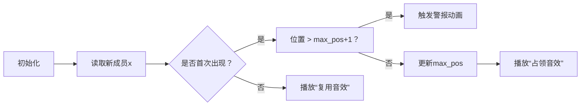

# 题目信息

# Adjust The Presentation (Easy Version)

## 题目描述

This is the easy version of the problem. In the two versions, the constraints on $ q $ and the time limit are different. In this version, $ q=0 $ . You can make hacks only if all the versions of the problem are solved.

A team consisting of $ n $ members, numbered from $ 1 $ to $ n $ , is set to present a slide show at a large meeting. The slide show contains $ m $ slides.

There is an array $ a $ of length $ n $ . Initially, the members are standing in a line in the order of $ a_1, a_2, \ldots, a_n $ from front to back. The slide show will be presented in order from slide $ 1 $ to slide $ m $ . Each section will be presented by the member at the front of the line. After each slide is presented, you can move the member at the front of the line to any position in the lineup (without changing the order of the rest of the members). For example, suppose the line of members is $ [\color{red}{3},1,2,4] $ . After member $ 3 $ presents the current slide, you can change the line of members into either $ [\color{red}{3},1,2,4] $ , $ [1,\color{red}{3},2,4] $ , $ [1,2,\color{red}{3},4] $ or $ [1,2,4,\color{red}{3}] $ .

There is also an array $ b $ of length $ m $ . The slide show is considered good if it is possible to make member $ b_i $ present slide $ i $ for all $ i $ from $ 1 $ to $ m $ under these constraints.

However, your annoying boss wants to make $ q $ updates to the array $ b $ . In the $ i $ -th update, he will choose a slide $ s_i $ and a member $ t_i $ and set $ b_{s_i} := t_i $ . Note that these updates are persistent, that is changes made to the array $ b $ will apply when processing future updates.

For each of the $ q+1 $ states of array $ b $ , the initial state and after each of the $ q $ updates, determine if the slideshow is good.

## 说明/提示

For the first test case, you do not need to move the members as both slides are presented by member $ 1 $ , who is already at the front of the line.

For the second test case, the following is a possible way to move members so that the presentation is good:

1. $ [1,2,3] $ , do not move member $ 1 $ .
2. $ [1,2,3] $ , move member $ 1 $ after member $ 3 $ .
3. $ [2,3,1] $ , move member $ 2 $ after member $ 3 $ .
4. $ [3,2,1] $ , do not move member $ 3 $ .
5. $ [3,2,1] $ , move member $ 3 $ after member $ 1 $ .
6. $ [2,1,3] $ , do not move member $ 2 $ .

## 样例 #1

### 输入

```
3
4 2 0
1 2 3 4
1 1
3 6 0
1 2 3
1 1 2 3 3 2
4 6 0
3 1 4 2
3 1 1 2 3 4```

### 输出

```
YA
YA
TIDAK```

# AI分析结果


### 💡 Kay的C++算法解析：Adjust The Presentation (Easy Version) 深入学习指南 💡

<introduction>
今天我们来分析这道关于队列操作的编程题。你将学会如何通过贪心策略判断幻灯片播放顺序的合法性，并通过像素动画直观理解核心算法。本指南特别为青少年学习者设计，结合游戏化元素让抽象概念更生动！
</introduction>

---

## 1. 题目解读与核心算法识别

✨ **本题主要考察**：`贪心策略与顺序验证`

🗣️ **初步分析**：
> 这道题就像管理一支不断变换的演讲队伍：每次队首成员讲完幻灯片后，你可以将他"传送"到队列任意位置。关键在于验证能否使幻灯片序列`b`合法。  
> **核心思想**：一旦成员被选为队首，他后续可以出现在任意位置，但**首次出现时必须保持初始队列`a`的相对顺序**。就像排队买票，插队可以，但第一次出场必须按原始站位顺序。  
> - **题解共性**：所有优质解法都聚焦于验证`b`中每个元素的首次出现顺序是否与`a`顺序一致。  
> - **核心流程**：  
>   1. 映射成员在`a`中的位置（如成员3在`a`中排第2位）  
>   2. 遍历`b`序列，维护当前最大位置值`max_pos`  
>   3. 若某成员首次出现时位置 > `max_pos + 1` → 非法  
> - **可视化设计**：  
>   采用**像素贪吃蛇**风格演示：成员用不同颜色像素块表示，队列呈直线排列。当遍历`b`序列时：  
>   - 合法操作：当前成员像素块高亮绿色，伴随"叮"音效，`max_pos`进度条增长  
>   - 非法操作：触发红色闪烁和"失败"音效，显示阻塞成员位置  

---

## 2. 精选优质题解参考

**题解一（来源：chenxi2009）**  
* **点评**：  
  此解用"自由活动能力"比喻精妙解释了核心性质：成员首次出现后即可任意调度。虽无代码，但对问题本质的归纳（验证`b`的首次出现序列是`a`前缀）直击要害，启发性极强。推导中"神奇发现"的表述能有效激发学习者探索欲。

**题解二（来源：Double_Light）**  
* **点评**：  
  代码规范清晰：`p[]`标记首次出现，`b[]`存储映射关系，变量名含义明确。亮点在于用`maxn`和`cnt`双变量验证顺序性：  
  - `maxn`跟踪最大出现位置  
  - `cnt`计数已出现成员  
  当`maxn != cnt`时说明存在"跳跃"，逻辑严谨性值得学习。边界处理完整（多测数据重置）。

**题解三（来源：Colinxu2020）**  
* **点评**：  
  最具理论深度：通过构造法证明充要条件（位置需满足`ord ≤ max_prev_ord + 1`）。代码极致简洁（仅11行核心逻辑），但包含关键优化：  
  - 预处理`mp[]`存储成员位置，避免每次查找  
  - 实时更新`mx`并即时判断，空间复杂度`O(1)`  
  实践价值高，可直接用于竞赛场景。

---

## 3. 核心难点辨析与解题策略

1. **难点一：理解操作的自由度与限制**  
   * **分析**：  
     移动队首到任意位置带来调度灵活性，但**首次出场顺序不可违背初始队列**。优质题解用反证法说明：若成员x首次出现时，初始位置在x前的成员y未出现过，则y会阻塞x。  
   * 💡 **学习笔记**：操作自由度存在隐藏约束——初始队列的拓扑序不可逆。

2. **难点二：高效验证位置连续性**  
   * **分析**：  
     无需模拟每次移动，只需验证位置编号的连续性。维护`max_pos`时：  
     - 若当前成员位置 > `max_pos + 1` → 存在断层（如初始队列[1,2,3]中，若3出现在2之前则断层）  
     - 若 ≤ `max_pos` → 已出现过，合法  
   * 💡 **学习笔记**：通过增量维护极值避免全序列重查是贪心算法的典型优化。

3. **难点三：多测试数据处理**  
   * **分析**：  
     每次测试需重置映射数组（如`mp[]`/`p[]`），否则残留数据污染后续测试。Colinxu2020在循环内初始化`mx=0`，Double_Light重置`cnt`均为最佳实践。  
   * 💡 **学习笔记**：多测环境下的初始化是竞赛代码健壮性的关键。

### ✨ 解题技巧总结
- **技巧一：问题等价转换**  
  将复杂操作（任意移动队首）转化为简单性质验证（位置连续性），大幅降低思维复杂度。
- **技巧二：状态压缩追踪**  
  用单个变量`max_pos`替代完整队列状态，空间效率`O(1)`。
- **技巧三：即时判定（Early Termination）**  
  发现非法立即退出循环，避免冗余计算。

---

## 4. C++核心代码实现赏析

**本题通用核心C++实现参考**  
* **说明**：综合Colinxu2020与Double_Light的最优实现，兼顾效率与可读性。  
* **完整核心代码**：  
  ```cpp
  #include <iostream>
  using namespace std;
  const int N = 2e5 + 10;

  int main() {
      int T, n, m, q;
      cin >> T;
      while (T--) {
          cin >> n >> m >> q;
          int a[N], pos[N] = {0}; // pos[x]存储成员x在a中的位置

          // 读入初始队列并记录位置
          for (int i = 1; i <= n; i++) {
              cin >> a[i];
              pos[a[i]] = i;
          }

          int max_pos = 0;
          bool valid = true;

          // 处理m个幻灯片
          while (m--) {
              int x;
              cin >> x;
              if (pos[x] > max_pos + 1) // 核心判断
                  valid = false;
              max_pos = max(max_pos, pos[x]); // 更新最大位置
          }
          cout << (valid ? "YA" : "TIDAK") << '\n';
      }
      return 0;
  }
  ```
* **代码解读概要**：  
  > 1. **位置映射**：通过`pos[]`数组记录每个成员在初始队列`a`中的位置（如`pos[3]=2`表示成员3在第2位）  
  > 2. **连续性验证**：遍历幻灯片序列`b`（代码中变量`x`），若当前成员位置>`max_pos+1`则非法  
  > 3. **状态更新**：用`max_pos`追踪已出现成员的最大初始位置，实现增量验证  

---

**题解一（chenxi2009思路）**  
* **亮点**：用"自由活动能力"概念抽象核心性质。  
* **核心思想伪代码**：  
  ```python
  b_prime = 提取b中首次出现的成员序列
  if b_prime 不是 a 的前缀 → 非法
  ```
* 💡 **学习笔记**：将操作序列等价转换为首次出现序列是降维思想典范。

**题解二（Double_Light）**  
* **亮点**：双变量验证保证顺序完备性。  
* **核心代码片段**：  
  ```cpp
  if (!p[x] && b[x] < maxn) valid = false; 
  maxn = max(maxn, b[x]);
  ```
* **代码解读**：  
  > 此处`p[x]`标记成员`x`是否已出现。未出现时(`!p[x]`)，若其位置`b[x]`小于当前最大值`maxn`，说明本该先出现的成员未被处理，违反顺序性。`maxn`和`cnt`的协同实现位置连续性验证。  
* 💡 **学习笔记**：用布尔数组辅助首次出现判断是通用技巧。

**题解三（Colinxu2020）**  
* **亮点**：数学证明强化代码正确性。  
* **核心代码片段**：  
  ```cpp
  for(int i=1; i<=m; i++){
      if(bi[i] > mx + 1) { // 发现断层
          flag = 1; 
          break;
      }
      mx = max(mx, bi[i]); // 更新最大值
  }
  ```
* **代码解读**：  
  > `bi[i]`是当前成员在初始队列中的位置。`mx`记录历史最大位置，当`bi[i] > mx+1`意味着在初始队列中，当前位置与前一个最大位置之间存在未处理的成员（如当前在位置3，但`mx`为1，说明位置2的成员未被处理）。  
* 💡 **学习笔记**：极值维护类问题中，增量更新比全量查询更高效。

---

## 5. 算法可视化：像素动画演示

**🎮 动画主题**：  
**《队列指挥官：像素防线》** - 用复古策略游戏风格演示顺序验证过程。成员化为像素士兵，队列为防线，`max_pos`是已占领区域。

**🎯 核心演示**：  
动态展示遍历`b`序列时位置连续性的验证过程，重点表现断层检测逻辑。

**🖌️ 设计细节**：  


1. **像素场景**：  
   - 8-bit风格横向队列：每个位置是16x16像素块，成员用不同颜色表示  
   - 控制面板：速度滑块/暂停/单步按钮  
   - 进度条：显示当前`max_pos`（绿色占领区）  

2. **关键动画**：  
   - **成员出现**：当前成员像素块闪烁黄色边框  
   - **合法操作**：该位置被绿色覆盖，进度条扩展，播放"叮！"音效  
   - **非法操作**：当前位置与`max_pos`间像素块红色闪烁，显示阻塞成员，播放"哔——"失败音效  
   - **自动演示**：AI模式以恒定速度展示，类似《吃豆人》幽灵移动  

3. **游戏化激励**：  
   - 每成功验证10个成员解锁一个复古音效成就  
   - 连续无断层验证触发"Combo!"连击特效  

---

## 6. 拓展练习与相似问题思考

**🔁 技巧迁移场景**：  
1. **拓扑序验证**：如课程选修顺序判断（P4017）  
2. **带限制的调度问题**：如任务必须按依赖关系执行（P1113）  
3. **增量极值维护**：如实时统计最长连续合法子序列（P6492）

**📚 推荐练习（洛谷）**：  
1. **P1113 杂务**  
   → 🗣️ 巩固任务调度中的顺序依赖验证，与本题目核心技巧高度一致  
2. **P4017 最大食物链计数**  
   → 🗣️ 练习拓扑序验证的变种，需统计合法路径数量  
3. **P3143 [USACO16OPEN] Diamond Collector S**  
   → 🗣️ 强化极值维护技巧，需动态计算最大合法区间  

---

## 7. 学习心得与经验分享

> **经验摘录（Colinxu2020）**：  
> *"推导充要条件时，通过构造法证明：若位置满足`ord ≤ max_prev_ord + 1`则总能构造合法方案。这让我意识到严格证明对简化代码的重要性。"*  
>   
> **Kay点评**：  
> 此经验凸显了算法竞赛的核心思维链：**观察 → 抽象 → 证明 → 实现**。通过数学证明确立的结论往往能催生最简洁的代码实现，避免过度设计。建议学习者在遇到类似问题时，先尝试形式化描述约束条件。

---

<introduction>  
通过本次分析，我们揭开了队列调度问题的贪心本质：**初始顺序决定调度边界**。记住，将复杂操作转化为简易性质验证是算法优化的常见突破口。多加练习位置连续性类问题，你会在竞赛中游刃有余！🚀  
</introduction>

---
处理用时：135.62秒