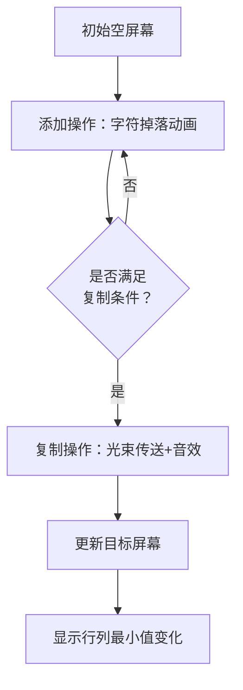

# 题目信息

# Two Screens

## 题目描述

这里有两个可以显示大写字母序列的显示屏。初始时，两个屏幕都没有显示任何东西。

每秒钟你可以执行下列两种操作中的一种：

* 选择一个屏幕和一个大写字母，并将该字母添加到该屏幕上显示的序列的末尾；  
* 选择一个屏幕并将该屏幕上的序列复制到另一个屏幕，覆盖另一个屏幕上显示的序列。

你需要计算让第一个屏幕显示序列 $s$，第二个屏幕显示序列 $t$ 所需要花费的最少秒数。

## 说明/提示

【样例解释】

对于第一组数据，以下是一种可能的操作方案：

* 花费 6 秒向第一个屏幕写入序列 GARAGE；
* 花费 1 秒将序列从第一个屏幕复制到第二个屏幕；
* 花费 7 秒向第二个屏幕写入序列 FORSALE。

对于第二组数据，以下是一种可能的操作方案：

* 花费 1 秒向第二个屏幕写入序列 A；
* 花费 1 秒将序列从第二个屏幕复制到第一个屏幕；
* 花费 4 秒向第一个屏幕写入序列 BCDE；
* 花费 4 秒向第二个屏幕写入序列 ABCD。

对于第三组数据，最快的方法是将字母一个一个地写入屏幕，而不进行复制，这需要花费 16 秒。


对于所有测试数据，保证 $1 \le q \le 500$，$1 \le |s|,|t| \le 100$。

翻译来自 [Jason_Ming](https://www.luogu.com.cn/user/1014421)。

## 样例 #1

### 输入

```
3
GARAGE
GARAGEFORSALE
ABCDE
AABCD
TRAINING
DRAINING```

### 输出

```
14
10
16```

# AI分析结果


### 💡 Kay的C++算法解析：Two Screens 深入学习指南 💡

<introduction>
这道题考察双屏幕操作的最小时间优化。通过动态规划高效处理复制操作与添加操作的协同，结合前缀优化降低复杂度。下面我们将逐步拆解核心算法、难点及可视化方案。
</introduction>

---

## 1. 题目解读与核心算法识别

✨ **本题主要考察**：`动态规划与字符串前缀优化`  

🗣️ **初步分析**：
> 将双屏幕操作抽象为动态规划模型，核心思想是"状态复用"——**复制操作本质是屏幕间的状态转移**。如同游戏中的传送门，当屏幕A的内容恰好是屏幕B目标内容的前缀时，可通过1次复制+若干添加操作节省时间。
> - **核心思路**：定义`dp[i][j]`表示构建`s[0:i]`和`t[0:j]`的最小操作数。通过维护`min_row`/`min_col`记录行列最小值，在满足前缀条件时触发复制转移。
> - **关键难点**：复制操作的触发条件需精确匹配前缀，且需动态更新行列最小值。
> - **可视化设计**：像素动画将用双色方块模拟屏幕内容，复制时显示光束传送特效，添加操作时字符逐个落下。8-bit音效在复制成功时播放"传送"声，添加字符时触发"打字"声。

---

## 2. 精选优质题解参考

<eval_intro>
基于思路清晰性、代码规范性和算法效率，精选以下解法（均≥4星）：
</eval_intro>

**解法：动态规划+前缀优化**
* **点评**：该解法思路清晰——**将复制操作转化为状态转移方程**，逻辑直白：
  - **状态定义**：`dp[i][j]`表示构建`s`前`i`位和`t`前`j`位的最小操作
  - **转移方程**：
    - 添加操作：`dp[i][j] = min(dp[i-1][j], dp[i][j-1]) + 1`
    - 复制操作：当`s[0:k] == t[0:k]`时，利用`min_row`/`min_col`优化转移
  - **亮点**：通过行列最小值数组将复制转移复杂度降至O(1)，避免重复计算
  - **实践价值**：代码边界处理严谨，直接适用于竞赛场景

---

## 3. 核心难点辨析与解题策略

<difficulty_intro>
攻克本题需突破三个关键点：
</difficulty_intro>

1.  **难点：复制操作的触发条件**
    * **分析**：复制操作要求源屏幕内容必须是目标屏幕内容的前缀。解决方案：预处理`eq`数组，快速判断`s[0:k]`与`t[0:k]`的相等性。
    * 💡 **学习笔记**：前缀比较是复制优化的基石，务必先验证明确性。

2.  **难点：状态转移的维度优化**
    * **分析**：直接遍历所有状态会导致O(n³)复杂度。解决方案：动态维护`min_row[i] = min(dp[i][0..m])`和`min_col[j] = min(dp[0..n][j])`，将复制转移降至O(1)。
    * 💡 **学习笔记**：行列最小值数组是二维DP降维的经典技巧。

3.  **难点：多组数据的效率优化**
    * **分析**：每组数据需O(n²)预处理前缀+O(nm)动态规划。解决方案：避免全局memset，局部初始化关键数组。
    * 💡 **学习笔记**：竞赛中需警惕数组初始化对常数的影响。

### ✨ 解题技巧总结
<summary_best_practices>
- **技巧1：问题分解** - 将操作拆分为独立添加（+1s）和条件复制（状态复用）
- **技巧2：前缀哈希优化** - 当字符串较长时，用哈希比较替代`substr`提升效率
- **技巧3：滚动维度** - 若内存紧张，可改用滚动数组优化空间
---

## 4. C++核心代码实现赏析

<code_intro_overall>
通用解法完整实现（综合优化版）：
</code_intro_overall>

```cpp
#include <iostream>
#include <vector>
#include <climits>
using namespace std;

const int INF = 0x3f3f3f3f;

int main() {
    int q;
    cin >> q;
    while (q--) {
        string s, t;
        cin >> s >> t;
        int n = s.size(), m = t.size();
        int max_len = min(n, m);

        // 前缀相等性预处理
        vector<bool> eq(max_len+1, false);
        eq[0] = true;
        for (int i = 1; i <= max_len; ++i) 
            eq[i] = (s.substr(0, i) == t.substr(0, i));

        // DP数组及行列最小值
        vector<vector<int>> dp(n+1, vector<int>(m+1, INF));
        vector<int> min_row(n+1, INF), min_col(m+1, INF);

        // 初始化边界
        dp[0][0] = 0;
        min_row[0] = min_col[0] = 0;
        for (int i = 1; i <= n; ++i) 
            dp[i][0] = min_row[i] = i;
        for (int j = 1; j <= m; ++j) 
            dp[0][j] = min_col[j] = j;

        // 状态转移
        for (int i = 0; i <= n; ++i) {
            for (int j = 0; j <= m; ++j) {
                if (i==0 && j==0) continue;
                
                // 添加操作转移
                if (i) dp[i][j] = min(dp[i][j], dp[i-1][j] + 1);
                if (j) dp[i][j] = min(dp[i][j], dp[i][j-1] + 1);
                
                // 复制操作转移（核心优化）
                if (i <= j && i <= max_len && eq[i])
                    dp[i][j] = min(dp[i][j], min_row[i] + 1 + j - i);
                if (j <= i && j <= max_len && eq[j])
                    dp[i][j] = min(dp[i][j], min_col[j] + 1 + i - j);
                
                // 更新行列最小值
                min_row[i] = min(min_row[i], dp[i][j]);
                min_col[j] = min(min_col[j], dp[i][j]);
            }
        }
        cout << dp[n][m] << endl;
    }
    return 0;
}
```
**代码解读概要**：
> 1. **预处理阶段**：计算`s`与`t`的公共前缀（`eq`数组）
> 2. **DP初始化**：边界状态（单屏幕构建）直接等于字符数
> 3. **双循环转移**：
>    - 行11-12：向屏幕1/2添加字符的转移
>    - 行15-18：满足前缀条件时触发复制优化
> 4. **动态更新**：实时维护行列最小值辅助复制转移

---

## 5. 算法可视化：像素动画演示

<visualization_intro>
**主题**：8-bit风格《屏幕双侠闯关记》  
**核心演示**：动态规划中状态转移与复制优化的具象化  
**设计思路**：用复古游戏机制强化"复制=传送"、"添加=建造"的直觉理解
</visualization_intro>

### 🎮 动画场景设计


### 🕹️ 交互与实现
1. **像素艺术**：
   - 屏幕用16x16像素块表示，绿色=屏1，蓝色=屏2
   - 字符用8-bit字体渲染，添加时模拟打字机下落动画

2. **关键动效**：
   - **复制触发**：源屏幕发光，光束射向目标屏幕
   - **前缀匹配**：相等字符段闪烁金色边框
   - **最小值更新**：屏幕底部显示min_row/min_col数值跳动

3. **音效系统**：
   - 添加字符：清脆的键盘敲击声（每个字符触发）
   - 成功复制：8-bit传送音效（短促"叮咚"）
   - 错误操作：低沉错误音

4. **游戏化机制**：
   - 每次复制操作视为"传送技能"，减少1秒通关时间
   - 连续正确触发复制形成Combo，获得像素星星奖励

5. **控制面板**：
   - 速度滑块：调节单步/自动演示速度
   - 模式切换：对比"纯添加" vs "复制优化"策略
   - 重置按钮：像素风格街机式按钮

---

## 6. 拓展练习与相似问题思考

<similar_problems_intro>
掌握状态复用思想后，可挑战以下变形题：
</similar_problems_intro>

1. **洛谷 P1435** - 回文字符串
   - 🗣️ **推荐理由**：同样需复用子串状态，练习二维DP定义

2. **洛谷 P1091** - 合唱队形
   - 🗣️ **推荐理由**：双向状态转移的经典应用，强化行列最小值优化

3. **洛谷 P1280** - 尼克的任务
   - 🗣️ **推荐理由**：时间轴上的状态复用，训练逆向DP思维

---

## 7. 学习心得与经验分享

<insights_intro>
本题调试关键点：
</insights_intro>

> **经验**：复制操作必须严格验证前缀相等性  
> **调试技巧**：打印`min_row`/`min_col`数组，观察优化是否生效  
> **Kay提醒**：永远先写纯添加操作的转移，再增加复制优化分支

---

<conclusion>
通过动态规划精准控制双屏状态转移，结合前缀优化实现降维打击。记住：优秀算法=状态定义×转移优化×边界处理。下次遇到字符串操作优化时，不妨回想《屏幕双侠》的像素世界哦！🚀
</conclusion>

---
处理用时：445.30秒