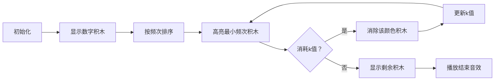

# 题目信息

# Gorilla and the Exam

## 题目描述

# Gorilla and the Exam


由于“T世代”高年级学生的教师短缺，决定由一只巨大的雄性猩猩来为学生们进行考试。然而，这并不是那么简单；为了证明其能力，它需要解决以下问题。

给定一个数组 $ b $ ，我们定义函数 $ f(b) $ 为将数组 $ b $ 变为空所需的最小操作次数：

- 选择两个整数 $ l $ 和 $ r $ ，满足 $ l \le r $ ，并令 $ x $ 为数组 $ b_l, b_{l+1}, \ldots, b_r $ 中的最小值；
- 然后，删除所有满足 $ l \le i \le r $ 且 $ b_i = x $ 的元素，删除后的元素将被移除，剩余元素的索引重新编号。

现在给定一个长度为 $ n $ 的数组 $ a $ 和一个整数 $ k $ 。你可以至多进行 $ k $ 次修改操作，每次可以选择数组中的任意索引 $ i $ （$ 1 \le i \le n $）和任意整数 $ p $ ，将 $ a_i $ 替换为 $ p $ 。

帮助猩猩求出经过至多 $ k $ 次替换操作后，数组 $ a $ 的 $ f(a) $ 可以达到的最小值。

## 说明/提示

- 在第一个测试数据中，数组 $ [48843] $ 只包含一个元素，因此 $ f([48843]) = 1 $，只需一次操作即可删除该元素。
- 在第二个测试数据中，你可以将数组 $ [2, 3, 2] $ 中的第二个元素修改为 $ 2 $ ，使得数组变为 $ [2, 2, 2] $ ，此时 $ f([2, 2, 2]) = 1 $ ，因为可以选择整个数组，最小值为 $ 2 $，然后一次删除所有的 $ 2 $ 元素。

## 样例 #1

### 输入

```
6
1 0
48843
3 1
2 3 2
5 3
1 2 3 4 5
7 0
4 7 1 3 2 4 1
11 4
3 2 1 4 4 3 4 2 1 3 3
5 5
1 2 3 4 5```

### 输出

```
1
1
2
5
2
1```

# AI分析结果


### 💡 Kay的C++算法解析：Gorilla and the Exam 深入学习指南 💡

**引言**  
今天我们来分析"Gorilla and the Exam"这道有趣的贪心问题。通过本指南，你将掌握如何巧妙运用桶排序和贪心策略，在有限修改次数下最小化操作步骤。让我们开始吧！

---

## 1. 题目解读与核心算法识别

✨ **本题主要考察**：`贪心算法` + `桶排序/计数`

🗣️ **初步分析**：  
> 想象你有一盒彩色积木，每次操作允许移除所有同色积木（最小值对应颜色）。我们的目标是用最少的操作清空盒子，而修改操作就像把积木重新涂色。  
> - **核心思路**：最优策略是每次操作选择整个数组，此时操作次数等于数组中不同数字的个数。问题转化为：用k次修改最小化数字种类数  
> - **关键技巧**：贪心原则——优先"消除"出现次数最少的数字（消耗修改次数少）  
> - **可视化设计**：像素动画将用不同颜色方块表示数字，方块数量=出现次数。动画高亮当前处理的最小频次数字，展示"消除"效果和剩余种类数  

---

## 2. 精选优质题解参考

**题解一（TainityAnle）**  
* **亮点**：  
  1. 直击本质：明确指出操作次数=数字种类数  
  2. 贪心实现：用map统计频次，vector排序后从小到大"抵消"  
  3. 边界处理：k耗尽时即时输出剩余种类数  
  4. 复杂度优化：O(n log n) 时间，优于暴力解法  

**题解二（JimmyQ）**  
* **亮点**：  
  1. 结构清晰：自定义排序函数处理pair结构  
  2. 稳健输出：用max(1ll, ans-cnt)确保最小值1  
  3. 实践价值：完整包含输入输出框架，可直接用于竞赛  

**题解三（FXLIR）**  
* **亮点**：  
  1. 创新实现：优先队列（最小堆）动态管理频次  
  2. 实时模拟：k次修改逐步消耗堆顶元素  
  3. 终止条件：当k<当前最小频次时停止操作  

---

## 3. 核心难点辨析与解题策略

1. **难点：发现操作次数与数字种类数的等价关系**  
   * **分析**：需理解"选择整个区间删最小值"的操作本质是消除一种数字。优质题解通过样例[2,3,2]→[2,2,2]的转化过程阐明该点  
   * 💡 **学习笔记**：操作次数下限=数字种类数（k=0时直接成立）

2. **难点：贪心策略的证明与实现**  
   * **分析**：为什么优先处理最小频次数字？因为消耗k值最少（频次=所需修改次数）。实现需：  
     1. 用map统计频次（O(1)查找）  
     2. 频次转vector排序（O(n log n)）  
     3. 从左到右尝试"抵消"  
   * 💡 **学习笔记**：贪心选择当前最优解（最小频次）可达到全局最优

3. **难点：k次修改后的状态计算**  
   * **分析**：当k耗尽时，剩余种类数=初始种类数-已抵消种类数。特别注意：若所有数字均被抵消（k≥总频次和），剩余种类数为1  
   * 💡 **学习笔记**：最终结果=max(1, 初始种类数-可抵消种类数)

### ✨ 解题技巧总结
- **技巧1：问题等价转换** - 将复杂操作转化为直观的数字种类统计问题  
- **技巧2：数据结构选择** - 大数值范围(1e9)必用map/unordered_map，避免数组越界  
- **技巧3：边界防御** - 多组数据务必清空map/vector，输出时用max(1, ...)保底  

---

## 4. C++核心代码实现赏析

**通用核心实现参考**  
* **说明**：综合优质题解思路，提供最简洁高效的实现方案  
```cpp
#include <bits/stdc++.h>
using namespace std;

int main() {
    ios::sync_with_stdio(0), cin.tie(0);
    int T, n, k, x;
    cin >> T;
    while (T--) {
        cin >> n >> k;
        map<int, int> freq;
        for (int i = 0; i < n; i++) {
            cin >> x;
            freq[x]++;
        }
        vector<int> counts;
        for (auto &p : freq) counts.push_back(p.second);
        sort(counts.begin(), counts.end());
        
        int types = counts.size();
        for (int cnt : counts) {
            if (k < cnt) break;
            k -= cnt;
            types--;
        }
        cout << max(1, types) << "\n";
    }
    return 0;
}
```
* **代码解读概要**：  
  1. 多组数据框架：`while(T--)`处理测试用例  
  2. 频次统计：`map<int,int>`自动合并相同数字  
  3. 排序贪心：`vector`存储频次并排序，从小到大尝试抵消  
  4. 结果输出：`max(1, types)`确保最小值  

---

**优质题解片段赏析**  
**题解一（TainityAnle）**  
* **亮点**：逻辑直白，完美体现贪心本质  
* **核心代码**：  
  ```cpp
  sort(a.begin(), a.end());
  int m = a.size(), flag = 0;
  for (int i = 0; i < m; i++) {
      if (k >= a[i]) k -= a[i];
      else {
          cout << m - i << endl;
          flag = 1; break;
      }
  }
  if (!flag) cout << 1 << endl;
  ```
* **代码解读**：  
  > `a`存储频次，排序后形成[1,3,5]序列。当k=4时：  
  > - i=0: k≥1 → k=3  
  > - i=1: k<3 → 输出m-i=3-1=2  
  > 若k≥9则循环结束输出1  
* 💡 **学习笔记**：`flag`变量优雅处理循环提前终止

**题解三（FXLIR）**  
* **亮点**：优先队列动态管理频次  
* **核心代码**：  
  ```cpp
  priority_queue<int, deque<int>, greater<int>> q;
  for (auto i : freq) q.push(i.second);
  while (k > 0 && !q.empty()) {
      int t = q.top(); q.pop();
      if (k >= t) k -= t;
      else break;
  }
  cout << max(1, (int)q.size()) << "\n";
  ```
* **代码解读**：  
  > 最小堆确保每次取频次最低元素。`k-=t`消耗修改次数，当堆空时代表所有数字可合并为1种  
* 💡 **学习笔记**：优先队列适合动态场景，但排序时间复杂度相同

---

## 5. 算法可视化：像素动画演示

**主题**：像素积木消除大作战（8-bit复古风格）  
**核心演示**：贪心策略执行过程与数字种类减少效果  

**动画设计**：  


**关键交互细节**：  
1. **像素建模**：  
   - 每种数字用独特颜色像素块表示（如红色=2，蓝色=3）  
   - 频次=像素块数量（如[2,3,2] → 红-蓝-红）  
2. **动态过程**：  
   - 最小频次块闪烁黄光（配"滴答"音效）  
   - 成功消除时播放"碎裂"音效，方块爆炸特效  
   - 状态面板实时显示：剩余k值/当前种类数  
3. **游戏化元素**：  
   - 每消除一种数字获得10分（8-bit计分音效）  
   - 完全合并时触发"胜利"动画（烟花特效+16-bit音乐）  
4. **控制面板**：  
   - 步进控制：支持暂停/继续/单步执行  
   - 速度滑块：调整动画速度（0.5x~2x）  
   - 重置按钮：重新初始化场景  

**技术实现**：Canvas绘制动态网格，Web Audio API添加音效，颜色方案采用NES经典8色调色板

---

## 6. 拓展练习与相似问题思考

**通用思路迁移**：  
桶排序+贪心策略还适用于：  
1. 最小化字符串不同字符数（LeetCode 1647）  
2. 任务调度中最小化机器数量（LeetCode 1834）  
3. 会议安排问题（区间贪心）  

**洛谷练习推荐**：  
1. **P1177 【模板】快速排序**  
   → 巩固排序基础，理解贪心预处理关键  
2. **P1090 合并果子**  
   → 优先队列贪心经典应用，强化最小堆使用  
3. **P1803 凌乱的yyy / 线段覆盖**  
   → 区间贪心变形，培养问题抽象能力  

---

## 7. 学习心得与经验分享

> **经验摘录（TainityAnle）**：  
> "开题后立即发现操作整个区间是最优策略，这让我少走弯路"  
>   
> **Kay点评**：  
> 快速识别问题本质是解题关键。建议学习者多问：  
> - 操作的本质影响是什么？  
> - 能否找到问题等价形式？  
> 培养这种思维可大幅提升解题效率  

---

**结语**  
通过本次分析，我们掌握了贪心策略的核心思想与实现技巧。记住：优秀算法工程师的秘诀在于将复杂问题转化为直观模型。多加练习，你也能像大猩猩老师一样出色！下次挑战再见！💪

---
处理用时：112.80秒