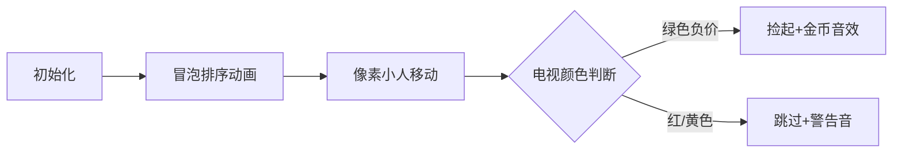

# 题目信息

# Sale

## 题目描述

Once Bob got to a sale of old TV sets. There were $ n $ TV sets at that sale. TV set with index $ i $ costs $ a_{i} $ bellars. Some TV sets have a negative price — their owners are ready to pay Bob if he buys their useless apparatus. Bob can «buy» any TV sets he wants. Though he's very strong, Bob can carry at most $ m $ TV sets, and he has no desire to go to the sale for the second time. Please, help Bob find out the maximum sum of money that he can earn.

## 样例 #1

### 输入

```
5 3
-6 0 35 -2 4
```

### 输出

```
8
```

## 样例 #2

### 输入

```
4 2
7 0 0 -7
```

### 输出

```
7
```

# AI分析结果


### 💡 Kay的C++算法解析：Sale 深入学习指南 💡

#### 题目解读与核心算法识别
✨ **本题主要考察**：`贪心算法`  
🗣️ **初步分析**：  
> 这道题就像在垃圾场淘金——电视价格为负时卖家会倒贴钱。贪心算法核心思想是**每一步都选当前最优解**，就像淘金时优先捡最大金块。本题中，我们只需排序后选价格最低的m台负价电视（即卖家贴钱最多的）。  
> - **核心难点**：区分有效负价电视，避免误选正价电视导致亏损  
> - **可视化设计**：用8位像素游戏展示电视排序过程，绿色方块代表负价电视（可捡钱），红色方块代表正价电视（需避让）。Bob像素小人从左到右移动捡电视，每次捡起时播放金币音效并更新头顶金币计数  

---

### 精选优质题解参考
**题解一（作者：empty）**  
* **点评**：思路巧妙地将负数取反转为正数，使排序后直接取最大值等同于选绝对值最大的负价电视。代码中`a[i]=0-x`的转换和降序取值逻辑清晰，边界处理严谨（遇到非正数立即停止）。变量名`money`直观体现解题目标，是竞赛编程的典范写法。

**题解二（作者：☆芝麻大饼☆）**  
* **点评**：直接对原数组升序排序的解法更符合直觉，循环中通过`if(a[i]>=0) break`精准避免误选非负电视。代码注释强调"坑！注意用零减"的调试经验极具参考价值，提醒学习者注意题目要求的"赚钱"本质是累加绝对值。

**题解三（作者：时律）**  
* **点评**：最简洁的标准贪心实现，严格遵循"选最负且不超过m台"原则。`if(x[i]<0)`的条件判断和`ans+=0-x[i]`的累加操作形成完美闭环，`sort`后立即处理的流水线式代码结构便于初学者理解算法本质。

---

### 核心难点辨析与解题策略
1. **负价电视识别**  
   * **分析**：必须严格筛选a[i]<0的电视。优质题解都用条件判断过滤，如时律的`if(x[i]<0)`和芝麻大饼的`if(a[i]>=0) break`  
   * 💡 **学习笔记**：负价是赚钱来源，正价是亏损陷阱

2. **贪心选择顺序**  
   * **分析**：升序排序后自然满足"优先选最便宜(最负)电视"的贪心性质。empty的逆向取反解法也等价实现此目标  
   * 💡 **学习笔记**：排序是贪心算法的前置核心操作

3. **选择数量控制**  
   * **分析**：循环终止条件需同时满足：已选数量≤m且未遇到非负电视。☆芝麻大饼☆的`for(int i=0;i<m;i++)`配合`break`是经典实现  
   * 💡 **学习笔记**：双约束条件需在循环中实时判断

✨ **解题技巧总结**  
- **问题转化技巧**：如empty将负数转正数简化判断  
- **边界防御编程**：循环内设终止条件避免无效选择  
- **语义化变量命名**：`money`/`ans`直观体现结果意义  

---

### C++核心代码实现赏析
**通用核心实现**  
```cpp
#include <iostream>
#include <algorithm>
using namespace std;

int main() {
    int n, m, a[105];
    cin >> n >> m;
    for(int i=0; i<n; i++) cin >> a[i];
    
    sort(a, a+n); // 升序排序使负价电视在前
    int ans = 0;
    
    for(int i=0; i<m; i++) {
        if(a[i] >= 0) break; // 遇到非负电视立即停止
        ans -= a[i];  // 累加负数的绝对值
    }
    cout << ans;
    return 0;
}
```
> **代码解读概要**：通过升序排序将负价电视集中在数组前端，循环m次累加其绝对值。关键防御`a[i]>=0`确保不会误选正价电视。

**题解一核心片段**  
```cpp
sort(a+1,a+n+1);
for(int i=n;i>=n-m+1;i--) {
  if(a[i]>0) money+=a[i];  // 取反后正数即原负数
  else break;
}
```
> **解读**：empty的逆向思维——取反后负价变正数，排序后直接从数组末端取最大值。妙在利用`a[i]>0`自然过滤原正数电视。  
> 💡 **学习笔记**：问题转化可简化代码逻辑

**题解二核心片段**  
```cpp
sort(a,a+n);
for(int i=0;i<m;i++) {
  if(a[i]>=0) break;     // 精准拦截非负电视
  sum+=0-a[i];           // 显式转正数累加
}
```
> **解读**：`0-a[i]`显式转换凸显"赚钱"本质，防御性`break`避免无效选择。  
> 💡 **学习笔记**：显式转换增强代码可读性

---

### 算法可视化：像素动画演示
**主题**：8位机《淘金小子》贪心模拟  
**核心演示**：电视排序→负价识别→动态捡取  


**动画关键帧**：  
1. **电视阵列初始化**：  
   - 随机生成像素电视（绿：负价，红：正价，黄：0）  
   - 控制面板含速度滑块/单步按钮/金币计数器  

2. **冒泡排序过程**：  
   - 相邻电视比较时高亮边框，交换时产生像素位移动画  
   - 每次交换播放"滴"声，排序完成奏胜利旋律  

3. **淘金小子移动捡拾**：  
   - 小人从左向右移动，遇到绿色电视播放"金币叮当"音效  
   - 电视消失时显示`+￥X`浮动文字，头顶金币计数更新  
   - 遇到红/黄电视时小人摇头+播放"错误"音效并跳过  

4. **自动演示模式**：  
   - 点击"AI演示"后自动完成全流程（可调速）  
   - 每捡1台电视计分板+100分，最终结算动画  

---

### 拓展练习与相似问题
1. **通用技巧迁移**：  
   - 合并果子（P1090）：优先选最小堆  
   - 删数问题（P1106）：贪心删最大数字  
   - 接水问题（P1223）：排序后最小等待  

2. **洛谷推荐**：  
   - **P1090**：巩固优先队列实现贪心  
   - **P1208**：学习混合背包的贪心策略  
   - **P1230**：进阶训练时空权衡的贪心  

---

### 学习心得与经验分享
> **作者☆芝麻大饼☆的经验**：  
> "坑！注意是赚的钱，要用零减"  
>   
> **Kay点评**：此调试经验直击核心——赚钱需显式转换负数为正数累加。类似的语义转换在竞赛编程中常见，例如「最小花费」可转化为「最大收益」。  

> **作者empty的启发**：  
> "买东西还能倒贴，良心"  
>   
> **Kay点评**：幽默提醒我们理解题目场景本质——负价电视才是收益来源，避免陷入正价电视的思维定式。  

---

通过这期分析，希望大家掌握贪心算法的核心要领：**排序创造贪心条件，循环实现局部最优**。记住，好算法像精妙的游戏——规则简单却充满智慧！🎮🚀

---
处理用时：176.08秒