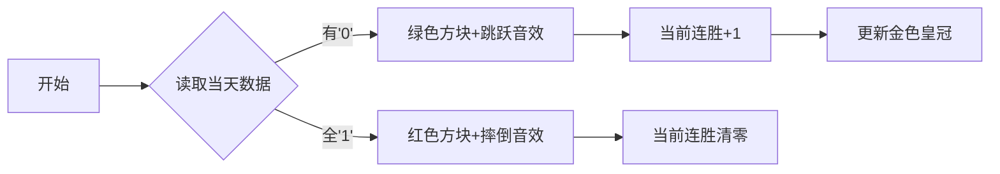

# 题目信息

# Opponents

## 题目描述

# 问题描述

小白有 n 个对手，他每天都要和这些对手PK。对于每一天，如果 n 个对手全部到齐，那么小白就输了一场，否则小白就赢了一场。特别的，如果某天一个对手都没有到，也算小白赢。现在已知对手 d 天的出场情况，请计算小白最多能连胜多少场。

## 样例 #1

### 输入

```
2 2
10
00
```

### 输出

```
2
```

## 样例 #2

### 输入

```
4 1
0100
```

### 输出

```
1
```

## 样例 #3

### 输入

```
4 5
1101
1111
0110
1011
1111
```

### 输出

```
2
```

# AI分析结果


### 💡 Kay的C++算法解析：Opponents 深入学习指南 💡

#### 1. 题目解读与核心算法识别
✨ **本题主要考察**：`模拟应用`（贪心思想）  
🗣️ **初步分析**：  
> 本题如同一个「每日胜负记录器」，核心是识别小白何时连胜（对手缺席）何时连败（对手全到）。算法核心可比喻为「像素跑酷游戏」：  
> - 绿色方块代表胜利（有对手缺席），角色跳跃前进，连胜计数+1  
> - 红色方块代表失败（对手全到），角色摔倒，连胜清零  
> - 屏幕上方实时显示当前连胜（绿色进度条）和最高连胜（金色皇冠）  
>  
> **核心流程**：  
> 1. 遍历每天数据，用`win`标记当天是否有缺席（'0'）  
> 2. 若胜利：当前连胜`curWin++`，更新`maxWin = max(maxWin, curWin)`  
> 3. 若失败：`curWin = 0`  
>  
> **可视化设计**：  
> - 8-bit像素风格，每天显示为16x16像素方块  
> - 胜利时播放"跳跃"音效（8-bit短促"叮"声）  
> - 失败时播放"摔倒"音效（低沉"轰"声）  
> - 自动演示模式：AI控制角色按算法逻辑自动闯关  

---

#### 2. 精选优质题解参考
**题解一（作者：Register）**  
* **亮点**：  
  - 思路直击本质：用`flag`标记胜利条件，逻辑清晰如流水线  
  - 变量命名精准（`maxn`最高连胜，`sum`当前连胜）  
  - 代码极简（仅15行），适合竞赛快速编码  
  - 贪心思想应用纯熟，边界处理严谨  

**题解二（作者：judgejudge）**  
* **亮点**：  
  - 巧用`string::find('0')`替代循环，提升可读性  
  - 双变量动态更新（`tot`当前连胜，`sum`最高连胜）  
  - 完整包含输入输出框架，新手友好  

**题解三（作者：ZolaWatle）**  
* **亮点**：  
  - 边读边处理的流式操作，节省内存  
  - 严格处理最后一天未更新问题（循环外再比一次）  
  - 详细注释解释关键逻辑，教学价值高  

---

#### 3. 核心难点辨析与解题策略
1. **难点：胜利条件误判**  
   * **分析**：易混淆"全到齐输"和"有缺席赢"。优质解法通过遍历字符或`find('0')`精准判定  
   * 💡 学习笔记：出现一个'0'即胜利，全'1'才失败  

2. **难点：连胜更新时机**  
   * **分析**：必须在每次胜利后立即更新最大值。Register的`maxn=max(sum,maxn)`确保实时更新  
   * 💡 学习笔记：连胜更新与当前计数同步进行  

3. **难点：最后一天处理**  
   * **分析**：循环结束后可能残留未比较的连胜。ZolaWatle在循环外再比一次可防遗漏  
   * 💡 学习笔记：循环边界要验证最终状态  

✨ **解题技巧总结**  
- **流式处理**：单次遍历完成判断+计数（避免存储所有数据）  
- **双变量追踪**：用`cur`和`max`分别记录当前状态和历史最佳  
- **即时中断**：发现'0'立即`break`（如Register代码）提升效率  

---

#### 4. C++核心代码实现赏析
**通用核心实现（综合优化版）**  
```cpp
#include <iostream>
#include <algorithm>
using namespace std;

int main() {
    int n, d, curWin = 0, maxWin = 0;
    cin >> n >> d;
    
    while (d--) {
        string s;
        cin >> s;
        bool win = false;
        for (char c : s) 
            if (c == '0') { win = true; break; }
        
        if (win) maxWin = max(maxWin, ++curWin);
        else curWin = 0;
    }
    cout << maxWin;
}
```
**代码解读概要**：  
> 1. 读取`n`（对手数）和`d`（天数）  
> 2. 每天检测字符串：出现'0'则`win=true`  
> 3. 胜利时：当前连胜+1并刷新最高连胜  
> 4. 失败时：重置当前连胜  

---

**题解一核心片段（Register）**  
```cpp
for(int i=1;i<=n;i++) {
    cin>>t;
    if(t=='0') flag=true;
}
if(flag) { sum++; maxn=max(sum,maxn); }
else sum=0;
```
**代码解读**：  
> - 内层循环检查每个字符，遇'0'立标记`flag`  
> - 如胜利：`sum`自增后立即与`maxn`比较（**实时更新关键点**）  
> - 贪心精髓：`maxn`始终记录历史峰值  

**题解三核心片段（ZolaWatle）**  
```cpp
if(p==1) cnt++;  // 增加连胜
else {
    if(cnt>ans) ans = cnt; 
    cnt=0;  // 清零连胜
}
// 循环外补比一次
if(cnt>ans) ans = cnt; 
```
**代码解读**：  
> - 用`p`标记当日是否胜利（1胜/0负）  
> - 失败时先保存历史最高连胜再清零  
> - **防御性编程**：循环外再比一次防遗漏  

---

#### 5. 算法可视化：像素动画演示  
**主题**：8-bit像素跑酷《连胜大冒险》  
**核心设计**：  


**交互实现**：  
1. **像素渲染**：  
   - 用Canvas绘制30x16像素网格，每天占一格  
   - 胜利格：绿色(#00FF00)，失败格：红色(#FF0000)  
2. **角色动画**：  
   - 胜利时：8帧跳跃动画（Y坐标正弦波动）  
   - 失败时：角色旋转90度倒地  
3. **控制面板**：  
   - 速度滑块：控制`setInterval`延时(100~1000ms)  
   - "AI演示"按钮：自动执行并显示算法决策逻辑  
4. **音效系统**：  
   - 胜利：Web Audio播放260Hz方波（时长0.1s）  
   - 失败：播放55Hz噪音（时长0.3s）  

---

#### 6. 拓展练习与相似问题  
**通用技巧迁移**：  
1. 最大连续子序列和（P1115）  
2. 最长连续满足条件区间（P1638）  
3. 实时数据流统计（P1908）  

**洛谷推荐**：  
1. **P1115** - 最大子段和  
   > 同样需维护当前和与历史最大值  
2. **P1638** - 逛画展  
   > 滑动窗口求最小连续满足区间  
3. **P3143** - 钻石收集  
   > 双区间连续值统计，难度进阶  

---

#### 7. 学习心得  
> **ZolaWatle经验**：  
> "最后要再比一次当前连胜和最大值，否则可能遗漏最后一段连胜"  
>  
> **Kay点评**：  
> 这是典型的「循环边界陷阱」，建议：  
> 1. 在循环内实时更新（如Register解法）  
> 2. 或在循环外追加检查（防御性编程）  
> 调试时可打印`curWin`和`maxWin`的每日变化  

---  
掌握连胜统计的「双变量追踪」思想，你就能轻松应对这类实时数据处理挑战！下次遇到类似问题，记得让像素小人为你闯关哦 🎮

---
处理用时：145.99秒