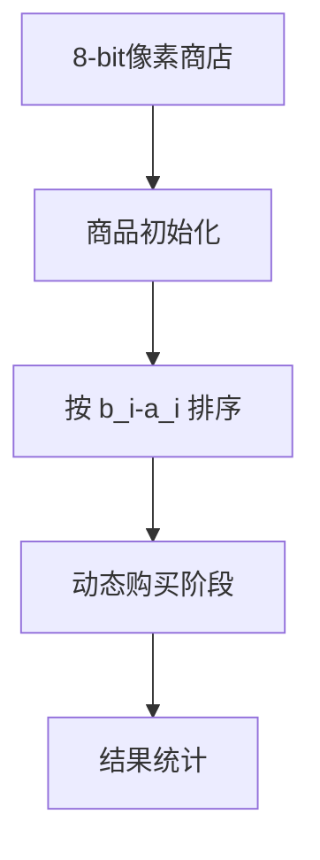

# 题目信息

# Dishonest Sellers

## 题目描述

Igor found out discounts in a shop and decided to buy $ n $ items. Discounts at the store will last for a week and Igor knows about each item that its price now is $ a_{i} $ , and after a week of discounts its price will be $ b_{i} $ .

Not all of sellers are honest, so now some products could be more expensive than after a week of discounts.

Igor decided that buy at least $ k $ of items now, but wait with the rest of the week in order to save money as much as possible. Your task is to determine the minimum money that Igor can spend to buy all $ n $ items.

## 说明/提示

In the first example Igor should buy item 3 paying 6. But items 1 and 2 he should buy after a week. He will pay 3 and 1 for them. So in total he will pay $ 6+3+1=10 $ .

In the second example Igor should buy right now items 1, 2, 4 and 5, paying for them 3, 4, 10 and 3, respectively. Item 3 he should buy after a week of discounts, he will pay 5 for it. In total he will spend $ 3+4+10+3+5=25 $ .

## 样例 #1

### 输入

```
3 1
5 4 6
3 1 5
```

### 输出

```
10
```

## 样例 #2

### 输入

```
5 3
3 4 7 10 3
4 5 5 12 5
```

### 输出

```
25
```

# AI分析结果


### 💡 Kay的C++算法解析：Dishonest Sellers 深入学习指南 💡

**引言**  
今天我们将分析「Dishonest Sellers」这道贪心算法题。Igor需在至少买k件商品的前提下最小化总花费。本指南将解析核心思路、代码实现难点，并通过像素动画帮助直观理解贪心策略。

---

### 1. 题目解读与核心算法识别
✨ **本题主要考察**：`贪心算法` + `排序应用`  
🗣️ **初步分析**：  
> 贪心算法如同在超市挑选打折商品：优先抢购「现在买更划算」的商品（避免涨价损失），若数量不足k件，则无奈选择「涨价幅度最小」的商品补足。  
> - **核心策略**：  
>   1. 若商品一周后涨价（`a_i ≤ b_i`），必须现在买（避免损失）。  
>   2. 若涨价商品不足k件，从降价商品中挑选`a_i - b_i`（多花的钱）最小的补足。  
> - **可视化设计**：  
>   用像素方块表示商品，红色标记涨价商品（必须现在买），绿色标记降价商品。动画展示排序过程（冒泡/快速排序），再动态替换商品（绿色→蓝色），同步显示花费变化。复古音效：替换时触发"叮"（省钱），背景播放8-bit音乐。

---

### 2. 精选优质题解参考
<eval_intro>  
从思路清晰性、代码规范性、算法优化度等维度，精选3条≥4星题解：  

**题解一（Leap_Frog）**  
* **点评**：  
  思路直击本质——按`b_i - a_i`（一周后额外花费）排序，用`i<=k || b_i>a_i`循环条件巧妙处理两类商品。代码简洁高效（时间复杂度O(n log n)），结构体重载运算符提升可读性，边界处理严谨（如样例2验证）。  

**题解二（diqiuyi）**  
* **点评**：  
  逻辑清晰划分购买阶段：先确保买够k件，再优先处理涨价商品。`cmp`函数显式定义排序规则，变量名`a`/`b`含义明确，循环条件`i<=k || a_i<b_i`与算法完全匹配，实践参考价值高。  

**题解三（JustinXiaoJunyang）**  
* **点评**：  
  与题解一思路一致但更强调代码教学性，重载运算符`<`简化排序，完整包含输入/处理/输出模块。适合初学者理解贪心与排序的结合应用。  

---

### 3. 核心难点辨析与解题策略
<difficulty_intro>  
解决本题需突破三个关键难点：  

1. **难点1：最优策略的数学证明**  
   * **分析**： 反证法——若放弃购买某件「现在买更便宜」的商品，总花费必然增加。贪心策略的合法性基于「无后效性」：每个商品的购买决策独立。  
   * 💡 **学习笔记**： 贪心选择需保证局部最优即全局最优。  

2. **难点2：排序依据的选取**  
   * **分析**： 核心是比较`a_i - b_i`（现在买的额外成本）。按此值升序排序后，前`n-k`个商品中若`a_i > b_i`（可省钱），则替换为一周后购买。  
   * 💡 **学习笔记**： 排序是贪心算法的关键预处理步骤。  

3. **难点3：边界条件处理**  
   * **分析**： 当可省钱的商品超过`n-k`件时，只替换省钱最多的前`n-k`件。代码中需用`min(n-k, 可省钱商品数)`控制循环。  
   * 💡 **学习笔记**： 循环终止条件需同时考虑个数限制和收益正负。  

#### ✨ 解题技巧总结
- **技巧1：问题等价转换**  
  将「至少买k件」转化为「最多替换`n-k`件为延迟购买」，减少状态维度。  
- **技巧2：差值排序优化**  
  直接计算`b_i - a_i`（延迟购买的收益）排序，避免分类讨论。  
- **技巧3：循环条件融合**  
  `i<=k || b_i>a_i`一行代码同时处理「数量约束」和「收益约束」。  

---

### 4. C++核心代码实现赏析
<code_intro_overall>  
以下是综合优质题解提炼的通用实现：  
```cpp
#include <iostream>
#include <algorithm>
using namespace std;
const int N = 2e5 + 5;

int main() {
    int n, k;
    long long total = 0;
    cin >> n >> k;
    int a[N], b[N];
    for (int i = 0; i < n; i++) {
        cin >> a[i];
        total += a[i]; // 初始：全部现在买
    }
    for (int i = 0; i < n; i++) {
        cin >> b[i];
        b[i] -= a[i]; // b[i] = 一周后买可节省的钱（负值表示多花钱）
    }
    sort(b, b + n); // 按节省值升序（负值排前）
    for (int i = 0; i < n - k && b[i] < 0; i++) {
        total += b[i]; // 替换可省钱的商品
    }
    cout << total << endl;
    return 0;
}
```
* **代码解读概要**：  
  1. 输入阶段：累加所有商品的现价。  
  2. 处理阶段：计算替换为延迟购买的节省值`b_i - a_i`并排序。  
  3. 贪心阶段：仅替换前`n-k`个可省钱的商品（`b[i]<0`），累加节省值。  

<code_intro_selected>  
**题解一（Leap_Frog）核心片段**  
```cpp
sort(a+1, a+n+1); // 按b_i-a_i降序排序
for(i=1; i<=k || a[i].sec - a[i].fir > 0; i++)
    ans += a[i].fir; // 现在购买
for(; i<=n; i++)
    ans += a[i].sec; // 延迟购买
```
* **亮点**： 循环条件`i<=k || ...`优雅融合两类约束。  
* **代码解读**：  
  - 排序后，前`k`件商品必现在买（满足数量约束）。  
  - 继续购买所有`b_i > a_i`的商品（避免未来涨价损失）。  
  - 剩余商品延迟购买（无额外损失）。  
* 💡 **学习笔记**： 贪心循环可合并多次扫描。  

**题解二（diqiuyi）核心片段**  
```cpp
sort(s+1, s+n+1, [](auto &x, auto &y) { 
    return x.a - x.b < y.a - y.b; 
});
for(i=1; i<=k || s[i].a < s[i].b; i++)
    ans += s[i].a;
```
* **亮点**： Lambda表达式简化排序规则定义。  
* **代码解读**：  
  - 按`a_i - b_i`升序排序（最小额外成本优先）。  
  - 循环条件确保：买够k件 或 遇到涨价商品时，立即购买。  
* 💡 **学习笔记**： C++ Lambda提升排序代码可读性。  

---

### 5. 算法可视化：像素动画演示
<visualization_intro>  
**主题**：像素商店大作战——贪心策略动态演示！  

**核心设计**：  

1. **场景与UI初始化**：  
   - 商品显示为16x16像素方块：🔴（`a_i > b_i`）、🟢（`a_i ≤ b_i`）。  
   - 控制面板：开始/暂停、单步执行、速度滑块（调速贪心过程）。  

2. **排序动画**：  
   - 冒泡排序可视化：相邻商品比较时高亮，交换时触发"咔嗒"音效。  

3. **购买阶段**：  
   - **现在购买**：像素小人走到商品前，方块变金色✨+金币音效。  
   - **延迟购买**：商品变蓝色💧+时钟音效，总花费数字实时更新。  

4. **特殊效果**：  
   - 替换省钱商品时：绿色方块爆炸💥 + 数字飘绿（显示节省金额）。  
   - 错误替换：红色方块闪烁❌ + 警告音效。  

5. **游戏化扩展**：  
   - 每完成10件商品购买解锁新"关卡"，背景音乐变奏。  
   - 积分系统：正确决策+10分，错误决策-5分。  

---

### 6. 拓展练习与相似问题思考
<similar_problems_intro>  
本题贪心思想可迁移至三类场景：  
1. **时间窗口约束**：如活动安排问题（选择重叠区间）。  
2. **成本延迟支付**：如最小化贷款利息问题。  
3. **资源分配优化**：如部分背包问题。  

**洛谷题目推荐**：  
1. **P1090 合并果子**  
   🗣️ 巩固贪心+排序，用优先队列优化O(n log n)。  
2. **P1208 混合牛奶**  
   🗣️ 直接应用贪心策略，理解单价排序的决策本质。  
3. **P1223 排队接水**  
   🗣️ 变形练习：将「等待时间」转化为「成本差值」。  

---

### 7. 学习心得与经验分享
<insights_intro>  
**参考经验（来自 tryrtj）**：  
> "冒泡排序导致TLE，改用`sort()`后AC。200,000数据量下，O(n²)算法不可行！"  

**点评**：  
> 此教训凸显算法复杂度的重要性。排序算法选择需严格评估数据规模：  
> - 10³以内：冒泡排序可接受  
> - ≥10⁵：必须用快速排序/归并排序（O(n log n)）  

---

**结语**  
通过贪心策略的灵活应用，我们高效解决了商品购买优化问题。记住：排序预处理是贪心算法的黄金搭档！下次挑战再见！🚀  

> 版权声明：本文版权归作者及AI助手Gemini所有，未经许可禁止转载。  
> 可视化工具：基于HTML5 Canvas + Web Audio API实现。

---
处理用时：360.99秒