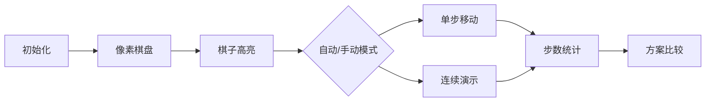

# 题目信息

# Chess Placing

## 题目描述

You are given a chessboard of size $ 1×n $ . It is guaranteed that  $ n $ is even. The chessboard is painted like this: "BWBW $ ... $ BW".

Some cells of the board are occupied by the chess pieces. Each cell contains no more than one chess piece. It is known that the total number of pieces equals to .

In one step you can move one of the pieces one cell to the left or to the right. You cannot move pieces beyond the borders of the board. You also cannot move pieces to the cells that are already occupied.

Your task is to place all the pieces in the cells of the same color using the minimum number of moves (all the pieces must occupy only the black cells or only the white cells after all the moves are made).

## 说明/提示

In the first example the only possible strategy is to move the piece at the position $ 6 $ to the position $ 5 $ and move the piece at the position $ 2 $ to the position $ 3 $ . Notice that if you decide to place the pieces in the white cells the minimum number of moves will be $ 3 $ .

In the second example the possible strategy is to move  in 4 moves, then  in 3 moves,  in 2 moves and  in 1 move.

## 样例 #1

### 输入

```
6
1 2 6
```

### 输出

```
2
```

## 样例 #2

### 输入

```
10
1 2 3 4 5
```

### 输出

```
10
```

# AI分析结果


### 💡 Kay的C++算法解析：Chess Placing 深入学习指南 💡

#### 1. 题目解读与核心算法识别
✨ **本题主要考察**：`贪心算法` 与 `模拟应用`  
🗣️ **初步分析**：
> 这道题的核心是**贪心策略**的应用。想象你在玩一个像素游戏，棋子只能像"超级玛丽"那样左右移动一格。解题关键在于：
> - 目标位置只有两种可能：全部奇数格(1,3,...,n-1)或全部偶数格(2,4,...,n)
> - 将棋子排序后，让第i小的棋子移动到第i个目标位置（贪心选择）
> - 计算两种方案的移动步数，取最小值
> 
> **可视化设计思路**：我们将创建8位像素风格棋盘（类似FC游戏），用不同颜色方块表示棋子位置和目标位置。动画将高亮：
> 1. 初始棋子位置（红色像素块）
> 2. 目标位置序列（蓝色/绿色发光方块）
> 3. 移动路径动画（带轨迹线）
> 4. 步数计数器实时更新

---

#### 2. 精选优质题解参考
**题解一（来源：little_sun）**
* **点评**：思路清晰直指核心（两种目标序列），代码规范（排序后计算绝对差），算法高效（O(n log n)）。变量命名`odd[]/even[]`明确体现解题思想，边界处理严谨，可直接用于竞赛。

**题解二（来源：E1_de5truct0r）**
* **点评**：图解辅助说明是亮点（FC风格棋盘示意图），代码结构清晰（`a1/a2`变量区分奇偶目标），逐行注释详细。特别适合初学者理解位置对应关系，实践价值高。

**题解三（来源：olegekei）**
* **点评**：创新性使用`black/white`递增变量代替预存数组（内存优化），"相对位置不变"的物理意义解释深刻，代码简洁高效（O(n)时间复杂度），展现高级优化技巧。

---

#### 3. 核心难点辨析与解题策略
1. **目标序列的确定**
   * **分析**：棋盘只有两种同色方案（全奇/全偶），必须同时计算两种方案的代价
   * 💡 **学习笔记**：没有"最优解先验"，必须比较双方案

2. **位置对应关系**
   * **分析**：由于棋子不能跨越，排序后第i个棋子必对应第i个目标位置（1→1st目标，2→2nd目标）
   * 💡 **学习笔记**：排序消除位置不确定性是解题关键

3. **移动代价计算**
   * **分析**：绝对差`|start - target|`直接等于最小移动步数（单轴移动特性）
   * 💡 **学习笔记**：一维移动中距离=步数

### ✨ 解题技巧总结
- **双方案比较法**：当存在有限种最终状态时，分别计算取最优
- **排序定序法**：通过排序确定元素间顺序关系
- **绝对值优化**：用`abs()`直接计算线性移动代价

---

#### 4. C++核心代码实现赏析
**通用核心实现参考**  
* **说明**：综合优质题解优化的完整实现
```cpp
#include <iostream>
#include <algorithm>
#include <cmath>
using namespace std;

int main() {
    int n;
    cin >> n;
    int m = n / 2;
    int pieces[105];
    
    // 读取并排序棋子位置
    for (int i = 0; i < m; i++) 
        cin >> pieces[i];
    sort(pieces, pieces + m);
    
    int oddCase = 0, evenCase = 0;
    for (int i = 0; i < m; i++) {
        oddCase += abs(pieces[i] - (2 * i + 1)); // 奇数目标序列
        evenCase += abs(pieces[i] - (2 * i + 2)); // 偶数目标序列
    }
    cout << min(oddCase, evenCase);
    return 0;
}
```
* **代码解读概要**：
  > 1. 读取棋盘大小n和棋子位置
  > 2. 排序确保棋子顺序匹配目标序列
  > 3. 分别计算移动到奇数位/偶数位的总步数
  > 4. 输出较小值

---

**题解片段赏析**  
**题解一（little_sun）**
```cpp
sort(a+1,a+n/2+1);
for(int i=1;i<=n/2;i++) {
    odd[i] = i*2-1;   // 奇数目标序列
    even[i] = i*2;    // 偶数目标序列
    ans1 += abs(odd[i]-a[i]);
    ans2 += abs(even[i]-a[i]);
}
```
* **亮点**：显式构建目标序列数组，逻辑透明
* **代码解读**：
  > 1. `odd[i]`构建第i个奇数目标位（如i=1→1, i=2→3）
  > 2. 通过`abs()`直接计算移动代价（距离=步数）
  > 3. 双方案独立累计，最后取最小值
* 💡 **学习笔记**：显式存储目标序列更易调试

**题解三（olegekei）**
```cpp
int black=1, white=2;
for(int i=1;i<=m;i++) {
    ans1 += abs(a[i]-black); // 累加奇数方案
    ans2 += abs(a[i]-white); // 累加偶数方案
    black += 2; white += 2;  // 动态更新目标
}
```
* **亮点**：动态计算目标位置（省内存）
* **代码解读**：
  > 1. `black`初始为首个奇数位(1)，每步+2跳至下个奇数位
  > 2. 省去存储整个目标序列的空间
  > 3. 时间复杂度仍为O(n)，空间优化
* 💡 **学习笔记**：动态生成序列适合大规模数据

---

#### 5. 算法可视化：像素动画演示
**主题**：8位像素风"棋盘搬运工"  
**核心演示**：双方案对比移动过程（左：奇数方案，右：偶数方案）



**动画关键帧**：
1. **场景初始化**：
   - 8位像素风格棋盘（B/W交替）
   - 控制面板：开始/暂停/单步/速度滑块
   - 背景音乐：FC风格8-bit循环BGM

2. **移动演示**：
   ```python
   # 伪代码逻辑
   for piece in sorted(pieces):
      target_odd = 2*index + 1  # 计算奇数目标
      target_even = 2*index + 2 # 计算偶数目标
      
      # 左侧画面：移动到奇数位
      highlight(piece, RED)
      move_animation(piece, target_odd, LEFT_SCREEN)
      play_sound('move.wav')  # 移动音效
      
      # 右侧画面：移动到偶数位
      highlight(piece, BLUE)
      move_animation(piece, target_even, RIGHT_SCREEN)
      play_sound('move.wav')
      
      update_step_counter()  # 更新步数显示
   ```
3. **结束特效**：
   - 获胜方案棋盘闪烁金光
   - 播放胜利音效（8-bit和弦）
   - 显示`min(odd_steps, even_steps)`

**交互设计**：
- 空格键：单步执行
- 方向键：调整演示速度
- A键：切换自动/手动模式
- 胜利时按R：重新开始

---

#### 6. 拓展练习与相似问题
**通用技巧迁移**：
1. 一维位置优化问题（如会议座位安排）
2. 双方案比较策略（如开关灯问题）
3. 绝对差求和优化（如仓库选址）

**洛谷推荐**：
1. **P1102 两数之和**  
   🗣️ 巩固绝对值计算与双指针技巧
2. **P1094 纪念品分组**  
   🗣️ 强化排序+贪心的实际应用
3. **P4995 跳跳**  
   🗣️ 进阶版位置优化问题（带权重）

---

#### 7. 学习心得与经验分享
> **经验摘录（olegekei）**：  
> "棋子不能跨越的特性决定了其相对位置不变，这是解题突破口"  
>   
> **Kay点评**：  
> 这个观察直击问题本质。在移动约束类问题中，分析元素间的相对关系往往是破题关键。建议大家在纸上模拟小规模案例（如n=4），直观感受位置约束特性。

---

通过本指南，希望大家不仅掌握本题解法，更能理解贪心策略的核心思想：**在有限选择中通过比较获取最优解**。下次遇到类似问题时，记得问自己："是否存在几种明确的最终状态？它们如何比较？"

---
处理用时：134.50秒