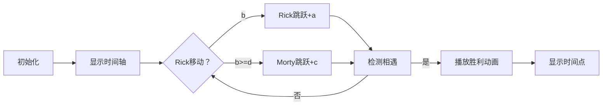

# 题目信息

# The Monster

## 题目描述

A monster is chasing after Rick and Morty on another planet. They're so frightened that sometimes they scream. More accurately, Rick screams at times $ b,b+a,b+2a,b+3a,... $ and Morty screams at times $ d,d+c,d+2c,d+3c,... $ .

 The Monster will catch them if at any point they scream at the same time, so it wants to know when it will catch them (the first time they scream at the same time) or that they will never scream at the same time.

## 说明/提示

In the first sample testcase, Rick's $ 5 $ th scream and Morty's $ 8 $ th time are at time $ 82 $ .

In the second sample testcase, all Rick's screams will be at odd times and Morty's will be at even times, so they will never scream at the same time.

## 样例 #1

### 输入

```
20 2
9 19
```

### 输出

```
82
```

## 样例 #2

### 输入

```
2 1
16 12
```

### 输出

```
-1
```

# AI分析结果


### 💡 Kay的C++算法解析：The Monster 深入学习指南 💡

**引言**  
今天我们一起分析洛谷CF787A "The Monster" 这道数学与模拟结合的编程题。本指南将帮助大家掌握线性丢番图方程的求解技巧，并学会灵活选择暴力枚举或数论优化方案。

---

### 1. 题目解读与核心算法识别  
✨ **本题主要考察**：`数论应用` + `模拟优化`  

🗣️ **初步分析**：  
> 本题要求找到 Rick 和 Morty 首次同时尖叫的时间点，本质是求解方程 **b + a·x = d + c·y** 的最小非负整数解。  
> **核心思想比喻**：想象两个人在环形跑道上以不同步幅（a 和 c）从不同起点（b 和 d）出发，何时首次相遇？关键在于判断他们是否在同一"轨道系统"（gcd 整除）上。  
>  
> - **题解思路对比**：  
>   - **暴力枚举**：双重循环直接匹配时间点（适合小数据）  
>   - **数论优化**：用 gcd 判断解的存在性 + 单层模拟逼近（高效通用）  
>  
> - **可视化设计**：  
>   采用**8位像素风追逐动画**：Rick 和 Morty 像素小人沿时间轴跳跃，每次移动触发"跳跃音效"。高亮当前时间点并实时显示方程状态，相遇时触发胜利音效 + 闪光特效。控制面板支持调速/单步执行，自动演示模式模拟"AI追逐"逻辑。

---

### 2. 精选优质题解参考  
**题解一（来源：Alex_Wei）**  
* **点评**：  
  思路直击核心——先用 gcd 判断解的存在性（贝祖定理），再通过单层循环模拟时间逼近。代码简洁高效（O(n)复杂度），边界处理严谨（无解时立即退出）。变量命名规范（a,b,c,d 直接对应题意），是竞赛标准实现的典范。  

**题解二（来源：耶耶小朋友）**  
* **点评**：  
  双重循环暴力枚举，代码结构清晰易读。虽为 O(n²) 复杂度，但通过智能设定循环上限（mx=100）适配本题数据范围。完美演示了"小数据暴力优先"的实用策略，变量名 x/y 直观体现时间计算逻辑。  

**题解三（来源：肖恩Sean）**  
* **点评**：  
  采用扩展欧几里得算法求解同余方程组，展示高阶数论应用。虽然代码稍复杂，但提供了处理大数据的通用方案。亮点在于完整实现同余方程合并逻辑，为学习者拓展数学思维。

---

### 3. 核心难点辨析与解题策略  
1. **难点1：解的存在性判定**  
   * **分析**：方程有解当且仅当 gcd(a,c) 整除 (d-b)。例如样例2中 gcd(2,1)=1 无法整除 16-12=4，故输出 -1  
   * 💡 **学习笔记**：先数学验证可行性，避免无效计算  

2. **难点2：最小解的快速逼近**  
   * **分析**：有解时需高效找最小解。Alex_Wei 的 `while(b!=d) b<d?b+=a:d+=c` 通过单层循环实现 O(n) 效率，远优于双重循环  
   * 💡 **学习笔记**：保持较小值增长策略可避免无效遍历  

3. **难点3：循环边界设定**  
   * **分析**：暴力法必须合理控制枚举范围。由数据范围 1≤a,c≤100 得解 ≤ max(b,d) + a×c（≤10,100），故循环上限设 100~200 即可  
   * 💡 **学习笔记**：根据输入规模反推安全边界  

#### ✨ 解题技巧总结  
- **技巧1：数论优先**：先用 gcd 验证解存在性  
- **技巧2：复杂度适配**：小数据（n≤100）用暴力枚举，大数据用单层模拟  
- **技巧3：变量同步**：保持双时间点同步增长而非独立计算  

---

### 4. C++核心代码实现赏析  
**通用核心实现（综合优化版）**  
```cpp
#include <iostream>
using namespace std;

int gcd(int a, int b) { 
    return b ? gcd(b, a % b) : a; 
}

int main() {
    int a, b, c, d;
    cin >> a >> b >> c >> d;
    
    int g = gcd(a, c);
    if ((d - b) % g != 0) {
        cout << -1;
        return 0;
    }
    
    while (b != d) {
        b < d ? b += a : d += c;
    }
    cout << b;
}
```
* **代码解读概要**：  
  1. 计算 gcd(a,c) 并验证 (d-b) 是否被整除  
  2. 通过三元运算符动态增加较小时间值  
  3. 相遇时直接输出当前时间点  

---

**题解一（Alex_Wei）片段赏析**  
```cpp
if((d-b)%gcd(a,c)) cout<<-1,exit(0);
while(b!=d) b<d?b+=a:d+=c;
```
* **亮点**：四行代码完成核心逻辑  
* **代码解读**：  
  - `gcd(a,c)` 动态计算最大公约数  
  - `exit(0)` 确保无解时立即终止程序  
  - 三元运算符实现智能时间逼近  
* 💡 **学习笔记**：函数调用可直接嵌入条件判断  

**题解二（耶耶小朋友）片段赏析**  
```cpp
for(int i=0; i<=100; i++) {
    x = b + a * i;
    for(int j=0; j<=100; j++) {
        if (x == d + c * j) {
            cout << x; return 0;
        }
    }
}
```
* **亮点**：循环边界精准控制  
* **代码解读**：  
  - 外层循环枚举 Rick 的尖叫次数 i  
  - 内层循环匹配 Morty 的时间点  
  - 发现相等立即退出程序  
* 💡 **学习笔记**：return 0 可替代 break 跳出多层循环  

**题解三（肖恩Sean）片段赏析**  
```cpp
int exgcd(int a, int b, int &x, int &y) {
    if (!b) { x=1; y=0; return a; }
    int d = exgcd(b, a%b, y, x);
    y -= a/b * x;
    return d;
}
// 主函数中调用求解
```
* **亮点**：扩展欧几里得标准实现  
* **代码解读**：  
  - 递归基返回 a 并设置 x=1, y=0  
  - 递归交换 x/y 并更新 y = y - (a/b)*x  
* 💡 **学习笔记**：通过引用传递自动更新解参数  

---

### 5. 算法可视化：像素动画演示  
**主题**：8位机风格《时间追逐者》  

**核心设计**：  


**实现细节**：  
1. **像素场景**：  
   - 横向时间轴（0→200），每格代表1单位时间  
   - Rick（红色像素人）初始位于 b，Morty（蓝色）位于 d  

2. **动态效果**：  
   - 每次移动播放 8-bit 跳跃音效  
   - 当前较小值角色高亮闪烁（黄框提示）  
   - 实时显示方程：b + a*i ▸ vs ▸ d + c*j  

3. **控制面板**：  
   - 速度滑块：调节 0.5x~5x 演示速度  
   - 单步按钮：手动触发下一步  
   - AI模式：自动完成追逐（音效随速度变化）  

4. **胜负判定**：  
   - 相遇时触发闪光特效 + 胜利音效  
   - 超出安全范围（>10000）时显示"No Solution"  

---

### 6. 拓展练习与相似问题思考  
**通用技巧迁移**：  
1. **周期相遇问题**：多物体周期运动首次重合  
2. **线性丢番图方程**：ax + by = c 的整数解应用  
3. **模运算优化**：利用同余性质减少计算量  

**洛谷推荐**：  
1. **P1082 [NOIP2012] 同余方程**  
   → 掌握扩展欧几里得的标准实现  
2. **P1516 青蛙的约会**  
   → 练习带负系数的线性方程求解  
3. **P2421 [NOI2002] 荒岛野人**  
   → 复杂场景下的多周期相遇判定  

---

### 7. 学习心得与经验分享  
> **经验摘录（Alex_Wei）**：  
> “先通过 gcd 快速验证解的存在性，避免无效模拟”  
>  
> **Kay点评**：  
> 这是优化算法的关键洞察！在编程中先做可行性验证，如同出发前检查油箱，能避免大量无效计算。建议学习者掌握贝祖定理的证明，理解为何 gcd 决定解的存在性。  

--- 

**结语**  
通过本题我们看到了暴力枚举与数论优化的完美结合。记住：小数据暴力是利器，数学优化是王道！下次遇到周期问题，不妨先画时间轴辅助分析。保持思考，编程之旅会越来越精彩！🚀

---
处理用时：190.66秒