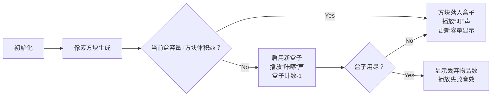

# 题目信息

# Boxes Packing

## 题目描述

有 $n$ 个物品，$m$ 个盒子。其中第 $i$ 个物品的大小为 $a_i$，所有盒子的大小均为 $k$。Makmis 先生想要将这些物品放入盒子中。对于每个物品，如果可以放入当前盒子中则放入当前盒子，否则换一个新的盒子放入。如果物品数量太多使得盒子装不下，可以**将先放入的物品丢弃**。求出最多能够放入多少物品。

## 说明/提示

#### 样例解释
- 在第一组样例中，可以将后 $4$ 个放入盒子。
- 在第二组样例中仅有一个盒子，故只能放入最后一个。
- 在第三组样例中有 $3$ 个大小为 $3$ 的盒子，每个盒子正好装满。
#### 数据规模与约定
保证 $1\le n,m\le2\times 10^5$，$1\le k\le10^9$，$1\le a_i\le k$。

## 样例 #1

### 输入

```
5 2 6
5 2 1 4 2
```

### 输出

```
4
```

## 样例 #2

### 输入

```
5 1 4
4 2 3 4 1
```

### 输出

```
1
```

## 样例 #3

### 输入

```
5 3 3
1 2 3 1 1
```

### 输出

```
5
```

# AI分析结果


### 💡 Kay的C++算法解析：Boxes Packing 深入学习指南 💡

#### 1. 题目解读与核心算法识别
✨ **本题主要考察**：**贪心算法**（逆向思维应用）  
🗣️ **初步分析**：  
> 装箱问题就像玩俄罗斯方块——只能从右侧放入且可丢弃左侧方块。核心在于**逆向贪心**：从右向左扫描物品，优先保证右侧物品入盒。  
> - **题解思路对比**：  
>   - **贪心模拟**（主流解法）：时间复杂度O(n)，直接模拟从右向左装箱过程  
>   - **二分答案**：时间复杂度O(n log n)，通过二分确定可保留的物品数量  
> - **可视化设计**：  
>   将物品设计为不同颜色的像素方块（红=当前物品，蓝=已装箱），盒子显示剩余容量。当方块入盒时播放"叮"音效，开新盒时播放"咔嚓"音效，盒子用尽时播放失败音效。

---

#### 2. 精选优质题解参考
**题解一：Plozia（贪心模拟）**  
* **点评**：  
  逆向思维巧妙（"正若难，则反"），代码简洁高效（23行）。`t`指针从右向左扫描，`box[m]`记录各盒剩余空间，边界处理严谨（`m==0`时`t++`）。亮点在于用单指针同时控制物品扫描和盒子计数。

**题解二：StudyingFather（贪心模拟）**  
* **点评**：  
  极致简洁（18行），逆序读入省去索引计算。`used`变量记录当前盒用量，`rem`跟踪剩余盒子数。实践价值极高——直接可用于竞赛，特别是`rem--, used=a[i]`的紧凑写法体现高手风范。

**题解三：fls233666（二分答案）**  
* **点评**：  
  虽非最优解，但二分思路具有教学意义。`check()`函数模拟装箱过程，二分搜索可保留物品数。亮点在于完整展示二分框架，变量命名规范（`st`起始位置，`cnt`盒子计数）。

---

#### 3. 核心难点辨析与解题策略
1. **难点：逆向思维突破**  
   *分析*：习惯从左向右思考会陷入局部最优。优质解均从右扫描，保证保留最右物品（因为丢弃权在左侧）。关键变量`i`（扫描指针）需初始化为`n`。  
   💡 **学习笔记**：当正向受阻时，尝试逆向扫描是解题利器。

2. **难点：盒子切换的边界处理**  
   *分析*：当`当前盒容量+物品体积 > k`时需开新盒。StudyingFather解法中`if(used+a[i]>k)`和`rem--`精准处理该逻辑。  
   💡 **学习笔记**：状态切换时立刻更新关键变量（盒子计数/剩余容量）。

3. **难点：终止条件判断**  
   *分析*：需同时检测两个终止条件：盒子用尽(`rem==0`)或物品扫完(`t==0`)。Plozia解法中`while(m!=0&&t!=0)`是典范。  
   💡 **学习笔记**：循环条件应覆盖所有终止状态。

**✨ 解题技巧总结**  
- **逆向扫描法**：对后缀序列操作时优先考虑从右向左处理  
- **双变量协同**：用单循环同时控制物品指针和盒子计数器  
- **即时状态更新**：在条件触发时立即更新关键状态变量  

---

### 4. C++核心代码实现赏析
**通用核心实现（贪心模拟）**  
```cpp
#include <iostream>
using namespace std;

int main() {
    int n, m, k;
    cin >> n >> m >> k;
    int a[200005];
    for (int i = 1; i <= n; i++) cin >> a[i];
    
    int used = 0, rem = m;
    for (int i = n; i >= 1; i--) {
        if (used + a[i] > k) {       // 需开新盒
            if (--rem == 0) break;   // 无盒可用
            used = a[i];             // 新盒初始容量
        } else used += a[i];         // 放入当前盒
    }
    cout << n - i;  // i为第一个未处理的物品索引
}
```
* **代码解读概要**：  
  逆序扫描物品，`used`记录当前盒用量。当超容量时开新盒（`rem--`），盒子用尽时终止。最终未处理物品数即为丢弃数量。

**题解一：Plozia（贪心模拟）**  
```cpp
while(m!=0&&t!=0) {
    box[m] += a[t];          // 尝试放入当前盒
    if(box[m] > k) {         // 超容量
        m--;                 // 启用新盒
        box[m] = a[t];       // 初始化新盒
    }
    t--;                     // 扫描前一个物品
}
```
* **解读**：  
  `box[m]`巧妙复用为盒子栈，`m--`实现盒子切换。`t--`控制扫描方向，循环条件同时检测盒子与物品状态。  
  💡 **学习笔记**：数组复用可减少变量数，但需确保语义清晰。

**题解二：StudyingFather（贪心模拟）**  
```cpp
for(int i=n; i>=1; i--) {
    if(used+a[i]>k) {        // 触发开盒条件
        rem--, used=a[i];    // 原子操作更新状态
        if(rem==0) {        // 终止检测
            printf("%d\n",i-1);
            return 0;
        }
    } else used += a[i];     // 正常放入
}
```
* **解读**：  
  `rem--, used=a[i]`在单行完成双变量更新，避免状态不一致。`rem==0`时立即退出保证效率。  
  💡 **学习笔记**：密切相关的变量更新应保持原子性。

**题解三：fls233666（二分答案）**  
```cpp
bool check(int st) {
    int cnt=1, v=0;              // 初始化盒子
    for(int i=st; i<=n; i++) {   // 检测后缀序列
        if(v + a[i] > k) {       // 开新盒
            if(++cnt > m) return false;
            v = a[i];
        } else v += a[i];        // 放入
    }
    return cnt<=m;
}
```
* **解读**：  
  二分框架下`check`函数实现装箱模拟。注意`cnt`从1开始计数（至少1个盒），`v`动态更新当前盒容量。  
  💡 **学习笔记**：二分答案需保证检查函数的高效性。

---

### 5. 算法可视化：像素动画演示
**🎮 设计概念**  
复古掌机风格，物品为下落方块，盒子为底部容器。通过8-bit音效强化关键操作。

**🖥️ 核心交互设计**：


**🎨 关键动画细节**：
- **像素艺术**：物品用16x16像素方块（红=当前，黄=已入盒，灰=丢弃）
- **容量显示**：盒子右侧显示进度条（绿色=剩余，红色=已用）
- **音效设计**：
  - 方块移动：8-bit滑动音
  - 成功入盒：清脆"叮"声（440Hz方波）
  - 启用新盒：机械"咔嚓"声
  - 游戏结束：低沉失败音+屏幕闪烁
- **控制面板**：步进/自动模式切换，速度滑块（1x-5x）

---

### 6. 拓展练习与相似问题思考
**🔗 技巧迁移场景**：
1. 后缀序列的最优化处理（如字符串后缀选择）
2. 资源分配中的贪婪策略（如带宽分配）
3. 实时系统中的任务调度

**📚 推荐练习（洛谷）**：
1. **P1090 [NOIP2004]合并果子**  
   → 巩固贪心策略在优先队列中的应用
2. **P1803 凌乱的yyy**  
   → 训练区间选择的贪心决策能力
3. **P3817 小A的糖果**  
   → 强化相邻元素约束下的贪心调整

---

### 7. 学习心得与经验分享
> **Plozia的顿悟**：  
> *"正若难，则反——当正向思路受阻时，尝试逆向扫描往往能打开新局面"*  
> **Kay点评**：这是算法设计的黄金法则！在DFS回溯、动态规划状态设计时同样适用。建立"双向思维"能显著提升解题能力。

---

### 结语
掌握逆向贪心思维，你就能像玩俄罗斯方块一样优雅解决装箱问题！下次遇到序列处理难题时，记得尝试"从右向左"的魔法视角哦~ 🎮✨

---
处理用时：120.38秒