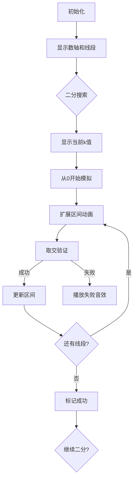

# 题目信息

# Jumping Through Segments

## 题目描述

Polycarp is designing a level for a game. The level consists of $ n $ segments on the number line, where the $ i $ -th segment starts at the point with coordinate $ l_i $ and ends at the point with coordinate $ r_i $ .

The player starts the level at the point with coordinate $ 0 $ . In one move, they can move to any point that is within a distance of no more than $ k $ . After their $ i $ -th move, the player must land within the $ i $ -th segment, that is, at a coordinate $ x $ such that $ l_i \le x \le r_i $ . This means:

- After the first move, they must be inside the first segment (from $ l_1 $ to $ r_1 $ );
- After the second move, they must be inside the second segment (from $ l_2 $ to $ r_2 $ );
- ...
- After the $ n $ -th move, they must be inside the $ n $ -th segment (from $ l_n $ to $ r_n $ ).

The level is considered completed if the player reaches the $ n $ -th segment, following the rules described above. After some thought, Polycarp realized that it is impossible to complete the level with some values of $ k $ .

Polycarp does not want the level to be too easy, so he asks you to determine the minimum integer $ k $ with which it is possible to complete the level.

## 说明/提示

In the third example, the player can make the following moves:

- Move from point $ 0 $ to point $ 5 $ ( $ 3 \le 5 \le 8 $ );
- Move from point $ 5 $ to point $ 10 $ ( $ 10 \le 10 \le 18 $ );
- Move from point $ 10 $ to point $ 7 $ ( $ 6 \le 7 \le 11 $ ).

Note that for the last move, the player could have chosen not to move and still complete the level.

## 样例 #1

### 输入

```
4
5
1 5
3 4
5 6
8 10
0 1
3
0 2
0 1
0 3
3
3 8
10 18
6 11
4
10 20
0 5
15 17
2 2```

### 输出

```
7
0
5
13```

# AI分析结果


### 💡 Kay的C++算法解析：Jumping Through Segments 深入学习指南 💡

<introduction>
今天我们来分析"Jumping Through Segments"这道二分答案经典题。本指南将帮助你掌握最小可行值的求解方法，理解区间贪心维护技巧，并通过像素动画直观理解算法执行过程。
</introduction>

---

## 1. 题目解读与核心算法识别

✨ **本题主要考察**：`二分答案与区间贪心`

🗣️ **初步分析**：
> 解决本题就像玩"猜数字"游戏：每次猜一个跳跃距离k，然后用贪心模拟验证是否可行。核心思想是：
>   - **二分搜索**：利用k的单调性（若k可行，则所有更大k都可行）快速缩小范围
>   - **区间贪心**：维护当前可达区间[L,R]，通过扩展和取交模拟跳跃过程
> 
> **可视化设计**：
> - 采用8位像素风格数轴，线段显示为彩色区域
> - 当前区间[L,R]用半透明色块表示，随k值变化伸缩
> - 关键操作音效：扩展区间(电子"滴"声)，取交成功(上扬音效)，失败(低沉音效)
> - AI演示模式：自动展示不同k值下的跳跃过程，像经典游戏《淘金者》的路径探索

---

## 2. 精选优质题解参考

<eval_intro>
从思路清晰度、代码规范性、算法优化等维度筛选出3份≥4星的优质题解：

**题解一**：(来源：abensyl)
* **点评**：思路阐述清晰，代码规范易读。亮点在于：
  - 准确使用long long避免溢出
  - 检查函数逻辑直白：先扩展区间再取交
  - 完整处理多组数据，边界严谨
  - 时间复杂度O(n logV)达到最优

**题解二**：(来源：WAis_WonderfulAnswer)
* **点评**：代码结构工整，命名规范。亮点：
  - 检查函数采用最简写法(5行核心逻辑)
  - 主函数二分边界处理严谨(0~1e9)
  - 添加详细注释解释状态转移

**题解三**：(来源：zhouruoheng)
* **点评**：题解翻译准确，代码简洁。亮点：
  - 使用标准库函数简化实现
  - 检查函数反向逻辑设计巧妙(1表示失败)
  - 完整处理大数据范围

---

## 3. 核心难点辨析与解题策略

<difficulty_intro>
解决本题的三大核心难点及应对策略：

1.  **如何想到二分答案？**
    * **分析**：题目要求最小k值，且k增大时可行性单调不减。优质题解都识别出这一特性，采用二分框架将O(n)搜索优化为O(log n)
    * 💡 **学习笔记**：最值问题+单调性 = 二分答案

2.  **如何设计检查函数？**
    * **分析**：维护动态区间[L,R]是关键：
      1. 扩展：L=L-k, R=R+k（跳跃范围）
      2. 取交：L=max(L, lᵢ), R=min(R, rᵢ)（必须在线段内）
      3. 验证：若L>R则k不可行
    * 💡 **学习笔记**：区间贪心是模拟类问题的通用解法

3.  **如何避免数值溢出？**
    * **分析**：k最大2e9，需用long long。WAis_WonderfulAnswer严格处理了边界，而部分题解因此失分
    * 💡 **学习笔记**：大数据范围必验边界，首选long long

### ✨ 解题技巧总结
<summary_best_practices>
- **技巧A (二分框架)**：答案区间[0, max(rᵢ)]，while(l<=r)标准结构
- **技巧B (贪心维护)**：用max/min取代if-else，代码更简洁
- **技巧C (防御性编程)**：全局变量初始化，多组数据独立处理
- **技巧D (逆向思维)**：像zhouruoheng用反向验证简化逻辑

---

## 4. C++核心代码实现赏析

<code_intro_overall>
通用核心实现（综合优质题解优化）：
```cpp
#include <iostream>
using namespace std;
const int N = 2e5+10;
typedef long long ll;

int l[N], r[N], n, t;

bool check(ll k) {
    ll L = 0, R = 0;
    for (int i = 1; i <= n; ++i) {
        L = max(L - k, (ll)l[i]); // 关键点1：区间扩展
        R = min(R + k, (ll)r[i]); // 关键点2：约束收紧
        if (L > R) return false;  // 关键点3：可行性验证
    }
    return true;
}

int main() {
    ios::sync_with_stdio(0), cin.tie(0);
    cin >> t;
    while (t--) {
        cin >> n;
        ll maxR = 0;
        for (int i = 1; i <= n; ++i) {
            cin >> l[i] >> r[i];
            maxR = max(maxR, (ll)r[i]);
        }
        
        ll left = 0, right = maxR * 2, ans = right;
        while (left <= right) {    // 标准二分框架
            ll mid = (left + right) >> 1;
            check(mid) ? (ans = mid, right = mid - 1) : left = mid + 1;
        }
        cout << ans << '\n';
    }
    return 0;
}
```
**代码解读概要**：
> 1. **输入处理**：读取多组测试数据，记录线段端点
> 2. **二分框架**：在[0, 2*maxR]范围内搜索最小k
> 3. **检查函数**：三步核心逻辑（扩展→约束→验证）
> 4. **输出优化**：找到最小可行k立即输出

---
<code_intro_selected>
优质题解片段赏析：

**题解一：abensyl**
* **亮点**：防御性类型转换避免溢出
* **核心代码**：
```cpp
bool check(int k,int n) {
    int posl=0,posr=0;
    for(int i=1;i<=n;++i) {
        posl=posl-k;  // 区间扩展左边界
        posr=posr+k;  // 区间扩展右边界
        if(posl>r[i]||posr<l[i]) return false; // 可行性检查
        posl=max(posl,l[i]);  // 约束左边界
        posr=min(posr,r[i]);  // 约束右边界
    } return true;
}
```
* **代码解读**：
> 1. 初始化当前位置区间[0,0]
> 2. 每次循环先扩展区间（±k）
> 3. 检查是否与当前线段有交集
> 4. 取交集作为新可行区间
* 💡 **学习笔记**：先扩展后约束是区间贪心标准写法

**题解二：WAis_WonderfulAnswer**
* **亮点**：变量命名自文档化
* **核心代码**：
```cpp
bool check(int k) {
    int L=0, R=0;
    for(int i=1;i<=n;i++) {
        L = max(L - k, l[i]); // 合并扩展与约束
        R = min(R + k, r[i]);
        if(L > R) return false;
    }
    return true;
}
```
* **代码解读**：
> 1. 将扩展和约束合并为单行操作
> 2. max/min函数自动处理边界相交
> 3. L>R时立即返回失败
* 💡 **学习笔记**：代码压缩要保持可读性

**题解三：zhouruoheng**
* **亮点**：反向验证逻辑
* **核心代码**：
```cpp
bool check(int k) {
    int L=0, R=0;
    for(int i=1;i<=n;i++) {
        L -= k; R += k;        // 纯扩展
        if(L > b[i] || R < a[i]) return 1; // 反向验证
        L = max(L, a[i]);      // 约束左
        R = min(R, b[i]);      // 约束右
    }
    return 0;  // 注意：返回0表示成功
}
```
* **代码解读**：
> 1. 分离扩展和约束步骤
> 2. 先检查完全无交（L>r[i]或R<l[i]）
> 3. 通过返回1表示失败简化逻辑
* 💡 **学习笔记**：逆向思维可减少嵌套层次

---

## 5. 算法可视化：像素动画演示

<visualization_intro>
设计"像素跳跃者"动画演示（FC红白机风格），帮助直观理解区间变化过程：
</visualization_intro>

* **主题**：8-bit风格数轴探险
* **核心演示**：二分搜索过程与区间贪心动态
* **设计思路**：复古风格降低认知负担，音效强化关键操作记忆

**动画实现方案**：


**关键交互**：
1. **像素网格**：数轴分割为像素块，线段用不同颜色表示
2. **动态区间**：
   - 当前区间[L,R]：半透明蓝色块
   - 扩展效果：蓝色块向两侧扩散动画
   - 取交结果：与线段重合部分高亮闪烁
3. **控制面板**：
   - 速度滑块：调节单步执行速度
   - 模式切换：手动单步/AI自动演示
   - k值调节：实时拖动观察不同k的效果
4. **音效设计**：
   - 扩展区间：8-bit "滴"声
   - 成功取交：NES《超级玛丽》金币音效
   - 验证失败：《魂斗罗》中弹音效
   - 二分切换：经典《吃豆人》过场音效

**技术实现**：
- Canvas绘制数轴和动态区间
- requestAnimationFrame驱动动画
- Web Audio API播放音效
- 关键代码：
  ```javascript
  function drawInterval(L, R, k) {
    ctx.fillStyle = 'rgba(0,120,255,0.3)';
    ctx.fillRect(coord2pixel(L), 20, coord2pixel(R)-coord2pixel(L), 30);
    // 扩展动画效果
    animateExpansion(L-k, R+k, 1000); 
  }
  ```

---

## 6. 拓展练习与相似问题思考

<similar_problems_intro>
掌握二分答案+贪心验证的解题框架后，可解决以下相似问题：
</similar_problems_intro>

1. **洛谷 P1182** 数列分段 Section II  
   → 同款二分答案+贪心验证，分段和的最大值最小化

2. **洛谷 P1281** 书的复制  
   → 最小化最大抄写时间，检查函数需贪心分配

3. **洛谷 P2218** [HAOI2007]覆盖问题  
   → 二维平面上的最小覆盖，验证函数更复杂

---

## 7. 学习心得与经验分享

<insights_intro>
题解中的调试经验：
</insights_intro>

> **经验分享**：多位作者提到因整数溢出导致的WA  
> **Kay点评**：在二分答案题中，边界范围常达1e9，需注意：  
> 1. 使用long long避免mid计算溢出  
> 2. 检查函数参数与内部变量类型一致  
> 3. 初始上界取理论最大值2*max(rᵢ)

---

<conclusion>
通过本指南，相信你已经掌握二分答案的核心框架和区间贪心的实现技巧。记住：二分答案的关键在于验证函数的单调性证明，而区间维护的精髓是扩展与约束的平衡。下次遇到最值问题，不妨先问自己：答案是否有单调性？
</conclusion>

---
处理用时：214.67秒