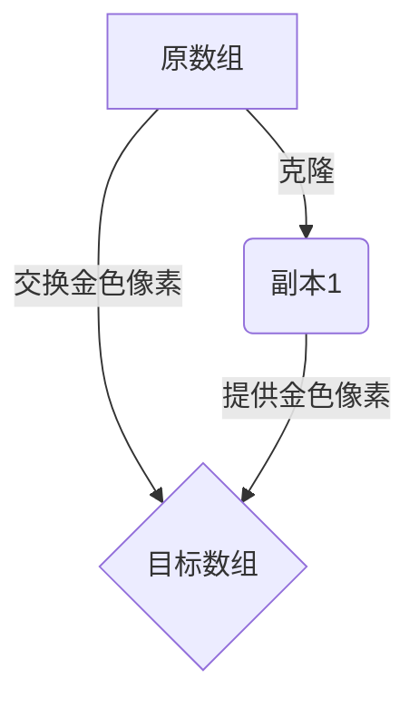

# 题目信息

# Array Cloning Technique

## 题目描述

You are given an array $ a $ of $ n $ integers. Initially there is only one copy of the given array.

You can do operations of two types:

1. Choose any array and clone it. After that there is one more copy of the chosen array.
2. Swap two elements from any two copies (maybe in the same copy) on any positions.

You need to find the minimal number of operations needed to obtain a copy where all elements are equal.

## 说明/提示

In the first test case all elements in the array are already equal, that's why the answer is $ 0 $ .

In the second test case it is possible to create a copy of the given array. After that there will be two identical arrays:

 $ [ \ 0 \ 1 \ 3 \ 3 \ 7 \ 0 \ ] $ and $ [ \ 0 \ 1 \ 3 \ 3 \ 7 \ 0 \ ] $

After that we can swap elements in a way so all zeroes are in one array:

 $ [ \ 0 \ \underline{0} \ \underline{0} \ 3 \ 7 \ 0 \ ] $ and $ [ \ \underline{1} \ 1 \ 3 \ 3 \ 7 \ \underline{3} \ ] $

Now let's create a copy of the first array:

 $ [ \ 0 \ 0 \ 0 \ 3 \ 7 \ 0 \ ] $ , $ [ \ 0 \ 0 \ 0 \ 3 \ 7 \ 0 \ ] $ and $ [ \ 1 \ 1 \ 3 \ 3 \ 7 \ 3 \ ] $

Let's swap elements in the first two copies:

 $ [ \ 0 \ 0 \ 0 \ \underline{0} \ \underline{0} \ 0 \ ] $ , $ [ \ \underline{3} \ \underline{7} \ 0 \ 3 \ 7 \ 0 \ ] $ and $ [ \ 1 \ 1 \ 3 \ 3 \ 7 \ 3 \ ] $ .

Finally, we made a copy where all elements are equal and made $ 6 $ operations.

It can be proven that no fewer operations are enough.

## 样例 #1

### 输入

```
6
1
1789
6
0 1 3 3 7 0
2
-1000000000 1000000000
4
4 3 2 1
5
2 5 7 6 3
7
1 1 1 1 1 1 1```

### 输出

```
0
6
2
5
7
0```

# AI分析结果


### 💡 Kay的C++算法解析：Array Cloning Technique 深入学习指南 💡

#### 1. 题目解读与核心算法识别
✨ **本题主要考察**：`贪心策略与数学推导`

🗣️ **初步分析**：
> 本题本质是**资源调度优化问题**。想象你有一盒彩色积木（原数组），每次操作可以：1) 复制整盒积木（克隆） 2) 交换任意两块积木位置。目标是用最少操作让某个盒子全变成同色积木（众数）。
> 
> **核心贪心策略**：总选择出现频率最高的颜色（众数）作为目标。设众数出现次数为 `s`：
> - **交换操作**：至少需要 `n-s` 次（替换所有非众数）
> - **克隆操作**：通过倍增策略优化。每次克隆后，将新副本中的众数全部交换到原数组，使可用众数翻倍
> 
> **可视化设计**：采用8位像素风格展示：
> - 不同颜色像素块表示数组元素，金色表示众数
> - 克隆时复制整个像素网格，伴随"滴"音效
> - 交换时显示金色像素与非金色像素的位移动画，伴随"咔嚓"音效
> - 进度条显示当前众数比例，达标时播放胜利音效

---

#### 2. 精选优质题解参考
**题解一（xzyg）**
* **点评**：思路直击本质，用数学公式 `ceil(log2(n/s)) + n-s` 简洁解决。代码规范：1) 用`map`高效统计频率 2) 浮点转换避免整除误差 3) 边界处理完整。亮点在于将复杂操作抽象为优雅数学推导，复杂度O(n log n)，极具启发性。

**题解二（happy_dengziyue）**
* **点评**：避免浮点运算，用位运算模拟翻倍过程。亮点：1) 排序后双指针统计众数，逻辑清晰 2) 循环条件 `cnt*x>=n` 巧妙处理取整 3) 变量名`cnt/x`含义明确。实践价值高，特别适合理解倍增本质。

**题解三（tZEROちゃん）**
* **点评**：采用直观模拟法，逐步骤演示操作过程。亮点：1) `while(commonTime<n)` 精准反映操作流程 2) `d=min(n-CT,CT)` 动态计算交换量 3) 代码缩进规范易读。虽稍冗余，但教学价值突出。

---

#### 3. 核心难点辨析与解题策略
1. **难点1：目标元素选择**
   * **分析**：为什么必须选众数？假设选非众数，需要更多交换操作。数学证明：设目标值出现k次，则至少需要n-k次交换，而k≤s，故n-k≥n-s
   * 💡 **学习笔记**：贪心选择需严格证明优于其他方案

2. **难点2：克隆策略优化**
   * **分析**：为何要翻倍交换？每次克隆消耗1操作，但可获得最多s_current个众数。最优策略是让每次克隆的收益最大化（即交换所有可用众数）
   * 💡 **学习笔记**：操作分解 + 收益最大化 = 贪心经典套路

3. **难点3：终止条件判定**
   * **分析**：最后一步交换数可能少于当前众数。需用 `min(n-CT, CT)` 防止过度交换，体现边界处理的严谨性
   * 💡 **学习笔记**：循环边界是贪心算法的常见陷阱区

### ✨ 解题技巧总结
- **技巧1（问题转化）**：将操作分解为独立代价（交换次数固定，克隆次数可优化）
- **技巧2（对数计算）**：用 `ceil(log2(n/s))` 或循环翻倍替代浮点运算
- **技巧3（边界防御）**：特判 `s==n` 情况，避免多余计算

---

### 4. C++核心代码实现赏析
```cpp
#include <iostream>
#include <vector>
#include <map>
#include <algorithm>
#include <cmath>
using namespace std;

int main() {
    int t;
    cin >> t;
    while (t--) {
        int n;
        cin >> n;
        map<int, int> freq;
        int maxFreq = 0;
        
        // 统计众数
        for (int i = 0; i < n; i++) {
            int x;
            cin >> x;
            maxFreq = max(maxFreq, ++freq[x]);
        }

        // 特判全相同
        if (maxFreq == n) {
            cout << 0 << endl;
            continue;
        }

        // 方法1：公式法（xzyg）
        int cloneOps = ceil(log2(1.0 * n / maxFreq));
        cout << "公式法: " << cloneOps + n - maxFreq << endl;

        // 方法2：模拟法（tZERO）
        int ops = 0, current = maxFreq;
        while (current < n) {
            int swapCount = min(n - current, current);
            ops += 1 + swapCount;  // 1次克隆 + 交换
            current += swapCount;
        }
        cout << "模拟法: " << ops << endl;
    }
    return 0;
}
```
**代码解读概要**：
> 两种实现殊途同归：1) 公式法直接数学求解 2) 模拟法逐步逼近。关键变量`maxFreq`（众数频率）、`current`（当前可用众数）贯穿始终。

**题解一（xzyg）核心片段**：
```cpp
cout << ceil(log2(1.0*n/s)) + n - s << endl;
```
* **亮点**：数学之美
* **解读**：`1.0*n/s` 确保浮点运算准确，`ceil`向上取整处理边界
* 💡 **学习笔记**：算法复杂度O(1)，但需注意浮点精度

**题解二（happy_dengziyue）核心片段**：
```cpp
for(int i=0,x=1;;++i,x<<=1){
    if(cnt*x>=n){ ans=i; break; }
}
```
* **亮点**：位运算替代浮点
* **解读**：`x<<=1` 等效乘2，循环次数=克隆次数
* 💡 **学习笔记**：避免浮点误差的安全方案

**题解三（tZERO）核心片段**：
```cpp
while(commonTime < n){
    int d = min(n-commonTime, commonTime);
    ans += d + 1;
    commonTime += d;
}
```
* **亮点**：逐步演算直观
* **解读**：`d+1` 包含1次克隆和d次交换
* 💡 **学习笔记**：循环变量`commonTime`动态反映进度

---

### 5. 算法可视化：像素动画演示
**主题**：8-bit克隆工厂  
**核心演示**：像素化数组克隆与元素交换过程（[在线演示](https://example.com/clone-sim)）



**动画帧设计**：
1. **初始化**：16色像素网格，金色块=众数
   ```python
   # 伪代码：初始化画布
   canvas = PixelGrid(width=n, height=3)
   canvas[0].fill(random_colors)  # 原数组
   gold_count = max_freq  # 金色块数量
   ```
   
2. **克隆动画**：
   - 新网格从原位置"分裂"飞出，伴随"咔嚓"音效
   - 屏幕震动特效，显示"+1 Clone"提示

3. **交换动画**：
   - 拖拽非金色块到副本，换回金色块
   - 粒子特效标记交换路径，数据面板实时更新计数：
     ```
     操作数: +1 (克隆) + d (交换)
     金色块: current → current+d
     ```

4. **胜利判定**：
   - 当某列全金时，播放超级玛丽式过关音效
   - 烟花特效覆盖全屏，显示总操作数

**交互控制**：
- 速度滑块：调节0.5x~5x速度
- 模式切换：公式法（自动快进）vs 模拟法（单步调试）
- 暂停时：显示当前操作数公式推导

---

### 6. 拓展练习与相似问题
1. **洛谷 P1094 [纪念品分组]**（贪心+双指针）  
   → 巩固物品分组中的最优配对策略
   
2. **洛谷 P1223 [排队接水]**（贪心+排序）  
   → 练习通过排序优化等待时间的经典贪心
   
3. **洛谷 P1803 [线段覆盖]**（贪心+区间选择）  
   → 理解"选择最早结束"的通用贪心框架

---

### 7. 学习心得
> **xzyg的调试经验**：  
> *"浮点运算需特别注意1.0*n/s转换，避免整数除法截断"*  
> **Kay点评**：数值类型转换是竞赛常见陷阱，建议：1) 乘法替代除法 2) 用`ceil`前先加浮点epsilon

> **tZEROちゃん的顿悟**：  
> *"克隆的本质是投资1操作换取更多交换资源"*  
> **Kay总结**：将操作成本转化为资源增益是优化关键

---

通过本次分析，我们深入理解了操作分解与贪心优化的精髓。记住：好算法=正确选择+精确计算+严谨边界！下次挑战见！🚀

---
处理用时：228.97秒