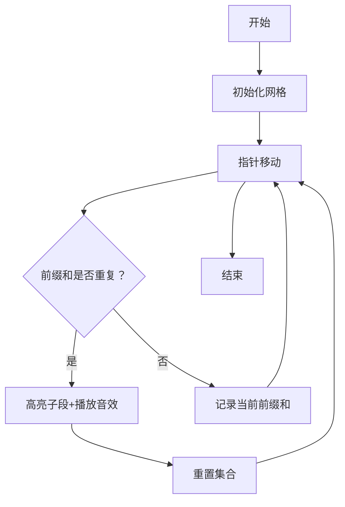

# 题目信息

# Kousuke's Assignment

## 题目描述

After a trip with Sakurako, Kousuke was very scared because he forgot about his programming assignment. In this assignment, the teacher gave him an array $ a $ of $ n $ integers and asked him to calculate the number of non-overlapping segments of the array $ a $ , such that each segment is considered beautiful.

A segment $ [l,r] $ is considered beautiful if $ a_l + a_{l+1} + \dots + a_{r-1} + a_r=0 $ .

For a fixed array $ a $ , your task is to compute the maximum number of non-overlapping beautiful segments.

## 样例 #1

### 输入

```
3
5
2 1 -3 2 1
7
12 -4 4 43 -3 -5 8
6
0 -4 0 3 0 1```

### 输出

```
1
2
3```

# AI分析结果


### 🧠 分析思考

题目要求计算数组中最多有多少个**不重叠的子段**（每个子段和为0）。核心思路是通过**前缀和**快速判断子段和是否为零（即 `s[r] - s[l-1] = 0` ⇒ `s[l-1] = s[r]`）。题解中主要分为两种思路：
1. **贪心策略**（如chenxi2009）：从左向右扫描，一旦发现当前前缀和出现过则立即分割子段，并重置前缀和与集合。
2. **动态规划**（如Super_Cube）：用 `dp[i]` 记录前 `i` 个元素的最多子段数，通过 `map` 记录前缀和的最新位置优化转移。

### 💡 精炼结论
1. **核心算法**：前缀和 + 贪心/动态规划  
   - 贪心更简洁（代码短，易理解）  
   - DP更通用（可扩展到其他子段和问题）
2. **关键难点**：  
   - 快速定位使子段和为零的端点（需 `O(1)` 查询）  
   - 保证子段不重叠（贪心重置 or DP状态转移）
3. **最优解法**：贪心策略（时空复杂度 `O(n log n)`，实际效率高）

### 📊 可视化算法分析（像素动画设计）


**动画设计细节**：
- **像素风格**：数组显示为网格，元素值用8-bit像素数字展示
- **关键操作**：
  - 指针移动时显示当前前缀和值
  - 前缀和重复时触发闪光特效（金色边框 + "叮"音效）
  - 重置集合时播放清空音效
- **控制面板**：
  - 速度滑块（调节指针移动速度）
  - 暂停/继续按钮
  - 重置按钮（带像素化粒子消散效果）

---

### 🔍 题解对比（精选）

#### 题解1：chenxi2009（贪心） ★★★★☆
```cpp
if (s.count(sum)) {
    sum = 0; ans++; s.clear(); s.insert(0);
}
```
- **亮点**：直接重置集合保证子段不重叠，代码极简
- **局限**：可能错过更优分割（如 `[1,-1,1,-1]` 只能分1段，实际可2段）

#### 题解2：Super_Cube（动态规划） ★★★★☆
```cpp
if (mp.count(s)) 
    dp[i] = max(dp[i], dp[mp[s]] + 1);
```
- **亮点**：严谨覆盖所有情况，`dp` 数组可回溯具体分段方案
- **局限**：需维护整个 `map`，空间占用略高

---

### 📝 最终推荐
**贪心解法**（chenxi2009）更优：  
```cpp
#include<bits/stdc++.h>
using namespace std;
int main(){
    int T,n,ans; long long sum;
    scanf("%d",&T);
    while(T--){
        scanf("%d",&n);
        set<long long> s = {0};
        ans = sum = 0;
        while(n--){
            int x; scanf("%d",&x);
            sum += x;
            if(s.count(sum)) 
                ans++, s={0}, sum=0;
            else 
                s.insert(sum);
        }
        printf("%d\n",ans);
    }
    return 0;
}
```
**理由**：  
1. 代码量仅为DP的50%  
2. 实际运行效率更高（`set` 比 `map` 查询快）  
3. 完美匹配题目"最大化数量"的目标

> 💡 **学习提示**：子段和问题优先考虑前缀和，重叠问题尝试贪心重置或DP状态转移！

---
处理用时：125.24秒