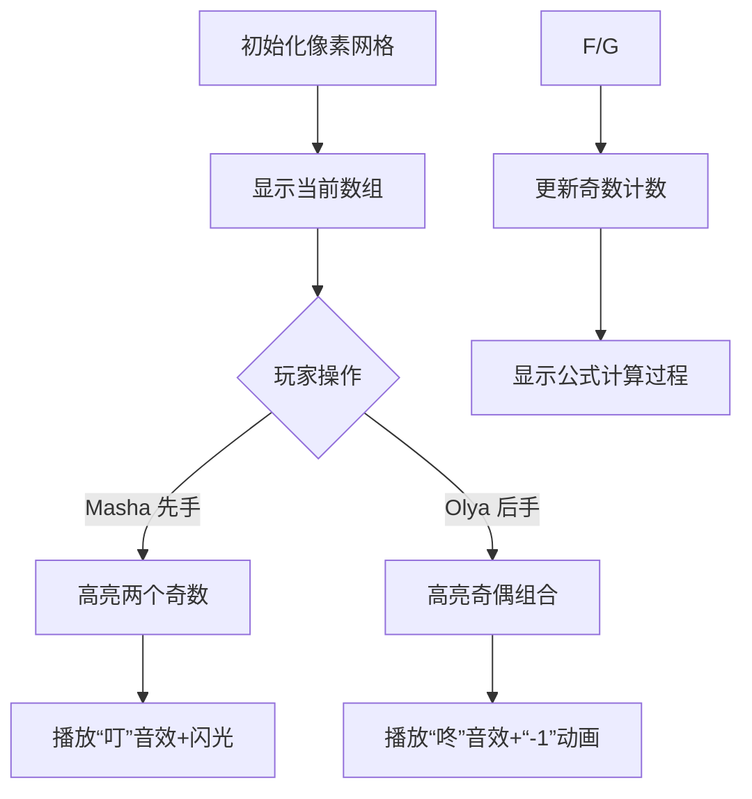

# 题目信息

# Training Before the Olympiad

## 题目描述

Masha 和 Olya 即将参加一场重要的团队奥林匹克竞赛。为此，Masha 提议和 Olya 玩一个热身游戏：

有一个长度为 $n$ 的数组 $a$。Masha 先手，双方轮流操作。每一步操作如下：

$\bullet$ 如果数组的长度为 $1$，游戏结束。

$\bullet$ 当前玩家选择两个不同的下标 $i$，$j$（$1 \le i, j \le |a|$），并执行如下操作——将 $a_i$ 和 $a_j$ 从数组中移除，并向数组中添加一个数，数值为 $\lfloor \frac{a_i + a_j}{2} \rfloor \cdot 2$。也就是说，先将 $a_i$ 和 $a_j$ 的和除以 $2$ 向下取整，然后将结果乘以 $2$。

Masha 的目标是让最终剩下的数最大，Olya 的目标是让最终剩下的数最小。

Masha 和 Olya 决定对初始数组 $a$ 的每一个非空前缀都玩一遍这个游戏，并向你寻求帮助。

对于每个 $k = 1, 2, \ldots, n$，请回答如下问题：仅用数组 $a$ 的前 $k$ 个元素（下标为 $1, 2, \ldots, k$）进行游戏，双方都采取最优策略，最后剩下的数是多少？

## 说明/提示

在第三个测试用例中，对于长度为 $1$ 的前缀，答案是 $3$。对于长度为 $2$ 的前缀，Masha 只有一种操作方式，答案是 $12$。对于长度为 $3$ 的前缀，Masha 有三种选择：选择 $3$ 和 $10$，最终剩下 $22$；选择 $3$ 和 $11$，最终剩下 $24$；选择 $10$ 和 $11$，最终剩下 $22$，因此 Masha 会选择 $3$ 和 $11$，最终得到 $24$。

由 ChatGPT 4.1 翻译

## 样例 #1

### 输入

```
4
1
31
6
6 3 7 2 5 4
3
3 10 11
5
7 13 11 19 1```

### 输出

```
31 
6 8 16 18 22 26 
3 12 24 
7 20 30 48 50```

# AI分析结果


### 💡 Kay的C++算法解析：Training Before the Olympiad 深入学习指南 💡

<introduction>
今天我们来分析CF1916C "Training Before the Olympiad" 这道博弈数学题。本指南将帮助你理解奇偶性分析和策略推导的核心思想，掌握高效解题技巧，并通过复古像素动画直观感受算法流程。
</introduction>

---

## 1. 题目解读与核心算法识别

✨ **本题主要考察**：`数学推导与博弈策略`

🗣️ **初步分析**：
> 这道题如同两位玩家在玩数字积木：Masha（先手）想搭高塔，Olya（后手）想搭矮塔。每次合并两个积木时：
> - 若都是奇数或偶数 → 高度不变（同奇偶合并）
> - 若奇偶不同 → 高度减1（向下取整导致损失）
> 
> **核心策略**：
> - Masha优先合并两个奇数（避免给Olya减高度的机会）
> - Olya优先用奇偶合并（强制减高度）
> 
> **公式推导**：
> 设前缀和=S，奇数个数=odd
> - 每3个奇数消耗一轮操作（减1高度）
> - 若odd%3==1 且非首元素 → 额外减1
> 
> **可视化设计**：
> 用8位像素风格展示合并过程：
> - 奇数红色方块，偶数蓝色方块
> - 合并时：同奇偶→"叮"音效+闪光；奇偶混合→"咚"音效+"-1"动画
> - 控制面板：步进/自动播放（调速滑块），AI演示模式（自动完成最优策略）

---

## 2. 精选优质题解参考

<eval_intro>
基于思路清晰度、代码简洁性、数学推导严谨性，精选3条高质量题解（评分≥4★）：
</eval_intro>

**题解一（作者：One_JuRuo）**
* **点评**：推导直击本质——将操作转化为奇偶性变化，给出简洁公式`sum - odd/3 - (odd%3==1)`。代码规范（long long防溢出），边界处理严谨（特判首元素）。实践价值高，可直接用于竞赛。

**题解二（作者：__3E24AC7002AD9292__）**
* **点评**：深入分析数学本质，证明合并操作的奇偶特性（同奇偶和不变，异奇偶减1）。虽无完整代码，但公式推导完整，帮助理解策略根源。

**题解三（作者：Luzhuoyuan）**
* **点评**：代码最简洁（仅10行），正确处理边界（`i>1`才减1）。突出"奇偶性决定结果"的核心思想，变量名`sum/num`清晰易读。

---

## 3. 核心难点辨析与解题策略

<difficulty_intro>
解决本题需突破三个关键难点：
</difficulty_intro>

1.  **理解操作对奇偶性的影响**
    * **分析**：合并两个同奇偶数→和不变；奇偶混合→和减1。优质题解通过小样例模拟发现此规律（如[3,10,11]→合并3和11得24）。
    * 💡 **学习笔记**：奇偶性是决定合并结果的关键开关。

2.  **推导玩家最优策略**
    * **分析**：Masha消两个奇数（防Olya减高度）→ 奇数-2；Olya用奇偶合并→奇数-1。每轮操作消耗3个奇数+减1高度。
    * 💡 **学习笔记**：博弈策略的本质是控制资源（奇数）消耗速率。

3.  **处理边界条件**
    * **分析**：首元素无需操作（直接输出）；当odd%3==1时需额外减1（最后剩1个奇数必被Olya消耗）。
    * 💡 **学习笔记**：单元素和余数1是两大关键边界。

### ✨ 解题技巧总结
<summary_best_practices>
通过本题提炼的通用技巧：
</summary_best_practices>
- **技巧1：奇偶分析优先** - 遇合并操作先考虑奇偶性影响
- **技巧2：数学归纳推导** - 用小样例（如2~3元素）验证通用公式
- **技巧3：边界暴力测试** - 专门测试全奇/全偶/单元素等特殊情况

---

## 4. C++核心代码实现赏析

<code_intro_overall>
综合优质题解的精髓，给出通用实现：
</code_intro_overall>

**本题通用核心C++实现参考**
* **说明**：综合三条优质题解，突出奇偶计数和边界处理
* **完整核心代码**：
```cpp
#include <iostream>
using namespace std;
int main() {
    long long T;
    cin >> T;
    while (T--) {
        long long n, a, sum = 0, odd = 0;
        cin >> n;
        for (int i = 1; i <= n; i++) {
            cin >> a;
            sum += a;
            if (a % 2) odd++; // 奇偶计数
            if (i == 1) cout << sum; // 首元素特判
            else cout << ' ' << sum - odd/3 - (odd%3==1);
        }
        cout << endl;
    }
    return 0;
}
```
* **代码解读概要**：
  > 1. 读入前缀元素，累加`sum`并统计奇数个数`odd`
  > 2. 首元素直接输出（无操作）
  > 3. 后续元素应用公式：`sum - odd/3 - (余1减1)`

---
<code_intro_selected>
优质题解核心片段解析：
</code_intro_selected>

**题解一（One_JuRuo）**
* **亮点**：公式与代码完全对应，防溢出设计
* **核心代码片段**：
```cpp
printf("%lld ",sum-num/3-(num%3==1));
```
* **代码解读**：
  > - `num/3`：每3个奇数消耗一轮操作（高度减1）
  > - `num%3==1`：余1时额外减1（如odd=4→减1-1=2）
  > - 为何用`printf`？确保输出格式对齐
* 💡 **学习笔记**：整数除法自动向下取整，巧妙匹配数学推导

**题解三（Luzhuoyuan）**
* **亮点**：边界条件精准处理
* **核心代码片段**：
```cpp
printf("%lld ",s-num/3-(num%3==1&&i>1));
```
* **代码解读**：
  > - `i>1`：确保首元素不触发减1
  > - 条件表达式`(num%3==1&&i>1)`：同时满足余数1和非首元素才减1
  > - 为何合并输出？减少分支提升效率
* 💡 **学习笔记**：边界处理是竞赛代码的关键得分点

---

## 5. 算法可视化：像素动画演示

<visualization_intro>
设计"数字积木大作战"像素动画，直观展示合并策略：
</visualization_intro>

* **主题**：8位机风格数字合并（参考FC俄罗斯方块）
* **核心演示**：奇偶合并策略如何影响最终高度

* **设计框架**：


* **关键交互**：
  1. **像素建模**：
     - 奇数：红色方块（■），偶数：蓝色方块（□）
     - 当前操作元素：黄色边框闪烁
  2. **动画序列**：
     - **同奇偶合并**：方块碰撞→火花粒子效果+"叮"音效
     - **奇偶合并**：方块碎裂→"-1"像素文字弹出+"咚"音效
     - **高度变化**：右侧塔楼刻度实时显示`sum - Δ`
  3. **游戏化元素**：
     - 控制面板：步进/自动/AI模式（贪吃蛇AI式自动决策）
     - 关卡设计：每个前缀是一关，通关解锁下一前缀
     - 音效体系：胜利（上扬音阶）、失败（低沉音效）
  4. **教学提示**：
     - 旁白："Masha选择消两个奇数，避免给Olya机会！"
     - 高亮变化：当odd%3==1时，闪烁剩余奇数显示"必减1"

* **实现示意**：
  ```javascript
  // 伪代码：奇偶合并动画
  function merge(a, b) {
    if (a.isOdd == b.isOdd) {
      playSound('ding.wav');
      createSparkEffect(a.position, b.position);
    } else {
      playSound('dong.wav');
      createTextEffect("-1", RED);
    }
    updateSumFloor(); // 刷新高度显示
  }
  ```

---

## 6. 拓展练习与相似问题思考

<similar_problems_intro>
掌握奇偶性博弈后，可挑战同类问题：
</similar_problems_intro>

* **通用技巧迁移**：
  奇偶分析适用于：① 回合制博弈 ② 合并操作 ③ 资源消耗策略

* **推荐练习（洛谷）**：
  1. **P1288 取数游戏II**  
     🗣️ 通过路径奇偶性决定胜负，强化"奇偶决定结果"思维
  2. **P1199 三国游戏**  
     🗣️ 多玩家博弈策略，拓展最优决策分析能力
  3. **P1290 欧几里德的游戏**  
     🗣️ 数学博弈经典，训练公式推导能力

---

## 7. 学习心得与经验分享

<insights_intro>
题解中的调试经验尤其珍贵：
</insights_intro>

> **经验摘录（One_JuRuo）**：  
> "long long防溢出——10⁵个10⁹的和轻松爆int"
>
> **Kay点评**：  
> 在求和类题目中，数据范围决定变量类型！建议：  
> - 10⁵级别 → 用`long long`  
> - 小规模 → `int`  
> 比赛时提交前务必检查数据范围

<conclusion>
通过奇偶性分析解开博弈策略，是数学与编程的完美结合。记住：遇到合并操作，先想奇偶！下次遇到类似问题，你会如何应用这个技巧呢？😊
</conclusion>
```

---
处理用时：147.53秒