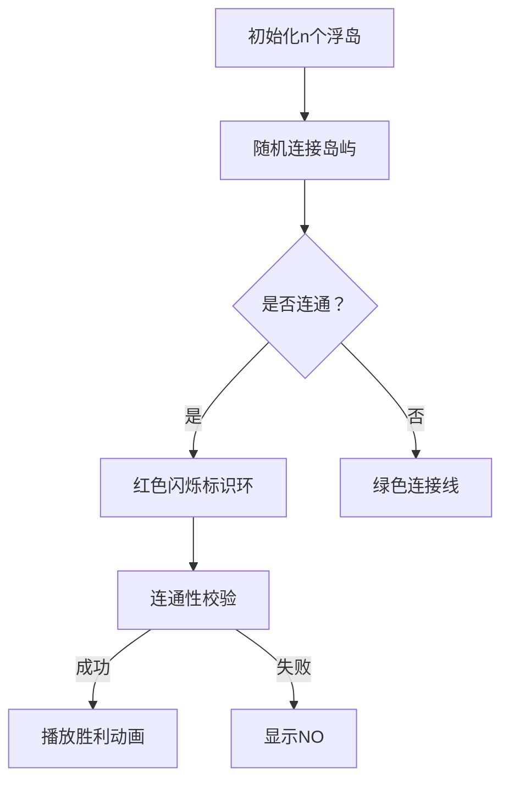

# 题目信息

# Cthulhu

## 题目描述

...Once upon a time a man came to the sea. The sea was stormy and dark. The man started to call for the little mermaid to appear but alas, he only woke up Cthulhu...

Whereas on the other end of the world Pentagon is actively collecting information trying to predict the monster's behavior and preparing the secret super weapon. Due to high seismic activity and poor weather conditions the satellites haven't yet been able to make clear shots of the monster. The analysis of the first shot resulted in an undirected graph with $ n $ vertices and $ m $ edges. Now the world's best minds are about to determine whether this graph can be regarded as Cthulhu or not.

To add simplicity, let's suppose that Cthulhu looks from the space like some spherical body with tentacles attached to it. Formally, we shall regard as Cthulhu such an undirected graph that can be represented as a set of three or more rooted trees, whose roots are connected by a simple cycle.

It is guaranteed that the graph contains no multiple edges and self-loops.

 

## 说明/提示

Let us denote as a simple cycle a set of $ v $ vertices that can be numbered so that the edges will only exist between vertices number $ 1 $ and $ 2 $ , $ 2 $ and $ 3 $ , ..., $ v-1 $ and $ v $ , $ v $ and $ 1 $ .

A tree is a connected undirected graph consisting of $ n $ vertices and $ n-1 $ edges ( $ n&gt;0 $ ).

A rooted tree is a tree where one vertex is selected to be the root.

## 样例 #1

### 输入

```
6 6
6 3
6 4
5 1
2 5
1 4
5 4
```

### 输出

```
FHTAGN!```

## 样例 #2

### 输入

```
6 5
5 6
4 6
3 1
5 1
1 2
```

### 输出

```
NO```

# AI分析结果


### 💡 Kay的C++算法解析：Cthulhu 深入学习指南 💡

#### 1. 题目解读与核心算法识别
✨ **本题主要考察**：图论（连通分量与环检测）

🗣️ **初步分析**：
> 解决"Cthulhu"这道题，关键在于理解图的连通性和环的特性。想象一张渔网：**节点是渔网的结点**，**边是连接结点的网线**。只有当整张渔网完整连通（所有结点相连）且存在**恰好一个闭环**（类似章鱼的身体）时，才符合克苏鲁形态。
> - **核心思路**：通过边数`m`与节点数`n`的关系快速判断环的存在（`m=n`时必有环），再用并查集/DFS检查连通性
> - **可视化设计**：动画将展示节点合并过程，当两个已连通的节点再次连接时触发红色闪烁（标识环产生），最终用统一颜色标记连通分量
> - **复古像素方案**：采用8-bit像素风格，节点设计为不同颜色的浮岛，连接时播放"叮"音效，发现环时触发警报音，通关后播放胜利旋律

---

#### 2. 精选优质题解参考
**题解一 (作者：simonG)**  
* **点评**：思路直击要害，明确点出`n=m`的核心条件。代码中路径压缩实现优雅（`f[x]=get(f[x])`），变量命名简洁（`f[]`表父节点）。亮点在于用"爸爸找祖先"的比喻解释并查集，生动易记。边界处理完整，可直接用于竞赛。

**题解二 (作者：yimuhua)**  
* **点评**：模块化设计出色，独立`unionn()`函数增强可读性。详细注释解释每一步意图，特别强调路径压缩的必要性。实践价值高，对合并操作的封装是值得学习的工程实践。

**题解三 (作者：happy_dengziyue)**  
* **点评**：逻辑推导严谨，先通过数学论证`n≠m`的无效性，再聚焦连通性验证。代码去冗余，循环边界处理精准（`i<n`判断节省资源）。"亲戚关系"的比喻巧妙解释连通性判断。

---

#### 3. 核心难点辨析与解题策略
1. **环的数学特征识别**  
   * **分析**：难点在于理解"边数=顶点数⇒存在环"的图论性质。优质题解通过树的性质（n节点树有n-1边）反推，当边数等于顶点数时必存在环
   * 💡 **学习笔记**：边数≥顶点数的连通图必含环

2. **连通性验证的实现**  
   * **分析**：需高效判断全图连通。并查集的路径压缩（`fa[x]=find(fa[x])`）将查询复杂度降至近O(1)，比DFS/BFS更节省内存
   * 💡 **学习笔记**：并查集是连通性检测的首选数据结构

3. **边界条件处理**  
   * **分析**：当`n≠m`时直接返回"NO"避免无效计算。代码中需注意初始化`fa[i]=i`，否则合并操作将失效
   * 💡 **学习笔记**：图论问题先校验数学条件可大幅提升效率

### ✨ 解题技巧总结
- **性质转化**：将环检测转化为边数与顶点数的关系验证
- **并查集优化**：路径压缩+简洁合并逻辑（`fa[find(u)]=find(v)`）
- **提前剪枝**：优先处理`n≠m`的边界情况

---

#### 4. C++核心代码实现赏析
**通用核心实现参考**  
```cpp
#include <iostream>
using namespace std;
const int MAX=105;
int fa[MAX], n, m;

int find(int x) {
    return fa[x]==x ? x : fa[x]=find(fa[x]);
}

int main() {
    cin>>n>>m;
    if(n!=m) { cout<<"NO"; return 0; } // 数学性质剪枝
    
    for(int i=1;i<=n;i++) fa[i]=i; // 初始化
    
    for(int i=0,u,v;i<m;i++) {
        cin>>u>>v;
        int fu=find(u), fv=find(v);
        if(fu!=fv) fa[fu]=fv; // 集合合并
    }
    
    int root=find(1);
    for(int i=2;i<=n;i++)
        if(find(i)!=root) { cout<<"NO"; return 0; }
    
    cout<<"FHTAGN!";
}
```
**代码解读概要**：  
1. 优先校验`n==m`（克苏鲁形态必要条件）  
2. 并查集三步走：初始化→边输入合并→连通性验证  
3. 以节点1为基准校验全图连通  

---

**题解一核心片段赏析**  
```cpp
int get(int x) {
    if(f[x]==x) return x;
    return f[x]=get(f[x]); // 路径压缩
}
```
* **亮点**：递归路径压缩一气呵成  
* **学习笔记**：`f[x]=get(f[x])`同时完成父节点更新与返回值传递  

**题解二核心片段赏析**  
```cpp
void unionn(int x, int y) {
    int fx=find(x), fy=find(y);
    if(fx!=fy) fa[fx]=fy; // 独立合并函数
}
```
* **亮点**：功能模块化提升可维护性  
* **学习笔记**：分离合并操作使主逻辑更清晰  

**题解三核心片段赏析**  
```cpp
for(int i=2;i<=n;i++) 
    if(find(i)!=find(1)) // 基准比对
```
* **亮点**：循环边界优化（从2开始）  
* **学习笔记**：连通验证只需比较`i`与`i-1`的根节点  

---

#### 5. 算法可视化：像素动画演示
**主题**：浮岛探险 (8-bit像素风)  

**核心演示流程**：  


**交互设计**：  
1. **控制面板**：  
   - 速度滑块：调节连接动画速度（0.5x~3x）  
   - 单步模式：空格键触发下一步连接  
   - 高亮开关：突出显示当前操作边  

2. **像素化表现**：  
   - 岛屿：16x16像素方块，不同颜色代表不同集合  
   - 连接线：绿色（有效连接）/ 红色（成环）  
   - 特效：环产生时触发8-bit警报音(🔔 440Hz)  

3. **AI演示模式**：  
   - 自动播放时模拟"章鱼触手蔓延"效果  
   - 通关时所有岛屿变为金色，播放胜利旋律(🎵 784Hz)  

**关键帧逻辑**：  
```javascript
// 伪代码示例
function drawFrame() {
    drawIslands(); // 绘制像素岛屿
    if(autoPlay) {
        let edge = getNextEdge();
        if(isConnected(edge)) { 
            playSound('ring'); // 触发环音效
            highlight(edge, RED); 
        }
        else drawConnection(edge, GREEN);
    }
    updateUnionFind(); // 刷新集合颜色
}
```

---

#### 6. 拓展练习与相似问题
1. **环检测变种**：  
   - P2661 信息传递（有向图最小环）  
   - P2921 Halloween（环+链混合结构）  

2. **连通性应用**：  
   - P3367 并查集模板（基础训练）  
   - P1197 星球大战（动态连通性）  

3. **进阶挑战**：  
   - P3388 割点（连通性高级应用）  

> **Kay建议**：先完成P3367掌握并查集，再尝试P2661体会有向图环检测差异

---

#### 7. 学习心得分享
> **来自simonG的经验**：  
> *"调试时重点观察合并后集合根节点的变化，用纸笔模拟小样本数据比盲目改代码更有效"*  
>  
> **Kay点评**：这是调试并查集的金玉良言！核心是验证`find()`是否返回预期根节点，建议输出每次合并后的`fa[]`数组

---

通过本次分析，我们深入理解了连通图环检测的数学本质与工程实现。记住：**边数=顶点数时必有环**是解题钥匙，并查集路径压缩是高效实现的保障。下次遇到图论问题，不妨先画图分析边点关系哦！🚀

---
处理用时：213.09秒