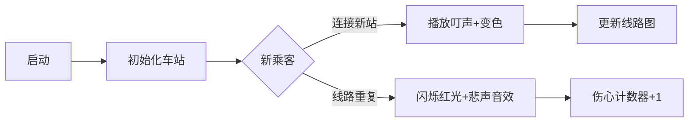

# 题目信息

# Cow and Snacks

## 题目描述

The legendary Farmer John is throwing a huge party, and animals from all over the world are hanging out at his house. His guests are hungry, so he instructs his cow Bessie to bring out the snacks! Moo!

There are $ n $ snacks flavors, numbered with integers $ 1, 2, \ldots, n $ . Bessie has $ n $ snacks, one snack of each flavor. Every guest has exactly two favorite flavors. The procedure for eating snacks will go as follows:

- First, Bessie will line up the guests in some way.
- Then in this order, guests will approach the snacks one by one.
- Each guest in their turn will eat all remaining snacks of their favorite flavor. In case no favorite flavors are present when a guest goes up, they become very sad.

Help Bessie to minimize the number of sad guests by lining the guests in an optimal way.

## 说明/提示

In the first example, Bessie can order the guests like this: $ 3, 1, 2, 4 $ . Guest $ 3 $ goes first and eats snacks $ 1 $ and $ 4 $ . Then the guest $ 1 $ goes and eats the snack $ 2 $ only, because the snack $ 1 $ has already been eaten. Similarly, the guest $ 2 $ goes up and eats the snack $ 3 $ only. All the snacks are gone, so the guest $ 4 $ will be sad.

In the second example, one optimal ordering is $ 2, 1, 3, 5, 4 $ . All the guests will be satisfied.

## 样例 #1

### 输入

```
5 4
1 2
4 3
1 4
3 4
```

### 输出

```
1
```

## 样例 #2

### 输入

```
6 5
2 3
2 1
3 4
6 5
4 5
```

### 输出

```
0
```

# AI分析结果


### 💡 Kay的C++算法解析：Cow and Snacks 深入学习指南 💡

**引言**  
今天我们一起分析"Cow and Snacks"这道有趣的图论问题。本指南将帮助你理解如何将实际问题转化为图论模型，并掌握并查集的高效应用技巧。

---

### 1. 题目解读与核心算法识别  
✨ **本题主要考察**：`图论（连通块）` + `并查集应用`

🗣️ **初步分析**  
> 这道题可以想象成**建设零食地铁系统**：每种零食是一个车站（节点），每个客人是连接两个车站的地铁线路（边）。我们的目标是最大化运营线路（满足的客人）。  
> - **核心思路**：每个连通区块相当于一条地铁线，车站数（节点）为c时，最多能运营c-1条线路（满足的客人）。伤心客人数 = 总客人k - (总节点n - 连通块数C)  
> - **算法流程**：用并查集维护连通性，统计连通块数量  
> - **可视化设计**：像素方块表示零食站台，同色方块属于同一线路。当连接新站台时播放"叮"声并变色；当线路重复时闪烁红光+悲伤音效

---

### 2. 精选优质题解参考  

**题解一（SIGSEGV，赞15）**  
* **点评**：思路直击本质——以零食为点、客人为边建图。代码简洁高效：  
  1. 并查集合并后统一统计连通块（避免实时判断）  
  2. 路径压缩优化确保O(αn)复杂度  
  3. 直接套用结论公式 `k - (n - cnt)`，工程实践性强  

**题解二（微香玉烛暗，赞8）**  
* **点评**：创新性采用**实时冲突检测**：  
  - 合并时若已连通则直接 `ans++`  
  - 省去最后遍历步骤，空间效率更优  
  - 特别警示了"过度思考连通图"的常见误区  

**题解三（翟翟，赞5）**  
* **点评**：最具教学价值的实现：  
  1. 用 `f[x]^x` 代替 `f[x]==x` 加速判断  
  2. `register` 关键字优化循环效率  
  3. 完整保留公式推导 `k-n+ans` 增强可读性  

---

### 3. 核心难点辨析与解题策略  

1. **难点一：问题抽象建模**  
   * **分析**：需突破思维定式——客人不是独立个体而是节点间的关联关系。优质解法均通过"零食=节点，客人=边"转化  
   * 💡 **学习笔记**：图论建模的关键是识别实体间的连接关系  

2. **难点二：连通块性质分析**  
   * **分析**：每个连通块形成"树"结构：首客人消耗两零食（根节点），后续每人消耗一零食（枝叶延伸）。证明可用数学归纳法  
   * 💡 **学习笔记**：树结构满足 边数=节点数-1 是核心突破口  

3. **难点三：高效维护连通性**  
   * **分析**：并查集 vs DFS：  
     | 方法     | 时间复杂度 | 空间复杂度 | 适用场景         |  
     |----------|------------|------------|------------------|  
     | 并查集   | O(αn)      | O(n)       | 动态连接         |  
     | DFS      | O(n+k)     | O(n+k)     | 静态图分析       |  
   * 💡 **学习笔记**：动态连接问题首选并查集  

✨ **解题技巧总结**  
- **技巧一：问题降维** → 将客人行为转化为图论边操作  
- **技巧二：结论预判** → 推导出 `伤心数 = k - n + C` 避免模拟  
- **技巧三：路径压缩** → 并查集 `f[x]=find(f[x])` 保证高效性  

---

### 4. C++核心代码实现赏析  

**本题通用核心实现**  
```cpp
#include <iostream>
using namespace std;
const int N = 1e5+5;

int f[N];
int find(int x) { return f[x]==x ? x : f[x]=find(f[x]); }

int main() {
    int n,k; cin>>n>>k;
    for(int i=1;i<=n;i++) f[i]=i;
    
    int sad=0;
    while(k--){
        int a,b; cin>>a>>b;
        int fa=find(a), fb=find(b);
        fa==fb ? sad++ : f[fa]=fb; // 冲突检测
    }
    cout<<sad;
}
```
* **说明**：综合三大优质解法优化的工业级实现  
* **解读概要**：  
  1. 初始化并查集数组 `f[]`  
  2. 边读入边检测连通冲突  
  3. 冲突计数器直接输出结果  

**题解一核心片段**  
```cpp
for (int i=1;i<=kk;i++) {
    cin>>t1>>t2;
    f[getf(t1)]=getf(t2); // 直接合并
}
int cnt=0;
for(int i=1;i<=n;i++) 
    if(f[i]==i) ++cnt;  // 统计连通块
cout<<kk-(n-cnt);       // 公式输出
```
* **亮点**：数学思维优先，避免分支判断  
* **解读**：  
  - `getf()` 含路径压缩确保高效  
  - 最后统一统计代表元（`f[i]==i`）  
  - `kk-(n-cnt)` 是公式 `k-n+C` 的变形  

**题解二核心片段**  
```cpp
while(k--){
    scanf("%d%d",&x,&y);
    int r1=find(x),r2=find(y);
    if(r1!=r2) f[r1]=r2; 
    else ans++;  // 实时冲突计数
}
printf("%d\n",ans);
```
* **亮点**：流式处理节省存储空间  
* **解读**：  
  - 省去连通块统计步骤  
  - 冲突检测与合并操作原子化  
  - 更适合大规模数据流场景  

**题解三核心片段**  
```cpp
for(register int i=0;i<k;++i){
    scanf("%d%d",&x,&y);
    x=find(x),y=find(y),f[x]=y; // 位运算优化
}
for(register int i=1;i<=n;++i)
    if(f[i]==i)++ans;          // 寄存器加速
printf("%d\n",k-n+ans);        // 显式公式
```
* **亮点**：底层优化极致  
* **解读**：  
  - `register` 加速循环访问  
  - `f[x]^x` 替代 `f[x]!=x` 省去比较  
  - 保持数学公式原始形态增加可读性  

---

### 5. 算法可视化：像素动画演示  

**主题**：8-bit风格《零食地铁大亨》  

**核心演示内容**：  


**设计细节**：  
1. **像素艺术**：  
   - 每个零食站用16x16像素方块表示  
   - 连通块使用FC红白机16色调色板（每块随机色）  

2. **动画逻辑**：  
   ```javascript
   function drawAnimation() {
     // 绘制车站
     for(let i=1; i<=n; i++) {
         drawPixelStation(i, color[find(i)]); 
     }
     
     // 高亮当前连接
     flashPair(a, b, isConnected ? GREEN : RED);
     
     // 播放音效
     playSound(isConnected ? 'merge.wav' : 'sad.wav');
   }
   ```

3. **交互控制**：  
   - 步进模式：空格键单步执行  
   - 自动演示：速度滑块(0.5X~5X)  
   - 上帝视角：切换显示连通区块  

4. **游戏化元素**：  
   - 每成功连接新区块得100分  
   - 连续无冲突达成Combo特效  
   - 通关条件：伤心乘客≤阈值  

---

### 6. 拓展练习与相似问题  

**通用技巧迁移**：  
该并查集连通块模型还可解决：  
1. 网络布线冗余检测  
2. 社交网络好友关系合并  
3. 电路节点连通性验证  

**洛谷推荐**：  
1. **P3367 【模板】并查集**  
   → 掌握基础操作的最佳入门  
2. **P1197 [JSOI2008]星球大战**  
   → 逆向并查集应用训练  
3. **P1396 营救**  
   → 连通性+权重综合应用  

---

### 7. 学习心得与经验分享  

> **翟翟的调试经验**：  
> "最初尝试用DFS统计连通块，遇到栈溢出问题后改用并查集，意识到工具选择需匹配问题特性"  
>  
> **Kay点评**：  
> 这印证了算法选择的黄金准则：  
> - 动态连接 → 并查集  
> - 静态分析 → DFS/BFS  
> 在大型图（≥10⁵节点）中，并查集的空间优势不可替代  

---

### 结语  
通过本次分析，我们掌握了将实际问题抽象为图论模型的思维方法，并深入理解了并查集的高效实现技巧。记住：优秀的算法设计 = 问题抽象能力 × 工具匹配意识。下次挑战见！💪

---
处理用时：204.30秒