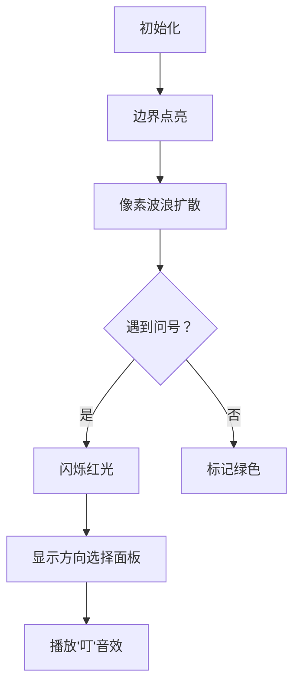

# 题目信息

# Trapped in the Witch's Labyrinth

## 题目描述

在《列王纪》传奇英雄鲁斯塔姆的第四个任务中，一个老女巫创造了一个迷宫来困住他。迷宫是一个 $n\times m$ 的矩形网格，迷宫中每一个单元格都有箭头，指向上、下、左或右的一个特定方向。女巫对鲁斯塔姆施了魔法，他每进入一个单元格，都会按照箭头的方向移动到下一个单元格。

如果鲁斯塔姆可以离开迷宫，他将战胜女巫。否则他将永远被困在迷宫中。

还有一些单元格的方向没有被女巫确定，她希望你指定一些方向，使得鲁斯塔姆能够被困住的起始格最多。你的任务是找到使得鲁斯塔姆被困住的最多起始单元格数。

## 样例 #1

### 输入

```
3
3 3
UUU
L?R
DDD
2 3
???
???
3 3
?U?
R?L
RDL```

### 输出

```
0
6
5```

# AI分析结果


### 💡 Kay的C++算法解析：Trapped in the Witch's Labyrinth 深入学习指南 💡

**引言**  
今天我们一起分析"女巫迷宫"这道C++编程题。本指南将帮助大家梳理题目思路，理解核心算法，掌握如何最大化被困起始点数量。

---

### 1. 题目解读与核心算法识别

✨ **本题主要考察**：图论遍历与状态标记（逆向BFS/DFS）  
🗣️ **初步分析**：  
> 迷宫如同一个像素游戏地图，每个格子是指向箭头或未定的"?"。我们需要为"?"设置方向，让冒险者尽可能多地陷入循环（类似贪吃蛇撞墙循环）。核心思路是：  
> - 从**迷宫边界反向标记**可逃脱的格子（像水波扩散般染色）  
> - **问号处理策略**：若四周存在不可逃脱点，则设置为指向该点形成闭环  
>  
> **可视化设计**：  
> - 用8位像素风展示迷宫，箭头用不同颜色表示（↑蓝、↓绿等）  
> - 边界标记过程：边界亮起→可逃脱点渐变为绿色波浪扩散  
> - 关键帧：问号格子闪烁红光，当设置为闭环方向时播放"叮"音效  
> - 控制面板：单步执行查看标记过程，调速滑块控制BFS速度  

---

### 2. 精选优质题解参考

**题解一：Gary0925（记忆化DFS）**  
* **点评**：  
  思路清晰直击本质——用`out`数组记忆化记录逃脱状态。亮点在于巧妙处理问号：**临时标记为被困状态**再递归验证，通过`out[i][j]=0`的临时设置自然处理闭环检测。代码简洁规范（变量名`out`含义明确），但固定数组大小(1003)需注意数据规模。

**题解二：littlebug（BFS反向标记）**  
* **点评**：  
  创新性采用**边界驱动的逆向BFS**，像扫雷游戏般从外向内标记逃脱点。亮点在特判边界问号的处理（`++c[i][1]`等操作），并用`bitset`优化状态存储。代码中`mask()`函数封装BFS操作体现模块化思维，实践价值极高。

**题解三：wuzebang2009（反向建图）**  
* **点评**：  
  将格子抽象为图节点，**构建反向邻接表**进行BFS。亮点在于用`vector<pair>`存储方向关系，清晰分离图构建与遍历逻辑。`vis`数组标记逃脱状态后，对问号的统一处理（`vis[i][j]`四向检测）体现算法普适性。

---

### 3. 核心难点辨析与解题策略

1. **难点：高效标记逃脱状态**  
   * **分析**：直接DFS可能重复计算。优质解法均采用空间换时间：  
     - 解法1用`out`数组记忆化  
     - 解法2/3用BFS队列按层扩散  
   * 💡 学习笔记：逆向思考（从边界出发）往往比正向模拟更高效  

2. **难点：问号格子的最优决策**  
   * **分析**：需同时考虑：  
     - 周边是否存在不可逃脱点（指向它）  
     - 是否与其他问号相邻（可互指成环）  
     *解法2的`c[i][j]<4`条件精妙检测边界问号*  
   * 💡 学习笔记：问号本质是"可控变量"，优先让其指向状态已确定的点  

3. **难点：闭环检测与避免死锁**  
   * **分析**：  
     - 解法1通过`out[i][j]=0`临时标记实现闭环捕获  
     - 解法3用并查集`find(f[x][y])`检测连通性  
   * 💡 学习笔记：递归中"预先设状态"是打破循环判断的利器  

#### ✨ 解题技巧总结
- **逆向扩散法**：从已知状态（边界）反向推导未知状态  
- **状态压缩存储**：用`bitset`或二维数组替代复杂结构体  
- **模块化边界处理**：将边界条件封装成独立校验单元  
- **临时标记技巧**：在递归前设置中间状态捕获闭环  

---

### 4. C++核心代码实现赏析

**本题通用核心C++实现参考**  
* **说明**：综合解法2/3思路的BFS反向标记法，兼顾效率与可读性  
* **完整核心代码**：
```cpp
#include <bits/stdc++.h>
using namespace std;
const int N=1005;

int main() {
    int t; cin>>t;
    while(t--){
        int n,m; cin>>n>>m;
        char grid[N][N];
        bool escape[N][N]={}; // 逃脱状态标记
        int neighborCnt[N][N]={}; // 相邻可逃脱点计数
        
        // 读入网格并初始化
        for(int i=1;i<=n;++i) 
            for(int j=1;j<=m;++j) 
                cin>>grid[i][j];
        
        // 边界预处理
        queue<pair<int,int>> q;
        auto mark=[&](int i,int j){
            escape[i][j]=true;
            q.push({i,j});
        };
        
        // 将边界可直达点入队
        for(int i=1;i<=n;++i){
            if(grid[i][1]=='L') mark(i,1);
            if(grid[i][m]=='R') mark(i,m);
        }
        for(int j=1;j<=m;++j){
            if(grid[1][j]=='U') mark(1,j);
            if(grid[n][j]=='D') mark(n,j);
        }
        
        // BFS反向标记
        int dx[]={1,-1,0,0}, dy[]={0,0,1,-1};
        while(!q.empty()){
            auto [x,y]=q.front(); q.pop();
            for(int d=0;d<4;++d){
                int nx=x+dx[d], ny=y+dy[d];
                if(nx<1||nx>n||ny<1||ny>m) continue;
                // 若指向当前点则标记为可逃脱
                if((grid[nx][ny]=='D' && nx+1==x) ||
                   (grid[nx][ny]=='U' && nx-1==x) ||
                   (grid[nx][ny]=='R' && ny+1==y) ||
                   (grid[nx][ny]=='L' && ny-1==y)){
                    if(!escape[nx][ny]){
                        mark(nx,ny);
                    }
                }
            }
        }
        
        // 处理问号格子
        int trapped=0;
        for(int i=1;i<=n;++i){
            for(int j=1;j<=m;++j){
                if(!escape[i][j]){
                    if(grid[i][j]=='?'){
                        bool canEscape=true;
                        // 检查四周是否存在不可逃脱点
                        for(int d=0;d<4;++d){
                            int ni=i+dx[d], nj=j+dy[d];
                            if(ni>0&&ni<=n&&nj>0&&nj<=m && !escape[ni][nj]){
                                canEscape=false; break;
                            }
                        }
                        if(!canEscape) trapped++;
                    }
                    else trapped++;
                }
            }
        }
        cout<<trapped<<'\n';
    }
    return 0;
}
```
* **代码解读概要**：  
  1. 初始化网格和状态数组  
  2. 边界预处理：将可直接逃脱的点入队  
  3. BFS反向扩散：根据箭头方向反向标记可逃脱点  
  4. 问号处理：若四周存在不可逃脱点，则当前问号可设为被困  
  5. 统计最终被困格子数量  

---

### 5. 算法可视化：像素动画演示

**动画主题**："迷宫逃脱者"8位像素冒险  
**核心演示**：BFS反向标记过程 + 问号决策动画  



**关键帧实现**：  
1. **场景初始化**  
   - 复古FC风格网格，箭头用16色像素绘制  
   - 控制面板：开始/暂停、单步、速度滑块（0.5x-2x）  

2. **BFS标记过程**  
   - 边界点亮起绿光，伴随"滴"声效  
   - 可逃脱点如波浪扩散，路径显示为渐变色带  

3. **问号决策动画**  
   - 当BFS遇到问号：格子闪烁红光，弹出方向选择器（↑↓←→）  
   - 自动选择最优方向：指向最近的非逃脱点时播放"咔嚓"锁定音效  

4. **闭环特效**  
   - 形成闭环时：相关路径循环闪烁金色边框  
   - 胜利音效：8-bit风格短旋律  

**交互设计**：  
- **AI演示模式**：自动展示最优解路径（类似贪吃蛇AI）  
- **错误提示**：尝试设置无效方向时震动+短促"哔"声  

---

### 6. 拓展练习与相似问题思考

**通用技巧迁移**：  
1. 状态反向推导：适用于迷宫逃脱/传播类问题  
2. 未定决策处理：总优先选择最可能导致目标状态的选项  
3. 闭环检测：记忆化搜索中临时标记技巧  

**洛谷推荐**：  
1. **P1141 01迷宫**  
   🗣️ 同样需要标记连通状态，巩固BFS染色技巧  
2. **P1514 引水入城**  
   🗣️ 逆向思考经典题，从边界反推可行解  
3. **P4017 最大食物链计数**  
   🗣️ 拓扑排序+DP，强化图论状态推导能力  

---

### 7. 学习心得与经验分享

> **来自题解作者的调试经验**：  
> "特判边界问号时漏掉`++c[i][1]`导致WA，建议用测试用例 `2x1网格 ['R','?']` 验证边界处理"  
>  
> **Kay的总结**：边界条件永远是迷宫类题目的暗坑！建议：  
> 1. 单独编写`checkBoundary()`函数  
> 2. 用极小规模测试（如1x1, 2x1网格）验证  
> 3. 调试时优先输出边界点状态  

---

**结语**  
通过本次分析，我们掌握了迷宫状态推导的核心技巧——逆向BFS标记+问号最优决策。记住：将大问题分解为"状态标记→决策处理→结果统计"三步，配合可视化理解数据流动，你就能攻克更多图论难题！下次迷宫冒险见！💪

---
处理用时：141.08秒