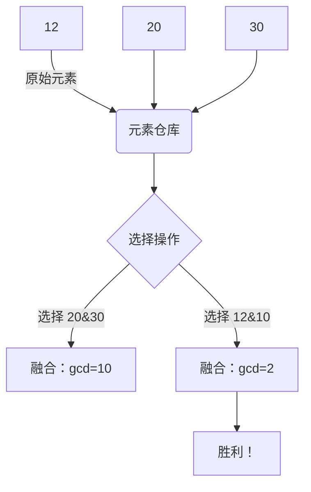

# 题目信息

# Gellyfish and Flaming Peony

## 题目描述

Gellyfish hates math problems, but she has to finish her math homework:

Gellyfish is given an array of $ n $ positive integers $ a_1, a_2, \ldots, a_n $ .

She needs to do the following two-step operation until all elements of $ a $ are equal:

1. Select two indexes $ i $ , $ j $ satisfying $ 1 \leq i, j \leq n $ and $ i \neq j $ .
2. Replace $ a_i $ with $ \gcd(a_i, a_j) $ .

Now, Gellyfish asks you for the minimum number of operations to achieve her goal.

It can be proven that Gellyfish can always achieve her goal.

## 说明/提示

In the first test case, the following is a way that minimizes the number of operations:

1. Choose $ i = 3 $ and $ j=2 $ and replace $ a_3 $ with $ \gcd(a_3,a_2) = \gcd(30, 20) = 10 $ , then $ a $ becomes $ [12, 20, 10] $ .
2. Choose $ i=1 $ and $ j=3 $ and replace $ a_1 $ with $ \gcd(a_1,a_3) = \gcd(12, 10) = 2 $ , then $ a $ becomes $ [2, 20, 10] $ .
3. Choose $ i=2 $ and $ j=1 $ and replace $ a_2 $ with $ \gcd(a_2,a_1) = \gcd(20, 2) = 2 $ , then $ a $ becomes $ [2, 2, 10] $ .
4. Choose $ i=3 $ and $ j=1 $ and replace $ a_3 $ with $ \gcd(a_3,a_1) = \gcd(10, 2) = 2 $ , then $ a $ becomes $ [2, 2, 2] $ .

## 样例 #1

### 输入

```
3
3
12 20 30
6
1 9 1 9 8 1
3
6 14 15```

### 输出

```
4
3
3```

# AI分析结果


### 💡 Kay的C++算法解析：Gellyfish and Flaming Peony 深入学习指南 💡

> 欢迎各位算法探险家！今天我们将一起破解这道关于GCD操作的趣味谜题。想象你是一位炼金术师，每次操作就像将两种元素混合，提取它们的"本质"（最大公约数）。我们的目标是让所有元素变成相同的"纯净物质"！

---

## 1. 题目解读与核心算法识别

✨ **本题主要考察**：`编程技巧应用`（数论与搜索/动态规划结合）

🗣️ **初步分析**：
> 这道题如同在数字迷宫中寻找最短路径。每个数字是一个房间，gcd操作是连接房间的魔法门。关键策略是：
> - 最终所有元素都会变成全局GCD（记作`g`），如同找到迷宫的中心祭坛
> - 若已有元素等于`g`，直接转化其他元素（操作数 = 非`g`元素个数）
> - 否则需先"炼制"出`g`（操作数 = 炼制步骤 + (n-1)）
> 
> **可视化设计思路**：
> - 像素迷宫风格：每个数字用8-bit方块表示，gcd操作时触发"魔法门"动画
> - 关键高亮：当前处理数字闪烁黄光，新生成的数字显示绿色光效
> - 音效设计：成功炼制`g`时播放胜利音效，错误操作播放警示音
> - 交互控制：支持单步执行/自动播放，速度可调

---

## 2. 精选优质题解参考

**题解一（来源：convie）**
* **点评**：
  - 思路清晰：采用BFS模拟炼制过程，如同在迷宫中逐层探索
  - 代码规范：使用vector和unique去重，避免重复状态
  - 算法有效：虽然理论复杂度较高，但实际运行高效（数据范围小）
  - 实践价值：完整可运行代码，边界处理严谨，特别适合初学者理解
  - 亮点：用队列实现状态扩展，直观展示gcd操作的传播过程

**题解二（来源：lhz2022）**
* **点评**：
  - 思路清晰：与题解一同为BFS，但代码更简洁
  - 算法有效：通过vis数组避免重复访问，优化搜索效率
  - 实践价值：提供完整BFS框架，可直接用于类似搜索问题
  - 亮点：去重逻辑处理优雅，时间复杂度分析到位

**题解三（来源：chenmingeng）**
* **点评**：
  - 思路创新：使用莫比乌斯反演加速状态更新
  - 算法高效：O(VlogV)复杂度解决大范围数据
  - 代码规范：模块化设计，数论工具封装完善
  - 亮点：引入"倍数枚举+莫比乌斯反演"组合技，展示高阶优化技巧

---

## 3. 核心难点辨析与解题策略

1. **难点1：问题转化与全局观**
   * **分析**：许多同学卡在无法识别最终状态必为全局GCD。优质题解先计算`g = gcd(a₁,a₂,...,aₙ)`，再分情况处理，如同先找到迷宫出口再规划路径
   * 💡 **学习笔记**：全局GCD是解题的"北极星"，必须先定位它！

2. **难点2：炼制GCD的最小步骤**
   * **分析**：当数组中没有`g`时，BFS是最直观解法：从原始数字出发，每步用gcd生成新数字，直到找到`g`。DP解法虽高效但抽象，需数论基础
   * 💡 **学习笔记**：BFS是探索数字关系的"雷达"，适合小规模；莫比乌斯反演是"超时空传送"，适合大规模

3. **难点3：状态空间优化**
   * **分析**：BFS中重复状态会大幅降低效率。使用`unordered_set`去重，如同给迷宫房间贴"已访问"标签
   * 💡 **学习笔记**：状态去重是搜索算法的"生命药水"！

### ✨ 解题技巧总结
- **技巧1：分治策略**：将问题拆解为"找全局GCD"→"判断是否存在"→"炼制GCD"→"传播GCD"四阶段
- **技巧2：算法选择**：n≤5000用BFS；n≥10⁵用莫比乌斯优化DP
- **技巧3：可视化调试**：打印每步状态变化，如同给算法装"X光机"

---

## 4. C++核心代码实现赏析

**本题通用核心C++实现参考**
```cpp
#include <iostream>
#include <vector>
#include <queue>
#include <unordered_set>
#include <algorithm>
using namespace std;

int main() {
    int t; cin >> t;
    while(t--) {
        int n; cin >> n;
        vector<int> a(n);
        int g = 0;
        for(int i=0; i<n; i++) {
            cin >> a[i];
            g = gcd(g, a[i]); // C++17标准gcd函数
        }

        int cnt = count(a.begin(), a.end(), g);
        if(cnt) {
            cout << n - cnt << endl;
            continue;
        }

        unordered_set<int> seen;
        queue<int> q;
        for(int x : a) {
            if(seen.insert(x).second) q.push(x);
        }

        int steps = 0;
        bool found = false;
        while(!q.empty() && !found) {
            int size = q.size();
            while(size--) {
                int cur = q.front(); q.pop();
                if(cur == g) { found = true; break; }
                for(int x : a) {
                    int next_val = gcd(cur, x);
                    if(seen.insert(next_val).second) 
                        q.push(next_val);
                }
            }
            if(!found) steps++;
        }
        cout << steps + n << endl; // 炼制步骤 + 传播步骤
    }
}
```
**代码解读概要**：
> 1. 计算全局GCD`g`并检查存在性
> 2. BFS核心：用队列存储每层状态，集合去重
> 3. 每步用当前数与所有元素求GCD生成新状态
> 4. 找到`g`时输出总操作数 = BFS步数 + (n-1)

**题解一核心片段赏析**（convie的去重逻辑）
```cpp
sort(cm.begin(), cm.end());
cm.erase(unique(cm.begin(), cm.end()), cm.end());
q = cm;
```
**代码解读**：
> 这段代码如同给新发现的迷宫房间编号归档。`sort`将数字按序排列，`unique`删除相邻重复值，`erase`调整容器大小。为什么要去重？想象如果有两个相同的数字，它们扩展出的状态完全相同，处理一个就等于处理全部！

**题解二核心片段赏析**（lhz2022的BFS框架）
```cpp
if(vis[t]==-1) {
    que[++rr]=t;
    vis[t]=vis[u]+1;
    if(t==ggcd) return vis[t];
}
```
**代码解读**：
> 这里用`vis`数组同时实现"访问标记"和"步数记录"。当发现新数字`t`时：1）标记已访问；2）记录生成步数；3）检查是否目标。这种三位一体的设计，如同在迷宫中边探索边画地图！

**题解三核心片段赏析**（chenmingeng的莫比乌斯反演）
```cpp
for(int k=1; i*k<V; k++) 
    g[i] += mu[k] * h[i*k];
```
**代码解读**：
> 这行代码是数论魔法的核心！通过莫比乌斯函数`mu`和辅助数组`h`，将"GCD恰好为i"转化为"GCD是i的倍数"的加权和。就像用棱镜分解白光，再重新组合成单色光。

---

## 5. 算法可视化：像素动画演示

### 🎮 像素炼金工坊：GCD炼制模拟器
**设计理念**：  
将数字转化为炼金元素，GCD操作设计为元素融合。采用FC游戏《炼金工坊》的像素风格，增强学习趣味性。

**核心演示流程**：


**实现细节**：
1. **场景设计**：
   - 8-bit像素网格：每个数字用16x16像素块表示
   - 控制面板：速度滑块/单步/暂停/重置
   - 动态队列展示：当前可操作元素列表

2. **动画逻辑**：
   ```javascript
   function gcdStep() {
     highlight(currentElement); // 当前元素闪烁
     let newVal = gcd(a, b);    // 计算GCD
     spawnParticle(a, b);       // 粒子融合动画
     if(newVal === target)      // 检查是否达成目标
        playVictorySound();     // 胜利音效
   }
   ```

3. **游戏化元素**：
   - 每炼制出新元素+10分
   - 连续无重复操作触发连击奖励
   - 通关条件：炼制出全局GCD

---

## 6. 拓展练习与相似问题思考

**技巧迁移场景**：
1. 数组元素归约问题（如所有元素变1的最小乘除操作）
2. 状态空间搜索优化（如八数码问题）
3. 数论与图论结合（如GCD关系构图）

**洛谷推荐**：
1. **P1075** - 质因数分解  
   → 巩固GCD与质因数分解的关系
2. **P1447** - 能量采集  
   → 练习GCD在二维网格中的应用
3. **P1890** - gcd区间  
   → 掌握GCD的区间查询技巧

---

## 7. 学习心得与经验分享

> **来自题解作者的智慧**：
> "在BFS实现中，忘记去重会导致队列爆炸！我曾因此MLE三次。建议每次生成新状态时立即检查是否已存在" —— convie
>
> **Kay的总结**：  
> 调试时打印每步的队列状态，就像给算法过程录像回放。记住：数字世界的炼金术，精确比速度更重要！

---

> 恭喜完成本次算法探险！记住：每个GCD操作都是数字的"本质提炼"，正如每次解题都是思维的淬炼。保持好奇，继续前进！🚀

---
处理用时：263.32秒