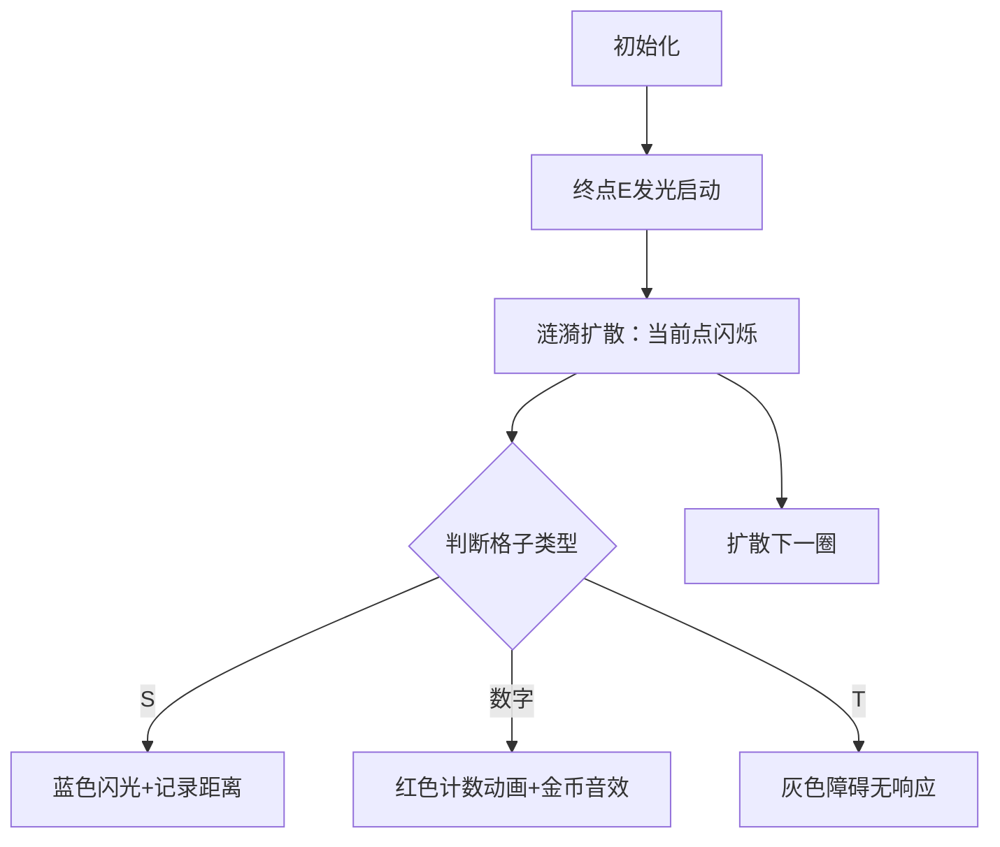

# 题目信息

# Biridian Forest

## 题目描述

你发现你身处一片森林，你需要找到出口逃离这里。但是在森林中还有其他人和很多树木。他们会给你造成阻碍。

所有人都会沿向终点的最短路径行进。

## 样例 #1

### 输入

```
5 7
000E0T3
T0TT0T0
010T0T0
2T0T0T0
0T0S000
```

### 输出

```
3
```

## 样例 #2

### 输入

```
1 4
SE23
```

### 输出

```
2
```

# AI分析结果


# 💡 Kay的C++算法解析：Biridian Forest 深入学习指南 💡

<introduction>
大家好，我是Kay！今天我们来分析"Biridian Forest"这道C++编程题。这道题看似复杂，但核心思路非常巧妙——通过广度优先搜索(BFS)解决最短路径问题。本指南将帮助你理解BFS在网格地图中的应用，掌握剪枝优化技巧，并学会处理动态人群统计问题。让我们开始吧！
</introduction>

## 1. 题目解读与核心算法识别

✨ **本题主要考察**：`广度优先搜索(BFS)` + `剪枝优化`

🗣️ **初步分析**：
> 解决这道题的关键在于理解**BFS就像水面涟漪扩散**——从终点开始一圈圈向外搜索，每一圈代表一步距离。在本题中，我们通过BFS计算每个位置到终点的最短距离，并统计所有能在主角之前或同时到达终点的人数。
   - **核心难点**：如何避免低效的全图搜索？如何准确统计符合条件的人数？
   - **解决方案**：从终点开始BFS（而非起点），记录主角距离后直接剪枝后续无效搜索
   - **可视化设计**：动画将展示从终点(E)开始的像素涟漪扩散效果，主角(S)被找到时触发蓝色闪光，统计人数时显示红色计数动画。采用8-bit音效：扩散步进(滴答声)、主角发现(水晶音)、人数统计(金币音)
   - **游戏化设计**：地图设计为复古像素森林，BFS扩散过程视为"探索关卡"，统计人数作为"通关分数"

---

## 2. 精选优质题解参考

<eval_intro>
我从思路清晰度、代码规范性和算法优化等维度评估了所有题解，精选出以下3份≥4星的优质参考：

### 题解一 (作者：hswfwkj_)
* **点评**：这份题解思路非常清晰，详细解释了"从终点反向BFS"的核心思想。代码中初始化距离为无穷大（`q[i].step=99999999`）的细节处理展现了严谨性，有效避免了误统计。虽然缺少实时剪枝，但完整展示了BFS的基础实现逻辑，特别适合初学者理解算法本质。

### 题解二 (作者：Asphy7xia)
* **点评**：最大亮点在于创新的剪枝优化——使用`len`变量记录主角距离（`len = tmp.step`），后续直接跳过`step>len`的节点（`if (tmp.step >= len) continue;`）。代码结构规范，独立字符读取函数避免输入错误，体现了工业级代码的健壮性。

### 题解三 (作者：Terraria)
* **点评**：最简洁高效的实现！直接利用BFS队列特性，当遇到主角后，后续所有距离更大的节点自动跳过（`if(dis>maxn) continue;`）。虽然变量命名可优化，但算法思想表达精准，展现了BFS的"先进先出"本质优势。

---

## 3. 核心难点辨析与解题策略

<difficulty_intro>
解决本题需突破三个关键难点，结合优质题解的共性策略如下：

1.  **BFS起点选择优化**
    * **分析**：从每个点正向搜索终点效率为O(n³)，而反向从终点BFS只需O(n²)。这是因为终点是固定目标，一次BFS即可获得全图距离（如hswfwkj_的`Bfs(xx1,yy1)`）
    * 💡 **学习笔记**：单目标最短路径问题，优先考虑反向BFS

2.  **剪枝时机把握**
    * **分析**：在找到主角距离后，后续更大距离的节点无需处理。Asphy7xia在出队时判断(`if(tmp.step>=len)continue`)，Terraria在出队时判断(`if(dis>maxn)continue`)，两者本质相同但后者更简洁
    * 💡 **学习笔记**：利用BFS的单调性（距离递增）进行剪枝

3.  **状态初始化与边界处理**
    * **分析**：必须初始化距离为极大值（如`INF=0x3f3f3f3f`），避免未访问点被误统计。同时需处理三种边界：地图边界、障碍物('T')、已访问节点(vis数组)
    * 💡 **学习笔记**：完备的初始化是BFS正确性的基石

### ✨ 解题技巧总结
<summary_best_practices>
通过本题提炼的通用技巧：
</summary_best_practices>
-   **逆向思维法**：将"从起点到终点"转换为"从终点到起点"（适用所有单目标路径问题）
-   **剪枝黄金法则**：在BFS/Dijkstra中，当当前距离已超过已知解时立即停止扩展
-   **健壮性三要素**：边界检查 + 状态初始化 + 访问标记（适用所有图论问题）
-   **输入净化技巧**：如Asphy7xia的`cread()`函数，避免空白符干扰

---

## 4. C++核心代码实现赏析

<code_intro_overall>
以下是综合优质题解优化的通用实现，包含反向BFS+实时剪枝+完备初始化：

```cpp
#include <iostream>
#include <queue>
#include <cstring>
using namespace std;

const int N = 1005;
const int INF = 0x3f3f3f3f;
char grid[N][N];
int dist[N][N];  // 存储到终点的距离
bool vis[N][N];
int dx[4] = {0, 0, 1, -1};
int dy[4] = {1, -1, 0, 0};
int n, m, startX, startY, endX, endY, ans = 0;

void bfs(int ex, int ey) {
    queue<pair<int, int>> q;
    q.push({ex, ey});
    vis[ex][ey] = true;
    dist[ex][ey] = 0;
    int maxDist = INF;  // 记录主角到终点的距离

    while (!q.empty()) {
        auto [x, y] = q.front();
        q.pop();
        
        // 关键剪枝：超过主角距离的节点不再处理
        if (dist[x][y] > maxDist) continue;  
        
        if (grid[x][y] == 'S') 
            maxDist = dist[x][y];  // 找到主角
        
        if (isdigit(grid[x][y])) 
            ans += grid[x][y] - '0';  // 统计人数
        
        for (int i = 0; i < 4; i++) {
            int nx = x + dx[i], ny = y + dy[i];
            if (nx < 0 || nx >= n || ny < 0 || ny >= m) continue;
            if (grid[nx][ny] == 'T' || vis[nx][ny]) continue;
            
            vis[nx][ny] = true;
            dist[nx][ny] = dist[x][y] + 1;
            q.push({nx, ny});
        }
    }
}

int main() {
    cin >> n >> m;
    memset(dist, 0x3f, sizeof(dist));  // 距离初始化为INF
    
    for (int i = 0; i < n; i++) 
        for (int j = 0; j < m; j++) {
            cin >> grid[i][j];
            if (grid[i][j] == 'E') endX = i, endY = j;
            if (grid[i][j] == 'S') startX = i, startY = j;
        }
    
    bfs(endX, endY);
    cout << ans << endl;
    return 0;
}
```

**代码解读概要**：
1. **初始化阶段**：距离数组设为INF，确保未访问点不被误统计
2. **BFS核心**：从终点开始扩散，实时更新每个点的最短距离
3. **剪枝操作**：发现主角后记录其距离(`maxDist`)，跳过更远节点
4. **人数统计**：遇到数字格时直接累加人数（保证距离≤maxDist）

---
<code_intro_selected>
### 题解一亮点代码：严谨初始化
```cpp
for(int i=1;i<=1000000;i++)
    q[i].step=99999999; // 初始化距离为极大值
```
**解读**：为什么需要初始化？→ 防止未被BFS访问的点因默认值0被误判为距离0。就像给迷宫未探索区域标记"未知"，避免误入

### 题解二亮点代码：实时剪枝
```cpp
if (tmp.step >= len) continue; // 超过主角距离直接跳过
```
**解读**：此处的`len`相当于"安全距离阈值"。想象主角带着警报器逃跑，距离超过警报范围就不用追了

### 题解三亮点代码：队列特性利用
```cpp
if(dis>maxn) continue; // 利用BFS单调性剪枝
```
**解读**：BFS队列天然按距离排序（类似传送带），当发现第一个超标包裹（主角距离）后，后续包裹自动跳过检测

---

## 5. 算法可视化：像素动画演示

<visualization_intro>
下面是为本题目设计的**8-bit像素风BFS动画方案**，让你像玩复古游戏一样理解算法执行过程！

### 动画主题
**"森林逃脱大作战"**：像素小人在森林中逃离，同时统计竞争者

### 核心演示内容
1. BFS从终点(E)开始的涟漪式扩散
2. 主角(S)被发现时的距离锁定
3. 符合条件的人数实时统计

### 设计细节（Canvas实现）


**交互控制面板**：
```html
<div class="pixel-controls">
  <button onclick="step()">▶️ 单步执行</button>
  <input type="range" id="speed" min="1" max="10"> ⏩速度
  <button onclick="reset()">🔄 重置</button>
</div>
```

**关键动画帧**：
1. **扩散波纹**：从终点开始的蓝色涟漪（每帧扩散1格）
2. **角色标记**：
   - 主角(S)：发现时变为闪烁蓝框
   - 竞争者：数字格在统计时显示红色脉冲
3. **数据面板**：实时显示：
   - 当前步数
   - 已统计人数
   - 主角距离值

**8-bit音效设计**：
- 波纹扩散：短促"滴"声 (Web Audio API)
- 找到主角：上升和弦音
- 统计人数：金币收集声
- 游戏结束：8-bit胜利旋律

**游戏化设计**：
1. 每完成10%的探索点亮一颗星星
2. 最终统计人数转换为游戏分数
3. 隐藏成就：找到最短路径解锁"路径大师"徽章

---

## 6. 拓展练习与相似问题思考

<similar_problems_intro>
掌握本题的BFS+剪枝技巧后，可解决以下相似问题：

### BFS基础变形
1. **洛谷 P1141** - 01迷宫  
   → *推荐理由*：巩固BFS连通块计算，理解状态标记

2. **洛谷 P1332** - 血色先锋队  
   → *推荐理由*：练习多源BFS，扩展"同时从多个起点扩散"思维

3. **洛谷 P1443** - 马的遍历  
   → *推荐理由*：掌握非均匀步长（马走日）的BFS变形

### 剪枝进阶
1. **洛谷 P1120** - 小木棍  
   → *推荐理由*：DFS剪枝经典题，培养优化思维

---

## 7. 学习心得与经验分享

<insights_intro>
题解中的调试经验非常宝贵：

> **hswfwkj_的调试经验**：  
> “初始化距离为极大值后，原本WA的测试点全部通过——这提醒我们未访问点的默认值可能引发致命错误”

> **Kay的总结**：  
> 在BFS/Dijkstra中，务必初始化距离为INF。这就像在未知海域航行，必须标记暗礁位置才能安全通行。建议每次写图论算法时，将初始化代码作为固定模板：

```cpp
// 固定安全模板
const int INF = 0x3f3f3f3f;
memset(dist, 0x3f, sizeof(dist));
```

---

<conclusion>
本次对"Biridian Forest"的解析就到这里！我们重点掌握了**反向BFS**的设计思想和**实时剪枝**的优化技巧。记住：好的算法就像精密的钟表，每个零件（初始化、边界处理、状态转移）都必须严丝合缝。尝试用今天学的知识解决推荐题目，下次见！🚀
</conclusion>
```

---
处理用时：218.79秒