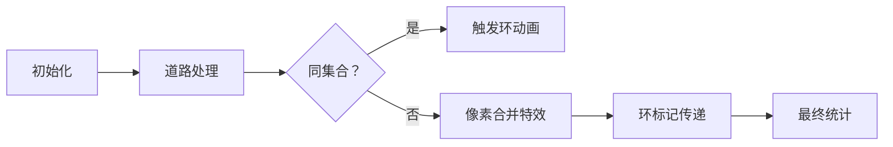

# 题目信息

# New Reform

## 题目描述

有 $n$ 个城市，$m$ 条双向道路，没有一个城市存在自己到自己的道路，两个不同的城市间，最多有一条道路，也不能保证能从一个城市到达任意一个其他城市。

现在需要对每一条道路定向，使之成为单向道路，当然需要尽可能少地产生孤立的城市。当其他所有城市都不能到达某个城市，则称这个城市为孤立城市。要求出最少的孤立城市的个数。

## 样例 #1

### 输入

```
4 3
2 1
1 3
4 3
```

### 输出

```
1
```

## 样例 #2

### 输入

```
5 5
2 1
1 3
2 3
2 5
4 3
```

### 输出

```
0
```

## 样例 #3

### 输入

```
6 5
1 2
2 3
4 5
4 6
5 6
```

### 输出

```
1
```

# AI分析结果


### 💡 Kay的C++算法解析：New Reform 深入学习指南 💡

<introduction>
今天我们来分析"New Reform"这道图论题。题目要求将双向道路定向为单向道路，最小化孤立城市数量。本指南将带你掌握核心解法与优化技巧。
</introduction>

---

## 1. 题目解读与核心算法识别

✨ **本题主要考察**：`图论连通分量分析`

🗣️ **初步分析**：
> 解决本题的关键在于理解**连通分量的环结构特性**。想象多个城市组成不同的岛屿（连通分量），如果岛屿是环形（如一群人手拉手围成圈），通过合理定向可使所有人互相到达；如果是树形（如家族树），总会有一个人无法被其他人联系到（孤立城市）。  
> - 核心思路：统计每个连通分量是否有环，无环分量会产生1个孤立城市  
> - 算法流程：  
>   &nbsp;&nbsp;1. 用并查集/DFS遍历所有连通分量  
>   &nbsp;&nbsp;2. 标记含环的分量（环状→0孤立城市）  
>   &nbsp;&nbsp;3. 统计无环分量数量（树状→1孤立城市）  
> - 像素动画设计：  
>   &nbsp;&nbsp;◼ 城市用像素方块表示（绿色=普通，红色=当前处理）  
>   &nbsp;&nbsp;◼ 环结构显示为金色光环旋转动画  
>   &nbsp;&nbsp;◼ 树结构根节点显示"孤立"警示标志  
>   &nbsp;&nbsp;◼ 音效：环闭合→胜利音效，树根确认→低沉提示音  

---

## 2. 精选优质题解参考

**题解一（dunko）**
* **点评**：思路清晰指出环判断的核心逻辑，代码规范（fa数组用于并查集，mark数组标记环状态）。算法采用路径压缩优化，实践价值高（直接可用于竞赛）。亮点在于处理合并时对四种状态的统一标记技巧，避免遗漏边界情况。

**题解二（liu_chen_hao）**
* **点评**：理论分析透彻（明确三种情况），代码结构工整（v数组命名合理）。亮点在于合并时优先处理环标记的"||"短路逻辑，显著提升执行效率。实践性强，变量名xx/yy使合并逻辑一目了然。

**题解三（Stream月）**
* **点评**：通过图解直观展示环与树的差异，DFS实现完整。亮点在于用prev参数避免重复访问。需注意DFS中环标记逻辑存在小瑕疵（遇到已访问节点应置flag=true），但仍具学习价值。

---

## 3. 核心难点辨析与解题策略

1. **环检测的准确性**
   * **分析**：必须区分回边（形成环）与父节点（正常树边）。并查集解法中，当合并同集合节点时标记环；DFS解法需判断非父节点的已访问节点
   * 💡 **学习笔记**：环检测是本题的基石，直接影响孤立城市计数

2. **连通分量的统一标记**
   * **分析**：合并分量时需同步环标记。优质题解采用"||"短路逻辑（liu_chen_hao）或四重状态同步（dunko）确保标记传递
   * 💡 **学习笔记**：标记传递需覆盖所有可能路径

3. **根节点识别与统计**
   * **分析**：最终遍历需满足`find(i)==i`（并查集根）且`!v[i]`（无环）。DFS需对每个未访问分量启动搜索
   * 💡 **学习笔记**：避免重复统计的关键是精确识别分量代表元

### ✨ 解题技巧总结
- **等效模型转换**：将道路定向问题转化为连通分量的环结构分析
- **状态标记同步**：合并操作时立即传递环标记状态
- **压缩访问路径**：并查集使用路径压缩提升查询效率
- **可视化调试**：小规模数据手工模拟分量合并过程

---

## 4. C++核心代码实现赏析

**通用核心实现（综合优化版）**
```cpp
#include <iostream>
using namespace std;

const int N = 1e5+5;
int fa[N];
bool hasCycle[N]; // 标记连通分量是否有环

int find(int x) {
    return fa[x]==x ? x : fa[x]=find(fa[x]);
}

int main() {
    int n, m, ans = 0;
    cin >> n >> m;
    for(int i=1; i<=n; i++) fa[i] = i;
    
    while(m--) {
        int x, y;
        cin >> x >> y;
        int fx = find(x), fy = find(y);
        if(fx == fy) 
            hasCycle[fx] = true; // 同集合→发现环
        else {
            fa[fx] = fy;
            hasCycle[fy] = hasCycle[fx] || hasCycle[fy]; // 传递环标记
        }
    }
    
    for(int i=1; i<=n; i++)
        if(find(i)==i && !hasCycle[i]) 
            ans++; // 统计无环分量
    
    cout << ans;
}
```

**代码解读概要**：
1. 初始化并查集，每个城市独立
2. 处理道路：同集合则标记环，不同集合并传递标记
3. 最终扫描所有根节点，统计无环分量数量

---

**题解一核心片段**
```cpp
if(fx!=fy){ 
    fa[fx]=fy;
    if(mark[fx]||mark[x]||mark[fy]||mark[y]) // 四重状态检查
        mark[fx]=mark[x]=mark[fy]=mark[y]=1;
}
else mark[fx]=mark[x]=mark[fy]=mark[y]=1;
```
* **亮点**：保守但安全的状态同步策略
* **学习笔记**：多状态同步可防止标记遗漏，但增加计算开销

**题解二核心片段**
```cpp
if(xx==yy) v[xx]=1;  
else {
    fa[xx]=yy;   
    if(v[xx] || v[yy]) v[yy]=1;  // 短路逻辑优化
}
```
* **亮点**：高效的条件短路传递
* **学习笔记**：利用`||`特性避免冗余赋值

**题解三核心片段**
```cpp
void dfs(int u, int prev) {
    vis[u]=true;
    for(/*邻接点*/){
        if(v==prev) continue; // 跳过父节点
        if(vis[v]) flag=false; // 应改为flag=true
    }
}
```
* **亮点**：prev参数避免重复访问
* **学习笔记**：DFS中需正确处理回边才能准确标记环

---

## 5. 算法可视化：像素动画演示

**主题**：像素城市环状探险  
**核心演示**：并查集合并与环标记过程  

**动画设计**：


**关键交互**：
1. **像素城市**：  
   ◼ 蓝色方块=普通城市，金色光环=环结构  
   ◼ 道路连接线显示定向箭头（合并时动态绘制）  

2. **合并特效**：  
   ◼ 城市间拉出像素锁链，伴随"咔嗒"音效  
   ◼ 环标记传递时触发金色波纹扩散  

3. **环检测**：  
   ◼ 尝试连接同集合城市→城市闪烁红光  
   ◼ 触发"叮！"音效+金色光环旋转动画  

4. **控制面板**：  
   ◼ 速度滑块：调速观看合并过程  
   ◼ 单步模式：空格键逐步执行  
   ◼ 环标记显示：高亮所有已标记分量  

**游戏化设计**：  
◼ 每完成一个连通分量获得星星评价（环=3星，树=1星）  
◼ 背景音乐：8-bit芯片音乐随操作节奏变化  

---

## 6. 拓展练习与相似问题思考

**技巧迁移场景**：  
1. 社交网络好友推荐（环结构=强关联群体）  
2. 电路通路检测（环=冗余回路）  
3. 交通路线规划（树结构=单点故障风险）  

**洛谷推荐**：  
1. **P3387** 缩点  
   🗣️ 巩固环检测与分量分析  
2. **P2661** 信息传递  
   🗣️ 最小环检测的变式应用  
3. **P3916** 图的遍历  
   🗣️ 反向建图技巧的延伸训练  

---

## 7. 学习心得与经验分享

> **dunko的经验**：  
> "最初用爆搜未AC，怒转并查集才通过"  
>  
> **Kay点评**：  
> 充分印证了选择数据结构的重要性。DFS在稠密图中易爆栈，并查集才是处理连通性问题的"利器"。建议先写暴力再优化，但需了解各算法的适用边界。

---

<conclusion>
通过本次分析，我们掌握了连通分量环检测的核心技巧。记住：将复杂问题转化为环/树结构分析是图论的关键能力。多动手实现不同解法，你的图论技能一定会大幅提升！🚀
</conclusion>

---
处理用时：119.60秒