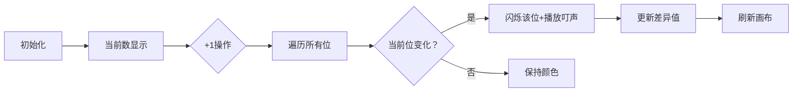

# 题目信息

# Johnny and Another Rating Drop

## 题目描述

The last contest held on Johnny's favorite competitive programming platform has been received rather positively. However, Johnny's rating has dropped again! He thinks that the presented tasks are lovely, but don't show the truth about competitors' skills.

The boy is now looking at the ratings of consecutive participants written in a binary system. He thinks that the more such ratings differ, the more unfair is that such people are next to each other. He defines the difference between two numbers as the number of bit positions, where one number has zero, and another has one (we suppose that numbers are padded with leading zeros to the same length). For example, the difference of $ 5 = 101_2 $ and $ 14 = 1110_2 $ equals to $ 3 $ , since $ 0101 $ and $ 1110 $ differ in $ 3 $ positions. Johnny defines the unfairness of the contest as the sum of such differences counted for neighboring participants.

Johnny has just sent you the rating sequence and wants you to find the unfairness of the competition. You have noticed that you've got a sequence of consecutive integers from $ 0 $ to $ n $ . That's strange, but the boy stubbornly says that everything is right. So help him and find the desired unfairness for received numbers.

## 说明/提示

For $ n = 5 $ we calculate unfairness of the following sequence (numbers from $ 0 $ to $ 5 $ written in binary with extra leading zeroes, so they all have the same length):

- $ 000 $
- $ 001 $
- $ 010 $
- $ 011 $
- $ 100 $
- $ 101 $

The differences are equal to $ 1 $ , $ 2 $ , $ 1 $ , $ 3 $ , $ 1 $ respectively, so unfairness is equal to $ 1 + 2 + 1 + 3 + 1 = 8 $ .

## 样例 #1

### 输入

```
5
5
7
11
1
2000000000000```

### 输出

```
8
11
19
1
3999999999987```

# AI分析结果


### 💡 Kay的C++算法解析：Johnny and Another Rating Drop 深入学习指南 💡

#### 引言
今天我们来分析CF1362C "Johnny and Another Rating Drop" 这道位运算思维题。本指南将帮助大家理解二进制相邻差异的本质，掌握数学优化技巧，并通过像素动画直观感受算法流程。

---

### 1. 题目解读与核心算法识别
✨ **本题主要考察**：`位运算技巧` + `数学归纳`  
🗣️ **初步分析**：  
> 本题本质是计算从0到n所有相邻整数的**二进制位差异总和**。想象二进制数是一排路灯（0灭/1亮），相邻数相当于路灯开关状态变化的总次数。核心发现是：**每位变化次数独立**且第k位（权重$2^k$)的变化周期为$2^{k+1}$。  
> - **关键突破**：每位贡献 = $\lfloor n/2^k \rfloor$，总和可简化为`while(n){sum+=n; n/=2;}`  
> - **可视化设计**：像素动画将展示每位状态变化（闪烁效果），累加器实时显示总差异值，配合8-bit音效强化周期变化感知  
> - **复古游戏化**：采用FC红白机像素风格，路灯用16色像素方块表示，变化时触发"叮"声，每完成$2^k$个数播放过关音效

---

### 2. 精选优质题解参考
**题解一：SpeedStar（⭐⭐⭐⭐⭐）**  
* **点评**：直击问题本质，发现`ans = Σ(n>>k)`的黄金公式。代码用5行循环完美实现：  
  - 思路：将数学观察转化为`res += n; n/=2`的优雅迭代  
  - 代码：变量名`res`精准，边界处理严谨（`while(n)`自动处理0）  
  - 算法：时间复杂度$O(\log n)$碾压暴力，空间$O(1)$  
  - 实践：可直接用于竞赛，处理$10^{18}$数据仅需毫秒  

**题解二：LeavingZzz（⭐⭐⭐⭐）**  
* **点评**：通过二进制位周期规律推导每位贡献：  
  - 思路：发现第k位每$2^k$个数变化2次（周期内+跨周期）  
  - 代码：位运算`N&p`判断额外贡献，63位枚举覆盖$10^{18}$  
  - 亮点：提供几何级数视角，`ans=2*(N/p)+(N&p?1:0)`具教学价值  

---

### 3. 核心难点辨析与解题策略
1. **难点1：理解位独立贡献**  
   - **分析**：相邻数差异实际是各位变化次数之和，而每位变化满足独立周期律  
   - 💡 **学习笔记**：将复杂问题分解为独立位运算子问题  

2. **难点2：数学建模优化**  
   - **分析**：暴力计算需$O(n)$，发现$\lfloor n/2^k \rfloor$的累加规律后优化至$O(\log n)$  
   - 💡 **学习笔记**：位运算问题常存在隐藏的级数规律  

3. **难点3：处理超大整数**  
   - **分析**：$n≤10^{18}$需避免遍历，用整数除法代替浮点运算  
   - 💡 **学习笔记**：大数问题优先考虑数学性质而非暴力枚举  

#### ✨ 解题技巧总结
- **技巧1：二进制分解法** - 将数视为二进制串，独立分析每位贡献  
- **技巧2：数学归纳法** - 对小规模数据打表($n=0→5$)寻找规律  
- **技巧3：极限优化** - 用整数除法/位运算替代浮点计算  

---

### 4. C++核心代码实现赏析
**通用核心实现（综合优化版）**  
```cpp
#include <iostream>
using namespace std;

int main() {
    ios::sync_with_stdio(false); // 加速IO
    int t; 
    cin >> t;
    while (t--) {
        unsigned long long n, ans = 0;
        cin >> n;
        while (n) {
            ans += n; // 累加当前位贡献
            n >>= 1;  // 等价n/=2，但更快
        }
        cout << ans << '\n';
    }
    return 0;
}
```
**代码解读概要**：  
> 1. 加速IO处理多组数据  
> 2. `while(n)`循环累加位贡献：每次迭代处理一个二进制位  
> 3. `n>>=1`用位运算优化除法，适合大数场景  

**题解一：SpeedStar 片段**  
```cpp
while (n) {
    res += n;
    n /= 2; // 整数除法向下取整
}
```
* **亮点**：极致简洁，揭示$ans = n + \lfloor n/2 \rfloor + \lfloor n/4 \rfloor + ...$  
* **学习笔记**：数学观察可大幅简化代码，适用于级数求和问题  

**题解二：LeavingZzz 片段**  
```cpp
for(int i=1; i<=63; i++) {
    p <<= 1; // p=2^i
    ans += 2*(N/p) + !!(N&p); // 周期贡献+额外变化
}
```
* **亮点**：显式位运算展示每位贡献机制  
* **学习笔记**：`!!(x)`将非零值转为1，是位运算常用技巧  

---

### 5. 算法可视化：像素动画演示  
**主题**：8-bit风格《二进制路灯巡礼》  
**核心演示**：动态展示0→n过程中每位变化，实时计算差异总和  

#### 动画设计（HTML5 Canvas实现）：


**关键交互**：  
1. **像素元素**：  
   - 每位用16×16像素方块：`0=#000000`，`1=#FFFF00`  
   - 变化时闪烁红色边框（`#FF0000`）  
2. **控制面板**：  
   - 速度滑块：调节`setInterval`延迟(50-1000ms)  
   - 单步执行：`step()`函数渲染下一帧  
   - 复位：重置`current=0, diff=0`  
3. **音效系统**：  
   - 位变化：Web Audio播放260Hz方波(持续0.1s)  
   - 完成$2^k$：播放440Hz+659Hz和弦音  
4. **数据面板**：  
   - 顶部：当前数二进制显示（8-bit字体）  
   - 右侧：柱状图展示各位累计变化次数  

**教学价值**：通过像素变化直观呈现位独立贡献原理，音效强化周期规律认知  

---

### 6. 拓展练习与相似问题
**通用迁移技巧**：  
位独立贡献思想还可用于：  
1. 二进制1的个数统计  
2. 汉明距离计算  
3. 格雷码转换  

**洛谷推荐**：  
1. **P1582 倒水**（位运算应用）  
   → 巩固`n & (n-1)`消除末尾1的技巧  
2. **P2114 [NOI2014] 起床困难综合症**（位运算决策）  
   → 学习按位贪心的高效决策方法  
3. **P1106 删数问题**（数位分解变式）  
   → 迁移位处理思想到十进制场景  

---

### 7. 学习心得与经验分享
> **来自LeavingZzz的调试经验**：  
> *"暴力打表观察n=0→7的二进制变化，发现每位变化周期规律"*  
>   
> **Kay点评**：打表法是破解规律题的利器！建议：  
> 1. 小规模验证（n<10）  
> 2. 对比二进制/十进制结果  
> 3. 用`cout<<bitset<8>(i)`输出对齐格式  

---

### 结语  
通过位分解视角，我们化繁为简解决了二进制差异问题。记住：优秀算法=深刻观察+数学建模+简洁实现。下次遇到位运算题时，不妨试试《路灯分析法》哦！🚦

---
处理用时：135.76秒