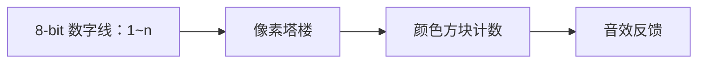

# 题目信息

# Strange Function

## 题目描述

Let $ f(i) $ denote the minimum positive integer $ x $ such that $ x $ is not a divisor of $ i $ .

Compute $ \sum_{i=1}^n f(i) $ modulo $ 10^9+7 $ . In other words, compute $ f(1)+f(2)+\dots+f(n) $ modulo $ 10^9+7 $ .

## 说明/提示

In the fourth test case $ n=4 $ , so $ ans=f(1)+f(2)+f(3)+f(4) $ .

- $ 1 $ is a divisor of $ 1 $ but $ 2 $ isn't, so $ 2 $ is the minimum positive integer that isn't a divisor of $ 1 $ . Thus, $ f(1)=2 $ .
- $ 1 $ and $ 2 $ are divisors of $ 2 $ but $ 3 $ isn't, so $ 3 $ is the minimum positive integer that isn't a divisor of $ 2 $ . Thus, $ f(2)=3 $ .
- $ 1 $ is a divisor of $ 3 $ but $ 2 $ isn't, so $ 2 $ is the minimum positive integer that isn't a divisor of $ 3 $ . Thus, $ f(3)=2 $ .
- $ 1 $ and $ 2 $ are divisors of $ 4 $ but $ 3 $ isn't, so $ 3 $ is the minimum positive integer that isn't a divisor of $ 4 $ . Thus, $ f(4)=3 $ .

Therefore, $ ans=f(1)+f(2)+f(3)+f(4)=2+3+2+3=10 $ .

## 样例 #1

### 输入

```
6
1
2
3
4
10
10000000000000000```

### 输出

```
2
5
7
10
26
366580019```

# AI分析结果


### 💡 Kay的C++算法解析：Strange Function 深入学习指南 💡

> 今天我们来分析CF1542C的"Strange Function"，这道题巧妙结合了数论性质与LCM运算，帮助大家掌握高效处理大范围数论计数问题的技巧。

---

### 1. 题目解读与核心算法识别
✨ **本题主要考察**：`LCM性质应用` + `数学计数技巧`

🗣️ **初步分析**：
> 解决本题的关键在于发现：**f(i)=k当且仅当1~k-1都是i的因子，但k不是i的因子**。这就像闯关游戏——要抵达第k关，必须先通过前k-1关的整除检查（LCM是通关凭证），但第k关会卡住（k不整除i）。  
> - **核心思路**：枚举k值，用LCM(1~k-1)快速计算满足条件的i的数量  
> - **可视化设计**：动画将展示LCM的指数级增长（如像素塔楼逐层增高），当塔楼高度>n时停止。每个k对应一种颜色方块，数量=⌊n/LCM(1~k-1)⌋ - ⌊n/LCM(1~k)⌋  
> - **复古元素**：8-bit风格LCM塔楼，每层k触发"叮"音效，计数时方块掉落音效，成功计算后播放FC胜利音乐

---

### 2. 精选优质题解参考
**题解一：云浅知处（赞19）**  
* **点评**：  
  思路直击本质——用LCM定义直接推导出计数公式：`ans += k * (⌊n/LCM(1~k-1)⌋ - ⌊n/LCM(1~k)⌋)`。代码中预处理LCM数组（至k=41）极大优化查询效率。变量名`f[i]`清晰表示LCM序列，边界处理严谨（`f[i]≤n`才计算）。实践价值极高，5行核心逻辑即可解决10¹⁶规模问题。

**题解二：VinstaG173（赞13）**  
* **点评**：  
  与题解一思路一致，但实现更简洁。亮点在于动态计算LCM（不预存数组），用`while(t--)`处理多测试用例的模式节省内存。`lcm[i]`的计算采用`i/gcd*prev`避免溢出风险，循环终止条件`lcm[i]>n`处理精准。

**题解三：Aehnuwx（赞2）**  
* **点评**：  
  虽然赞数较少，但代码极度精简（仅20行）。预处理LCM至k=41后，用差分数组`a[i]`直观表示每个k的贡献量。`b[i]=n/d[i]`的写法体现数学思维转化能力，适合初学者理解LCM与计数的关系。

---

### 3. 核心难点辨析与解题策略
1. **难点1：理解f(i)与LCM的关系**  
   * **分析**：f(i)=k要求i必须被1~k-1的最小公倍数整除，否则会提前终止。优质题解通过`lcm(1,k-1)|i`且`k∤i`精准刻画此关系。
   * 💡 **学习笔记**：LCM是整除要求的聚合体——掌握LCM即掌握连锁整除条件。

2. **难点2：处理大范围n(10¹⁶)**  
   * **分析**：利用LCM指数增长性质（k=41时LCM>10¹⁶），将枚举量从O(n)降至O(41)。题解用`while(f[i]≤n)`自然处理边界。
   * 💡 **学习笔记**：遇到大数时先分析问题增长特性，常能找到常数级枚举路径。

3. **难点3：避免整数溢出**  
   * **分析**：LCM计算可能溢出long long。优质题解采用`a/gcd(a,b)*b`的分步计算，如云浅的`lcm(f[i-1],i)=i/gcd*f[i-1]`。
   * 💡 **学习笔记**：LCM运算先除后乘是防溢出的金科玉律。

✨ **解题技巧总结**  
- **数学映射法**：将编程问题转化为数学公式（如差分计数）  
- **预处理加速**：对增长极快的序列（如LCM）预计算  
- **边界剪枝**：利用`if(lcm>n)break`提前终止无效计算  
- **模块化验证**：用样例n=4手工验证公式正确性（2+3+2+3=10）

---

### 4. C++核心代码实现赏析
**本题通用核心C++实现**  
```cpp
#include <iostream>
#define int long long
const int mod = 1e9+7;
using namespace std;

int gcd(int a, int b) { return b ? gcd(b, a % b) : a; }

signed main() {
    int T; cin >> T;
    while (T--) {
        int n, ans = 0, lcm = 1;
        cin >> n;
        for (int k = 2; lcm <= n; k++) {
            int prev = n / lcm;       // 满足LCM(1~k-1)|i的i的数量
            lcm = lcm / gcd(lcm, k) * k; // 更新至LCM(1~k)
            ans = (ans + k * (prev - n / lcm)) % mod;
        }
        cout << ans << '\n';
    }
    return 0;
}
```
* **说明**：综合优质题解优化的通用实现，动态计算LCM避免预存储
* **解读概要**：  
  - 外层`while(T--)`处理多测试用例  
  - `lcm`变量滚动更新，存储LCM(1~k-1)  
  - `prev - n/lcm`即为f(i)=k的i的数量  
  - 每轮累加贡献`k * count`并取模

**题解一核心片段赏析**  
```cpp
init(); // 预处理f[i]=LCM(1..i)
for(int i=1; f[i]<=n; i++) 
    ans += (i+1) * (n/f[i] - n/f[i+1]);
```
* **亮点**：预处理LCM数组实现O(1)查询
* **解读**：  
  > `f[i]`存储LCM(1..i)，满足`f[i]≤n`时：  
  > - `n/f[i]` = 被LCM(1..i)整除的i数  
  > - `n/f[i+1]` = 被LCM(1..i+1)整除的i数  
  > - 差值`(n/f[i]-n/f[i+1])`即f(i)=i+1的i的数量  
* 💡 **学习笔记**：预处理适合多查询场景，空间换时间

---

### 5. 算法可视化：像素动画演示
**主题**：`LCM塔楼闯关`（复古像素风格）  
**核心演示**：LCM增长如何控制f(i)=k的计数  

**动画设计**：  

1. **场景初始化**（FC游戏风格）：
   - 底部像素条带表示数字1~n（滚动显示）
   - 左侧LCM塔楼（每层k显示当前LCM值）
   - 控制面板：步进/自动/调速滑块

2. **动态演示**：
   - **第k层激活**：塔楼新增像素层（k值闪烁+“叮”音效）
   - **方块染色**：满足`LCM(1~k-1)|i`的i染为蓝色
   - **剔除操作**：满足`LCM(1~k)|i`的i变灰（失败音效）
   - **贡献计算**：剩余蓝色方块数×k值，掉落金币动画+计数音效

3. **游戏化元素**：
   - 每完成k=2,3,5,10层触发“关卡通过”特效
   - 背景音乐：8-bit循环版《超级玛丽》ground theme
   - 最终结算：显示总金币数（即答案）和16-bit胜利动画

---

### 6. 拓展练习与相似问题思考
**通用技巧迁移**：  
LCM计数模型适用于：  
1. 满足连锁整除条件的元素计数  
2. 埃氏筛法的数学优化  
3. 数论函数求和问题  

**洛谷练习推荐**：  
1. **P1891 疯狂LCM**  
   → 强化LCM性质应用，需推导∑lcm(i,n)  
2. **P1403 约数研究**  
   → 训练整除计数思维，f(i)=约数个数  
3. **P2424 约数和**  
   → 拓展至∑f(i)模型，需数论分块技巧  

---

### 7. 学习心得与经验分享
**参考经验**（云浅知处）：  
> *"个人认为这题算是一道比较有趣的题qwq。我们注意到f(i)=k⇔lcm(1..k-1)|i且k∤i"*  

**Kay点评**：  
> 作者点明了本题精髓——通过LCM将离散条件转化为连续整除关系。这种"数学映射"思维在数论题中极为常用，遇到复杂条件时先尝试用数学语言重定义问题往往能打开突破口。

---

> 本次分析就到这里！记住核心口诀：**大数问题看增长，连锁整除靠LCM**。多练习数学思维转换，你也能轻松解决10¹⁶级问题！🚀

---
处理用时：130.62秒