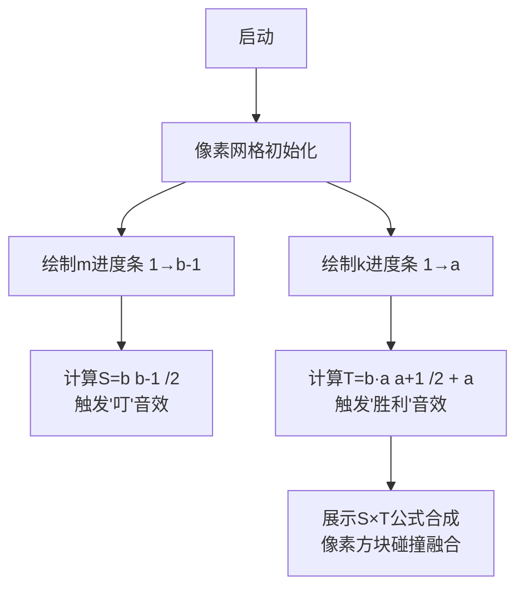

# 题目信息

# Dreamoon and Sums

## 题目描述

Dreamoon loves summing up something for no reason. One day he obtains two integers $ a $ and $ b $ occasionally. He wants to calculate the sum of all nice integers. Positive integer $ x $ is called nice if  and , where $ k $ is some integer number in range $ \[1,a\] $ .

By  we denote the quotient of integer division of $ x $ and $ y $ . By  we denote the remainder of integer division of $ x $ and $ y $ . You can read more about these operations here: http://goo.gl/AcsXhT.

The answer may be large, so please print its remainder modulo $ 1000000007 $ ( $ 10^{9}+7 $ ). Can you compute it faster than Dreamoon?

## 说明/提示

For the first sample, there are no nice integers because  is always zero.

For the second sample, the set of nice integers is $ {3,5} $ .

## 样例 #1

### 输入

```
1 1
```

### 输出

```
0
```

## 样例 #2

### 输入

```
2 2
```

### 输出

```
8
```

# AI分析结果


# 💡 Kay的C++算法解析：Dreamoon and Sums 深入学习指南 💡

**引言**  
今天我们一起分析CF476C "Dreamoon and Sums"。这道数学推导题需要巧妙转化条件，利用等差数列快速求和。本指南将解析核心思路，提供代码实现，并设计像素动画帮助理解。

---

## 1. 题目解读与核心算法识别

✨ **本题主要考察**：`数学推导与公式优化`  

🗣️ **初步分析**：  
> 这道题就像在迷宫中寻找隐藏的宝藏——我们需要通过数学变换把复杂的双重循环变成简单的乘积公式。核心思路是将题目条件 $x = m \cdot (k \cdot b + 1)$ 转化为两个等差数列的乘积：  
> - **关键变换**：通过余数$m$和参数$k$表示$x$，将双重求和拆解为 $\sum m \times \sum (kb+1)$  
> - **可视化设计**：在像素动画中，我们将用两条进度条分别展示$m$（1→b-1）和$k$（1→a）的遍历过程，最终合并为公式计算  
> - **复古元素**：采用8-bit音效——当进度条填满时播放胜利音效，公式合成时触发"叮"声  

---

## 2. 精选优质题解参考

**题解一 (来源：czh___)**  
* **点评**：思路清晰展现了问题转化过程（双重循环→公式），代码规范使用`mod`避免溢出。亮点在于用等差数列求和替代暴力循环，时间复杂度优化至$O(a)$。变量`temp`精准对应$(kb+1)$的数学含义，边界处理严谨。

**题解二 (来源：ZJle)**  
* **点评**：给出最优的$O(1)$解法和完整公式推导，代码实现最精炼。亮点在于双重化简：先将内层$m$求和转为$\frac{b(b-1)}{2}$，再对外层$k$套用等差数列公式。`long long`类型转换确保大数运算安全。

**题解三 (来源：冯老师)**  
* **点评**：提供$O(b)$解法作为过渡思路，帮助理解公式推导过程。亮点在于强调余数$r$的枚举本质，数学表达式书写规范。但需注意$b \leq 10^7$时循环可能达到性能临界点。

---

## 3. 核心难点辨析与解题策略

1. **条件转化难点**：如何从 $\frac{\lfloor x/b \rfloor}{x \bmod b}=k$ 推导出 $x=m(kb+1)$？  
   * **分析**：利用带余除法基本关系 $x = b \cdot d + m$，结合$d=k \cdot m$代入消元  
   * 💡 **学习笔记**：将复杂条件分解为基本数学元件是解题突破口

2. **求和优化难点**：如何处理双重循环 $\sum_{k=1}^a \sum_{m=1}^{b-1} m(kb+1)$？  
   * **分析**：交换求和顺序，内层$m$求和转为等差数列$\frac{b(b-1)}{2}$，外层$k$求和转为$b \cdot \frac{a(a+1)}{2} + a$  
   * 💡 **学习笔记**：分离变量是化简多重求和的核心技巧

3. **大数运算难点**：如何避免 $10^{21}$ 级别溢出？  
   * **分析**：每步运算后取模，用`long long`存中间结果，优先使用乘法分配律减少大数运算  
   * 💡 **学习笔记**：在公式中尽早取模，如同给数据穿上"防爆服"

### ✨ 解题技巧总结
- **技巧1（数学建模）**：将编程问题转化为数学表达式  
- **技巧2（分离变量）**：将多重求和拆解为独立乘积项  
- **技巧3（防溢三板斧）**：`long long`存储 + 及时取模 + 化简公式  

---

## 4. C++核心代码实现赏析

**通用核心实现参考**  
```cpp
#include <iostream>
using namespace std;
const int mod = 1e9 + 7;

int main() {
    long long a, b;
    cin >> a >> b;
    long long S = b * (b - 1) / 2 % mod;       // ∑m (m∈[1,b-1])
    long long T = (a * (a + 1) / 2 % mod * b % mod + a) % mod; // ∑(kb+1)
    cout << S * T % mod;
    return 0;
}
```
* **代码解读概要**：  
  1. 计算$m$的和$S=\frac{b(b-1)}{2}$  
  2. 计算$kb+1$的和$T=b \cdot \frac{a(a+1)}{2} + a$  
  3. 输出$S \times T \mod 10^9+7$  

---

**题解一片段赏析**  
```cpp
int m = b*(b-1)/2%mod;  // ∑m
for(int i=1; i<=a; i++) {
    int temp = (i*b+1) % mod;  // (kb+1)
    ans = (ans + m*temp) % mod;
}
```
* **亮点**：清晰展现公式分步计算过程  
* **代码解读**：  
  > 外层循环遍历$k$，`temp`对应$(kb+1)$项  
  > `m`存储预先计算的$m$总和，避免内层循环  
  > 每次累加后立即取模控制数据范围  
* 💡 **学习笔记**：预先计算不变项可提升效率  

**题解二片段赏析**  
```cpp
int x = ((long long)b*(b-1)/2) % mod;          // S
int y = ((long long)a*(a+1)/2 % mod * b + a) % mod; // T
cout << (long long)x * y % mod;
```
* **亮点**：最优$O(1)$解法，无循环直接输出结果  
* **代码解读**：  
  > 将数学公式 $S \times T$ 直接代码化  
  > 通过`(long long)`强制转换避免int乘法溢出  
  > 运算链中穿插取模保持数值稳定  
* 💡 **学习笔记**：数学化简是性能优化的终极武器  

---

## 5. 算法可视化：像素动画演示

**动画演示主题**：8-bit风格"公式合成工厂"  
**核心演示内容**：展示双重循环如何转化为$S \times T$公式  

### 动画帧步骤设计：


1. **像素化控件面板**  
   - 左侧进度条：红色像素块填充表示$m$从1增长到b-1，伴随"滴答"步进音效  
   - 右侧进度条：绿色像素块填充表示$k$从1增长到a，伴随升调音阶  
   - 中央LCD屏：实时显示 $S = \sum m$ 和 $T = \sum (kb+1)$ 的计算过程

2. **关键操作可视化**  
   - 当$m$进度条填满时，像素方块聚合成$S$公式，触发"叮"声并高亮显示$\frac{b(b-1)}{2}$  
   - 当$k$进度条填满时，$T$公式以16-bit字体弹出，播放胜利音效  
   - 最终$S \times T$计算结果以金色像素爆炸动画呈现

3. **交互功能**  
   - 速度滑块：控制动画速度（1x-10x）  
   - 模式切换：对比暴力循环（慢速像素扫描）vs 公式解法（瞬时合成）  
   - 音效开关：启用/禁用操作反馈音  

---

## 6. 拓展练习与相似问题思考

**通用技巧迁移**  
本题的数学建模与公式优化技巧还可用于：  
1. 多重循环计数问题  
2. 取模运算下的数列求和  
3. 组合数学中的分离变量  

**洛谷推荐**  
1. **P2265 路障** - 考察取模运算性质  
   > 🗣️ 用余数思想转化路径计数问题  
2. **P1593 因子和** - 需要类似公式推导  
   > 🗣️ 练习将质因子分解转化为乘积公式  
3. **P2671 求和** - 双重循环优化  
   > 🗣️ 强化分离变量技巧的应用能力  

---

## 7. 学习心得与经验分享

**参考经验 (来自题解作者)**  
> "推导时卡在$x$的表达式转化，通过具体数值代入（如b=2时x=3,5）才突破瓶颈"

**点评**：  
当抽象推导受阻时，用特例验证是黄金法则。例如取$b=2$：  
- $m=1$时 $x = k\cdot2+1 = \{3,5,7...\}$  
- 验证 $\frac{\lfloor 3/2 \rfloor}{3\bmod2}=\frac{1}{1}=1$ 符合条件  
这种"用例子探路"的方法能快速检验思路正确性。

---

**结语**  
通过数学变换将复杂问题化归为基本公式，是编程与数学的美妙结合。保持好奇心，在特例验证中寻找规律，你将成为算法世界的"公式炼金师"！💪

---
处理用时：133.51秒