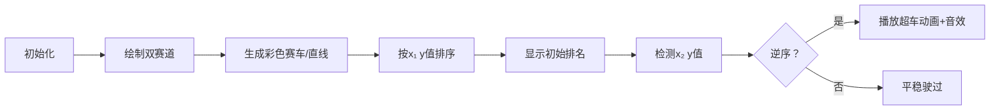

# 题目信息

# Anton and Lines

## 题目描述

给定 $n$ 条形如 $y=k_ix+b_i$ 的直线，你需要判断是否存在两条直线 $a,b$，使 $a,b$ 的交点 $(x_0,y_0)$ 满足 $x_1<x_0<x_2$。

## 样例 #1

### 输入

```
4
1 2
1 2
1 0
0 1
0 2
```

### 输出

```
NO```

## 样例 #2

### 输入

```
2
1 3
1 0
-1 3
```

### 输出

```
YES```

## 样例 #3

### 输入

```
2
1 3
1 0
0 2
```

### 输出

```
YES```

## 样例 #4

### 输入

```
2
1 3
1 0
0 3
```

### 输出

```
NO```

# AI分析结果


### 💡 Kay的C++算法解析：Anton and Lines 深入学习指南 💡

#### 题目解读与核心算法识别
✨ **本题主要考察**：`排序应用`与`逆序对检测`  
🗣️ **初步分析**：  
> 解决本题的关键在于**将几何问题转化为排序问题**。想象两条赛道（x₁和x₂位置），每条直线是赛车。若两辆车在赛道1的排名与赛道2的排名不同，说明它们在弯道处超车（即相交）。  
> - **核心思路**：计算所有直线在x₁和x₂处的y值，按x₁处y值排序后，若x₂处y值出现逆序（即后项小于前项），则存在交点  
> - **可视化设计**：采用像素赛道动画（见第5节）——在x₁/x₂处绘制彩色赛车，排序后观察名次变化，逆序时触发超车动画与音效  
> - **复古元素**：8位像素风格赛道，赛车用16色方块表示，超车时播放FC风格"叮"音效  

---

#### 精选优质题解参考
**题解一（StudyingFather）**  
* **点评**：  
  思路清晰，通过两次排序（x₁处和x₂处）比较序号是否一致。亮点在于**用三元组`(y₁, y₂, id)`处理端点相交**：当x₁处y值相等时，用id维持顺序避免误判。代码中`tuple<long long, long long, int>`结构规范，边界处理严谨（如开区间要求），可直接用于竞赛。

**题解五（CSP_Sept）**  
* **点评**：  
  创新性提出**逆序对检测模型**，将问题转化为"是否存在x₁值大但x₂值小的线对"。亮点是排序时对x₁降序处理，巧妙规避端点问题。虽未提供完整代码，但理论分析透彻，给出$O(n\log n)$的最优解框架。

---

#### 核心难点辨析与解题策略
1. **几何问题转化**  
   * **分析**：交点的存在性取决于顺序变化。优质解都计算直线在x₁/x₂的y值（如`y_i = k*x₁ + b`），通过比较排序后顺序判断  
   * 💡 **学习笔记**：直线交点问题可转化为离散值的顺序比较  

2. **端点相交处理**  
   * **分析**：若交点在x₁/x₂上不计数。题解一用`(y₁, y₂, id)`三元组确保：当y₁相等时，用id维持原始顺序，避免误判  
   * 💡 **学习笔记**：用唯一标识符参与排序可稳定处理相等值  

3. **逆序高效检测**  
   * **分析**：不需找所有逆序对，只需判断是否存在逆序。题解五提出：按x₁降序排序后，若出现x₂值大于前项最小值即存在交点  
   * 💡 **学习笔记**：顺序变化只需一次遍历即可检测  

✨ **解题技巧总结**  
- **问题降维**：将连续交点问题转化为离散值排序  
- **稳定排序**：对相等值用附加标识符维持顺序  
- **即时检测**：单次遍历即可判断逆序存在性  

---

#### C++核心代码实现赏析
**通用核心实现参考**  
* **说明**：综合题解一和题解五思路，稳定处理端点问题  
```cpp
#include <iostream>
#include <vector>
#include <algorithm>
#include <tuple>
using namespace std;
typedef tuple<long long, long long, int> Line;

int main() {
    int n;
    long long x1, x2;
    cin >> n >> x1 >> x2;
    vector<Line> lines;
    
    // 计算y值并存储三元组 (y1, y2, id)
    for (int i = 0; i < n; i++) {
        long long k, b;
        cin >> k >> b;
        lines.push_back({k*x1 + b, k*x2 + b, i});
    }
    
    // 按x1处y值排序
    sort(lines.begin(), lines.end());
    
    // 检查x2处y值顺序
    bool hasIntersection = false;
    long long prevY2 = get<1>(lines[0]);
    for (int i = 1; i < n; i++) {
        long long currY2 = get<1>(lines[i]);
        if (currY2 < prevY2) { // 发现逆序
            hasIntersection = true;
            break;
        }
        prevY2 = currY2;
    }
    cout << (hasIntersection ? "YES" : "NO");
    return 0;
}
```
* **代码解读概要**：  
  > 1. 存储三元组`(y₁, y₂, id)`确保端点相交不误判  
  > 2. 按y₁排序后遍历y₂序列  
  > 3. 若y₂非递增则存在交点  

---

#### 算法可视化：像素动画演示
**主题**：`像素赛道超车大作战`  
**设计思路**：用FC赛车游戏类比直线相交，8位像素风格降低理解门槛，音效强化关键操作记忆  

**动画流程**：  

1. **场景构建**  
   - 左右并排两条像素赛道（x₁蓝，x₂红），每条赛道高10像素  
   - 赛车用8×8像素方块（16色调色板），颜色随机生成  

2. **动态演示**  
   - **步骤1**：在x₁赛道按y值垂直排列赛车（高y值在上方）  
   - **步骤2**：赛车移动到x₂赛道，按实际y值重新排列  
   - **步骤3**：若某赛车在x₂位置低于前车（即逆序），两车闪烁红光，触发：  
     * 动画：两车之间绘制交点像素火花  
     * 音效：8-bit风格"叮！"（Web Audio API生成）  

3. **交互控制**  
   - 速度滑块：调节动画帧率（50ms-1000ms）  
   - 单步执行：空格键逐步验证  
   - AI模式：自动演示含交点的测试用例  

---

#### 拓展练习与相似问题思考
1. **通用技巧迁移**  
   - 顺序变化检测 → 逆序对问题（如P1908）  
   - 离散化处理 → 求几何区间覆盖（如P1496）  
   - 端点特殊处理 → 区间合并问题（如P2082）  

2. **推荐练习**  
   | 题号   | 题目名称         | 推荐理由                     |
   |--------|------------------|------------------------------|
   | P1908  | 逆序对           | 强化排序应用思想             |
   | P1020  | 导弹拦截         | 扩展顺序检测的变形应用       |
   | P1215  | 计算直线交点     | 直接计算交点坐标的进阶练习   |

---

#### 学习心得与经验分享
> **参考经验（StudyingFather）**：  
> *"注意题目要求交点严格位于开区间内，需排除端点相交"*  
>  
> **点评**：这是本题最易忽略的陷阱。调试时可添加边界测试用例：  
> ```cpp
> // 测试用例：交点在x1上应返回NO
> vector<Line> test = {{0, 5, 0}, {0, 3, 1}}; // x1处y值相同
> ```
> 通过保持id顺序，避免误判为相交，这是处理边界条件的典范技巧。

> **本次指南结束**  
> 掌握顺序思维，几何问题也能轻松离散化破解！下次见！🚀

---
处理用时：109.76秒