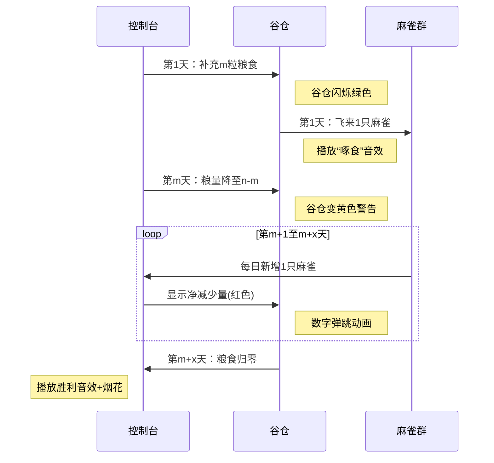

# 题目信息

# Anton and Fairy Tale

## 题目描述

Anton likes to listen to fairy tales, especially when Danik, Anton's best friend, tells them. Right now Danik tells Anton a fairy tale:

"Once upon a time, there lived an emperor. He was very rich and had much grain. One day he ordered to build a huge barn to put there all his grain. Best builders were building that barn for three days and three nights. But they overlooked and there remained a little hole in the barn, from which every day sparrows came through. Here flew a sparrow, took a grain and flew away..."

More formally, the following takes place in the fairy tale. At the beginning of the first day the barn with the capacity of $ n $ grains was full. Then, every day (starting with the first day) the following happens:

- $ m $ grains are brought to the barn. If $ m $ grains doesn't fit to the barn, the barn becomes full and the grains that doesn't fit are brought back (in this problem we can assume that the grains that doesn't fit to the barn are not taken into account).
- Sparrows come and eat grain. In the $ i $ -th day $ i $ sparrows come, that is on the first day one sparrow come, on the second day two sparrows come and so on. Every sparrow eats one grain. If the barn is empty, a sparrow eats nothing.

Anton is tired of listening how Danik describes every sparrow that eats grain from the barn. Anton doesn't know when the fairy tale ends, so he asked you to determine, by the end of which day the barn will become empty for the first time. Help Anton and write a program that will determine the number of that day!

## 说明/提示

In the first sample the capacity of the barn is five grains and two grains are brought every day. The following happens:

- At the beginning of the first day grain is brought to the barn. It's full, so nothing happens.
- At the end of the first day one sparrow comes and eats one grain, so $ 5-1=4 $ grains remain.
- At the beginning of the second day two grains are brought. The barn becomes full and one grain doesn't fit to it.
- At the end of the second day two sparrows come. $ 5-2=3 $ grains remain.
- At the beginning of the third day two grains are brought. The barn becomes full again.
- At the end of the third day three sparrows come and eat grain. $ 5-3=2 $ grains remain.
- At the beginning of the fourth day grain is brought again. $ 2+2=4 $ grains remain.
- At the end of the fourth day four sparrows come and eat grain. $ 4-4=0 $ grains remain. The barn is empty.

So the answer is $ 4 $ , because by the end of the fourth day the barn becomes empty.

## 样例 #1

### 输入

```
5 2
```

### 输出

```
4
```

## 样例 #2

### 输入

```
8 1
```

### 输出

```
5
```

# AI分析结果


### 💡 Kay的C++算法解析：Anton and Fairy Tale 深入学习指南 💡

**引言**  
今天我们来分析一道有趣的数学模拟题——"Anton and Fairy Tale"。这道题通过谷仓补粮和麻雀吃粮的童话场景，考察数学建模和高效计算能力。我们将深入解析核心算法，并设计像素动画帮助直观理解。

---

## 1. 题目解读与核心算法识别  
✨ **本题主要考察**：`数学推导` + `二分查找`  

🗣️ **初步分析**：  
> 解决本题的关键在于**分阶段建模**。想象谷仓是个有漏洞的水池：前`m`天水位保持稳定（每日补满），之后水位以递增速度下降（麻雀越来越多）。核心难点是找到水位归零的临界点。  
> - **题解思路**：分两种情况：①若初始粮量≤日补量(`n≤m`)，第`n`天直接吃空；②否则前`m`天粮量线性减少，之后剩余粮量需满足等差数列求和公式。  
> - **算法流程**：  
>   ```mermaid  
>   graph LR
>   A[输入n,m] --> B{n≤m?}
>   B -->|是| C[输出n]
>   B -->|否| D[计算剩余量 k=n-m]
>   D --> E[解不等式 x(x+1)/2 ≥ k]
>   E --> F[二分查找最小x]
>   F --> G[输出m+x]
>   ```  
> - **像素动画设计**：采用8位农场模拟风格，谷仓用像素方块堆叠表示，麻雀用像素小鸟飞入动画。关键帧高亮：  
>   - 前`m`天：补粮时谷仓闪烁绿色，吃粮时对应麻雀数量飞走  
>   - 后期：净减少量用红色数字弹跳显示  
>   - 空仓时播放"胜利"音效+烟花动画

---

## 2. 精选优质题解参考

**题解一：npqenqpve（综合最优解）**  
* **点评**：思路最清晰严谨，完整推导出`n>m`时的等差数列模型。代码亮点在于：  
  - 精准二分查找临界点（`l=1, r=1e10`覆盖大数范围）  
  - 不等式变形`mid*(mid+1)≥2*(n-m)`避免浮点误差  
  - 变量名`ans=m`明确表示基础天数  
  - 时间复杂度**O(log n)**，竞赛级高效实现

**题解三：lichenfan（数学优化解）**  
* **点评**：创新性使用开方直接逼近解（`ans=sqrt(2*(n-m))`）。亮点：  
  - 数学优化：通过`n=(n-m)*2`预计算简化不等式  
  - 边界处理：`while(ans*(ans+1)≥n) ans--`确保精确  
  - 代码极简（11行），适合快速实现  
  - 注意：开平方解法需验证边界，不如二分稳定

---

## 3. 核心难点辨析与解题策略

1. **难点一：问题阶段划分**  
   * **分析**：前`m`天因每日补满，粮量呈`n-i`线性减少；第`m+1`天起补粮量恒为`m`但吃粮量递增，需用等差数列求和建模  
   * 💡 **学习笔记**：识别系统行为变化的临界点（此处是第`m`天）是解题关键

2. **难点二：不等式求解**  
   * **分析**：核心不等式`x(x+1)/2 ≥ n-m`需高效求解。优质题解展示两种方案：  
     - 二分法：稳定处理大范围（题解1）  
     - 开方逼近：更简洁但需边界微调（题解3）  
   * 💡 **学习笔记**：遇到二次不等式时，优先考虑二分查找保证精确性

3. **难点三：边界条件处理**  
   * **分析**：`n≤m`时直接返回`n`；`n>m`时需注意：  
     - 剩余粮量`k=n-m`（非原始`n`）  
     - 解`x`需为整数且满足最小性  
   * 💡 **学习笔记**：特殊情况的独立处理能显著降低复杂度

### ✨ 解题技巧总结
- **技巧1：问题分解**  
  将过程拆解为稳定期（前`m`天）和衰减期，分别建模
- **技巧2：数学优化**  
  用等差数列求和代替逐日模拟，时间复杂度从O(n)降至O(log n)
- **技巧3：二分模板应用**  
  牢记二分查找三要素：初始范围设定、循环条件(`l≤r`)、指针移动逻辑

---

## 4. C++核心代码实现赏析

**通用核心实现参考**  
```cpp
#include <iostream>
using namespace std;

int main() {
    long long n, m;
    cin >> n >> m;
    
    if (n <= m) cout << n;  // 情况1：n≤m时直接输出n
    else {
        long long k = n - m, l = 0, r = 2e9; // k:剩余量, r覆盖2e9
        while (l < r) {
            long long mid = (l + r) / 2;
            (mid*(mid+1) >= 2*k) ? r = mid : l = mid+1; // 二分核心
        }
        cout << m + l;  // 总天数=基础天数m+额外天数l
    }
    return 0;
}
```
* **说明**：综合题解1和3优点，保证高效性与准确性  
* **解读概要**：  
  1. 第4-5行：处理`n≤m`的特例  
  2. 第7行：计算第`m`天结束时的剩余粮量`k`  
  3. 第9-12行：二分查找最小`x`满足`x(x+1)/2 ≥ k`  
  4. 第13行：输出总天数`m+x`

---

**题解一核心片段赏析**  
```cpp
int l=1,r=1e10;          // 亮点1：大范围覆盖
while(l<=r) {
    int mid=(l+r)>>1;    // 亮点2：位运算加速
    if(mid*(mid+1)>=2*(n-m)) r=mid-1; // 核心不等式
    else l=mid+1;
}
cout<<ans+l;            // ans=m
```
* **解读**：  
  - **第1行**：`r=1e10`确保覆盖极端数据（如`n=1e18`）  
  - **第3行**：`mid=(l+r)>>1`等价`/2`但更快，竞赛常用技巧  
  - **第4行**：不等式变形避免除法，保证整数运算精确性  
  - **第6行**：`ans+l`中`ans`存储基础天数`m`，`l`为额外天数  
* 💡 **学习笔记**：二分查找结束时，`l`始终指向第一个满足条件的解

**题解三核心片段赏析**  
```cpp
n=(n-m)*2;             // 数学优化：预计算2*(n-m)
ans=sqrt(n);            // 开方逼近近似解
while(ans*(ans+1)>=n) ans--; // 边界校准
cout<<ans+m+1;          // +1补偿校准
```
* **解读**：  
  - **第1行**：将不等式转化为`x²+x ≥ n`形式  
  - **第2行**：`sqrt(n)`获取理论解（因`x≈√(2k)`）  
  - **第3行**：循环校准确保`ans`是满足条件的最大整数  
  - **第4行**：`+1`因校准方向为向下取整  
* 💡 **学习笔记**：开方法需注意浮点转整型的截断方向

---

## 5. 算法可视化：像素动画演示  
### 像素农场模拟器（8-bit风格）  
**设计思路**：用经典农场经营游戏风格演示算法，通过色彩/音效强化理解  

**动画流程**：  


**关键交互**：  
1. **控制面板**：  
   - 速度滑块：调节天数推进速度  
   - 单步执行：空格键逐日推进  
   - 重置：R键重启动画  
2. **视觉设计**：  
   - 谷仓容量：10x10像素网格（每格=10%容量）  
   - 麻雀：8-bit小鸟，数量随天数增加  
   - 数值显示：当前天数/粮食量/净减少量  
3. **音效方案**：  
   - 补粮：流水声（短促叮咚）  
   - 吃粮：像素啄食声（8-bit短音）  
   - 空仓：胜利小调（上升音节）  
   - 错误：低沉警示音  

---

## 6. 拓展练习与相似问题  
**通用技巧迁移**：  
1. **递减系统建模**：适用于资源随时间线性/非线性消耗的场景  
2. **临界点二分**：可扩展到所有满足单调性的阈值查找问题  
3. **等差数列优化**：解决阶梯型增长/衰减问题的核心工具  

**洛谷习题推荐**：  
1. **P1181 数列分段**  
   → 考察临界点查找与贪心结合，强化分段思维  
2. **P2440 木材加工**  
   → 二分查找经典应用题，需处理类似不等式  
3. **P1873 砍树**  
   → 等差数列求和实际应用，熟悉`高度-锯片`关系建模  

---

## 7. 学习心得与经验分享  
> **题解一作者经验**：  
> *"二分查找范围需足够大（如1e10），否则大数测试点会WA"*  
> **Kay点评**：这是重要实践心得！计算理论范围时，应通过`x²+x=2k`反推`x≈√(2k)`，取`r=2√k`更安全  

> **题解三调试经验**：  
> *"开方解需while循环校准，直接取整会WA"*  
> **Kay总结**：验证了浮点运算的陷阱——整数问题优先用整数运算（如二分法）  

---

**结语**  
通过分阶段建模和数学优化，我们高效解决了谷仓问题。记住Kay的秘籍：遇到阶梯型变化，先找临界点，再数学推导，最后用二分/开方精准求解！下次挑战见！🚀

---
处理用时：201.77秒