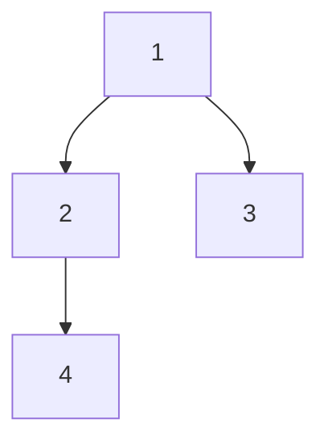

# 题目信息

# Journey

## 题目描述

## 问题描述

在七大王国里有 $n$ 个城市和 $n-1$ 条道路，每条道路连接两个城市，并且通过这些道路我们可以从任何一个城市到达任何一个城市。

席恩和阿莎在第一个城市骑上马，他们要通过这些路开始一次旅行。但是有雾，所以他们看不见他们的马带他们去了哪里。当马抵达一个城市的时候（包括第一个城市），它会去跟当前这个城市相连的城市。但是这是一匹奇怪的马，它只去他们以前没有去过的城市。在每个城市，马以相同的概率移动去上述符合要求的城市，并且当没有这样的城市（可走）时，马就停下了。

每条路的长度都是 $1$，旅行从城市 $1$ 开始，问这次旅行的期望长度（旅行长度的期望值）是多少？你可以通过[这个链接](https://en.wikipedia.org/wiki/Expected\_value)来阅读一些关于期望（平均）值的文字。

## 说明/提示

在第一个例子中，他们的旅行可能以同等的概率停止于城市 $3$ 或城市 $4$。去城市 $3$ 的距离是 $1$，去城市 $4$ 的距离是 $2$，所以期望是 $1.5$。

在第二个例子中，他们的旅行可能停止于城市 $4$ 或城市 $5$。去这些城市的距离都是 $2$，所以期望是 $2$。

## 样例 #1

### 输入

```
4
1 2
1 3
2 4
```

### 输出

```
1.500000000000000
```

## 样例 #2

### 输入

```
5
1 2
1 3
3 4
2 5
```

### 输出

```
2.000000000000000
```

# AI分析结果


### 💡 Kay的C++算法解析：Journey 深入学习指南 💡

#### 题目解读与核心算法识别
✨ **本题主要考察**：`树形动态规划（Tree DP）`  
🗣️ **初步分析**：
> 解决"Journey"的关键在于理解树形结构和期望值的计算。想象你在玩一个像素迷宫游戏🎮：从起点（城市1）开始，每次随机选择未探索的分支前进，直到走入死胡同（叶子节点）。  
> - 核心思路：定义`dp[u]`表示从节点u出发的期望路径长度。状态转移方程为：`dp[u] = (Σ(dp[v] + 1)) / k`，其中v是u的子节点，k是子节点数（根节点为度数，其他节点需排除父节点）
> - 可视化设计：在像素树中高亮当前节点（闪烁黄光），移动时显示概率分布（如1/2箭头），数据更新时播放"叮"声，到达叶子时触发胜利音效🎵。自动演示模式可调速观察状态转移过程。

---

#### 精选优质题解参考
**题解一（E1_de5truct0r）**  
* **点评**：思路直击本质——树形DP的经典应用。代码简洁规范（`dp[u]`状态定义清晰），用`cnt`动态统计子节点数，边界处理严谨（叶子节点返回0）。亮点在于用单次DFS完成期望计算，复杂度O(n)最优，竞赛可直接复用。

**题解二（caidzh）**  
* **点评**：创新性地从概率视角切入，计算每个叶子的期望贡献（深度×概率）。代码使用前向星存图，通过`exp`参数传递概率值，区分根节点处理逻辑。亮点是提供第二种解题视角，帮助理解期望的本质。

**题解三（Overstars）**  
* **点评**：结构清晰分离度数统计与DP计算，显式定义`deg`数组提高可读性。状态转移方程`dp[x] += (1.0/deg[x])*(dp[v]+1)`直观呈现期望加权特性，适合初学者理解概率分配机制。

---

#### 核心难点辨析与解题策略
1. **状态定义与转移方程**  
   * **分析**：如何理解`dp[u] = (Σ(dp[v]+1))/k`？每个子路径期望需加上当前边（+1），再按概率（1/k）加权平均。优质题解通过DFS自底向上计算。
   * 💡 **学习笔记**：期望的线性性（E(X+Y)=E(X)+E(Y)）是转移方程的理论基础。

2. **度数差异处理**  
   * **分析**：根节点子节点数=度数，其他节点=度数-1（排除父节点）。代码中通过`fa`参数在DFS时过滤父节点。
   * 💡 **学习笔记**：树形DP必须区分根节点与普通节点！

3. **叶子边界条件**  
   * **分析**：当节点无子节点时停止，期望为0（`dp[leaf]=0`）。未处理边界会导致除零错误。
   * 💡 **学习笔记**：递归终止条件是树形DP正确性的保障。

### ✨ 解题技巧总结
- **问题分解**：将全局期望分解为子树期望（分治思想）
- **递归实现**：DFS后序遍历保证子问题先求解
- **精度控制**：使用`double`存储期望，输出时`setprecision(10)`
- **边界测试**：单节点树/链形树等 Corner Case 验证

---

#### C++核心代码实现赏析
**通用核心实现参考**  
* **说明**：综合优质题解，最简树形DP框架
```cpp
#include <iostream>
#include <vector>
#include <iomanip>
using namespace std;

const int MAXN = 1e5+5;
vector<int> tree[MAXN];
double dp[MAXN]; // dp[u]: 从u出发的期望长度

void dfs(int u, int parent) {
    double sum = 0;
    int childCount = 0;
    
    for (int v : tree[u]) {
        if (v == parent) continue;
        dfs(v, u);
        sum += dp[v] + 1; // 累加子期望+当前边
        childCount++;
    }
    dp[u] = childCount ? sum / childCount : 0; // 叶子节点为0
}

int main() {
    int n; cin >> n;
    for (int i = 1; i < n; ++i) {
        int u, v; cin >> u >> v;
        tree[u].push_back(v);
        tree[v].push_back(u);
    }
    dfs(1, 0); // 根节点无父节点
    cout << fixed << setprecision(10) << dp[1];
}
```
* **代码解读概要**：  
  > 1. 邻接表`tree`存储无向树  
  > 2. DFS遍历时用`parent`避免回父节点  
  > 3. `childCount`动态计算有效子节点数  
  > 4. 叶子节点自动返回0（childCount=0时）

**题解一核心片段**  
```cpp
if (cnt) dp[u] /= (double)cnt; // 非叶子节点才求平均
```
* **亮点**：用`cnt`自然处理度数差异
* **代码解读**：  
  > `cnt`统计实际子节点数，除法前校验避免除零。注意`(double)`显式转换防整数除法。

**题解二核心片段**  
```cpp
if(!flag) ans += (dep[x]-1)*exp; // 到达叶子累加期望
```
* **亮点**：概率视角的期望累加
* **代码解读**：  
  > `flag`标记是否为叶子，`exp`为到达概率，`dep[x]-1`是从根到叶的边数（深度-1）。

**题解三核心片段**  
```cpp
dp[x] += (double)(1.0/deg[x])*(dp[v]+1); // 显式概率加权
```
* **亮点**：分离度数统计与状态转移
* **代码解读**：  
  > 第一轮DFS统计`deg[x]`（子节点数），第二轮计算加权期望，清晰展示概率分配过程。

---

#### 算法可视化：像素动画演示
**主题**：« 像素骑士的树形冒险 »  
**核心演示**：树形DP期望计算过程（结合8-bit像素风）

##### 设计实现方案


1. **初始化**  
   - 像素树渲染：节点用16色方块（根=金色，普通=青蓝，叶子=绿色）
   - 控制面板：开始/暂停、单步执行、速度滑块（兔子/乌龟图标）
   - 8-bit BGM：低循环芯片音乐

2. **DFS过程演示**  
   - **步骤1**：当前节点闪烁红光（如节点2），显示`childCount=1`
   - **步骤2**：遍历子节点时播放"叮"声，显示概率计算：`1/childCount → 1.0`
   - **步骤3**：移动像素骑士到子节点（节点4），显示`dp[4]=0`（叶子）
   - **步骤4**：回溯更新`dp[2] = (0+1)/1 = 1.0`，节点2变橙光

3. **特效与交互**  
   - 数据变化：节点上方实时显示`dp`值（像素字体）
   - 音效反馈：移动("叮")，叶子("胜利号角")，错误("爆破音")
   - 自动演示：AI骑士按DFS序移动，可调速观察
   - 关卡设计：每完成子树计算视为"小关"，显示"Stage Clear!"

##### 技术实现
- **Canvas绘制**：用`fillRect`绘制像素节点，`lineTo`画边
- **动画时序**：`requestAnimationFrame`控制帧率
- **音效**：Web Audio API播放8-bit音效（[jsfxr](https://sfxr.me/)生成）

---

#### 拓展练习与相似问题
1. **通用技巧迁移**  
   - 路径期望：P4316 绿豆蛙的归宿（DAG期望）
   - 树形统计：P1352 没有上司的舞会（最大独立集）
   - 条件期望：P1850 换教室（概率DP）

2. **洛谷推荐**  
   - **P4316**：巩固DAG期望DP，体验拓扑排序与DP结合  
   - **P1364**：树形DP求医院选址（最小距离和）  
   - **P1040**：区间DP+树形结构（加分二叉树）  

---

#### 学习心得与经验分享
> **参考经验（E1_de5truct0r）**：  
> “没注意到树结构卡了3分钟——审题要抓图论性质！”  
>  
> **点评**：树的性质（无环/连通）是解题突破口，审题时需标记关键条件（如$n$点$n-1$边）。

> **经验（caidzh）**：  
> “概率×深度的思路源于期望定义——回归数学本质”  
>  
> **点评**：复杂算法背后往往是最基础的数学原理（$E=\sum p_ix_i$），解题遇阻时可回归定义。

---

本次解析就到这里！记住：树形DP的核心是**分解子问题+DFS递归**。尝试用像素动画模拟算法，你会感受到数据流动的美妙~ 下次见！💻🚀

---
处理用时：165.68秒