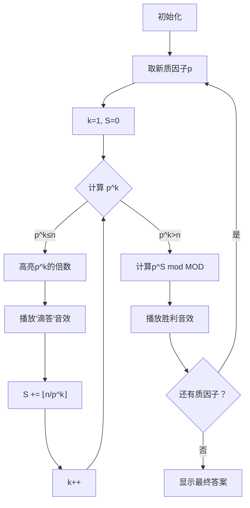

# 题目信息

# Primes and Multiplication

## 题目描述

Let's introduce some definitions that will be needed later.

Let $ prime(x) $ be the set of prime divisors of $ x $ . For example, $ prime(140) = \{ 2, 5, 7 \} $ , $ prime(169) = \{ 13 \} $ .

Let $ g(x, p) $ be the maximum possible integer $ p^k $ where $ k $ is an integer such that $ x $ is divisible by $ p^k $ . For example:

- $ g(45, 3) = 9 $ ( $ 45 $ is divisible by $ 3^2=9 $ but not divisible by $ 3^3=27 $ ),
- $ g(63, 7) = 7 $ ( $ 63 $ is divisible by $ 7^1=7 $ but not divisible by $ 7^2=49 $ ).

Let $ f(x, y) $ be the product of $ g(y, p) $ for all $ p $ in $ prime(x) $ . For example:

- $ f(30, 70) = g(70, 2) \cdot g(70, 3) \cdot g(70, 5) = 2^1 \cdot 3^0 \cdot 5^1 = 10 $ ,
- $ f(525, 63) = g(63, 3) \cdot g(63, 5) \cdot g(63, 7) = 3^2 \cdot 5^0 \cdot 7^1 = 63 $ .

You have integers $ x $ and $ n $ . Calculate $ f(x, 1) \cdot f(x, 2) \cdot \ldots \cdot f(x, n) \bmod{(10^{9} + 7)} $ .

## 说明/提示

In the first example, $ f(10, 1) = g(1, 2) \cdot g(1, 5) = 1 $ , $ f(10, 2) = g(2, 2) \cdot g(2, 5) = 2 $ .

In the second example, actual value of formula is approximately $ 1.597 \cdot 10^{171} $ . Make sure you print the answer modulo $ (10^{9} + 7) $ .

In the third example, be careful about overflow issue.

## 样例 #1

### 输入

```
10 2
```

### 输出

```
2
```

## 样例 #2

### 输入

```
20190929 1605
```

### 输出

```
363165664
```

## 样例 #3

### 输入

```
947 987654321987654321
```

### 输出

```
593574252
```

# AI分析结果


### 💡 Kay的C++算法解析：Primes and Multiplication 深入学习指南 💡

**引言**  
今天我们来分析"Primes and Multiplication"这道数论题。本指南将帮助你理解题目核心、掌握解题技巧，并通过可视化方案直观感受算法执行过程。

---

## 1. 题目解读与核心算法识别

✨ **本题主要考察**：数学（质因数分解）+ 数论（阶乘质因子指数计算）

🗣️ **初步分析**：  
> 解决本题的关键在于将复杂乘积问题分解为独立质因子的贡献计算。想象每个质因子就像独立的工人，在1~n的数字工厂中"盖章"（贡献幂次）。  
> - **核心思路**：先将x分解质因数，对每个质因子p，计算其在∏g(i,p)中的总贡献（即p的指数和），最后合并所有质因子的贡献  
> - **难点对比**：所有题解都采用"质因数分解+指数和公式"的核心思路，区别在于指数计算实现（循环累加 vs 递归累积）  
> - **可视化设计**：采用像素网格展示1~n的数字，用不同颜色高亮当前质因子p的k次幂倍数，右侧动态显示指数累加过程（详见第5节）  
> - **复古元素**：8位FC游戏风格，数字网格采用16色调色板，关键操作配"滴答"音效，完成质因子时播放胜利音效，支持AI自动演示模式  

---

## 2. 精选优质题解参考

**题解一：Steven_Meng (赞4)**  
* **点评**：思路清晰直白，核心逻辑`Calc`函数用循环累积代替递归，巧妙避免栈溢出风险。代码规范（`ksm`快速幂模块化），变量名`primes`/`cnt`含义明确，边界处理严谨（`x>1`特判）。亮点在于将指数计算与快速幂完美融合，实践价值高，可直接用于竞赛。

**题解二：blue_ice (赞1)**  
* **点评**：推导过程详尽透彻，创新性地将问题转化为n!的质因子指数计算，数学证明严谨。代码结构工整（质因数分解/指数计算/快速幂分离），`do-while`循环确保边界正确。亮点在于给出严格数学公式证明，加深对数论本质的理解。

**题解三：紪絽 (赞0)**  
* **点评**：解题思路表述清晰易懂（配合实例说明阶乘质因子指数来源），代码简洁高效。亮点在于封装`calc`函数计算指数和，主逻辑仅3行体现高度抽象能力，适合初学者学习模块化编程思想。

---

## 3. 核心难点辨析与解题策略

1. **质因数分解的完整性**  
   * **分析**：x可能有大于√x的质因子（如x=13），优质解法都通过`i*i<=x`循环后特判`x>1`确保完整性  
   * 💡 **学习笔记**：质因数分解后必须检查剩余值，这是数论问题的基础保障

2. **指数和的高效计算**  
   * **分析**：指数和S=∑⌊n/pᵏ⌋需避免重复计算。Steven_Meng用`while(n){ans*=p^(n/p);n/=p;}`，blue_ice用`do{tmp/=p;cnt+=tmp}while(tmp);`，本质都是O(logₚn)  
   * 💡 **学习笔记**：通过不断除以p降规模，是处理大数(n≤10¹⁸)的关键技巧

3. **大数幂运算的优化**  
   * **分析**：p^S mod (10⁹+7) 中S可达10¹⁸，但快速幂仅需O(logS)≈60步。优质解都用分治快速幂（平方降次），避免直接计算大数  
   * 💡 **学习笔记**：快速幂是数论问题的标准配置，务必掌握位运算实现

### ✨ 解题技巧总结
- **质因子独立原则**：将复杂乘积分解为独立质因子的贡献  
- **降维攻击**：用除法规模降低处理大数（n/=p循环）  
- **模块化设计**：分离质因数分解、指数计算、快速幂三大模块  
- **边界防御**：特判x为质数、n=0等边界情况  

---

## 4. C++核心代码实现赏析

**本题通用核心C++实现参考**  
```cpp
#include <iostream>
#include <vector>
using namespace std;
typedef long long ll;
const int MOD = 1e9 + 7;

ll qpow(ll base, ll exp) { // 快速幂模块
    ll res = 1;
    while (exp) {
        if (exp & 1) res = res * base % MOD;
        base = base * base % MOD;
        exp >>= 1;
    }
    return res;
}

int main() {
    ll x, n;
    cin >> x >> n;
    vector<ll> primes;
    
    // 质因数分解
    for (ll i = 2; i * i <= x; i++) {
        if (x % i == 0) {
            primes.push_back(i);
            while (x % i == 0) x /= i;
        }
    }
    if (x > 1) primes.push_back(x);

    ll ans = 1;
    for (ll p : primes) {
        ll cnt = 0, tmp = n;
        // 计算指数和 S = ∑[n/p^k]
        while (tmp) {
            tmp /= p;
            cnt += tmp;
        }
        ans = ans * qpow(p, cnt) % MOD;
    }
    cout << ans;
}
```
**代码解读概要**：  
1. 质因数分解：从2遍历到√x，将质因子存入`primes`  
2. 指数计算：对每个p，通过`while(tmp){tmp/=p; cnt+=tmp}`计算指数和  
3. 快速幂：用位运算高效计算p^cnt mod MOD  
4. 结果合并：所有质因子贡献相乘取模  

---

**针对优质题解的片段赏析**  

**题解一：Steven_Meng**  
* **亮点**：循环累积代替递归，避免栈溢出  
* **核心代码**：
```cpp
while (n) {
    ans = (ans * ksm(x, n/x, MOD)) % MOD;
    n /= x;
}
```
* **代码解读**：  
  > 每次循环处理当前层级的贡献：  
  > 1. `n/x` 即当前p的指数贡献（如p=2, n=8时贡献4）  
  > 2. `ksm(x, n/x)` 计算p^{当前层贡献}  
  > 3. `n /= x` 降级到下一层（等价于p^k → p^{k+1}）  
  > 循环终止时恰好累积所有层级贡献  
* 💡 **学习笔记**：循环累积是空间复杂度优化（O(1)）的典范  

**题解二：blue_ice**  
* **亮点**：严格数学公式证明指导代码实现  
* **核心代码**：
```cpp
do {
    tmp /= prime;
    cnt += tmp;
} while (tmp);
```
* **代码解读**：  
  > 1. `do-while`确保至少执行一次（处理n≥p的情况）  
  > 2. `tmp /= prime` 计算当前层级的除数  
  > 3. `cnt += tmp` 累加⌊n/pᵏ⌋到总指数  
  > 4. 当`tmp<p`时停止（再除为0）  
* 💡 **学习笔记**：数学推导是优化算法的源泉  

**题解三：紪絽**  
* **亮点**：模块化设计提升代码可读性  
* **核心代码**：
```cpp
ll calc(ll n, ll p) {
    ll s = 0;
    while (n) 
        s += n / p, n /= p;
    return s;
}
// 主函数调用
ans = (ans * ksm(p[i], calc(n, p[i]))) % MOD;
```
* **代码解读**：  
  > 1. 封装`calc`函数专注指数计算  
  > 2. `s += n/p` 累加当前层贡献  
  > 3. `n /= p` 进入下一层级  
  > 主函数只需调用并合并结果  
* 💡 **学习笔记**：功能封装是工程化编程的基础  

---

## 5. 算法可视化：像素动画演示

**主题**：质因子贡献探险（8位FC风格）  
**核心演示**：质因子p在1~n数字网格中的"盖章"过程  

### 设计思路
1. **场景布局**  
   - 左侧：16色像素网格展示1~n（滚动显示）  
   - 右面板：当前质因子p/指数k/累计S值  
   - 控制区：开始/暂停/单步/速度滑块/AI演示  

2. **动画流程**  


3. **关键交互**  
   - **颜色编码**：p=2→蓝色，p=3→红色，p=5→绿色  
   - **高亮规则**：当前k次幂倍数用闪烁边框，历史倍数用纯色  
   - **音效设计**：  
     - 倍数点亮：8位"滴"声  
     - 指数累加：键盘敲击声  
     - 质因子完成：马里奥金币声  
   - **AI演示**：自动按最优速度执行，速度滑块调节帧率  

4. **教学提示**  
   > "当前处理质因子3，k=2 → 3²=9的倍数被点亮"  
   > "S增加⌊100/9⌋=11，累计S=15+11=26"  
   > "完成！3的贡献=3²⁶ mod (10⁹+7)"  

---

## 6. 拓展练习与相似问题思考

1. **通用技巧迁移**  
   - 质因数分解是处理乘积问题的核心工具  
   - 阶乘质因子指数公式适用于：  
     * 组合数计算（如C(n,m) mod p）  
     * 数论函数求和（如因子个数函数）  
     * 素数分布问题（如n!后缀零）  

2. **洛谷推荐**  
   - **P2043 质因子分解**  
     > 基础练习，巩固质因数分解技巧  
   - **P3807 卢卡斯定理**  
     > 进阶应用，练习大组合数取模中的质因子处理  
   - **P1069 细胞分裂**  
     > 变形考察，需结合质因子指数比较  

---

## 7. 学习心得与经验分享

**参考经验 (来自 Steven_Meng)**：  
> "数论不会先打表，通过小规模数据找规律"  

**点评**：  
> 打表是探索数论问题的利器。例如计算x=10,n=10的f值：  
> f(10,1)=1, f(10,2)=2, f(10,3)=1...  
> 可发现质因子2在n=2,4,6,8时分别贡献2,4,2,8 → 即2¹,2²,2¹,2³  
> 这直接引导出指数累加规律  

---

**结语**  
通过本次分析，我们掌握了质因数分解、指数累积和快速幂三大武器。记住：数论问题重在分解问题规模！下次挑战再见！🚀

---
处理用时：242.56秒