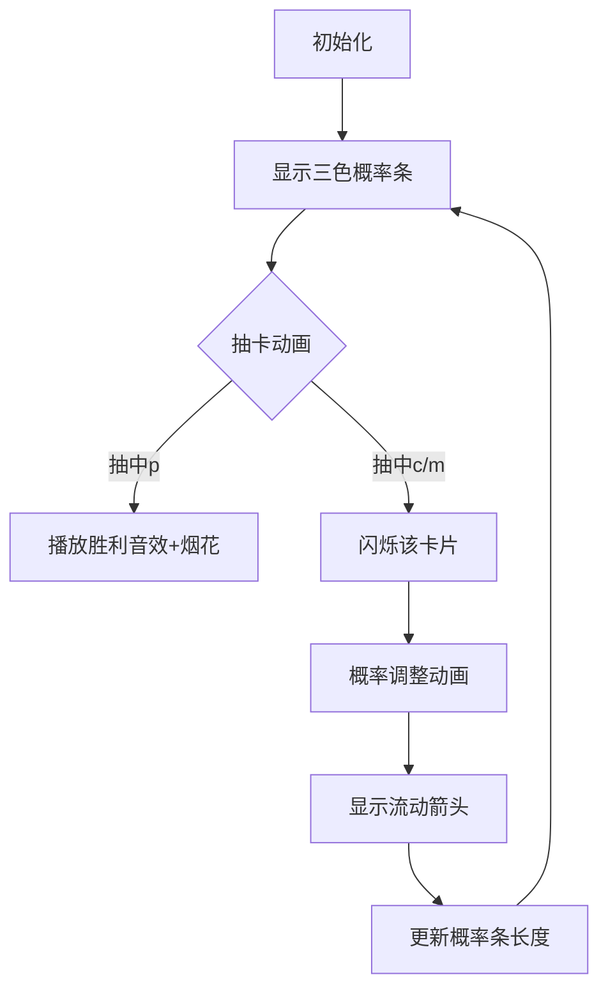

# 题目信息

# Need for Pink Slips

## 题目描述

After defeating a Blacklist Rival, you get a chance to draw $ 1 $ reward slip out of $ x $ hidden valid slips. Initially, $ x=3 $ and these hidden valid slips are Cash Slip, Impound Strike Release Marker and Pink Slip of Rival's Car. Initially, the probability of drawing these in a random guess are $ c $ , $ m $ , and $ p $ , respectively. There is also a volatility factor $ v $ . You can play any number of Rival Races as long as you don't draw a Pink Slip. Assume that you win each race and get a chance to draw a reward slip. In each draw, you draw one of the $ x $ valid items with their respective probabilities. Suppose you draw a particular item and its probability of drawing before the draw was $ a $ . Then,

- If the item was a Pink Slip, the quest is over, and you will not play any more races.
- Otherwise, 
  1. If $ a\leq v $ , the probability of the item drawn becomes $ 0 $ and the item is no longer a valid item for all the further draws, reducing $ x $ by $ 1 $ . Moreover, the reduced probability $ a $ is distributed equally among the other remaining valid items.
  2. If $ a > v $ , the probability of the item drawn reduces by $ v $ and the reduced probability is distributed equally among the other valid items.

For example,

- If $ (c,m,p)=(0.2,0.1,0.7) $ and $ v=0.1 $ , after drawing Cash, the new probabilities will be $ (0.1,0.15,0.75) $ .
- If $ (c,m,p)=(0.1,0.2,0.7) $ and $ v=0.2 $ , after drawing Cash, the new probabilities will be $ (Invalid,0.25,0.75) $ .
- If $ (c,m,p)=(0.2,Invalid,0.8) $ and $ v=0.1 $ , after drawing Cash, the new probabilities will be $ (0.1,Invalid,0.9) $ .
- If $ (c,m,p)=(0.1,Invalid,0.9) $ and $ v=0.2 $ , after drawing Cash, the new probabilities will be $ (Invalid,Invalid,1.0) $ .

You need the cars of Rivals. So, you need to find the expected number of races that you must play in order to draw a pink slip.

## 说明/提示

For the first test case, the possible drawing sequences are:

- P with a probability of $ 0.6 $ ;
- CP with a probability of $ 0.2\cdot 0.7 = 0.14 $ ;
- CMP with a probability of $ 0.2\cdot 0.3\cdot 0.9 = 0.054 $ ;
- CMMP with a probability of $ 0.2\cdot 0.3\cdot 0.1\cdot 1 = 0.006 $ ;
- MP with a probability of $ 0.2\cdot 0.7 = 0.14 $ ;
- MCP with a probability of $ 0.2\cdot 0.3\cdot 0.9 = 0.054 $ ;
- MCCP with a probability of $ 0.2\cdot 0.3\cdot 0.1\cdot 1 = 0.006 $ .

 So, the expected number of races is equal to $ 1\cdot 0.6 + 2\cdot 0.14 + 3\cdot 0.054 + 4\cdot 0.006 + 2\cdot 0.14 + 3\cdot 0.054 + 4\cdot 0.006 = 1.532 $ .For the second test case, the possible drawing sequences are:

- P with a probability of $ 0.4 $ ;
- CP with a probability of $ 0.4\cdot 0.6 = 0.24 $ ;
- CMP with a probability of $ 0.4\cdot 0.4\cdot 1 = 0.16 $ ;
- MP with a probability of $ 0.2\cdot 0.5 = 0.1 $ ;
- MCP with a probability of $ 0.2\cdot 0.5\cdot 1 = 0.1 $ .

So, the expected number of races is equal to $ 1\cdot 0.4 + 2\cdot 0.24 + 3\cdot 0.16 + 2\cdot 0.1 + 3\cdot 0.1 = 1.86 $ .

## 样例 #1

### 输入

```
4
0.2 0.2 0.6 0.2
0.4 0.2 0.4 0.8
0.4998 0.4998 0.0004 0.1666
0.3125 0.6561 0.0314 0.2048```

### 输出

```
1.532000000000
1.860000000000
5.005050776521
4.260163673896```

# AI分析结果


### 💡 Kay的C++算法解析：Need for Pink Slips 深入学习指南 💡

**引言**  
今天我们来分析"Need for Pink Slips"这道概率期望题。本指南将帮助大家掌握DFS模拟概率状态转移的核心技巧，理解期望计算原理，并通过像素动画直观感受算法流程。

---

### 1. 题目解读与核心算法识别  
✨ **本题主要考察**：`DFS搜索` + `概率期望计算`  

🗣️ **初步分析**：  
> 这道题就像玩复古抽卡游戏：每次抽卡可能改变后续概率，直到抽中"粉色卡"。核心是**DFS模拟所有可能路径**并计算期望步数。  
> - **核心难点**：概率调整规则复杂（>v减v，≤v置0）、概率重分配逻辑、浮点精度处理  
> - **解法对比**：所有题解都用DFS，区别在状态设计（直接递归 vs 显式步数记录）  
> - **可视化设计**：用像素长条表示概率值，抽卡时闪烁被选卡片，概率调整时显示流动箭头（后文详解）  
> - **复古元素**：8-bit音效（抽卡"叮"、胜利旋律）、FC风格界面、AI自动演示模式  

---

### 2. 精选优质题解参考  
**题解一（作者：5ab_juruo）**  
* **亮点**：  
  - 递归设计优雅：通过返回值隐式累加期望（`dfs()`返回当前状态期望步数）  
  - 高效处理概率分配：用条件判断实现分支逻辑（约10行核心代码）  
  - 实践价值高：竞赛标准代码，边界处理严谨（EPS防精度误差）  

**题解二（作者：言琢დ）**  
* **亮点**：  
  - 教学友好：显式传递步数参数（`t`），更符合直觉  
  - 详细注释：每个分支对应题目规则样例  
  - 调试技巧：独立`equal()`函数处理浮点比较  

---

### 3. 核心难点辨析与解题策略  
1. **难点：概率调整规则分支多**  
   - *分析*：需区分`>v`（减v后平分）和`≤v`（置0后全分）两种情况，且需动态判断其他卡是否有效  
   - 💡 *学习笔记*：优先检查其他卡片的存续状态（`if(m>eps)`）再决定分配方式  

2. **难点：期望计算的递推结构**  
   - *分析*：期望 = Σ(分支概率 × (当前步数 + 子状态期望))  
   - 💡 *学习笔记*：两种实现殊途同归——题解一返回"未来期望+1"，题解二显式累加"当前步数×概率"  

3. **难点：浮点精度陷阱**  
   - *分析*：概率值反复计算可能导致`0.1+0.2≠0.3`  
   - 💡 *学习笔记*：用`eps=1e-9`阈值替代直接比较（`a>eps` 而非 `a>0`）  

✨ **解题技巧总结**  
- **状态压缩**：仅需传递三个概率值（第四值固定为1）  
- **剪枝优化**：当`p≈1`时提前终止（题解二）  
- **模块化**：分离概率调整逻辑（如抽到c卡的处理）  

---

### 4. C++核心代码实现赏析  
**通用核心实现（综合题解一、二）**  
```cpp
const double eps = 1e-9;

double dfs(double c, double m, double p) {
    double res = p; // 当前步抽中p的概率贡献
    if (c > eps) {
        if (c > v) { // 情况1：c > v
            if (m > eps) res += c * dfs(c-v, m+v/2, p+v/2);
            else res += c * dfs(c-v, 0, p+v);
        } else { // 情况2：c ≤ v
            if (m > eps) res += c * dfs(0, m+c/2, p+c/2);
            else res += c; // 直接累加步数贡献
        }
    }
    // 对称处理m卡（代码类似）
    return res + 1; // +1 表示当前步的期望
}
```

**题解一片段赏析**  
```cpp
if (c > v) {
    if (m > eps) res += c * dfs(c-v, m+v/2, p+v/2);
    else res += c * dfs(c-v, 0, p+v);
}
```
> **解读**：当抽到c卡且`c>v`时：  
> 1. c卡概率减`v`（`c-v`）  
> 2. 若m卡有效（`m>eps`），将`v`平分给m和p（各`v/2`）  
> 3. 若m卡无效，`v`全部分配给p卡  
> 💡 *学习笔记*：分支条件体现"有效卡数量决定分配规则"  

**题解二片段赏析**  
```cpp
if (!equal(c,0)) 
    if (c <= v) 
        if (equal(m,0)) res += c * go(0,0,1,t+1);
```
> **解读**：显式传递步数`t+1`，当`c≤v`且m卡无效时，c置0后概率全给p卡  
> 💡 *学习笔记*：`t`参数使期望计算更直观（贡献 = 概率 × 当前步数）  

---

### 5. 算法可视化：像素动画演示  
**主题**：8-bit抽卡模拟器（FC游戏风格）  

**核心演示流程**：  


**关键交互设计**：  
1. **像素元素**：  
   - 三色长条（蓝：Cash/绿：Impound/粉：Pink）表示概率值  
   - 概率流动用箭头动画（从抽中卡流向其他卡）  
2. **音效系统**：  
   - 抽卡：8-bit "叮"声  
   - 概率重分配：水流声  
   - 胜利：FC游戏通关旋律  
3. **控制面板**：  
   - 单步/自动模式（可调速）  
   - "AI演示"按钮：自动抽卡直到成功（展示最优路径）  

**学习价值**：通过颜色变化与箭头流动，直观理解**概率重分配规则**（如`v/2`平分 vs `v`全分）  

---

### 6. 拓展练习与相似问题  
**通用技巧迁移**：  
1. 状态转移期望问题（如骰子游戏）  
2. 概率驱动的DFS搜索（如随机迷宫）  
3. 资源分配模拟（如带宽调度）  

**洛谷推荐**：  
1. **P1297**：单选错位（基础概率期望）  
   - *推荐理由*：巩固期望的线性性质  
2. **P6154**：游走（DAG上的期望DP）  
   - *推荐理由*：学习拓扑序期望计算  
3. **P1850**：换教室（期望+状态机）  
   - *推荐理由*：掌握复杂期望建模  

---

### 7. 学习心得与经验分享  
> **题解二作者经验**："浮点数判断相等需用`fabs`比较，这是调试时踩过的坑"  
> **Kay点评**：浮点精度是算法竞赛常见陷阱，建议：  
> 1. 统一用`eps`比较  
> 2. 避免连续浮点运算  
> 3. 输出时设`precision(12)`  

---

**结语**  
通过本次分析，我们掌握了概率期望题的DFS解法核心——**状态转移设计**与**分支处理逻辑**。记住：用像素动画可视化抽象规则，能大幅提升理解效率！下次遇到类似问题，不妨先画概率流动图哦~ 💪

---
处理用时：155.29秒