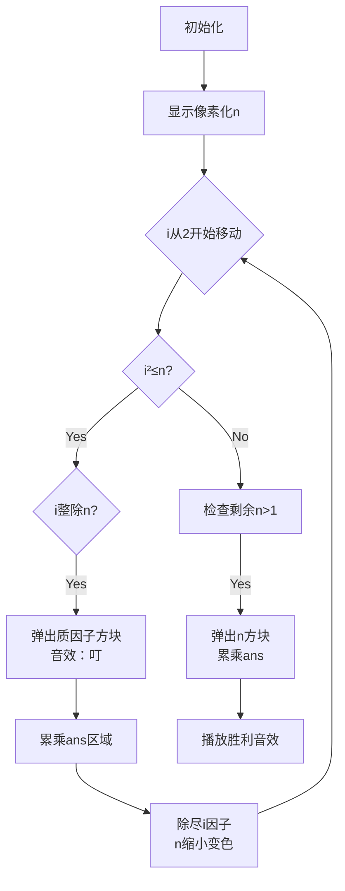

# 题目信息

# Duff in Love

## 题目描述

## 问题描述

如果不存在一个数 $ a (a>1)$ ，使得 $ a^2 $ 是 $ n $ 的约数，我们就称 $ n $ 是一个可爱的数。

给出一个正整数 $ n $ ，在 $ n $ 的所有约数中，寻找最大的可爱的数。

## 样例 #1

### 输入

```
10
```

### 输出

```
10
```

## 样例 #2

### 输入

```
12
```

### 输出

```
6
```

# AI分析结果


### Kay的C++算法解析：Duff in Love 深入学习指南 💡
**引言**  
今天我们一起分析CF588B "Duff in Love"。这道题要求找出给定数 \( n \) 的最大约数，且该约数不存在平方因子（即没有 \( a>1 \) 使得 \( a^2 \) 整除它）。本指南将帮助你掌握质因数分解的核心思想与高效实现技巧。

---

## 1. 题目解读与核心算法识别
✨ **本题主要考察**：`数学-质因数分解`  

🗣️ **初步分析**：  
> 解决本题的关键在于**质因数分解**，就像拆解乐高积木时只保留每种颜色的一块。核心思想是：一个"可爱的数"要求所有质因子的指数均为1（如 \( 6 = 2×3 \))。因此，最大可爱数就是 \( n \) 的所有质因子的乘积。  
> - **题解思路对比**：所有优质解法均基于质因数分解，但实现细节不同：  
>   - **主流做法**：遍历 \( i=2 \) 到 \( \sqrt{n} \)，累乘质因子并除尽其所有幂次（如 b6e0_ 的解法）  
>   - **替代思路**：不断除去平方因子（如 SqrtSecond 的解法），但需注意边界  
> - **可视化设计重点**：  
>   1. 用像素方块表示 \( n \) 和质因子，高亮当前检测的 \( i \)  
>   2. 当 \( i \) 整除 \( n \) 时，弹出质因子方块并累乘到答案区  
>   3. 剩余 \( n \) 变色提示其成为新质因子  
>   4. 复古音效：质因子弹出（"叮"）、完成（胜利音效）

---

## 2. 精选优质题解参考
**题解一：b6e0_ (赞数：5)**  
* **点评**：思路清晰直击核心（质因子乘积），代码简洁高效：  
  - 循环条件 `i*i<=n` 避免无效遍历，复杂度 \( O(\sqrt{n}) \) 最优  
  - 变量名 `ans` 和除尽操作逻辑明确，边界处理严谨（最后检查 `n>1`）  
  - 亮点：强调 `long long` 和循环优化，可直接用于竞赛  

**题解二：MattL (赞数：0)**  
* **点评**：代码简洁且包含关键注释，但需注意：  
  - 输出时 `ans*n` 的写法巧妙处理剩余质因子  
  - 变量初始化 `ans=1` 避免零值，但缺少 `long long` 声明提醒  
  - 实践价值高，适合初学者理解质因数分解框架  

**题解三：StudyingFather (赞数：1)**  
* **点评**：采用线性递增 `cur` 而非平方优化，逻辑正确但效率稍低：  
  - 亮点：使用 `flag` 标记质因子出现，代码可读性强  
  - 改进点：循环条件 `cur*cur>n` 可前置到 while 判断中提升效率  

---

## 3. 核心难点辨析与解题策略
1. **难点：高效分解大数 \( n \leq 10^{12} \)**  
   * **分析**：必须用 \( i^2 \leq n \) 而非 \( i \leq n \) 优化。优质解法均以 `i*i<=n` 为循环条件，将复杂度从 \( O(n) \) 降至 \( O(\sqrt{n}) \)  
   * 💡 **学习笔记**：平方根是质因数分解的性能临界点  

2. **难点：剩余质因子的处理**  
   * **分析**：循环结束后若 \( n>1 \)，则 \( n \) 本身是质因子（如 \( n=10 \) 时剩余 \( 5 \))。b6e0_ 和 MattL 通过 `ans*=n` 解决  
   * 💡 **学习笔记**：任何大于1的整数，未被分解的部分必为质数  

3. **难点：避免重复累乘质因子**  
   * **分析**：用 `while(n%i==0) n/=i` 彻底除尽当前质因子，防止后续重复检测  
   * 💡 **学习笔记**：除尽操作保障每个质因子仅被取用一次  

### ✨ 解题技巧总结
- **平方优化**：始终用 \( i^2 \leq n \) 替代 \( i \leq n \)  
- **彻底除尽**：`while` 循环移除质因子的所有幂次  
- **边界守卫**：循环后检查剩余 \( n \) 并处理  
- **数据类型**：\( n \leq 10^{12} \) 必须用 `long long`  

---

## 4. C++核心代码实现赏析
**通用核心实现参考**  
* **说明**：综合 b6e0_ 和 MattL 的最优解法  
* **完整代码**：
  ```cpp
  #include <iostream>
  using namespace std;
  int main() {
      long long n, ans = 1;  // 必须long long
      cin >> n;
      for (long long i = 2; i * i <= n; i++) {  // 关键优化
          if (n % i == 0) {
              ans *= i;          // 累乘质因子
              while (n % i == 0) // 除尽该因子
                  n /= i;
          }
      }
      if (n > 1) ans *= n;  // 处理剩余质因子
      cout << ans;
      return 0;
  }
  ```
* **代码解读概要**：  
  > 1. 初始化 `ans=1` 作为累乘器  
  > 2. 循环检测 \( i \)（从 2 开始），若 \( i \) 整除 \( n \) 则累乘并除尽  
  > 3. 循环结束后处理剩余的质因子 \( n \)  

---

**题解一：b6e0_ 片段赏析**  
* **亮点**：严格遵循平方优化，代码极简  
* **核心片段**：
  ```cpp
  for(i=2; i*i<=n; i++)
    if(n%i==0) {
      ans *= i;
      while(n%i==0) n /= i;  // 彻底除尽
    }
  if(n>1) ans *= n;  // 边界处理
  ```
* **代码解读**：  
  > - `i*i<=n` 确保只遍历到 \( \sqrt{n} \)，避免无效循环  
  > - `while` 循环清除所有 \( i \) 的因子，保证每个质数只取一次  
  > - 最终检查 `n>1` 处理大质数（如输入 \( 17 \)）  
* 💡 **学习笔记**：质因数分解中，平方优化是效率的灵魂  

**题解二：MattL 片段赏析**  
* **亮点**：输出语句 `ans*n` 巧妙处理剩余质因子  
* **核心片段**：
  ```cpp
  for(long long i=2; i*i<=n; i++)
    if(n%i==0) {
      ans *= i;
      while(n%i==0) n /= i;
    }
  cout << ans * n;  // 直接乘入剩余n
  ```
* **代码解读**：  
  > 循环结束时若 \( n \) 为质数则 \( n \neq 1 \)，直接与 `ans` 相乘。需注意：当 \( n=1 \) 时不影响结果  
* 💡 **学习笔记**：利用乘法特性简化边界判断  

---

## 5. 算法可视化：像素动画演示
**主题**：`质因数猎人：8位分解冒险`  
**核心演示**：动态展示质因数分解过程，融入FC游戏元素  

### 动画设计


1. **场景设计**  
   - **像素网格**：中央显示 \( n \)（大像素方块），底部为 `ans` 累乘区  
   - **控制面板**：步进/自动播放按钮 + 速度滑块  
   - **角色**：像素小人持数字 `i` 从左侧向 \( n \) 移动  

2. **关键交互**  
   - 当 `i` 触碰 \( n \) 且整除时：  
     - \( n \) 分裂出质因子方块飞入 `ans` 区  
     - 播放 "叮" 音效，\( n \) 缩小并变浅色  
   - 循环结束后：若剩余 \( n \) 变色闪烁，飞入 `ans` 区  
   - 胜利时：`ans` 区闪烁 + 8位胜利音乐  

3. **游戏化元素**  
   - **关卡模式**：每个质因子分解为小关卡  
   - **得分系统**：快速分解获得连击奖励分  
   - **AI演示**：自动播放模式展示最优分解路径  

---

## 6. 拓展练习与相似问题思考
**通用技巧迁移**：质因数分解还可用于解决：  
1. 求最大公约数/最小公倍数  
2. 约数个数计算  
3. 欧拉函数值求解  

**洛谷推荐**：  
1. **P1075 质因数分解**  
   🗣️ 直接练习质因数分解，巩固循环优化技巧  
2. **P1069 细胞分裂**  
   🗣️ 结合质因数分解求最小时间，提升模型转化能力  
3. **P2043 质因子分解**  
   🗣️ 进阶练习，要求输出质因子指数  

---

## 7. 学习心得与经验分享
**参考经验 (来自 b6e0_)**：  
> "循环条件一定要写成 `i*i<=n` 而不是 `i<=n`"  

**点评**：这是效率优化的核心！\( O(\sqrt{n}) \) 和 \( O(n) \) 在 \( n=10^{12} \) 时相差百万倍计算量。务必记住：**质因数分解的循环边界是平方根**  

---

**结语**  
通过本次分析，我们掌握了质因数分解的核心思想与优化技巧。记住：分解大数时，平方优化和彻底除尽是两大关键武器！下次遇到类似问题，不妨回想"像素质因数猎人"的分解之旅哦~ 💪

---
处理用时：112.90秒