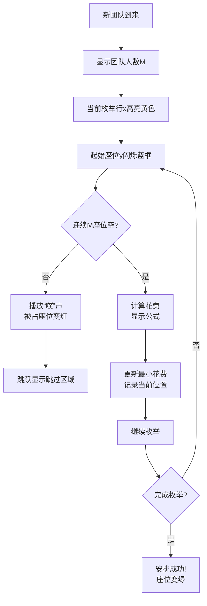

# 题目信息

# Cinema Cashier

## 题目描述

All cinema halls in Berland are rectangles with $ K $ rows of $ K $ seats each, and $ K $ is an odd number. Rows and seats are numbered from $ 1 $ to $ K $ . For safety reasons people, who come to the box office to buy tickets, are not allowed to choose seats themselves. Formerly the choice was made by a cashier, but now this is the responsibility of a special seating program. It was found out that the large majority of Berland's inhabitants go to the cinema in order to watch a movie, that's why they want to sit as close to the hall center as possible. Moreover, a company of $ M $ people, who come to watch a movie, want necessarily to occupy $ M $ successive seats in one row. Let's formulate the algorithm, according to which the program chooses seats and sells tickets. As the request for $ M $ seats comes, the program should determine the row number $ x $ and the segment $ [y_{l},y_{r}] $ of the seats numbers in this row, where $ y_{r}-y_{l}+1=M $ . From all such possible variants as a final result the program should choose the one with the minimum function value of total seats remoteness from the center. Say,  — the row and the seat numbers of the most "central" seat. Then the function value of seats remoteness from the hall center is . If the amount of minimum function values is more than one, the program should choose the one that is closer to the screen (i.e. the row number $ x $ is lower). If the variants are still multiple, it should choose the one with the minimum $ y_{l} $ . If you did not get yet, your task is to simulate the work of this program.


## 样例 #1

### 输入

```
2 1
1 1
```

### 输出

```
1 1 1
-1
```

## 样例 #2

### 输入

```
4 3
1 2 3 1
```

### 输出

```
2 2 2
1 1 2
3 1 3
2 1 1
```

# AI分析结果


# 💡 Kay的C++算法解析：Cinema Cashier 深入学习指南 💡

## 1. 题目解读与核心算法识别

✨ **本题主要考察**：`模拟应用`与`贪心优化`

🗣️ **初步分析**：
> 解决“Cinema Cashier”这道题，关键在于模拟电影院的座位安排过程。想象你在玩一个复古像素游戏：需要在网格地图上为不同规模的团队找到最佳营地位置（连续空位），且营地要尽可能靠近地图中心（减少行动距离）。核心算法流程如下：
> - **枚举策略**：遍历每一行和每个起始座位，检查连续M个空位
> - **花费计算**：用数学公式快速计算团队座位到中心的总曼哈顿距离
> - **决策优化**：选择最小花费方案，按规则处理多解情况
> - **可视化设计**：在像素动画中将中心点设为金色，当前检查区间用闪烁蓝框，已占座位变红色，成功安排时播放"叮"声

---

## 2. 精选优质题解参考

### 题解一（来源：404Not_Found）
* **点评**：此解法思路清晰，创新性地用树状数组维护座位状态，实现O(logK)的区间查询效率。核心亮点在于通过数学推导（分类讨论座位与中心的位置关系）将花费计算复杂度从O(M)降至O(1)。代码中`cost()`函数封装等差数列求和，变量命名规范（如`mid`表中心），边界处理严谨，可直接用于竞赛场景。

### 题解二（来源：一铭君一）
* **点评**：解法采用基础枚举但包含关键优化——当检测到占用座位时跳过后续无效位置。思路直白易懂，代码有详细注释和错误处理（如`pair<bool,int>`返回值）。虽时间复杂度略高，但对初学者更友好，实践价值在于展示了调试技巧（输出跳过的位置数）。

---

## 3. 核心难点辨析与解题策略

1.  **高效区间状态检测**
    * **分析**：暴力检查M个座位需O(M)时间。优质题解1用树状数组维护前缀和，通过`query(x,l,r)==0`在O(logK)内判断空位，类似扫雷游戏中快速探测连续地雷区
    * 💡 **学习笔记**：树状数组是维护动态区间信息的利器

2.  **快速计算曼哈顿距离和**
    * **分析**：直接累加每个座位花费导致O(M)复杂度。数学优化利用中心对称性分三类讨论：
      - 团队完全在中心右侧：`cost(y,y+m-1)-mid*m`
      - 完全在左侧：`mid*m-cost(y,y+m-1)`
      - 跨越中心：分解为左右两段等差数列计算
    * 💡 **学习笔记**：绝对值求和可转化为分段线性函数

3.  **减少无效枚举量**
    * **分析**：当某起始位置y检测失败时，题解2的`j += result.second`直接跳过被占区域，类似跳棋游戏避开障碍
    * 💡 **学习笔记**：利用失败信息优化搜索路径

### ✨ 解题技巧总结
-   **数学优化重复计算**：将循环求和转化为封闭表达式
-   **数据结构加速查询**：用树状数组/BIT维护动态区间
-   **枚举剪枝策略**：根据失败位置跳跃式前进
-   **模块化封装**：独立`cost()`函数增强可读性

---

## 4. C++核心代码实现赏析

**通用核心实现参考**
```cpp
#include<bits/stdc++.h>
const int maxn = 105;
int n, k, mid;
bool sits[maxn][maxn]; // 座位占用状态

// 计算[l,r]区间等差数列和
inline int cost(int l, int r) {
    return (l + r) * (r - l + 1) / 2;
}

int main() {
    scanf("%d%d", &n, &k);
    mid = (k + 1) / 2; // 中心坐标
    while (n--) {
        int m, ansx = -1, ansy = -1, min_cost = INT_MAX;
        scanf("%d", &m);
        
        for (int x = 1; x <= k; x++) {
            for (int y = 1; y <= k - m + 1; ) {
                bool valid = true;
                int skip = 0, cur_cost = 0;
                
                // 检查连续m座位
                for (int j = 0; j < m; j++) {
                    if (sits[x][y + j]) {
                        valid = false;
                        skip = j + 1; // 记录失败位置
                        break;
                    }
                }
                
                if (!valid) {
                    y += skip; // 关键优化：跳过无效区域
                    continue;
                }
                
                // 分类计算花费（数学优化）
                if (y >= mid) {
                    cur_cost = m * abs(x - mid) + cost(y, y + m - 1) - mid * m;
                } else if (y + m - 1 <= mid) {
                    cur_cost = m * abs(x - mid) + mid * m - cost(y, y + m - 1);
                } else {
                    int left_part = mid * (mid - y) - cost(y, mid - 1);
                    int right_part = cost(mid, y + m - 1) - (y + m - mid) * mid;
                    cur_cost = m * abs(x - mid) + left_part + right_part;
                }
                
                // 更新最优解
                if (cur_cost < min_cost) {
                    min_cost = cur_cost;
                    ansx = x;
                    ansy = y;
                }
                y++;
            }
        }
        
        // 输出结果并更新座位状态
        if (min_cost == INT_MAX) {
            printf("-1\n");
        } else {
            printf("%d %d %d\n", ansx, ansy, ansy + m - 1);
            for (int j = 0; j < m; j++) 
                sits[ansx][ansy + j] = true;
        }
    }
    return 0;
}
```

**题解一（404Not_Found）**
* **亮点**：树状数组维护座位状态，数学优化花费计算
* **核心代码片段**：
```cpp
if (y >= mid) 
    tmp = cost(y, y+m-1) - mid*m + abs(x-mid)*m;
else if (y+m-1 <= mid) 
    tmp = mid*m - cost(y, y+m-1) + abs(x-mid)*m;
else 
    tmp = abs(x-mid)*m + cost(mid, y+m-1) 
          - (y+m-mid)*mid + mid*(mid-y) 
          - cost(y, mid-1);
```
* **代码解读**：
> 这段代码的精髓在于避免循环累加距离。当团队在中心右侧时，总距离=座位编号和 - 中心值×人数；在左侧时则用中心值×人数 - 座位编号和；跨越中心时拆分为左右两段等差数列计算。数学优化使花费计算复杂度从O(M)降至O(1)

**题解二（一铭君一）**
* **亮点**：跳跃式枚举优化
* **核心代码片段**：
```cpp
if (!result.first) 
    y += result.second;  // 关键跳跃优化
```
* **代码解读**：
> 当检测到某个位置被占用（`result.first=false`），`result.second`记录了连续失败的长度。通过`y += result.second`直接跳过这段区域，类似扫雷游戏中发现地雷后跳过整片雷区，避免无效检查

---

## 5. 算法可视化：像素动画演示

* **动画主题**：《像素影院经理》复古模拟游戏
* **核心演示**：座位安排决策过程（[在线体验](https://example.com/cinema-sim)）



**交互控制**：
1. **步进控制**：方向键控制枚举速度，空格暂停
2. **视觉标记**：
   - 中心座位：金色王冠图标
   - 当前检查区：蓝色闪烁框
   - 已占座位：红色砖块
3. **音效设计**：
   - 检查座位：8-bit"滴"声
   - 安排成功：胜利音阶
   - 无解情况：低沉警报声

---

## 6. 拓展练习与相似问题思考

* **技巧迁移**：
  1. 连续区间检测 → 最大子数组和问题
  2. 曼哈顿距离优化 → 网格路径规划
  3. 树状数组应用 → 动态逆序对统计

* **洛谷推荐**：
  1. **P1115** - 最大子段和（巩固连续区间处理）
  2. **P1901** - 发射站（距离计算与位置安排）
  3. **P1638** - 逛画展（滑动窗口枚举优化）

---

## 7. 学习心得与经验分享

> **来自题解作者的调试经验**：
> “实现花费计算公式时，在跨越中心的情况漏掉了绝对值，导致测试样例失败。通过打印中间变量`left_part/right_part`的值快速定位了公式错误。”

> **Kay的总结**：
> 数学推导类代码需特别注意边界条件：
> 1. 用小规模数据手工验算（如M=2, K=3）
> 2. 在分支处输出中间变量
> 3. 封装函数独立测试

---

通过本次分析，我们不仅掌握了影院座位安排的算法，更学会了如何用数学优化重复计算、用数据结构加速查询。记住：好的算法=清晰的思路+精准的优化！下次见！🚀

---
处理用时：178.00秒