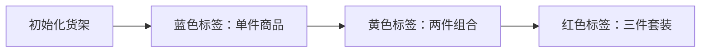

# 题目信息

# Three displays

## 题目描述

### 形式化题面

给定一个有两个性质 $s_i$ 和 $c_i$ 的数组，要求在其中选出三个数，满足：

 - $i<j<k$.
 - $s_i<s_j<s_k$.
 - $c_i+c_j+c_k$ 最小.

## 样例 #1

### 输入

```
5
2 4 5 4 10
40 30 20 10 40
```

### 输出

```
90
```

## 样例 #2

### 输入

```
3
100 101 100
2 4 5
```

### 输出

```
-1
```

## 样例 #3

### 输入

```
10
1 2 3 4 5 6 7 8 9 10
10 13 11 14 15 12 13 13 18 13
```

### 输出

```
33
```

# AI分析结果


### 💡 Kay的C++算法解析：Three Displays 深入学习指南 💡

#### 1. 题目解读与核心算法识别
✨ **本题主要考察**：动态规划（DP）  
🗣️ **初步分析**：
> 这道题就像在商店里挑选三件展示品，要求体积（s）从小到大排列，同时总花费（c）最小。DP就像一位精明的采购经理：他先记录买**单件商品**的最低花费（基础状态），再逐步计算**两件组合**的最优解，最后推导**三件套装**的最优方案。  
> - **核心思路**：定义`dp[i][k]`表示以第`i`件商品作为**第k件**时的最小花费。通过两层循环（枚举商品位置+当前件数）递推最优解  
> - **可视化设计**：动画将用三种颜色标记DP状态（蓝=单件/黄=两件/红=三件），当`s[j]<s[i]`时触发金色连线动画，实时显示状态转移和数值更新  
> - **复古游戏化**：采用8-bit商店模拟场景，每次状态更新播放"金币音效"，组合成功时播放胜利音效，用像素小人演示"采购过程"

---

#### 2. 精选优质题解参考
**题解一（小菜鸟）**  
* **点评**：巧妙避开DP，通过枚举中间位置将复杂度从O(n³)降至O(n²)。左右扫描时用变量动态记录最小值（`c[l]`/`c[r]`），代码简洁高效。亮点在于用`0x7fffffff`初始化边界值，避免特殊判断。  

**题解二（love_luke）**  
* **点评**：标准DP实现，状态定义清晰（`f[i][k]`=第i件作为第k件的最小花费）。通过`k=2->3`的循环顺序自然实现状态递推，边界处理严谨（`memset`初始化极大值）。  

**题解三（Tweetuzki）**  
* **点评**：进阶优化方案，用权值线段树将复杂度优化至O(n log n)。亮点在于离散化`s`值后，通过两次建树分别优化`dp[i][2]`和`dp[i][3]`的查询效率，适合大数据量场景。

---

#### 3. 核心难点辨析与解题策略
1. **状态定义与维度设计**  
   *分析*：如何定义`dp[i][k]`的含义是关键。优质题解统一采用"以i为第k件"的定义，既覆盖所有情况，又满足无后效性  
   💡 学习笔记：状态定义要像搭积木——每层依赖下层稳固基础  

2. **状态转移的条件控制**  
   *分析*：转移时必须满足`s[j]<s[i]`。题解2通过内层循环自然过滤，题解3用线段树加速查询  
   💡 学习笔记：条件转移是DP的"安全阀门"，确保状态合法  

3. **空间/时间复杂度的权衡**  
   *分析*：基础DP(O(n²)) vs 线段树优化(O(n log n))。当n≤3000时，简单DP更易实现；更大数据需数据结构优化  
   💡 学习笔记：算法选择要匹配数据规模  

✨ **解题技巧总结**  
- **问题分解**：将三元组分解为"单件→两件→三件"的渐进式求解  
- **滚动变量**：枚举中间值时，用临时变量记录左右最小值（题解1）  
- **离散化**：大范围数据先压缩值域（题解3/7）  
- **防御性初始化**：用`0x3f3f3f3f`或`0x7fffffff`标记无效状态  

---

#### 4. C++核心代码实现赏析
**通用核心实现**  
```cpp
#include <cstring>
#include <algorithm>
const int INF = 0x3f3f3f3f;
int main() {
    int n, s[3005], c[3005], dp[3005][4];
    memset(dp, 0x3f, sizeof(dp)); // 初始化无效状态
    for(int i=1; i<=n; ++i) {
        dp[i][1] = c[i];  // 基础状态：单件物品
        for(int k=2; k<=3; ++k) 
        for(int j=1; j<i; ++j) 
            if(s[j] < s[i]) 
                dp[i][k] = std::min(dp[i][k], dp[j][k-1]+c[i]);
    }
    int ans = *std::min_element(&dp[1][3], &dp[n][3]+1);
    std::cout << (ans>=INF ? -1 : ans);
}
```
* **代码解读概要**：  
  1. 初始化所有状态为极大值（无效状态）  
  2. 第一件物品花费就是`c[i]`  
  3. 双层循环递推：外层遍历物品，中层枚举件数，内层查找合法前驱  
  4. 最终遍历所有`dp[i][3]`找最小值  

---

**题解一核心片段**  
```cpp
for(int i=2; i<=n-1; i++) { // 枚举中间点
    int l_min = INF, r_min = INF;
    for(int j=1; j<i; j++) 
        if(s[j]<s[i]) l_min = std::min(l_min, c[j]);
    for(int j=i+1; j<=n; j++)
        if(s[j]>s[i]) r_min = std::min(r_min, c[j]);
    ans = std::min(ans, l_min + c[i] + r_min);
}
```
* **亮点**：化繁为简，空间复杂度O(1)  
* **代码解读**：  
  - 固定中间点`i`后，左右扫描独立进行  
  - 左扫描找比`s[i]`小的最小`c[j]`，右扫描找比`s[i]`大的最小`c[k]`  
  - 用`INF`初始化保证无解时不会被误更新  
* 💡 学习笔记：分治思想能有效降低问题维度  

**题解三权值线段树优化**  
```cpp
// 离散化后建立权值线段树
void update(int pos, int val, int tree[]) {
    while(pos <= n) {
        tree[pos] = std::min(tree[pos], val);
        pos += pos & -pos; // lowbit进位
    }
}
int query(int pos, int tree[]) {
    int res = INF;
    while(pos) {
        res = std::min(res, tree[pos]);
        pos -= pos & -pos;
    }
    return res;
}
```
* **亮点**：O(log n)完成状态查询  
* **代码解读**：  
  - 离散化后将`s`值映射到1~n  
  - `update`在`s[i]`位置更新`dp[i][k]`  
  - `query(1, s[i]-1)`查询比当前小的最优解  
* 💡 学习笔记：数据结构是DP优化的利器  

---

#### 5. 算法可视化：像素动画演示  
**主题**："8-bit商店采购大冒险"  
**核心演示流程**：  


**关键交互设计**：  
1. **像素场景**：  
   - 商品陈列为像素方块，高度=s值，颜色深浅=c值  
   - DP状态区：三行像素灯（蓝/黄/红）显示当前状态值  

2. **动态演示**：  
   - 当扫描到`s[j] < s[i]`时，`i`和`j`之间产生金色连线  
   - 状态更新时对应像素灯闪烁，数值实时变化  
   - 成功组合三件时，商品升起放烟花🎆  

3. **音效系统**：  
   - 状态更新："金币碰撞"声（$）  
   - 无效转移："错误提示"哔声  
   - 组合成功：8-bit胜利旋律  

4. **控制面板**：  
   - 步进按钮：单步观察状态转移  
   - 速度滑块：调整自动演示速度  
   - 模式切换：基础DP vs 线段树优化（对比执行效率）  

---

#### 6. 拓展练习与相似问题思考  
**通用技巧迁移**：  
1. 最长递增子序列(LIS)及其变种  
2. 带权值的最优序列选择问题  
3. 需要数据结构优化的DP问题  

**洛谷推荐**：  
1. **P1020 导弹拦截**  
   → 巩固LIS和贪心思想  
2. **P1091 合唱队形**  
   → 双向LIS应用，强化枚举中间点技巧  
3. **P1439 LCS转LIS**  
   → 体验离散化+DP的经典优化  

---

#### 7. 学习心得与经验分享  
> **来自小菜鸟的经验**："枚举中间点避开了DP思维难点，但需注意左右扫描的独立性"  
> **Kay的总结**：DP的核心在于状态定义——就像为乐高设计说明书，清晰的步骤说明（状态转移）能避免组装错误（逻辑漏洞）。多测试边界数据（如全递增/递减序列）是避免WA的关键！  

---  
掌握DP就像学习魔术，理解背后的数学原理后，你也能变出优雅的解！下次遇到序列问题，记得尝试"分解状态+递推求解"的魔法哦~ ✨

---
处理用时：171.34秒