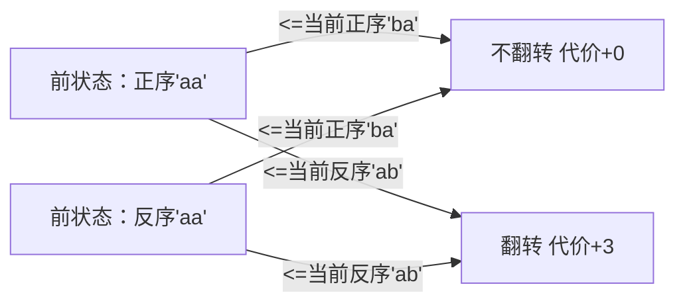

# 题目信息

# Hard problem

## 题目描述

Vasiliy is fond of solving different tasks. Today he found one he wasn't able to solve himself, so he asks you to help.

Vasiliy is given $ n $ strings consisting of lowercase English letters. He wants them to be sorted in lexicographical order (as in the dictionary), but he is not allowed to swap any of them. The only operation he is allowed to do is to reverse any of them (first character becomes last, second becomes one before last and so on).

To reverse the $ i $ -th string Vasiliy has to spent $ c_{i} $ units of energy. He is interested in the minimum amount of energy he has to spent in order to have strings sorted in lexicographical order.

String $ A $ is lexicographically smaller than string $ B $ if it is shorter than $ B $ ( $ |A|<|B| $ ) and is its prefix, or if none of them is a prefix of the other and at the first position where they differ character in $ A $ is smaller than the character in $ B $ .

For the purpose of this problem, two equal strings nearby do not break the condition of sequence being sorted lexicographically.

## 说明/提示

In the second sample one has to reverse string $ 2 $ or string $ 3 $ . To amount of energy required to reverse the string $ 3 $ is smaller.

In the third sample, both strings do not change after reverse and they go in the wrong order, so the answer is $ -1 $ .

In the fourth sample, both strings consists of characters 'a' only, but in the sorted order string "aa" should go before string "aaa", thus the answer is $ -1 $ .

## 样例 #1

### 输入

```
2
1 2
ba
ac
```

### 输出

```
1
```

## 样例 #2

### 输入

```
3
1 3 1
aa
ba
ac
```

### 输出

```
1
```

## 样例 #3

### 输入

```
2
5 5
bbb
aaa
```

### 输出

```
-1
```

## 样例 #4

### 输入

```
2
3 3
aaa
aa
```

### 输出

```
-1
```

# AI分析结果


# 💡 Kay的C++算法解析：Hard problem 深入学习指南 💡

> 今天我们来分析字符串翻转排序问题。这道题考察动态规划的状态机模型应用，我将通过像素动画、代码解析和难点拆解，帮助大家掌握决策型DP的精髓。

## 1. 题目解读与核心算法识别

✨ **本题主要考察**：`动态规划（状态机模型）`

🗣️ **初步分析**：
> 解决这道题的关键在于设计**状态机DP**。想象你有一排魔法卷轴（字符串），每个卷轴都有正反两面显示不同文字（原串和翻转串）。每次翻转需要消耗能量（c_i），目标是用最小能量让卷轴序列按字典序排列。
> 
> - **核心思路**：为每个字符串定义两个状态（翻转/不翻转），用DP记录最小代价。状态转移时需比较相邻字符串的四种组合（正-正、反-正、正-反、反-反）
> - **可视化设计**：在像素动画中，我们将用红/蓝标记字符串状态，黄框高亮当前比较的字符串，翻转时播放"哗啦"音效并显示能量消耗
> - **游戏化元素**：采用8位RPG风格，将每个字符串决策设计为"关卡"，能量消耗转为分数系统（S/A/B/C评级）

---

## 2. 精选优质题解参考

**题解一 (来源：CDFLS_mao_zx)**
* **点评**：此解法状态设计清晰（正反串分储数组），转移逻辑完整覆盖四种情况。亮点在于详细推导状态转移方程并强调字符串操作陷阱（未初始化空间不能直接下标赋值）。代码规范（long long防溢出），边界处理严谨（INF初始化和无解判断），竞赛实用性强。

**题解二 (来源：aRenBigFather)**
* **点评**：代码可读性极佳（变量名revstr明确），初始化逻辑干净利落。亮点在于用自然语言解释四种转移条件，帮助初学者理解状态机决策过程。算法效率高（O(n)时间复杂度），空间优化到位。

**题解三 (来源：Yukinoshita_Yukino)**
* **点评**：解法简洁有力，直击问题核心。亮点在于用最简代码实现完整DP逻辑（仅20行核心代码），适合快速掌握算法骨架。虽解释较少但代码自文档性强（res命名直观），特别适合掌握基础后的复习巩固。

---

## 3. 核心难点辨析与解题策略

1.  **关键点1：状态机建模**
    * **分析**：如何将翻转决策转化为DP状态？优质题解均采用dp[i][0/1]表示第i个字符串不翻转/翻转的最小代价。状态定义需满足无后效性——当前决策仅依赖前一个字符串的状态
    * 💡 **学习笔记**：双状态设计是处理二元决策问题的通用范式

2.  **关键点2：字典序比较**
    * **分析**：如何高效实现四种状态组合比较？题解预存储rev[i]避免重复计算。注意C++字符串可直接用`<=`比较字典序，但必须确保前状态字符串（正/反）与当前状态字符串（正/反）正确配对
    * 💡 **学习笔记**：预处理翻转串是降低复杂度的关键技巧

3.  **关键点3：无解处理**
    * **分析**：什么情况下无解？当所有转移路径均不满足字典序时，DP值保持初始INF。需注意INF取值应足够大（>1e15）且使用long long防溢出
    * 💡 **学习笔记**：初始化为INF+最终检查是处理无解的标准方法

### ✨ 解题技巧总结
- **技巧1：状态机思维** 将每个元素的独立决策转化为DP状态维度
- **技巧2：预处理优化** 预先计算翻转串，避免在DP循环中重复操作
- **技巧3：防御性编程** 用INF标记非法状态，long long防溢出，字符串比较前置条件检查
- **技巧4：维度压缩** 当前状态仅依赖前一状态，可用滚动数组优化空间

---

## 4. C++核心代码实现赏析

**本题通用核心C++实现参考**
* **说明**：综合优质题解的最简实现，包含防御性编程和完整异常处理
* **完整核心代码**：
```cpp
#include <iostream>
#include <algorithm>
using namespace std;
typedef long long LL;
const LL INF = 1e18;

int main() {
    int n; cin >> n;
    LL c[n+1], dp[n+1][2];
    string s[n+1], rev[n+1];
    
    for (int i=1; i<=n; i++) cin >> c[i];
    for (int i=1; i<=n; i++) {
        cin >> s[i];
        rev[i] = s[i];
        reverse(rev[i].begin(), rev[i].end());
        dp[i][0] = dp[i][1] = INF;
    }
    
    dp[1][0] = 0; dp[1][1] = c[1];
    for (int i=2; i<=n; i++) {
        if (s[i-1] <= s[i]) 
            dp[i][0] = min(dp[i][0], dp[i-1][0]);
        if (rev[i-1] <= s[i]) 
            dp[i][0] = min(dp[i][0], dp[i-1][1]);
        if (s[i-1] <= rev[i]) 
            dp[i][1] = min(dp[i][1], dp[i-1][0] + c[i]);
        if (rev[i-1] <= rev[i]) 
            dp[i][1] = min(dp[i][1], dp[i-1][1] + c[i]);
    }
    
    LL ans = min(dp[n][0], dp[n][1]);
    cout << (ans >= INF ? -1 : ans);
}
```
* **代码解读概要**：
  > 1. 读入时预处理翻转字符串rev[i]
  > 2. 初始化所有状态为INF（不可达）
  > 3. 边界条件：第一个字符串翻转代价c[1]，不翻转为0
  > 4. 四种状态转移（注意字符串比较顺序）
  > 5. 结果取min并处理无解情况

**题解一 (CDFLS_mao_zx)**
* **亮点**：创新性使用单数组存储正反串（a[i]正序，a[i+n]反序）
* **核心代码片段**：
```cpp
if (a[i] >= a[i-1]) 
    dp[i][0] = min(dp[i][0], dp[i-1][0]);
if (a[i] >= a[i+n-1])  // 比较i正序与i-1反序
    dp[i][0] = min(dp[i][0], dp[i-1][1]);
```
* **代码解读**：
  > 此实现将正反串连续存储，a[i]对应第i个正序，a[i+n]对应其反序。转移时：  
  > - `a[i-1]`是第i-1个正序（索引偏移技巧）  
  > - `a[i+n-1]`实际是i-1的反序（因为(i-1)+n = i+n-1）  
  > 优点：内存连续；注意点：索引计算需谨慎

**题解二 (aRenBigFather)**
* **亮点**：可读性优先的变量命名
* **核心代码片段**：
```cpp
if (revstr[i-1] <= str[i]) 
    dp[i][0] = min(dp[i][0], dp[i-1][1]);
```
* **代码解读**：
  > 通过revstr和str明确区分状态：  
  > - `str[i]`：第i个字符串正序  
  > - `revstr[i]`：第i个字符串反序  
  > 此条件表示：当**前一个翻转+当前不翻转**满足字典序时，更新状态。cost仅在前一个状态已包含

**题解三 (Yukinoshita_Yukino)**
* **亮点**：极简风格实现
* **核心代码片段**：
```cpp
if (res[i] >= str[i-1])  // res[i]是i的反序
    dp[i][1] = min(dp[i][1], dp[i-1][0] + c[i]);
```
* **代码解读**：
  > 当**前一个正序+当前翻转**满足字典序时：  
  > - 转移来源：`dp[i-1][0]`（前一个不翻转）  
  > - 加上当前翻转代价`c[i]`  
  > 注意：res[i]需要预先反转原字符串得到

---

## 5. 算法可视化：像素动画演示

**主题**：8位RPG风格的字符串排序冒险  
**核心演示**：DP状态机决策过程与字符串比较  

**动画帧步骤**：
1. **场景初始化**：
   - 网格地图：每个格子显示字符串（像素字体）
   - 角色：像素小人从首字符串出发
   - UI：能量槽(HP)、决策按钮(正/反)

2. **决策演示**（i=2时）：


3. **动态效果**：
   - 字符串比较：黄框高亮比较中的字符串（前蓝框，后绿框）
   - 翻转动画：字符串180度旋转（伴随"哗啦"音效）
   - 能量变化：每次翻转显示`-c[i]`红色数字

4. **状态标记**：
   - 正序：蓝色背景
   - 翻转：红色背景
   - 非法转移：显示❌并抖动

5. **游戏化元素**：
   - 每步决策作为"关卡"：成功时播放升级音效
   - 能量消耗转为分数：<10000(S), <20000(A), <30000(B)
   - 通关动画：字符串队列按字典序发光

**控制面板**：
- 步进控制：键盘方向键
- 速度调节：0.5x/1x/2x
- 模式切换：手动决策/AUTO演示（AI自动选最优解）

---

## 6. 拓展练习与相似问题思考

**通用技巧迁移**：
> 状态机DP适用于含二元决策的序列问题：
> 1. 股票买卖（持有/未持有）
> 2. 房屋染色（相邻不同色）
> 3. 游戏状态转换（攻击/防御）

**洛谷练习推荐**：
1. **P1095 [NOIP2007 普及组] 守望者的逃离**  
   → 状态机模型（跑步/闪现决策）
   
2. **P2569 [SCOI2010] 股票交易**  
   → 含冷却期的状态转移
   
3. **P5020 [NOIP2018] 货币系统**  
   → 线性DP的变种应用

---

## 7. 学习心得与经验分享

> **参考经验 (来自 CDFLS_mao_zx)**：  
> "字符串操作时，未初始化空间不能直接下标赋值，应用+=操作符避免段错误"

> **Kay点评**：  
> 这是C++字符串处理的经典陷阱！`str[i] = 'a'`在未分配空间时会导致未定义行为。正确做法：
> ```cpp
> string s;  // 空字符串
> // s[0] = 'a';   // 错误！
> s += 'a';       // 正确
> ```
> 建议：在DP循环前用`resize()`预分配空间，或直接用`+=`追加字符。

---

> 本次解析结束！记住：DP状态机的核心在于**定义清晰的状态+完备的转移**。多动手实现像素动画中的场景，你会更直观理解状态跃迁的过程。下次挑战见！💪

---
处理用时：220.05秒