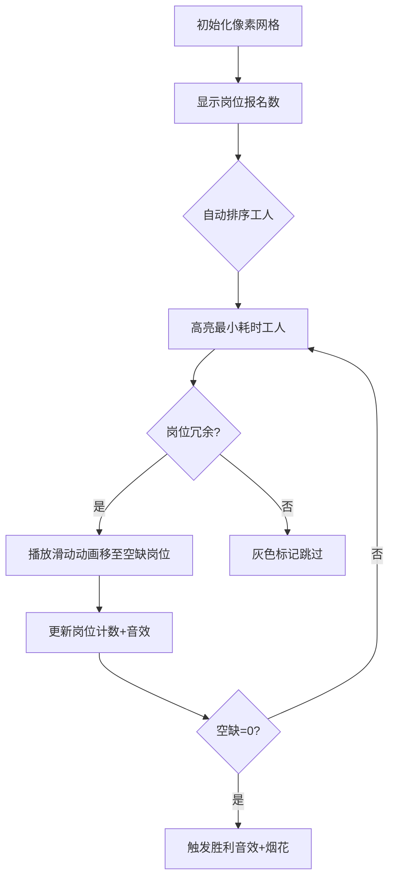

# 题目信息

# Lazyland

## 题目描述

The kingdom of Lazyland is the home to $ n $ idlers. These idlers are incredibly lazy and create many problems to their ruler, the mighty King of Lazyland.

Today $ k $ important jobs for the kingdom ( $ k \le n $ ) should be performed. Every job should be done by one person and every person can do at most one job. The King allowed every idler to choose one job they wanted to do and the $ i $ -th idler has chosen the job $ a_i $ .

Unfortunately, some jobs may not be chosen by anyone, so the King has to persuade some idlers to choose another job. The King knows that it takes $ b_i $ minutes to persuade the $ i $ -th idler. He asked his minister of labour to calculate the minimum total time he needs to spend persuading the idlers to get all the jobs done. Can you help him?

## 说明/提示

In the first example the optimal plan is to persuade idlers 1, 6, and 8 to do jobs 2, 4, and 6.

In the second example each job was chosen by some idler, so there is no need to persuade anyone.

## 样例 #1

### 输入

```
8 7
1 1 3 1 5 3 7 1
5 7 4 8 1 3 5 2
```

### 输出

```
10
```

## 样例 #2

### 输入

```
3 3
3 1 2
5 3 4
```

### 输出

```
0
```

# AI分析结果


### 💡 Kay的C++算法解析：Lazyland 深入学习指南 💡

**引言**  
今天我们来分析CF1089L Lazyland这道贪心算法题。本指南将帮助大家理解如何用最小代价劝说懒人完成所有工作，通过清晰的算法解析、代码示例和生动的像素动画演示，助你掌握贪心算法的核心思想。

---

#### **1. 题目解读与核心算法识别**  
✨ **本题主要考察**：贪心算法  

🗣️ **初步分析**：  
> 这道题的核心是**贪心策略**。想象国王要劝懒人换工作，他一定会优先选择"最容易说服"（即耗时最少）且"所在岗位有多余人力"的懒人。就像整理凌乱的玩具时，我们总是先收拾最容易放回原位的那些。  
> - **解题思路**：统计每个工作的报名人数，优先劝说耗时最小且岗位冗余的懒人，直到所有工作都有人负责。  
> - **算法流程**：  
>   1. 用桶数组统计每个工作的报名人数  
>   2. 按劝说耗时从小到大排序懒人  
>   3. 遍历排序列表，劝说冗余岗位的懒人并累加时间  
> - **可视化设计**：用像素方块表示工作和工人，高亮"可劝说的最小耗时工人"，移动动画展示岗位调配过程，音效强化关键操作。  
> - **复古像素风**：采用8-bit游戏风格，工人移动时播放滑动音效，成功时触发胜利音效，控制面板支持单步调试和自动演示（类似"贪吃蛇AI"寻路）。

---

#### **2. 精选优质题解参考**  
筛选标准：思路清晰度 ★★★★☆，代码规范性 ★★★★☆，算法有效性 ★★★★★  

**题解一（作者：Molina）**  
* **点评**：  
  思路直白易懂，用桶数组`ton[]`统计岗位报名数，特判`k==0`的边界情况。代码规范（变量名`a[i].x/y`含义明确），贪心排序后遍历的流程清晰，实践价值高（可直接用于竞赛）。亮点是**动态更新桶数组**和**及时终止循环**的优化。

**题解二（作者：lbh666）**  
* **点评**：  
  结构体命名合理（`pot/time`），用`tot`统计空缺岗位数，逻辑严谨。代码注释详细，强调`long long`防溢出，对青少年学习者友好。亮点是**分离输入与统计逻辑**，增强可读性。

**题解三（作者：ran_qwq）**  
* **点评**：  
  创新性地用`vector`存储每个岗位的报名者，按耗时降序排序后保留最大值（即最难劝说者），其余人参与贪心选择。思路独特且正确，代码简洁。亮点是**避免重复劝说**的预处理技巧。

---

#### **3. 核心难点辨析与解题策略**  
1. **难点一：如何识别可劝说的懒人？**  
   * **分析**：必须满足两个条件——(1) 该岗位报名数≥2 (2) 当前空缺岗位数>0。优质题解用桶数组动态跟踪岗位人数。  
   * 💡 **学习笔记**：桶数组是实时监控岗位冗余的关键工具。

2. **难点二：为什么按耗时排序能保证最优？**  
   * **分析**：贪心策略的核心是局部最优=全局最优。每次选择最小耗时的冗余懒人，最终总和必然最小（反证法可证）。  
   * 💡 **学习笔记**：贪心问题中，排序常是突破口。

3. **难点三：如何避免劝说后岗位空缺？**  
   * **分析**：只劝说报名数≥2的岗位，劝说后立即将该岗位人数减1，确保原岗位仍有人值守。  
   * 💡 **学习笔记**：动态维护数据结构状态是贪心的精髓。

**✨ 解题技巧总结**  
- **问题分解**：拆解为"统计→排序→选择"三步骤  
- **边界处理**：特判`k==0`的情况（如Molina解法）  
- **防溢出技巧**：劝说时间总和可能超`int`（如lbh666开`long long`）

---

#### **4. C++核心代码实现赏析**  
**本题通用核心实现**  
```cpp
#include <iostream>
#include <algorithm>
using namespace std;
const int N = 1e5 + 5;

struct Person {
    int job;    // 选择的工作
    long long time; // 劝说时间
} a[N];
long long bucket[N]; // 桶数组统计岗位报名数

bool cmp(Person x, Person y) { return x.time < y.time; }

int main() {
    int n, k; cin >> n >> k;
    int count = 0; // 已覆盖岗位数
    for (int i = 0; i < n; i++) {
        cin >> a[i].job;
        if (bucket[a[i].job]++ == 0) count++; 
    }
    for (int i = 0; i < n; i++) cin >> a[i].time;

    if (count >= k) { cout << 0; return 0; } // 特判
    
    sort(a, a + n, cmp); // 按劝说时间升序排序
    long long ans = 0;
    int need = k - count; // 需填补的岗位数

    for (int i = 0; i < n && need; i++) {
        if (bucket[a[i].job] > 1) { // 只劝冗余岗位的人
            ans += a[i].time;
            bucket[a[i].job]--;
            need--;
        }
    }
    cout << ans;
}
```
**代码解读概要**：  
1. 桶数组`bucket`统计初始岗位覆盖  
2. 按`time`排序后遍历，只选择冗余岗位(`bucket>1`)的工人  
3. 动态更新桶数组和剩余岗位数`need`

---

**优质题解片段赏析**  
**题解一（Molina）**  
```cpp
sort(a+1, a+n+1, cmp); // 按时间排序
for(int i=1; i<=n; i++){
    if(ton[a[i].x] >= 2){ // 岗位冗余检测
        ans += a[i].y;
        ton[a[i].x]--; // 更新桶数组
        k--;           // 更新空缺计数
    }
    if(k==0) break;    // 及时终止
}
```
**代码解读**：  
> 排序后直接遍历，`ton[a[i].x]>=2`确保不破坏原有岗位。`k`动态跟踪剩余空缺数，达成条件立即退出，避免无效循环。  
💡 **学习笔记**：循环终止条件是贪心算法的常见优化点。

**题解二（lbh666）**  
```cpp
sort(a+1, a+n+1, cmp); 
for(int i=1; i<=n; i++){
    if(tot == 0) break; // 无空缺时退出
    if(b[a[i].pot] > 1) { 
        ans += a[i].time;
        b[a[i].pot]--; // 桶更新
        tot--;         // 空缺减少
    }
}
```
**代码解读**：  
> 用`tot`替代`k`表示空缺数，防止原变量被修改。`b[a[i].pot]--`保证原岗位留人，`tot--`精准控制填补进度。  
💡 **学习笔记**：维护独立空缺计数器增强可读性。

**题解三（ran_qwq）**  
```cpp
vector<int> v[N]; // 存储每个岗位的报名者
for(int i=1; i<=m; i++) 
    sort(v[i].begin(), v[i].end(), greater<int>()); // 降序排序

vector<int> candidates;
for(int i=1; i<=m; i++)
    for(int j=1; j < v[i].size(); j++) // 跳过最大值（留岗者）
        candidates.push_back(v[i][j]); 

sort(candidates.begin(), candidates.end());
for(int i=0; i<k; i++) // k为初始空缺数
    ans += candidates[i];
```
**代码解读**：  
> 创新点：每个岗位保留耗时最大者（最难劝说），其余人加入候选池。对候选池升序排序后直接取前`k`个最小耗时。  
💡 **学习笔记**：预处理剔除"必须留岗者"可简化贪心选择。

---

#### **5. 算法可视化：像素动画演示**  
**主题**："工人调度大作战"（8-bit像素风格）  

**核心演示流程**：  


**交互设计**：  
1. **像素元素**：  
   - 岗位：颜色方块（绿色=已覆盖，红色=空缺）  
   - 工人：像素小人（头顶显示耗时），高亮当前最小耗时者  
2. **控制面板**：  
   - 单步执行：空格键触发  
   - 自动模式：AI自动调度（速度可调）  
   - 音效：滑动声（移动时）、叮~（选择时）、胜利号角（完成时）  
3. **动态显示**：  
   - 桶数组数值实时显示在岗位下方  
   - 当前累计耗时悬浮显示  

**设计意义**：通过游戏化流程直观展现**贪心选择**和**动态更新**，强化"最小耗时优先"的核心思想。

---

#### **6. 拓展练习与相似问题**  
**通用技巧迁移**：  
贪心在分配问题中的应用：  
1. 会议安排（优先选结束时间最早的）  
2. 合并果子（优先合并最小的两堆）  
3. 任务调度（优先处理耗时最短的任务）  

**洛谷练习题推荐**：  
1. **P1090 [NOIP2004 提高组] 合并果子**  
   → 巩固贪心思想+优先队列应用  
2. **P1803 凌乱的yyy / 线段覆盖**  
   → 贪心策略解决区间调度问题  
3. **P3817 小A的糖果**  
   → 贪心处理相邻约束条件  

---

#### **7. 学习心得与经验分享**  
本次题解中未发现作者分享调试经验，但Kay提醒大家：  
> **调试技巧**：在贪心算法中，最易出错的是**边界处理**（如`k=0`）和**数据结构更新`（如桶数组）。建议用小型测试用例（如样例2）逐步验证循环逻辑。

---

**结语**  
通过本次分析，相信大家已掌握Lazyland的贪心解法精髓。记住：贪心的关键在于**排序+局部最优选择**。接下来尝试用像素动画工具可视化自己的代码吧！遇到问题随时找Kay讨论~ 💪

---
处理用时：251.83秒