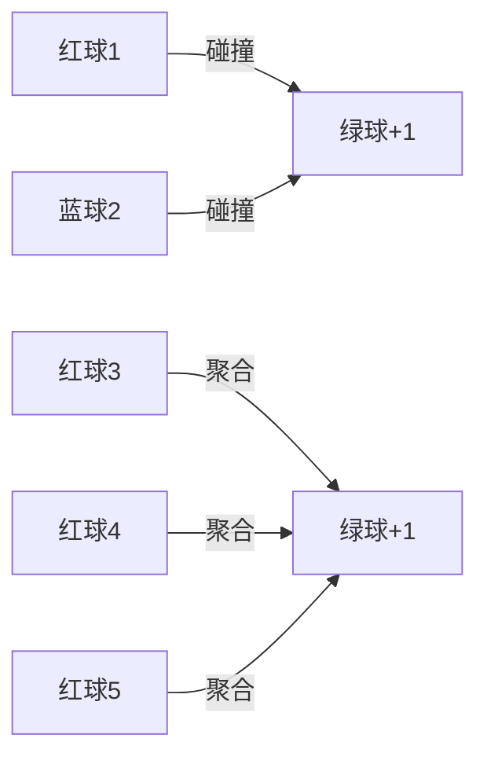

# 题目信息

# Merge it!

## 题目描述

You are given an array $ a $ consisting of $ n $ integers $ a_1, a_2, \dots , a_n $ .

In one operation you can choose two elements of the array and replace them with the element equal to their sum (it does not matter where you insert the new element). For example, from the array $ [2, 1, 4] $ you can obtain the following arrays: $ [3, 4] $ , $ [1, 6] $ and $ [2, 5] $ .

Your task is to find the maximum possible number of elements divisible by $ 3 $ that are in the array after performing this operation an arbitrary (possibly, zero) number of times.

You have to answer $ t $ independent queries.

## 说明/提示

In the first query of the example you can apply the following sequence of operations to obtain $ 3 $ elements divisible by $ 3 $ : $ [3, 1, 2, 3, 1] \rightarrow [3, 3, 3, 1] $ .

In the second query you can obtain $ 3 $ elements divisible by $ 3 $ with the following sequence of operations: $ [1, 1, 1, 1, 1, 2, 2] \rightarrow [1, 1, 1, 1, 2, 3] \rightarrow [1, 1, 1, 3, 3] \rightarrow [2, 1, 3, 3] \rightarrow [3, 3, 3] $ .

## 样例 #1

### 输入

```
2
5
3 1 2 3 1
7
1 1 1 1 1 2 2
```

### 输出

```
3
3
```

# AI分析结果


### 💡 Kay的C++算法解析：Merge it! 深入学习指南 💡

#### 1. 题目解读与核心算法识别
✨ **本题主要考察**：贪心策略（模运算分类应用）  
🗣️ **初步分析**：  
> 解决"Merge it!"的关键在于**余数分类与贪心合并**。想象三种颜色的球：绿球（余0）直接得分，红球（余1）和蓝球（余2）需配对融合。  
> - **核心策略**：① 绿球直接计数 ② 红球+蓝球配对融合 ③ 剩余同色球三合一  
> - **难点**：证明最优顺序（先配对后三合）  
> - **可视化设计**：用像素球体动态演示融合过程：红蓝球碰撞变绿（"叮"声效），三个红/蓝球聚合变绿（"咚"声效），绿球计数器实时更新  

---

#### 2. 精选优质题解参考
**题解一（Raych123）**  
* **点评**：思路阐述清晰（比喻红蓝球配对），代码结构完整（详细分支处理），实践性强（边界处理严谨）。亮点在于用生活化比喻降低理解门槛，特别适合初学者建立直观认知。

**题解二（fjy666）**  
* **点评**：算法实现高效（min/max压缩代码），空间复杂度优化至O(1)。亮点在于用数学思维消除冗余分支，`y/3`的处理展现抽象能力，适合进阶学习者理解优化本质。

**题解三（_HiKou_）**  
* **点评**：代码可读性极佳（注释明确），流程分步实现（先配对后处理剩余）。亮点在于模块化思维（`pei`变量分离关注点），调试友好的输出逻辑，适合掌握基础后的巩固练习。

---

#### 3. 核心难点辨析与解题策略
1. **难点：余数性质抽象**  
   * **分析**：识别操作不改变模3性质（(a+b)%3≡(a%3+b%3)%3），需通过具体例子引导（如演示3+6≡0+0）。  
   * 💡 **学习笔记**：模运算的"不变性"是分类基础  

2. **难点：合并顺序证明**  
   * **分析**：用反证法说明优先配对效率最高（2个数得1分 vs 3个数得1分），可视化中高亮不同策略的得分差异  
   * 💡 **学习笔记**：贪心策略需评估"单次操作收益"  

3. **难点：剩余量处理**  
   * **分析**：同余数合并依赖整除性质（3k≡0），需强调整数除法向下取整的特性（演示7个红球得2分）  
   * 💡 **学习笔记**：`n/3`本质是分组能力的量化  

✨ **解题技巧总结**  
- **问题降维**：将数值运算转化为余数计数  
- **分阶段贪心**：优先高收益操作（配对＞三合）  
- **防御性计算**：显式处理`cnt[1]-pairs`避免负值  

---

#### 4. C++核心代码实现赏析
**通用核心实现**  
```cpp
#include <iostream>
#include <algorithm>
using namespace std;

int main() {
    int t;
    cin >> t;
    while (t--) {
        int n, cnt[3] = {};
        cin >> n;
        for (int i = 0, x; i < n; i++) {
            cin >> x;
            cnt[x % 3]++; // 余数分类
        }
        int pairs = min(cnt[1], cnt[2]); // 红蓝配对数
        cout << cnt[0] + pairs + (cnt[1]-pairs)/3 + (cnt[2]-pairs)/3 << endl;
    }
    return 0;
}
```
**代码解读概要**：  
> ① `cnt[]`统计三类余数 ② `pairs`计算最大有效配对 ③ 最终得分=绿球+配对分+剩余红/蓝球合并分  

**题解一片段（Raych123）**  
```cpp
if (cnt[1] > cnt[2]) {
    cnt[1] -= cnt[2];
    printf("%d\n", cnt[0] + cnt[2] + cnt[1] / 3);
}
```
**亮点**：分支显式处理，逻辑具象化  
**学习笔记**：条件分支虽直白，但min/max可压缩代码量  

**题解二片段（fjy666）**  
```cpp
int x = min(cnt[1], cnt[2]);
int y = max(cnt[1], cnt[2]) - x;
printf("%d\n", cnt[0] + x + y/3);
```
**亮点**：数学优化消除分支  
**学习笔记**：`y`抽象剩余量体现问题本质  

**题解三片段（_HiKou_）**  
```cpp
ans = ys[0];
int pei = min(ys[1], ys[2]); // 分离配对阶段
ans += pei;
ys[1] -= pei; ys[2] -= pei; // 显式更新计数
ans += ys[1]/3 + ys[2]/3;   // 独立处理剩余
```
**亮点**：分阶段变量命名提升可读性  
**学习笔记**：操作阶段化利于调试复查  

---

#### 5. 算法可视化：像素动画演示
**主题**：贪吃球融合大作战（8-bit像素风）  
**核心设计**：  


**交互实现**：  
1. **初始化**：像素网格随机生成红/蓝/绿球（16色系）  
2. **配对阶段**：  
   - 点击"自动配对"：红蓝球寻路接近→碰撞特效（火花动画+8-bit音效）→变绿球  
   - 计数器实时更新：`绿球+=1`，`红球--`，`蓝球--`  
3. **三合阶段**：  
   - 拖动滑块调速：观察三个红球聚合成绿球（进度条填充动画）  
   - 失败处理：剩余≤2球时显示灰色锁定状态  
4. **游戏化元素**：  
   - 关卡进度：每关初始球量递增  
   - 音效体系：配对（叮！），三合（咚！），通关（胜利旋律）  

**旁白提示**：  
> "注意看！这三个红球正在聚合..." → 高亮聚合路径  
> "叮！红+蓝=绿，效率最大化！" → 显示收益对比面板  

---

#### 6. 拓展练习与相似问题思考
**技巧迁移场景**：  
1. 模5最大得分（余数配对扩展到其他模数）  
2. 硬币组合问题（1/2/5元凑整）  
3. 字符串删除（相邻字符特定规则融合）  

**洛谷推荐**：  
1. **P1090 合并果子**  
   🗣️ 巩固贪心策略的经典场景，优先队列应用  
2. **P2691 合并检测**  
   🗣️ 模运算分组的变形实践，强化抽象能力  
3. **P1106 删数问题**  
   🗣️ 贪心策略的逆向思维训练，对比本题合并操作  

---

#### 7. 学习心得与经验分享
> 本次题解未包含作者调试心得，但需注意：  
> **典型错误**：剩余球未除3直接累加 → 动画演示中高亮`/3`计算步骤  
> **调试技巧**：打印`cnt[]`中间值验证阶段结果  

---
> 掌握余数分类的降维思想，你就能解决一大类合并优化问题！下次遇到类似题目时，记得先问自己：操作会改变哪些**不变性**？绿色小球在向你招手哦！🚀

---
处理用时：247.41秒