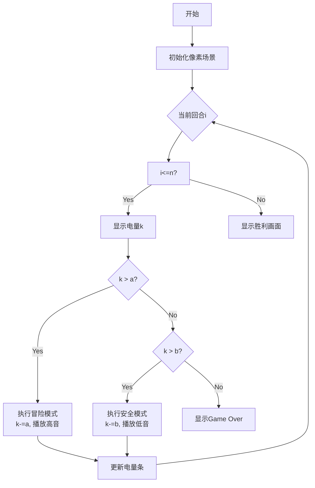

# 题目信息

# Computer Game

## 题目描述

Vova is playing a computer game. There are in total $ n $ turns in the game and Vova really wants to play all of them. The initial charge of his laptop battery (i.e. the charge before the start of the game) is $ k $ .

During each turn Vova can choose what to do:

- If the current charge of his laptop battery is strictly greater than $ a $ , Vova can just play, and then the charge of his laptop battery will decrease by $ a $ ;
- if the current charge of his laptop battery is strictly greater than $ b $ ( $ b<a $ ), Vova can play and charge his laptop, and then the charge of his laptop battery will decrease by $ b $ ;
- if the current charge of his laptop battery is less than or equal to $ a $ and $ b $ at the same time then Vova cannot do anything and loses the game.

Vova wants to complete the game (Vova can complete the game if after each of $ n $ turns the charge of the laptop battery is strictly greater than $ 0 $ ). Among all possible ways to complete the game, Vova wants to choose the one where the number of turns when he just plays is the maximum possible. It is possible that Vova cannot complete the game at all.

Your task is to find out the maximum possible number of turns Vova can just play or report that Vova cannot complete the game.

You have to answer $ q $ independent queries.

## 说明/提示

In the first example query Vova can just play $ 4 $ turns and spend $ 12 $ units of charge and then one turn play and charge and spend $ 2 $ more units. So the remaining charge of the battery will be $ 1 $ .

In the second example query Vova cannot complete the game because even if he will play and charge the battery during each turn then the charge of the notebook battery will be $ 0 $ after the last turn.

## 样例 #1

### 输入

```
6
15 5 3 2
15 5 4 3
15 5 2 1
15 5 5 1
16 7 5 2
20 5 7 3
```

### 输出

```
4
-1
5
2
0
1
```

# AI分析结果


# 💡 Kay的C++算法解析：Computer Game 深入学习指南 💡

> 我是Kay，一位专注于C++算法教学的引导者。今天我们将深入分析Codeforces题目"Computer Game"，帮助你在理解核心算法的同时掌握高效解题技巧。让我们一起探索这个有趣的电池管理问题！

## 1. 题目解读与核心算法识别

✨ **本题主要考察**：`数学推导`（公式优化）与`二分答案`（替代解法）

🗣️ **初步分析**：
> 这道题就像在管理一个游戏角色的电池电量——我们需要在有限的电量资源下做出最优决策。想象你是一位太空探险家，在n个星球探险中，每次降落可以选择"冒险模式"(耗电a)或"安全模式"(耗电b)，目标是尽可能多选冒险模式且保证飞船电量始终>0。

- **核心思路**：多数题解采用**数学公式法**直接计算最大冒险次数：先检查无解情况(k≤nb)，再通过`(k-nb-1)/(a-b)`计算理论最大值，最后与n取最小值。少数题解使用**二分法**验证可行性。
- **算法流程**：1) 检查无解(k≤nb)→输出-1；2) 计算理论冒险次数x=(k-nb-1)/(a-b)；3) 输出min(x,n)。关键变量`k`(电量)、`n`(回合数)的动态变化是可视化重点。
- **像素动画设计**：采用复古太空探险主题，飞船电池以像素条显示。每次选择模式时：
  - 冒险模式：飞船闪烁红光，播放高音"叮！"
  - 安全模式：飞船闪烁蓝光，播放低音"咚！"
  - 关键步骤高亮：当前回合编号、电量扣除值、剩余电量实时更新
  - 失败场景：电量≤0时飞船爆炸像素动画+低沉音效

---

## 2. 精选优质题解参考

> 我从思路清晰度、代码规范性、算法效率和实践价值四个维度评估题解，精选出3个≥4星的优质解法：

**题解一：wucstdio（公式法）**
* **点评**：思路直击本质——将问题转化为"每次模式切换增加(a-b)耗电"的数学模型。代码简洁高效(时间复杂度O(1))，边界处理严谨(k-=b*n后判断≤0)。变量命名规范(`k,n,a,b`)，竞赛实战性强。亮点在于用一行核心公式`min((k-1)/(a-b),n)`完美解决问题。

**题解二：zhouzihe（公式法）**
* **点评**：对关键细节"k减1"的解释特别清晰（确保最终电量>0），帮助学习者理解边界条件。代码结构工整，将(a-b)预先计算提升效率。实践价值高，三元运算符`k>=0?min(k/a,n):-1`的处理方式展示了优雅的代码技巧。

**题解三：WydnksqhbD（公式法）**
* **点评**：创新性地用"鸡兔同笼"类比解题思路，降低理解门槛。代码包含必要的IO优化(`ios::sync_with_stdio`)，变量作用明确。亮点在于将抽象问题转化为经典数学模型，帮助建立解题思维框架。

---

## 3. 核心难点辨析与解题策略

> 解决这类资源优化问题时，需特别注意以下三个关键点：

1.  **无解条件判定**
    * **分析**：当最小消耗模式(n次安全模式)的总耗电`n*b`≥初始电量k时，任何策略都会失败。优质题解优先处理此边界条件（如`if(k<=n*b)`）
    * 💡 **学习笔记**：先计算最保守策略，是优化问题的通用入口

2.  **严格大于0的边界处理**
    * **分析**：题目要求回合后电量**严格大于0**，因此公式中`(k-nb-1)`的"-1"确保最终至少剩1单位电。这是最易出错的细节（如样例k=16,n=7,a=5,b=2）
    * 💡 **学习笔记**：遇到"strictly greater"条件，计算时主动减1预留安全空间

3.  **数据类型与溢出预防**
    * **分析**：k,n可达10^9，a-b可能很小，因此`(k-nb-1)/(a-b)`需用long long。部分题解未用long long会导致WA
    * 💡 **学习笔记**：当计算涉及大数相除，优先使用long long避免溢出

### ✨ 解题技巧总结
- **技巧一：数学建模优先** - 将操作转化为数学表达式(如`ax+by<k`)，往往能得到最优解
- **技巧二：边界四象限测试** - 测试最小/最大值(k=1/n=10^9)、整除临界值(a-b=1)
- **技巧三：二分答案保底** - 当公式难以推导时(如约束条件复杂)，二分法总是可靠替代方案

---

## 4. C++核心代码实现赏析

**本题通用核心C++实现参考**
* **说明**：综合优质题解优化的公式法实现，兼顾可读性与效率
* **完整核心代码**：
```cpp
#include <iostream>
using namespace std;
int main() {
    int q; 
    cin >> q;
    while (q--) {
        long long k, n, a, b;   // 必须long long防溢出
        cin >> k >> n >> a >> b;
        
        // 1. 检查无解条件
        if (k <= n * b) {
            cout << -1 << endl;
            continue;
        }
        
        // 2. 计算最大冒险次数
        long long x = (k - n * b - 1) / (a - b);
        
        // 3. 限制不超过回合数
        cout << min(x, n) << endl;
    }
    return 0;
}
```
* **代码解读概要**：
> 该实现清晰分为三阶段：1) 无解判断（安全模式最小消耗验证）→ 2) 核心公式计算（预留1单位电的安全边际）→ 3) 结果修正（限制不超过总回合数）。全程仅用基础运算，时间复杂度O(1)完美应对q组查询。

---

**针对各优质题解的片段赏析**

**题解一：wucstdio**
* **亮点**：极致简洁，合并计算步骤
* **核心代码片段**：
```cpp
k -= b * n;  // 假设全部安全模式
if (k <= 0) printf("-1\n");
else printf("%lld\n", min((k - 1) / (a - b), n));
```
* **代码解读**：
> 关键在`k -= b*n`的转换——将原问题转化为"富余电量能支持多少次模式升级"。`(k-1)`中的`-1`确保升级后电量>0，`(a-b)`是每次升级的代价。这种"问题等价转换"技巧值得学习。

**题解二：zhouzihe**
* **亮点**：显式解释安全边际
* **核心代码片段**：
```cpp
k -= n * b + 1;  // 显式预留1单位电
a -= b;           // 模式升级代价
cout << (k >= 0 ? min(k / a, n) : -1) << '\n';
```
* **代码解读**：
> 独特的双变量调整：`k -= nb+1`直接内嵌安全边际，`a -= b`将问题简化为单一升级代价计算。三元运算符`k>=0?`同时处理无解和求解，体现代码压缩艺术。

**题解三：WydnksqhbD**
* **亮点**：鸡兔同笼类比教学
* **核心代码片段**：
```cpp
k--;  // 预留电量
if (b * n > k) puts("-1");
else printf("%lld", min(n, (k - b * n) / (a - b)));
```
* **代码解读**：
> 前置`k--`是边界处理的另类实现，与`(k-nb-1)`等效但更易理解。类比鸡兔同笼：安全模式如鸡(耗电b)，冒险模式如兔(耗电a)，求最多能放几只兔。

---

## 5. 算法可视化：像素动画演示 (核心部分)

> **主题**："太空电池大冒险" - 8-bit像素风格电量管理模拟  
> **核心演示**：公式计算过程动态可视化+回合决策动画  
> **设计思路**：用FC游戏风格降低理解压力，音效强化操作反馈  



**动画帧步骤**：
1. **场景初始化**：
   - 顶部像素电池：20格电量（k=20示例）
   - 中部回合轨道：5个发光像素块（n=5示例）
   - 控制面板：速度滑块/暂停/单步按钮

2. **关键公式演示**：
   ```python
   # 动态显示公式计算过程
   k = 20, n = 5, a = 7, b = 3
   安全模式最低消耗 = 5*3 = 15
   富余电量 = 20 - 15 - 1 = 4
   模式升级代价 = 7 - 3 = 4
   理论冒险次数 = min(5, 4/4) = 1
   ```

3. **回合决策动画**：
   - 第1回合：电量20>7→冒险模式，飞船喷红火，电量条减少7格
   - 第2回合：电量13>7→冒险模式，电量减至6
   - 第3回合：电量6≤7但>3→安全模式，飞船喷蓝火
   - 第4/5回合：持续安全模式，最终电量=20-7*2-3*3=3>0

4. **游戏化元素**：
   - 音效：冒险模式(高音"叮！")，安全模式(低音"咚！")，胜利(小段马里奥过关音乐)
   - 关卡进度：每完成1回合，对应像素块变金色
   - 自动演示：AI按最优策略运行，速度可调

---

## 6. 拓展练习与相似问题思考

**通用思路迁移**：
1. **资源分配问题**：在固定总量下最大化某类操作
2. **临界值判断**：处理严格大于/小于的边界条件
3. **二分答案验证**：当直接公式困难时的替代方案

**练习推荐 (洛谷)**：
1. **P1089 津津的储蓄计划**  
   → 🗣️ 同样需要平衡资源使用与目标达成，练习边界处理
2. **P3743 kotori的设备**  
   → 🗣️ 进阶版电量管理，引入充电机制，强化二分答案应用
3. **P1181 数列分段**  
   → 🗣️ 资源分段处理的经典问题，训练问题抽象能力

---

## 7. 学习心得与经验分享

> **参考经验 (来自 zhouzihe)**："公式中`(k-nb-1)`的`-1`是保证最终电量>0的关键，调试时忽略这点会WA在隐蔽用例"  
> **点评**：这是本题目最易错的边界陷阱！建议编码时用样例k=16,n=7,a=5,b=2验证：  
> - 未减1：(16-7*2)/(5-2)=2/3≈0 → 错误  
> - 减1后：(16-14-1)/2=1/2=0 → 正确

> **经验 (来自 lbh666)**："必须开long long"  
> **点评**：当k=10^9, b=1, n=10^9时，中间变量k-nb-1可能达10^18级，int必然溢出。大数运算是竞赛基本功！

---

通过本次分析，相信你已经掌握资源优化类问题的核心解法。记住：**清晰的数学模型+严谨的边界处理=AC的关键**！下次遇到类似问题，不妨先尝试建立电量那样的资源消耗方程哦！ 🚀

---
处理用时：223.90秒