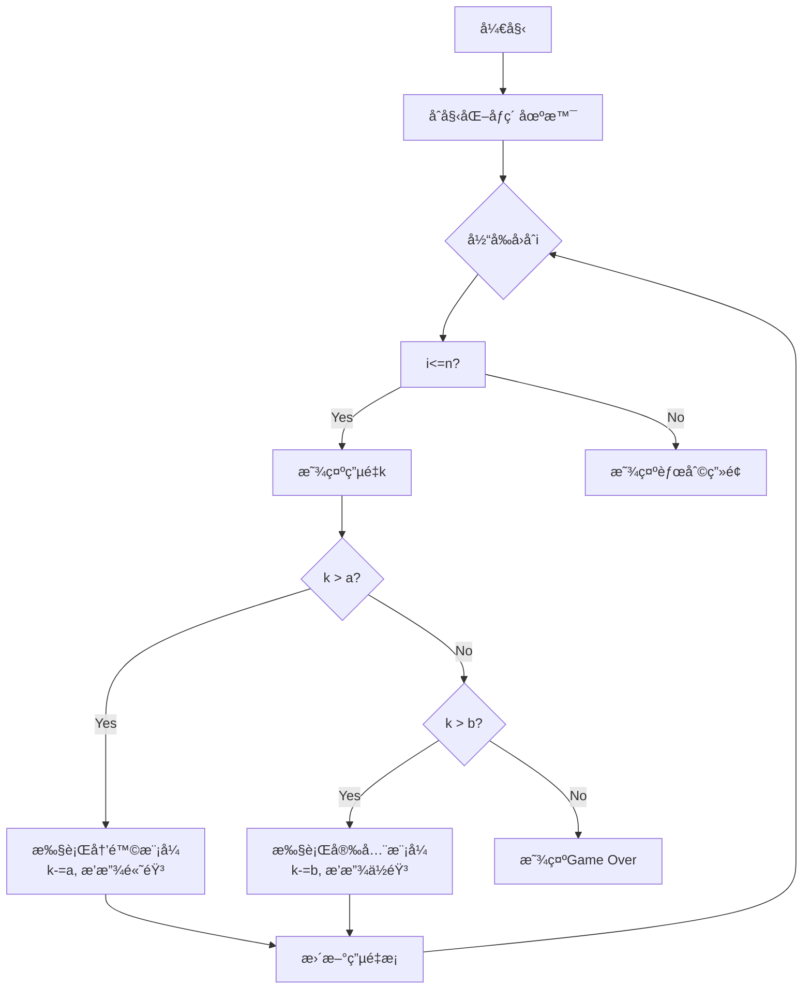

# 题目信æ¯

# Computer Game

## 题目æè¿°

Vova is playing a computer game. There are in total $ n $ turns in the game and Vova really wants to play all of them. The initial charge of his laptop battery (i.e. the charge before the start of the game) is $ k $ .

During each turn Vova can choose what to do:

- If the current charge of his laptop battery is strictly greater than $ a $ , Vova can just play, and then the charge of his laptop battery will decrease by $ a $ ;
- if the current charge of his laptop battery is strictly greater than $ b $ ( $ b<a $ ), Vova can play and charge his laptop, and then the charge of his laptop battery will decrease by $ b $ ;
- if the current charge of his laptop battery is less than or equal to $ a $ and $ b $ at the same time then Vova cannot do anything and loses the game.

Vova wants to complete the game (Vova can complete the game if after each of $ n $ turns the charge of the laptop battery is strictly greater than $ 0 $ ). Among all possible ways to complete the game, Vova wants to choose the one where the number of turns when he just plays is the maximum possible. It is possible that Vova cannot complete the game at all.

Your task is to find out the maximum possible number of turns Vova can just play or report that Vova cannot complete the game.

You have to answer $ q $ independent queries.

## 说æ˜/æ示

In the first example query Vova can just play $ 4 $ turns and spend $ 12 $ units of charge and then one turn play and charge and spend $ 2 $ more units. So the remaining charge of the battery will be $ 1 $ .

In the second example query Vova cannot complete the game because even if he will play and charge the battery during each turn then the charge of the notebook battery will be $ 0 $ after the last turn.

## 样例 #1

### 输入

```
6
15 5 3 2
15 5 4 3
15 5 2 1
15 5 5 1
16 7 5 2
20 5 7 3
```

### 输出

```
4
-1
5
2
0
1
```

# AI分æ结æœ


# 💡 Kayçš„C++算法解æ：Computer Game æ·±å…¥å­¦ä¹ æŒ‡å— ğŸ’¡

> 我是Kay，一ä½ä¸“注äºC++算法教学的引导者。今天我们将深入分æCodeforces题目"Computer Game"，帮助你在ç†è§£æ ¸å¿ƒç®—法的åŒæ—¶æŒæ¡é«˜æ•ˆè§£é¢˜æŠ€å·§ã€‚让我们一起æ¢ç´¢è¿™ä¸ªæœ‰è¶£çš„电池管ç†é—®é¢˜ï¼

## 1. 题目解读ä¸æ ¸å¿ƒç®—法识别

✨ **本题主è¦è€ƒå¯Ÿ**：`æ•°å­¦æ¨å¯¼`（公å¼ä¼˜åŒ–）ä¸`二分答案`（替代解法）

ğŸ—£ï¸ **åˆæ­¥åˆ†æ**：
> è¿™é“题就åƒåœ¨ç®¡ç†ä¸€ä¸ªæ¸¸æˆè§’色的电池电é‡â€”—我们需è¦åœ¨æœ‰é™çš„电é‡èµ„æºä¸‹åšå‡ºæœ€ä¼˜å†³ç­–。想象你是一ä½å¤ªç©ºæ¢é™©å®¶ï¼Œåœ¨n个星çƒæ¢é™©ä¸­ï¼Œæ¯æ¬¡é™è½å¯ä»¥é€‰æ‹©"冒险模å¼"(耗电a)或"安全模å¼"(耗电b)，目标是尽å¯èƒ½å¤šé€‰å†’险模å¼ä¸”ä¿è¯é£èˆ¹ç”µé‡å§‹ç»ˆ>0。

- **核心æ€è·¯**：多数题解采用**数学公å¼æ³•**ç›´æ¥è®¡ç®—最大冒险次数：先检查无解情况(k≤nb)，å†é€šè¿‡`(k-nb-1)/(a-b)`计算ç†è®ºæœ€å¤§å€¼ï¼Œæœ€åä¸nå–最å°å€¼ã€‚少数题解使用**二分法**验è¯å¯è¡Œæ€§ã€‚
- **算法æµç¨‹**：1) 检查无解(k≤nb)→输出-1ï¼›2) 计算ç†è®ºå†’险次数x=(k-nb-1)/(a-b)ï¼›3) 输出min(x,n)。关键å˜é‡`k`(电é‡)ã€`n`(å›åˆæ•°)的动æ€å˜åŒ–是å¯è§†åŒ–é‡ç‚¹ã€‚
- **åƒç´ åŠ¨ç”»è®¾è®¡**：采用å¤å¤å¤ªç©ºæ¢é™©ä¸»é¢˜ï¼Œé£èˆ¹ç”µæ± ä»¥åƒç´ æ¡æ˜¾ç¤ºã€‚æ¯æ¬¡é€‰æ‹©æ¨¡å¼æ—¶ï¼š
  - 冒险模å¼ï¼šé£èˆ¹é—ªçƒçº¢å…‰ï¼Œæ’­æ”¾é«˜éŸ³"å®ï¼"
  - 安全模å¼ï¼šé£èˆ¹é—ªçƒè“光，播放ä½éŸ³"å’šï¼"
  - 关键步骤高亮：当å‰å›åˆç¼–å·ã€ç”µé‡æ‰£é™¤å€¼ã€å‰©ä½™ç”µé‡å®æ—¶æ›´æ–°
  - 失败场景：电é‡â‰¤0æ—¶é£èˆ¹çˆ†ç‚¸åƒç´ åŠ¨ç”»+ä½æ²‰éŸ³æ•ˆ

---

## 2. 精选优质题解å‚考

> 我ä»æ€è·¯æ¸…晰度ã€ä»£ç è§„范性ã€ç®—法效ç‡å’Œå®è·µä»·å€¼å››ä¸ªç»´åº¦è¯„估题解，精选出3个≥4星的优质解法：

**题解一：wucstdio（公å¼æ³•ï¼‰**
* **点评**：æ€è·¯ç›´å‡»æœ¬è´¨â€”—将问题转化为"æ¯æ¬¡æ¨¡å¼åˆ‡æ¢å¢åŠ (a-b)耗电"的数学模å‹ã€‚代ç ç®€æ´é«˜æ•ˆ(时间å¤æ‚度O(1))，边界处ç†ä¸¥è°¨(k-=b*nå判断≤0)。å˜é‡å‘½å规范(`k,n,a,b`)，ç«èµ›å®æˆ˜æ€§å¼ºã€‚亮点在äºç”¨ä¸€è¡Œæ ¸å¿ƒå…¬å¼`min((k-1)/(a-b),n)`完ç¾è§£å†³é—®é¢˜ã€‚

**题解二：zhouzihe（公å¼æ³•ï¼‰**
* **点评**：对关键细节"kå‡1"的解释特别清晰（确ä¿æœ€ç»ˆç”µé‡>0），帮助学习者ç†è§£è¾¹ç•Œæ¡ä»¶ã€‚代ç ç»“æ„工整，将(a-b)预先计算æå‡æ•ˆç‡ã€‚å®è·µä»·å€¼é«˜ï¼Œä¸‰å…ƒè¿ç®—符`k>=0?min(k/a,n):-1`的处ç†æ–¹å¼å±•ç¤ºäº†ä¼˜é›…的代ç æŠ€å·§ã€‚

**题解三：WydnksqhbD（公å¼æ³•ï¼‰**
* **点评**：创新性地用"鸡兔åŒç¬¼"类比解题æ€è·¯ï¼Œé™ä½ç†è§£é—¨æ§›ã€‚代ç åŒ…å«å¿…è¦çš„IO优化(`ios::sync_with_stdio`)，å˜é‡ä½œç”¨æ˜ç¡®ã€‚亮点在äºå°†æŠ½è±¡é—®é¢˜è½¬åŒ–为ç»å…¸æ•°å­¦æ¨¡å‹ï¼Œå¸®åŠ©å»ºç«‹è§£é¢˜æ€ç»´æ¡†æ¶ã€‚

---

## 3. 核心难点辨æä¸è§£é¢˜ç­–ç•¥

> 解决这类资æºä¼˜åŒ–问题时，需特别注æ„以下三个关键点：

1.  **无解æ¡ä»¶åˆ¤å®š**
    * **分æ**：当最å°æ¶ˆè€—模å¼(n次安全模å¼)的总耗电`n*b`≥åˆå§‹ç”µé‡k时，任何策略都会失败。优质题解优先处ç†æ­¤è¾¹ç•Œæ¡ä»¶ï¼ˆå¦‚`if(k<=n*b)`）
    * 💡 **学习笔记**：先计算最ä¿å®ˆç­–略，是优化问题的通用入å£

2.  **严格大äº0的边界处ç†**
    * **分æ**：题目è¦æ±‚å›åˆå电é‡**严格大äº0**，因此公å¼ä¸­`(k-nb-1)`çš„"-1"ç¡®ä¿æœ€ç»ˆè‡³å°‘剩1å•ä½ç”µã€‚这是最易出错的细节（如样例k=16,n=7,a=5,b=2）
    * 💡 **学习笔记**：é‡åˆ°"strictly greater"æ¡ä»¶ï¼Œè®¡ç®—时主动å‡1预留安全空间

3.  **æ•°æ®ç±»å‹ä¸æº¢å‡ºé¢„防**
    * **分æ**：k,nå¯è¾¾10^9，a-bå¯èƒ½å¾ˆå°ï¼Œå› æ­¤`(k-nb-1)/(a-b)`需用long long。部分题解未用long long会导致WA
    * 💡 **学习笔记**：当计算涉åŠå¤§æ•°ç›¸é™¤ï¼Œä¼˜å…ˆä½¿ç”¨long longé¿å…溢出

### ✨ 解题技巧总结
- **技巧一：数学建模优先** - å°†æ“作转化为数学表达å¼(如`ax+by<k`)，往往能得到最优解
- **技巧二：边界四象é™æµ‹è¯•** - 测试最å°/最大值(k=1/n=10^9)ã€æ•´é™¤ä¸´ç•Œå€¼(a-b=1)
- **技巧三：二分答案ä¿åº•** - 当公å¼éš¾ä»¥æ¨å¯¼æ—¶(如约æŸæ¡ä»¶å¤æ‚)，二分法总是å¯é æ›¿ä»£æ–¹æ¡ˆ

---

## 4. C++核心代ç å®ç°èµæ

**本题通用核心C++å®ç°å‚考**
* **说æ˜**：综åˆä¼˜è´¨é¢˜è§£ä¼˜åŒ–çš„å…¬å¼æ³•å®ç°ï¼Œå…¼é¡¾å¯è¯»æ€§ä¸æ•ˆç‡
* **完整核心代ç **：
```cpp
#include <iostream>
using namespace std;
int main() {
    int q; 
    cin >> q;
    while (q--) {
        long long k, n, a, b;   // 必须long long防溢出
        cin >> k >> n >> a >> b;
        
        // 1. 检查无解æ¡ä»¶
        if (k <= n * b) {
            cout << -1 << endl;
            continue;
        }
        
        // 2. 计算最大冒险次数
        long long x = (k - n * b - 1) / (a - b);
        
        // 3. é™åˆ¶ä¸è¶…过å›åˆæ•°
        cout << min(x, n) << endl;
    }
    return 0;
}
```
* **代ç è§£è¯»æ¦‚è¦**：
> 该å®ç°æ¸…晰分为三阶段：1) 无解判断（安全模å¼æœ€å°æ¶ˆè€—验è¯ï¼‰â†’ 2) 核心公å¼è®¡ç®—（预留1å•ä½ç”µçš„安全边际）→ 3) 结æœä¿®æ­£ï¼ˆé™åˆ¶ä¸è¶…过总å›åˆæ•°ï¼‰ã€‚全程仅用基础è¿ç®—，时间å¤æ‚度O(1)完ç¾åº”对q组查询。

---

**针对å„优质题解的片段èµæ**

**题解一：wucstdio**
* **亮点**：æ致简æ´ï¼Œåˆå¹¶è®¡ç®—步骤
* **核心代ç ç‰‡æ®µ**：
```cpp
k -= b * n;  // å‡è®¾å…¨éƒ¨å®‰å…¨æ¨¡å¼
if (k <= 0) printf("-1\n");
else printf("%lld\n", min((k - 1) / (a - b), n));
```
* **代ç è§£è¯»**：
> 关键在`k -= b*n`的转æ¢â€”—将åŸé—®é¢˜è½¬åŒ–为"富余电é‡èƒ½æ”¯æŒå¤šå°‘次模å¼å‡çº§"。`(k-1)`中的`-1`ç¡®ä¿å‡çº§å电é‡>0，`(a-b)`是æ¯æ¬¡å‡çº§çš„代价。这ç§"问题等价转æ¢"技巧值得学习。

**题解二：zhouzihe**
* **亮点**：显å¼è§£é‡Šå®‰å…¨è¾¹é™…
* **核心代ç ç‰‡æ®µ**：
```cpp
k -= n * b + 1;  // 显å¼é¢„ç•™1å•ä½ç”µ
a -= b;           // 模å¼å‡çº§ä»£ä»·
cout << (k >= 0 ? min(k / a, n) : -1) << '\n';
```
* **代ç è§£è¯»**：
> 独特的åŒå˜é‡è°ƒæ•´ï¼š`k -= nb+1`ç›´æ¥å†…嵌安全边际，`a -= b`将问题简化为å•ä¸€å‡çº§ä»£ä»·è®¡ç®—。三元è¿ç®—符`k>=0?`åŒæ—¶å¤„ç†æ— è§£å’Œæ±‚解，体ç°ä»£ç å‹ç¼©è‰ºæœ¯ã€‚

**题解三：WydnksqhbD**
* **亮点**：鸡兔åŒç¬¼ç±»æ¯”教学
* **核心代ç ç‰‡æ®µ**：
```cpp
k--;  // 预留电é‡
if (b * n > k) puts("-1");
else printf("%lld", min(n, (k - b * n) / (a - b)));
```
* **代ç è§£è¯»**：
> å‰ç½®`k--`是边界处ç†çš„å¦ç±»å®ç°ï¼Œä¸`(k-nb-1)`等效但更易ç†è§£ã€‚类比鸡兔åŒç¬¼ï¼šå®‰å…¨æ¨¡å¼å¦‚鸡(耗电b)，冒险模å¼å¦‚å…”(耗电a)，求最多能放几åªå…”。

---

## 5. 算法å¯è§†åŒ–：åƒç´ åŠ¨ç”»æ¼”示 (核心部分)

> **主题**："太空电池大冒险" - 8-bitåƒç´ é£æ ¼ç”µé‡ç®¡ç†æ¨¡æ‹Ÿ  
> **核心演示**：公å¼è®¡ç®—过程动æ€å¯è§†åŒ–+å›åˆå†³ç­–动画  
> **设计æ€è·¯**：用FC游æˆé£æ ¼é™ä½ç†è§£å‹åŠ›ï¼ŒéŸ³æ•ˆå¼ºåŒ–æ“作å馈  



**动画帧步骤**：
1. **场景åˆå§‹åŒ–**：
   - 顶部åƒç´ ç”µæ± ï¼š20格电é‡ï¼ˆk=20示例）
   - 中部å›åˆè½¨é“：5个å‘å…‰åƒç´ å—（n=5示例）
   - æ§åˆ¶é¢æ¿ï¼šé€Ÿåº¦æ»‘å—/æš‚åœ/å•æ­¥æŒ‰é’®

2. **关键公å¼æ¼”示**：
   ```python
   # 动æ€æ˜¾ç¤ºå…¬å¼è®¡ç®—过程
   k = 20, n = 5, a = 7, b = 3
   安全模å¼æœ€ä½æ¶ˆè€— = 5*3 = 15
   å¯Œä½™ç”µé‡ = 20 - 15 - 1 = 4
   模å¼å‡çº§ä»£ä»· = 7 - 3 = 4
   ç†è®ºå†’险次数 = min(5, 4/4) = 1
   ```

3. **å›åˆå†³ç­–动画**：
   - 第1å›åˆï¼šç”µé‡20>7→冒险模å¼ï¼Œé£èˆ¹å–·çº¢ç«ï¼Œç”µé‡æ¡å‡å°‘7æ ¼
   - 第2å›åˆï¼šç”µé‡13>7→冒险模å¼ï¼Œç”µé‡å‡è‡³6
   - 第3å›åˆï¼šç”µé‡6≤7但>3→安全模å¼ï¼Œé£èˆ¹å–·è“ç«
   - 第4/5å›åˆï¼šæŒç»­å®‰å…¨æ¨¡å¼ï¼Œæœ€ç»ˆç”µé‡=20-7*2-3*3=3>0

4. **游æˆåŒ–元素**：
   - 音效：冒险模å¼(高音"å®ï¼")，安全模å¼(ä½éŸ³"å’šï¼")，胜利(å°æ®µé©¬é‡Œå¥¥è¿‡å…³éŸ³ä¹)
   - å…³å¡è¿›åº¦ï¼šæ¯å®Œæˆ1å›åˆï¼Œå¯¹åº”åƒç´ å—å˜é‡‘色
   - 自动演示：AI按最优策略è¿è¡Œï¼Œé€Ÿåº¦å¯è°ƒ

---

## 6. 拓展练习ä¸ç›¸ä¼¼é—®é¢˜æ€è€ƒ

**通用æ€è·¯è¿ç§»**：
1. **资æºåˆ†é…问题**：在固定总é‡ä¸‹æœ€å¤§åŒ–æŸç±»æ“作
2. **临界值判断**：处ç†ä¸¥æ ¼å¤§äº/å°äºçš„边界æ¡ä»¶
3. **二分答案验è¯**：当直æ¥å…¬å¼å›°éš¾æ—¶çš„替代方案

**练习æ¨è (洛谷)**：
1. **P1089 津津的储蓄计划**  
   → ğŸ—£ï¸ åŒæ ·éœ€è¦å¹³è¡¡èµ„æºä½¿ç”¨ä¸ç›®æ ‡è¾¾æˆï¼Œç»ƒä¹ è¾¹ç•Œå¤„ç†
2. **P3743 kotori的设备**  
   → ğŸ—£ï¸ è¿›é˜¶ç‰ˆç”µé‡ç®¡ç†ï¼Œå¼•å…¥å……电机制，强化二分答案应用
3. **P1181 数列分段**  
   → ğŸ—£ï¸ èµ„æºåˆ†æ®µå¤„ç†çš„ç»å…¸é—®é¢˜ï¼Œè®­ç»ƒé—®é¢˜æŠ½è±¡èƒ½åŠ›

---

## 7. 学习心得ä¸ç»éªŒåˆ†äº«

> **å‚考ç»éªŒ (æ¥è‡ª zhouzihe)**："å…¬å¼ä¸­`(k-nb-1)`çš„`-1`是ä¿è¯æœ€ç»ˆç”µé‡>0的关键，调试时忽略这点会WA在éšè”½ç”¨ä¾‹"  
> **点评**：这是本题目最易错的边界陷阱ï¼å»ºè®®ç¼–ç æ—¶ç”¨æ ·ä¾‹k=16,n=7,a=5,b=2验è¯ï¼š  
> - 未å‡1：(16-7*2)/(5-2)=2/3≈0 → 错误  
> - å‡1å：(16-14-1)/2=1/2=0 → 正确

> **ç»éªŒ (æ¥è‡ª lbh666)**："必须开long long"  
> **点评**：当k=10^9, b=1, n=10^9时，中间å˜é‡k-nb-1å¯èƒ½è¾¾10^18级，int必然溢出。大数è¿ç®—是ç«èµ›åŸºæœ¬åŠŸï¼

---

通过本次分æ，相信你已ç»æŒæ¡èµ„æºä¼˜åŒ–类问题的核心解法。记ä½ï¼š**清晰的数学模å‹+严谨的边界处ç†=AC的关键**ï¼ä¸‹æ¬¡é‡åˆ°ç±»ä¼¼é—®é¢˜ï¼Œä¸å¦¨å…ˆå°è¯•å»ºç«‹ç”µé‡é‚£æ ·çš„资æºæ¶ˆè€—æ–¹ç¨‹å“¦ï¼ ğŸš€

---
处ç†ç”¨æ—¶ï¼š223.90秒