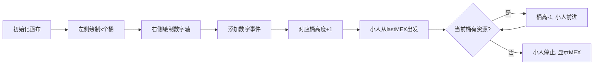

# 题目信息

# MEX maximizing

## 题目描述

Recall that MEX of an array is a minimum non-negative integer that does not belong to the array. Examples:

- for the array $ [0, 0, 1, 0, 2] $ MEX equals to $ 3 $ because numbers $ 0, 1 $ and $ 2 $ are presented in the array and $ 3 $ is the minimum non-negative integer not presented in the array;
- for the array $ [1, 2, 3, 4] $ MEX equals to $ 0 $ because $ 0 $ is the minimum non-negative integer not presented in the array;
- for the array $ [0, 1, 4, 3] $ MEX equals to $ 2 $ because $ 2 $ is the minimum non-negative integer not presented in the array.

You are given an empty array $ a=[] $ (in other words, a zero-length array). You are also given a positive integer $ x $ .

You are also given $ q $ queries. The $ j $ -th query consists of one integer $ y_j $ and means that you have to append one element $ y_j $ to the array. The array length increases by $ 1 $ after a query.

In one move, you can choose any index $ i $ and set $ a_i := a_i + x $ or $ a_i := a_i - x $ (i.e. increase or decrease any element of the array by $ x $ ). The only restriction is that  $ a_i $ cannot become negative. Since initially the array is empty, you can perform moves only after the first query.

You have to maximize the MEX (minimum excluded) of the array if you can perform any number of such operations (you can even perform the operation multiple times with one element).

You have to find the answer after each of $ q $ queries (i.e. the $ j $ -th answer corresponds to the array of length $ j $ ).

Operations are discarded before each query. I.e. the array $ a $ after the $ j $ -th query equals to $ [y_1, y_2, \dots, y_j] $ .

## 说明/提示

In the first example:

- After the first query, the array is $ a=[0] $ : you don't need to perform any operations, maximum possible MEX is $ 1 $ .
- After the second query, the array is $ a=[0, 1] $ : you don't need to perform any operations, maximum possible MEX is $ 2 $ .
- After the third query, the array is $ a=[0, 1, 2] $ : you don't need to perform any operations, maximum possible MEX is $ 3 $ .
- After the fourth query, the array is $ a=[0, 1, 2, 2] $ : you don't need to perform any operations, maximum possible MEX is $ 3 $ (you can't make it greater with operations).
- After the fifth query, the array is $ a=[0, 1, 2, 2, 0] $ : you can perform $ a[4] := a[4] + 3 = 3 $ . The array changes to be $ a=[0, 1, 2, 2, 3] $ . Now MEX is maximum possible and equals to $ 4 $ .
- After the sixth query, the array is $ a=[0, 1, 2, 2, 0, 0] $ : you can perform $ a[4] := a[4] + 3 = 0 + 3 = 3 $ . The array changes to be $ a=[0, 1, 2, 2, 3, 0] $ . Now MEX is maximum possible and equals to $ 4 $ .
- After the seventh query, the array is $ a=[0, 1, 2, 2, 0, 0, 10] $ . You can perform the following operations: 
  - $ a[3] := a[3] + 3 = 2 + 3 = 5 $ ,
  - $ a[4] := a[4] + 3 = 0 + 3 = 3 $ ,
  - $ a[5] := a[5] + 3 = 0 + 3 = 3 $ ,
  - $ a[5] := a[5] + 3 = 3 + 3 = 6 $ ,
  - $ a[6] := a[6] - 3 = 10 - 3 = 7 $ ,
  - $ a[6] := a[6] - 3 = 7 - 3 = 4 $ .
  
   The resulting array will be $ a=[0, 1, 2, 5, 3, 6, 4] $ . Now MEX is maximum possible and equals to $ 7 $ .

## 样例 #1

### 输入

```
7 3
0
1
2
2
0
0
10```

### 输出

```
1
2
3
3
4
4
7```

## 样例 #2

### 输入

```
4 3
1
2
1
2```

### 输出

```
0
0
0
0```

# AI分析结果


### 1. 题目解读与核心算法识别

✨ **本题主要考察**：`数学（模运算与计数）`

🗣️ **初步分析**：
> 解决"MEX maximizing"的关键在于理解**模运算的等价性质**。想象有x个不同颜色的桶（编号0到x-1），每个桶可装无数个球，但球必须按固定间隔排列（如桶0装0,x,2x,...）。MEX就是第一个空桶位，我们要尽可能用已有球填满小数字的桶位。
> 
> - **核心思路**：所有数字按模x余数分组，用桶计数。每次添加数字时，更新对应桶的计数，然后从当前MEX开始扫描：若当前MEX对应桶中有球，则消耗一个球并增加MEX，直到遇到空桶。
> - **关键难点**：动态维护MEX需高效检查桶状态。最优解法用均摊思想——MEX单调递增，每次从上个位置继续扫描，避免重复检查。
> - **可视化设计**：用像素风桶（竖直柱状图）和小人行走动画展示过程：
>   - 添加数字时对应桶高度+1（像素块上升+收集音效）
>   - 小人从0出发，每步检查脚下位置对应桶（位置 mod x）
>   - 桶中有球：球数-1（像素块下降+消耗音效），小人前进
>   - 桶空：小人停止（播放失败音效），此时位置即MEX
> - **复古游戏化**：8-bit音效（球消耗"叮"声，胜利音效），关卡式设计（每填满10个位置过关），自动演示模式（小人AI连续行走）

---

### 2. 精选优质题解参考

**题解一（来源：YooLc407）**
* **点评**：此解思路清晰直白，核心逻辑用简洁的桶计数和while循环实现。代码中`vis[opt % x]`精准捕获模运算本质，`while(vis[ans % x])`巧妙利用MEX单调性逐步推进。亮点在于均摊O(1)的时间复杂度——每个数字仅消耗一次，且边界处理严谨（无多余操作）。变量名`vis`可优化为`cnt`，但整体具备竞赛级参考价值。

**题解二（来源：lzy120406）**
* **点评**：代码规范性强，包含输入输出优化和详细注释。核心逻辑与题解一一致，但用`mex`变量名更语义化。亮点在于完整展示工业级代码实践：`ios::sync_with_stdio(false)`加速IO，`cnt`数组初始化归零，循环条件`while (cnt[mex % x] > 0)`明确表达消耗逻辑。是学习可读性编码的典范。

**题解三（来源：封禁用户）**
* **点评**：采用独特优化思路：当新数字模值等于当前MEX模值时直接增加MEX（省去入桶操作）。代码极简（仅10行），但保留完整逻辑链。亮点在于对均摊复杂度的深刻理解——通过条件分支`if (a % x == ans % x)`预判移动，实践中可提升效率。变量命名`ans`和`s`稍简略，但核心算法实现精准高效。

---

### 3. 核心难点辨析与解题策略

1.  **关键点：理解模运算的等价性质**
    * **分析**：操作可任意加减x意味着数字的有效信息是其模x余数。需将问题转化为余数计数问题，用桶数组`cnt[0..x-1]`代替原始数字集合。
    * 💡 **学习笔记**：模运算是简化数字问题的核心数学工具。

2.  **关键点：动态维护MEX的高效策略**
    * **分析**：暴力枚举每次从0检查MEX会超时。最优解利用MEX单调递增特性——从上一次结束位置继续扫描，避免重复检查。均摊复杂度证明：每个数字仅消耗一次，总操作O(q)。
    * 💡 **学习笔记**：单调性是优化循环的关键突破口。

3.  **关键点：桶计数的资源分配机制**
    * **分析**：桶中每个数字对应一个可填补的位置（桶号 + kx）。消耗数字时需确保：① 仅填补当前MEX位置；② 每个数字仅用一次。代码中`cnt[mex%x]--`同步完成消耗与位置推进。
    * 💡 **学习笔记**：计数数组要配合状态更新才有效。

### ✨ 解题技巧总结
- **技巧1：问题等价转换**（核心）：将自由操作的数学问题转化为模运算分组
- **技巧2：单调性优化**：利用答案单调递增特性避免重复扫描
- **技巧3：均摊复杂度分析**：证明每元素操作O(1)，保证算法高效性
- **技巧4：边界条件预判**（如题解三）：通过条件分支避免无效操作

---

### 4. C++核心代码实现赏析

**本题通用核心C++实现参考**
* **说明**：综合自优质题解，体现最简洁高效的桶计数思想。
* **完整核心代码**：
```cpp
#include <iostream>
using namespace std;
const int MAX_X = 400000;

int main() {
    int q, x;
    cin >> q >> x;
    int cnt[MAX_X] = {0}; // 桶计数数组
    int mex = 0; // 当前MEX值
    
    for (int i = 0; i < q; ++i) {
        int y;
        cin >> y;
        cnt[y % x]++; // 步骤1: 更新对应桶
        
        // 步骤2: 消耗桶中资源推进MEX
        while (cnt[mex % x] > 0) {
            cnt[mex % x]--;
            mex++;
        }
        cout << mex << endl; // 输出当前MEX
    }
    return 0;
}
```
* **代码解读概要**：
  > 1. **初始化**：创建桶数组`cnt`和MEX变量
  > 2. **查询处理**：读取数字→更新对应桶计数
  > 3. **MEX更新**：循环消耗当前MEX位置对应的桶资源
  > 4. **输出**：每次查询后输出实时MEX

**题解一核心代码片段**
```cpp
vis[opt % x]++; 
while(vis[ans % x])
    vis[ans++ % x]--;
printf("%d\n", ans);
```
* **亮点**：用单循环完成更新与消耗，代码极致压缩
* **代码解读**：
  > - `vis[opt%x]++`：新数字入桶（等价类计数）
  > - `while(vis[ans%x])`：检查当前MEX对应桶是否有资源
  > - `vis[ans++%x]--`：**先取模索引再自增**，同步完成消耗和MEX移动
* 💡 **学习笔记**：自增与取模的顺序决定索引正确性

**题解二核心代码片段**
```cpp
cnt[mod]++; // mod = y%x
while (cnt[mex % x] > 0) {
    cnt[mex % x]--;
    mex++;
}
```
* **亮点**：语义化变量名提升可读性
* **代码解读**：
  > - 显式分离`mod`计算步骤，便于理解
  > - 循环条件`cnt[mex%x]>0`强调资源存在性检查
  > - 消耗与移动分离（先减计数再增mex），逻辑更直白
* 💡 **学习笔记**：适当拆分步骤有利调试和理解

**题解三核心代码片段**
```cpp
if (a % x == ans % x) ++ans;
else s[a % x]++;
while (s[ans % x]) s[ans % x]--, ans++;
```
* **亮点**：条件分支预判MEX移动
* **代码解读**：
  > - 当新数字模值等于当前MEX模值：直接`ans++`（模拟消耗）
  > - 否则：数字入桶备用
  > - `s[ans%x]--, ans++`：逗号运算符实现单行消耗移动
* 💡 **学习笔记**：特定场景预判可减少桶操作次数

---

### 5. 算法可视化：像素动画演示

* **主题**：桶中探险（8-bit像素风）
* **核心演示**：动态展示MEX推进与桶资源消耗关系

**实现方案**：


1. **像素艺术设计**：
   - 桶：垂直柱状图（8×16像素块），不同余数桶用不同颜色
   - 小人：8×8像素角色，沿数字轴（横向网格）移动
   - 控制面板：复古按钮（开始/暂停/单步/速度滑块）

2. **关键动画触发**：
   - 添加数字：桶像素块上升动画 + "叮"声（Web Audio API）
   - 小人移动：
     - 每步检查脚下网格位置`pos`对应的桶`pos%x`
     - 有资源：桶顶像素块消失动画 + 小人跳跃前进音效
     - 无资源：播放"失败"音效 + 显示MEX弹窗
   - 自动模式：小人持续移动至停止（调速滑块控制帧率）

3. **游戏化元素**：
   - 连续填补奖励：每10步触发星星特效+得分
   - 音效系统：
     - 背景：8-bit循环BGM
     - 事件音：资源消耗(短促"叮")、胜利(上扬和弦)、失败(低沉嗡鸣)
   - 关卡制：每完成q/10次查询解锁新速度档位

4. **同步显示**：
   - 代码高亮：实时显示`while(cnt[mex%x])`等核心行
   - 数据面板：当前桶计数/MEX值/操作次数

---

### 6. 拓展练习与相似问题思考

* **技巧迁移场景**：
  1. 带约束的连续序列覆盖（如P4137 Rmq Problem）
  2. 可调整数字的最优排列问题（如CF1290B Array Shrinking）
  3. 分组计数求极值（如P1972 HH的项链）

* **洛谷题目推荐**：
  1. **P4137 Rmq Problem / mex**  
     🗣️ *推荐理由*：静态数组求MEX，需结合莫队或线段树，巩固模计数思想
  2. **P1496 火烧赤壁**  
     🗣️ *推荐理由*：区间覆盖问题，训练连续序列维护能力
  3. **P1631 序列合并**  
     🗣️ *推荐理由*：分组堆优化，深化数据结构与模运算结合应用

---

### 7. 学习心得与经验分享

> **参考经验 (来自 YooLc407)**：*"考场上脑抽了，忘了x是给定的... 后来通过模拟小数据才定位问题"*  
> **点评**：调试时务必验证基础假设！建议：  
> - 用样例手工模拟算法流程  
> - 输出中间状态（如每次查询后的桶状态）  
> - 对特殊值（x=1, q=0）单独测试

> **参考经验 (来自 封禁用户)**：*极简代码的调试技巧*  
> **点评**：短代码易隐藏错误，解决策略：  
> 1. 添加临时变量打印关键值（如`printf("mex=%d, bucket=%d",mex,mex%x)`)  
> 2. 用边界数据测试（如x>max_int）  
> 3. 模块化验证：先测试桶更新，再验证MEX推进

---

通过本次分析，我们深入理解了模运算在动态维护问题中的威力。记住：好算法=数学转化+高效维护+边界严谨。下次挑战见！💪

---
处理用时：220.57秒