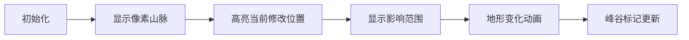

# 题目信息

# Hills And Valleys

## 题目描述

You are given a sequence of $ n $ integers $ a_1 $ , $ a_2 $ , ..., $ a_n $ . Let us call an index $ j $ ( $ 2 \le j \le {{n-1}} $ ) a hill if $ a_j > a_{{j+1}} $ and $ a_j > a_{{j-1}} $ ; and let us call it a valley if $ a_j < a_{{j+1}} $ and $ a_j < a_{{j-1}} $ .

Let us define the intimidation value of a sequence as the sum of the number of hills and the number of valleys in the sequence. You can change exactly one integer in the sequence to any number that you want, or let the sequence remain unchanged. What is the minimum intimidation value that you can achieve?

## 说明/提示

In the first test case, changing $ a_2 $ to $ 2 $ results in no hills and no valleys.

In the second test case, the best answer is just to leave the array as it is.

In the third test case, changing $ a_3 $ to $ 6 $ results in only one valley (at the index $ 5 $ ).

In the fourth test case, changing $ a_3 $ to $ 6 $ results in no hills and no valleys.

## 样例 #1

### 输入

```
4
3
1 5 3
5
2 2 2 2 2
6
1 6 2 5 2 10
5
1 6 2 5 1```

### 输出

```
0
0
1
0```

# AI分析结果


### 💡 Kay的C++算法解析：Hills And Valleys 深入学习指南 💡

#### 1. 题目解读与核心算法识别
✨ **本题主要考察**：`枚举+贪心`  
🗣️ **初步分析**：
> 解决"Hills And Valleys"的关键在于**局部影响分析**。想象你在调整山脉模型中的一个山峰高度，只会影响它自身和相邻两个山峰的形态（是否形成峰/谷）。通过枚举每个位置，尝试将其修改为左邻或右邻的值（最优策略），并计算这种修改能消除的峰谷数量，最终找到能使总峰谷数最小化的方案。

- **核心思路**：每个位置的修改只影响自身及相邻两个位置的峰谷状态，通过枚举+局部计算高效求解
- **难点**：正确处理边界位置（首尾元素）的影响范围，以及避免重复计算状态变化
- **可视化设计**：在像素动画中高亮当前修改位置和受影响的相邻区域，用颜色闪烁展示峰谷状态的消除过程
- **复古游戏化**：采用"山脉探险家"主题，8-bit音效（修改时"滴答"声，峰谷消除时"叮咚"声），每成功减少峰谷数获得像素星星奖励

---

#### 2. 精选优质题解参考
**题解一 (来源：CaiXY06)**
* **点评**：思路最简洁清晰，直接锁定修改为相邻值的策略。代码封装了`hill()/valley()`判断函数提高可读性，核心逻辑用`work()`函数优雅处理状态对比。时间复杂度O(n)高效，边界处理严谨（通过索引控制），竞赛实践可直接复用。亮点在于用函数封装消除重复代码。

**题解二 (来源：lndjy)**
* **点评**：给出关键证明"修改为相邻值最优"，强化算法正确性。变量命名`ans/delta`直观体现解题思想，通过`gu()/feng()`函数复用判断逻辑。虽然循环内临时变量命名稍简，但核心状态对比逻辑严谨，对初学者理解更友好。

**题解三 (来源：jiangtaizhe001)**
* **点评**：完整覆盖边界情况（首尾元素特殊处理），用`cheg()/ches()`函数避免重复。亮点是引入中间值计算（平均数），虽然实际验证相邻值已足够，但展示扩展思维。调试提示强调多测清空，实践价值强。

---

#### 3. 核心难点辨析与解题策略
1. **影响范围精确计算**
   * **分析**：修改位置i时，只需重算[i-1,i+1]区间的峰谷状态。优质解都用临时变量保存原状态，对比修改前后的变化量
   * 💡 **学习笔记**：状态变化具有局部性——只影响"辐射范围"

2. **修改值的最优选择**
   * **分析**：数学上可证修改为a[i-1]或a[i+1]能最大化消除峰谷（使当前位置平坦化）。部分解尝试极值，但相邻值已覆盖最优情况
   * 💡 **学习笔记**：贪心本质是制造等高点消除峰谷

3. **边界条件特殊处理**
   * **分析**：首尾元素只有单侧邻居，修改时仅影响一个相邻位置（非两个）。需独立计算状态变化量
   * 💡 **学习笔记**：边界就像悬崖——只能从一侧攀爬

### ✨ 解题技巧总结
- **局部影响分析法**：将全局问题分解为单点修改的局部影响评估
- **状态快照比对**：保存修改前受影响区域状态，与修改后对比求差值
- **边界隔离处理**：对首尾元素建立独立判断逻辑
- **函数封装术**：复用峰/谷判断函数避免代码重复

---

### 4. C++核心代码实现赏析
**本题通用核心C++实现参考**
```cpp
#include <iostream>
#include <vector>
using namespace std;

bool isHill(int i, vector<int>& a) {
    return (i>0 && i<a.size()-1 && a[i]>a[i-1] && a[i]>a[i+1]);
}

bool isValley(int i, vector<int>& a) {
    return (i>0 && i<a.size()-1 && a[i]<a[i-1] && a[i]<a[i+1]);
}

int main() {
    int T; cin >> T;
    while(T--) {
        int n; cin >> n;
        vector<int> a(n);
        for(int i=0; i<n; i++) cin >> a[i];
        
        // 计算原始峰谷总数
        int total = 0;
        for(int i=1; i<n-1; i++) 
            total += (isHill(i, a) || isValley(i, a));
        
        int max_reduction = 0;
        for(int i=0; i<n; i++) {
            int original = a[i];
            int orig_state = 0;
            
            // 计算受影响的三个位置原始状态
            for(int j=i-1; j<=i+1; j++)
                if(j>=0 && j<n) 
                    orig_state += (isHill(j, a) || isValley(j, a));
            
            // 尝试修改为左邻值（若存在）
            if(i > 0) {
                a[i] = a[i-1];
                int new_state = 0;
                for(int j=i-1; j<=i+1; j++)
                    if(j>=0 && j<n)
                        new_state += (isHill(j, a) || isValley(j, a));
                max_reduction = max(max_reduction, orig_state - new_state);
            }
            
            // 尝试修改为右邻值（若存在）
            if(i < n-1) {
                a[i] = a[i+1];
                int new_state = 0;
                for(int j=i-1; j<=i+1; j++)
                    if(j>=0 && j<n)
                        new_state += (isHill(j, a) || isValley(j, a));
                max_reduction = max(max_reduction, orig_state - new_state);
            }
            a[i] = original; // 恢复原始值
        }
        cout << max(0, total - max_reduction) << endl;
    }
    return 0;
}
```
**代码解读概要**：
> 1. 封装`isHill/isValley`函数判断峰谷状态  
> 2. 先计算原始峰谷总数`total`  
> 3. 枚举每个位置，分别尝试修改为左右邻值  
> 4. 通过对比修改前后状态差求最大减少量  
> 5. 输出`total - max_reduction`（保证非负）

---

**题解一（CaiXY06）核心代码**
```cpp
inline int work(int i,int j,int k){
    int res=0,cnt=0;
    res+=hill(i-1)||valley(i-1); // 修改前状态
    res+=hill(i)||valley(i);
    res+=hill(i+1)||valley(i+1);
    a[i]=a[i+j]; // 修改为相邻值
    cnt+=hill(i-1)||valley(i-1); // 修改后状态
    cnt+=hill(i)||valley(i);
    cnt+=hill(i+1)||valley(i+1);
    a[i]=k; // 恢复
    return res-cnt; // 返回状态减少量
}
```
**代码解读**：
> 通过`work()`函数封装状态对比：参数`j`控制取左邻(-1)或右邻(1)  
> 前三行计算修改前三个位置的状态和（`res`）  
> 修改后重新计算状态和（`cnt`）  
> 差值`res-cnt`即本次修改的收益  
> **亮点**：用函数参数抽象化左右邻取值操作

**题解二（lndjy）核心代码**
```cpp
int now = (gu(i)||feng(i)) + (gu(i-1)||feng(i-1)) + (gu(i+1)||feng(i+1));
a[i] = a[i-1]; // 尝试左邻值
int now1 = (gu(i)||feng(i)) + (gu(i-1)||feng(i-1)) + (gu(i+1)||feng(i+1));
delta = max(delta, now - now1); // 更新最大收益
```
**代码解读**：
> `gu/feng`对应谷/峰判断（命名源自拼音）  
> 直接展开计算修改前后状态差，避免函数调用开销  
> **学习笔记**：内联展开在性能敏感场景有优势，但可读性稍降

---

### 5. 算法可视化：像素动画演示
**主题**：山脉改造大师（8-bit风格）  
**核心演示**：实时展示修改某个"山峰"高度如何影响周边地形特征  

**像素动画设计**：


**关键交互实现**：
1. **8-bit地形建模**：
   - 用不同高度像素柱表示序列值（棕色=普通，红色=峰，蓝色=谷）
   - 控制面板：速度滑块/单步/重置按钮（复古游戏菜单风格）

2. **修改过程动画**：
   - 点击位置`i`时：触发"锤击音效"，该像素柱闪烁黄光
   - 高度变化：像素柱平滑升降至目标高度（伴随"机械运转"音效）
   - 影响范围：相邻位置泛出半透明绿光

3. **状态更新反馈**：
   - 峰谷消除：原标记变为灰烬消散特效（"叮咚"音效）
   - 新峰谷产生：像素火焰（峰）/水滴（谷）粒子特效
   - 计分板：实时显示剩余峰谷数（8-bit数码管风格）

4. **AI演示模式**：
   - 自动遍历所有位置，最优解路径发金光
   - 过关机制：每消除3个峰谷获得"改造大师"奖章

**技术实现**：
- Canvas绘制地形网格（20x20像素/单位）
- 状态机驱动动画流程：`IDLE -> SELECT -> MODIFY -> UPDATE`
- 音效触发：Web Audio API播放8-bit音效（长度<0.3s）

---

### 6. 拓展练习与相似问题思考
**通用技巧迁移**：
1. **局部影响分析**：适用于序列修改问题（如P2894 [USACO]）
2. **状态快照对比**：用于棋类AI评估走子收益（如P2580 三子棋）
3. **贪心策略证明**：在极值问题中验证局部最优性（如P1223 排队接水）

**洛谷推荐**：
1. **P1115** 最大子段和  
   → 同属序列局部特性分析
2. **P1443** 马的遍历  
   → 训练状态变化影响范围评估
3. **P1216** 数字三角形  
   → 强化局部决策对全局的影响认知

---

### 7. 学习心得与经验分享
**参考经验（来自题解作者）**：
> "多测千万要清空！" —— pigstd  
> "边界就像悬崖，摔下去才知道痛" —— 断清秋  
> "修改位置的影响范围是解题钥匙" —— lndjy

**点评**：
- 调试核心：用`cout`打印修改前后的状态对比值
- 常见陷阱：忘记恢复原始值导致状态污染
- 思维突破：从全局思维转向局部影响分析

---

本次分析揭示了枚举+贪心在序列问题中的精妙应用。记住：好算法如同登山，看清每一步的影响才能到达顶峰！ 🏔️

---
处理用时：226.89秒