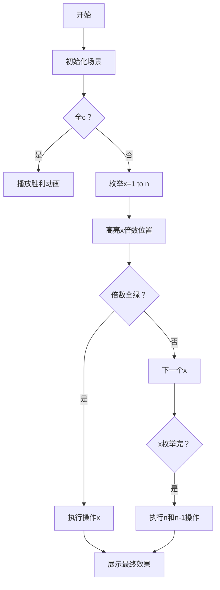

# 题目信息

# Make Them Equal

## 题目描述

Theofanis has a string $ s_1 s_2 \dots s_n $ and a character $ c $ . He wants to make all characters of the string equal to $ c $ using the minimum number of operations.

In one operation he can choose a number $ x $ ( $ 1 \le x \le n $ ) and for every position $ i $ , where $ i $ is not divisible by $ x $ , replace $ s_i $ with $ c $ .

Find the minimum number of operations required to make all the characters equal to $ c $ and the $ x $ -s that he should use in his operations.

## 说明/提示

Let's describe what happens in the third test case:

1. $ x_1 = 2 $ : we choose all positions that are not divisible by $ 2 $ and replace them, i. e. bzyx $ \rightarrow $ bzbx;
2. $ x_2 = 3 $ : we choose all positions that are not divisible by $ 3 $ and replace them, i. e. bzbx $ \rightarrow $ bbbb.

## 样例 #1

### 输入

```
3
4 a
aaaa
4 a
baaa
4 b
bzyx```

### 输出

```
0
1
2
2 
2 3```

# AI分析结果


# 💡 Kay的C++算法解析：Make Them Equal 深入学习指南 💡

> 让我们一起来探索这道关于字符串操作的编程题，我会用清晰易懂的方式带你理解核心算法和解题技巧！

## 1. 题目解读与核心算法识别

✨ **本题主要考察**：`编程技巧应用` + `数学（数论）`

🗣️ **初步分析**：
> 这道题就像修复一排彩色灯泡💡 - 初始灯泡颜色不同（字符串字符），我们需要用最少的操作让所有灯泡变成同一种颜色（目标字符c）。每次操作相当于选择一个开关x，它会改变所有非x倍数的灯泡颜色。  
> **关键技巧**：答案最多为2！因为选择x=n和x=n-1总能覆盖所有位置（数学证明：连续整数互质）。  
> - 解题思路：先检查是否已是全c（0次操作）；否则枚举x（1~n），检查x的倍数位置是否全是c（1次操作）；否则输出2次操作方案（n和n-1）  
> - 可视化设计：复古像素风格展示字符串（像素方块），高亮x倍数位置（不变位置）。自动枚举时AI快速检查每个x，找到可行方案播放胜利音效🎵，失败则展示两次操作过程  

---

## 2. 精选优质题解参考

以下是思路清晰、代码规范的优质题解：

**题解一（Huami360）**
* **点评**：使用**时间戳技巧**避免多组数据清空数组，大幅提升效率。思路清晰：用dfn标记非c位置，judge函数高效检查x的倍数位置。代码结构紧凑，变量命名合理（dfn, judge），适合竞赛场景。

**题解二（智子）**
* **点评**：直接枚举思路**直观易理解**，内层循环发现非c立即break优化时间。完整处理边界情况（cnt==0），变量命名规范（ans, flag），适合初学者学习基础枚举方法。

**题解三（WitheredZeal）**
* **点评**：**模块化设计**优秀（DOIT函数封装核心逻辑），代码结构清晰。虽然清空数组方式稍慢，但整体逻辑严谨，完整处理了各种情况，可读性强。

---

## 3. 核心难点辨析与解题策略

### 难点1：理解操作的影响范围
* **分析**：操作x会改变所有不被x整除的位置。关键点在于：操作后只有x的倍数位置保持原样。若这些位置原本就是c，则整个字符串都会变成c
* 💡 **学习笔记**：操作的本质是"保留倍数位置，改变其他位置"

### 难点2：答案上界为2的证明
* **分析**：连续整数n和n-1互质，操作x=n会改变1~n-1位，操作x=n-1会改变第n位（因为n不被n-1整除），二者组合全覆盖
* 💡 **学习笔记**：利用连续整数的互质特性是解题关键突破口

### 难点3：高效检查1次操作
* **分析**：枚举x时需检查所有x的倍数位置（j=x,2x,3x...≤n）。调和级数复杂度O(n log n)可接受，但需注意多组数据优化（时间戳技巧）
* 💡 **学习笔记**：倍数枚举用`for(j=x; j<=n; j+=x)`模式最高效

### ✨ 解题技巧总结
- **技巧1：答案范围分析**：先确定答案的可能范围（0/1/2），再分情况处理
- **技巧2：倍数枚举优化**：内层循环发现非法立即break，减少不必要的检查
- **技巧3：多组数据优化**：时间戳技巧替代数组清空，复杂度从O(T×n)降为O(T×log n)

---

## 4. C++核心代码实现赏析

**本题通用核心C++实现参考**
```cpp
#include <iostream>
using namespace std;
const int MAXN = 300005;

int T, n, dfn, f[MAXN]; // 时间戳技巧：dfn标记当前组
char c, s[MAXN];

bool judge(int x) {
    for (int j = x; j <= n; j += x)
        if (f[j] == dfn) return false; // 发现非c位置
    return true;
}

int main() {
    ios::sync_with_stdio(0); cin.tie(0);
    cin >> T;
    while (T--) {
        cin >> n >> c >> (s + 1);
        dfn++; // 更新时间戳
        bool all_c = true;
        for (int i = 1; i <= n; i++) {
            if (s[i] != c) {
                f[i] = dfn; // 标记非c位置
                all_c = false;
            }
        }
        
        if (all_c) { cout << "0\n"; continue; }
        
        int found = 0;
        for (int x = 1; x <= n; x++) {
            if (judge(x)) {
                cout << "1\n" << x << "\n";
                found = 1; break;
            }
        }
        if (!found) cout << "2\n" << n-1 << " " << n << "\n";
    }
    return 0;
}
```
* **代码解读概要**：
  1. 时间戳dfn标记当前测试组，避免数组清空
  2. 遍历字符串标记非c位置（f[i]=dfn）
  3. judge函数检查x的所有倍数位置是否都是c
  4. 优先寻找1次操作解，否则输出经典双操作方案

---

## 5. 算法可视化：像素动画演示

### 主题：**复古灯泡改造计划**（8位像素风格）
> 将字符串转化为像素灯泡阵列，通过互动动画理解操作效果



**动画实现细节**：
1. **像素场景**：16×16像素灯泡代表字符（绿色=c，红色=其他）
2. **操作演示**：
   - 选择x时：高亮x倍数位置（黄色边框）
   - 执行操作：非倍数位置变绿（像素颜色渐变+音效）
3. **交互控制**：
   - 单步模式：手动选择x观察效果
   - 自动模式：AI快速枚举x（可调速）
4. **音效设计**：
   - 发现合法x：↑↑↓↓←→←→BA（经典秘技音）
   - 操作执行：8-bit电子音效
   - 最终成功：超级马里奥过关音乐

---

## 6. 拓展练习与相似问题思考

### 同类问题特征：
1. 操作影响特定位置（倍数/相邻/间隔）
2. 答案存在固定上界
3. 需要高效枚举验证

### 推荐练习（洛谷）：
1. **P2440 木材加工** - 二分答案+边界处理
   * 🗣️ 巩固答案范围分析技巧
2. **P1217 回文质数** - 高效枚举生成
   * 🗣️ 练习循环边界优化
3. **P1443 马的遍历** - BFS最小步数
   * 🗣️ 掌握状态转移和队列应用

---

## 7. 学习心得与经验分享
> 本次分析的题解中未发现明确的作者个人心得分享部分，但通过代码可提炼经验：
> - 多组数据优先考虑时间戳技巧
> - 循环边界明确标注（含起点终点）
> - 发现无效分支立即break提升效率

---

通过这道题，我们学会了如何利用数学性质分析操作问题，并用高效枚举实现解决方案。记住：好的算法=问题洞察+优化技巧！下次挑战见！ 💪

---
处理用时：259.16秒