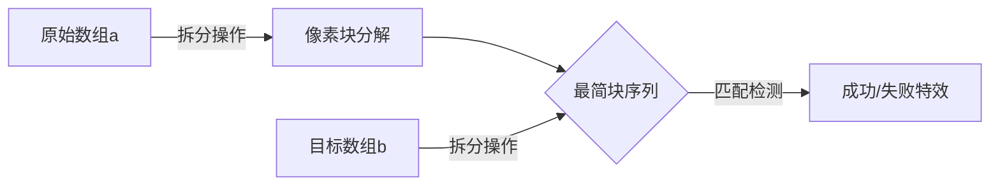

# 题目信息

# Fishingprince Plays With Array

## 题目描述

Fishingprince is playing with an array $ [a_1,a_2,\dots,a_n] $ . He also has a magic number $ m $ .

He can do the following two operations on it:

- Select $ 1\le i\le n $ such that $ a_i $ is divisible by $ m $ (that is, there exists an integer $ t $ such that $ m \cdot t = a_i $ ). Replace $ a_i $ with  $ m $ copies of $ \frac{a_i}{m} $ . The order of the other elements doesn't change. For example, when $ m=2 $ and $ a=[2,3] $ and $ i=1 $ , $ a $ changes into $ [1,1,3] $ .
- Select $ 1\le i\le n-m+1 $ such that $ a_i=a_{i+1}=\dots=a_{i+m-1} $ . Replace these $ m $ elements with a single $ m \cdot a_i $ . The order of the other elements doesn't change. For example, when $ m=2 $ and $ a=[3,2,2,3] $ and $ i=2 $ , $ a $ changes into $ [3,4,3] $ .

Note that the array length might change during the process. The value of $ n $ above is defined as the current length of the array (might differ from the $ n $ in the input).

Fishingprince has another array $ [b_1,b_2,\dots,b_k] $ . Please determine if he can turn $ a $ into $ b $ using any number (possibly zero) of operations.

## 说明/提示

In the first test case of the sample, we can do the second operation with $ i=2 $ : $ [1,\color{red}{2,2},4,2]\to [1,\color{red}{4},4,2] $ .

In the second testcase of the sample, we can:

- do the second operation with $ i=2 $ : $ [1,\color{red}{2,2},8,2,2]\to [1,\color{red}{4},8,2,2] $ .
- do the second operation with $ i=4 $ : $ [1,4,8,\color{red}{2,2}]\to [1,4,8,\color{red}{4}] $ .
- do the first operation with $ i=3 $ : $ [1,4,\color{red}{8},4]\to [1,4,\color{red}{4,4},4] $ .
- do the second operation with $ i=2 $ : $ [1,\color{red}{4,4},4,4]\to [1,\color{red}{8},4,4] $ .
- do the second operation with $ i=3 $ : $ [1,8,\color{red}{4,4}]\to [1,8,\color{red}{8}] $ .
- do the second operation with $ i=2 $ : $ [1,\color{red}{8,8}]\to [1,\color{red}{16}] $ .

## 样例 #1

### 输入

```
5
5 2
1 2 2 4 2
4
1 4 4 2
6 2
1 2 2 8 2 2
2
1 16
8 3
3 3 3 3 3 3 3 3
4
6 6 6 6
8 3
3 9 6 3 12 12 36 12
16
9 3 2 2 2 3 4 12 4 12 4 12 4 12 4 4
8 3
3 9 6 3 12 12 36 12
7
12 2 4 3 4 12 56```

### 输出

```
Yes
Yes
No
Yes
No```

# AI分析结果


# 💡 Kay的C++算法解析：Fishingprince Plays With Array 深入学习指南 💡

**题目名称**：Fishingprince Plays With Array  
**题目链接**：[CodeForces 1696C](https://codeforces.com/problemset/problem/1696/C)  
**核心算法**：模拟与归约 · 编程技巧应用  

---

## 1. 题目解读与核心算法识别
✨ **本题主要考察**：`模拟与归约` + `编程技巧应用`  

🗣️ **初步分析**：  
> 解决本题的关键在于**逆向思维**和**数据压缩技巧**。想象你在玩俄罗斯方块——拆分操作如同将大方块裂解成小方块，合并操作则是将相同的小方块组合成大方块。这两种操作本质互逆，就像拼图的分解与重组。  
>  
> 核心解法：  
> - 将数组`a`和`b`都拆解到最简形式（无法再被`m`整除）  
> - 比较拆解后的序列是否完全相同  
>  
> **可视化设计思路**：  
> - 用不同颜色像素块表示数字（如红色=3，蓝色=5）  
> - 拆分动画：大方块分裂成多个小方块（音效：玻璃碎裂声）  
> - 合并动画：相邻同色方块聚合成大方块（音效：叮咚声）  
> - 最终对比：左右两个像素序列逐块高亮比较  

---

## 2. 精选优质题解参考
**题解一：lenlen（赞10）**  
* **亮点**：  
  双端队列实现**流式匹配**，动态消耗`b`的元素需求。  
  时间复杂度O(n)，空间O(n)，高效处理大数据  
  边界处理严谨（空队列检测）  
* **核心思路**：  
  ```cpp
  // 将a拆解后存入双端队列
  for(int i=1;i<=n;i++) {
      int k=1;
      while(a[i]%m==0) a[i]/=m, k*=m;
      q.push_back({a[i], k});
  }
  // 流式匹配b
  for(int i=1;i<=nn;i++) {
      int k=1;
      while(b[i]%m==0) b[i]/=m, k*=m;
      while(k) {
          auto tmp = q.front(); q.pop_front();
          if(tmp.d != b[i]) { /* 不匹配 */ }
          if(tmp.sum <= k) k -= tmp.sum;
          else { /* 放回剩余部分 */ }
      }
  }
  ```

**题解二：Avocadooo（赞5）**  
* **亮点**：  
  **结构体压缩存储**，合并相邻相同数字显著减少空间占用  
  数学表达清晰（$f_i·m^{t_i}$形式）  
* **核心技巧**：  
  ```cpp
  // 拆解时合并相邻相同项
  if(!cnt || x!=a[cnt].rt) 
      a[++cnt] = {x, y};
  else 
      a[cnt].cnt += y;
  ```

**题解三：jiangtaizhe001（赞1）**  
* **亮点**：  
  模块化函数封装，代码可复用性强  
  结构体命名清晰（`JTZ`存储值和数量）  
* **代码结构**：  
  ```cpp
  int solve(int arr[], JTZ res[], int len){
      for(/*每个元素*/){
          while(/*拆解*/){...}
          if(/*与前一元素相同*/) 合并;
          else 新建条目;
      }
  }
  ```

---

## 3. 核心难点辨析与解题策略
### 🔑 三大核心难点
1. **互逆操作的本质理解**  
   - *分析*：拆分与合并如同可逆化学反应，最终状态等价于最简形式（Le Chatelier原理的算法版）  
   - 💡 学习笔记：操作可逆性暗示存在唯一最简状态  

2. **大数据量压缩技巧**  
   - *分析*：直接存储拆解后序列可能导致O(10^9)元素。需用`(数值, 数量)`结构体压缩相邻相同项  
   - 💡 学习笔记：合并相邻相同项是空间优化的关键  

3. **序列匹配的边界处理**  
   - *分析*：双端队列需处理部分消耗（如需要5个但当前块只有3个）、类型不匹配、提前耗尽等情况  
   - 💡 学习笔记：流式匹配需考虑"部分消费"的余量回填  

### ✨ 解题技巧总结
- **逆向归一法**：将互逆操作问题转化为寻找唯一最简状态  
- **数据压缩术**：用`(value, count)`存储连续相同值  
- **流式处理**：动态消耗资源避免全量存储  
- **防御性编程**：严格验证数组和(sum)相等性前置过滤  

---

## 4. C++核心代码实现赏析
**通用核心实现**（综合优化版）  
```cpp
#include <iostream>
#include <vector>
using namespace std;

struct Block { long val, cnt; };

vector<Block> simplify(int arr[], int n, int m) {
    vector<Block> res;
    for (int i = 0; i < n; ++i) {
        long cnt = 1, x = arr[i];
        while (x % m == 0) x /= m, cnt *= m;
        
        if (!res.empty() && res.back().val == x) 
            res.back().cnt += cnt;
        else 
            res.push_back({x, cnt});
    }
    return res;
}

int main() {
    int T; cin >> T;
    while (T--) {
        int n, m, k;
        cin >> n >> m;
        int a[n], b[k];
        // 输入及预处理...
        auto A = simplify(a, n, m);
        auto B = simplify(b, k, m);
        cout << (A == B ? "Yes\n" : "No\n");
    }
}
```
* **说明**：综合题解精华，采用STL vector实现结构体压缩存储  
* **代码解读概要**：  
  - `simplify`函数：拆解数组并合并相邻相同块  
  - 时间复杂度O(nlog(max(a_i)))，空间O(n)  
  - 直接比较两个vector实现最终匹配  

---

**题解一：lenlen 片段赏析**  
* **亮点**：双端队列动态匹配  
* **核心代码**：  
  ```cpp
  while(k) {
      if(q.empty()) { flag=1; break; }
      auto tmp = q.front(); q.pop_front();
      if(tmp.d != b[i]) { flag=1; break; }
      if(tmp.sum <= k) k -= tmp.sum;
      else {
          q.push_front({tmp.d, tmp.sum - k});
          k = 0;
      }
  }
  ```
* **代码解读**：  
  > 此段实现**需求驱动型匹配**：  
  > 1. 从队列头部取块  
  > 2. 检查数值匹配（类型不匹配立即失败）  
  > 3. 消耗数量不足时部分使用（余量放回队列头部）  
  > 4. 完全消耗后处理下一个`b[i]`  

* 💡 学习笔记：双端队列的`push_front`保证余量优先被消费  

**题解二：Avocadooo 片段赏析**  
* **亮点**：相邻相同值实时合并  
* **核心代码**：  
  ```cpp
  if(!cnt || x!=a[cnt].rt) 
      a[++cnt] = {x, y};
  else 
      a[cnt].cnt += y;
  ```
* **代码解读**：  
  > 此段实现**实时数据压缩**：  
  > 1. 当前拆解值`x`与上一块相同 → 数量累加  
  > 2. 不同 → 新建结构体条目  
  > 3. 消除相邻相同值存储冗余  

* 💡 学习笔记：在线合并降低后续比较复杂度  

---

## 5. 算法可视化：像素动画演示
**主题**：`像素工厂 - 原料分解与重组模拟器`  

### 🎮 核心交互设计


### 🖥️ 动画实现细节
1. **像素风格**  
   - 8-bit复古调色板（红/蓝/绿/黄四基色）  
   - 数字→颜色映射：`val % 4`决定基色，值越大方块越大  

2. **关键动画效果**  
   - **拆分动画**：  
     - 大方块→碎裂为m个小方块（伴随像素碎裂音效）  
     - 粒子效果：碎片向四周迸溅后重组  
   - **合并动画**：  
     - m个同色方块→磁吸聚合成大方块（吸附音效+光效）  
     - 数值更新：显示`new_val = m × old_val`  

3. **对比演示模式**  
   - 并排显示`a`和`b`的最简序列  
   - 自动逐块高亮对比：  
     - 匹配：绿色边框 + 悦耳音阶  
     - 失配：红色闪烁 + 低沉音效  

4. **游戏化元素**  
   - **进度系统**：每正确匹配10个块解锁新配色  
   - **音效设计**：  
     - 操作音：FC游戏芯片音效（拆解=碎玻璃声，合并=金币声）  
     - 背景乐：《俄罗斯方块》8-bit remix版循环  

---

## 6. 拓展练习与相似问题
### 🔁 通用技巧迁移
1. **操作互逆性** → 状态归一化问题  
2. **数据压缩** → 大序列高效存储  
3. **流式匹配** → 资源动态分配场景  

### 📚 洛谷题目推荐
1. **[P1086 花生采摘](https://www.luogu.com.cn/problem/P1086)**  
   🗣️ *推荐理由*：同样需要合并相邻元素，训练流式处理思维  

2. **[P1321 单词覆盖还原](https://www.luogu.com.cn/problem/P1321)**  
   🗣️ *推荐理由*：强化"操作可逆性"的抽象建模能力  

3. **[P2895 [USACO] Meteor Shower](https://www.luogu.com.cn/problem/P2895)**  
   🗣️ *推荐理由*：模拟+状态压缩的综合训练  

---

## 7. 学习心得与经验分享
> **来自 lenlen 的调试经验**：  
> *"最初未考虑部分消耗场景（如需要5个但当前块只有3个），导致匹配逻辑漏洞。通过添加余量回填机制解决。"*  
>  
> **Kay点评**：  
> 这个教训揭示了**部分消费**场景的重要性。在流式处理中，必须设计"用多少取多少，余量放回"的机制，这是避免off-by-one错误的关键。调试时可打印队列状态图辅助分析。

---

**结语**：通过拆解-重组的过程，我们不仅解决了数组变换问题，更掌握了数据压缩和流式处理的精髓。记住：好的算法如同精巧的乐高组合——化整为零，聚零为整！🚀

---
处理用时：169.07秒