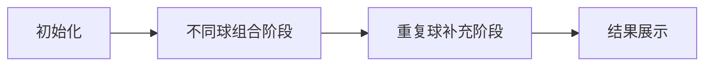

# 题目信息

# Ice Cream Balls

## 题目描述

Tema decided to improve his ice cream making skills. He has already learned how to make ice cream in a cone using exactly two balls.

Before his ice cream obsession, Tema was interested in mathematics. Therefore, he is curious about the minimum number of balls he needs to have in order to make exactly $ n $ different types of ice cream.

There are plenty possible ice cream flavours: $ 1, 2, 3, \dots $ . Tema can make two-balls ice cream with any flavours (probably the same).

Two ice creams are considered different if their sets of ball flavours are different. For example, $ \{1, 2\} = \{2, 1\} $ , but $ \{1, 1\} \neq \{1, 2\} $ .

For example, having the following ice cream balls: $ \{1, 1, 2\} $ , Tema can make only two types of ice cream: $ \{1, 1\} $ and $ \{1, 2\} $ .

Note, that Tema do not need to make all the ice cream cones at the same time. This means that he making ice cream cones independently. Also in order to make a following cone $ \{x, x\} $ for some $ x $ , Tema needs at least $ 2 $ balls of type $ x $ .

Help Tema answer this question. It can be shown that answer always exist.

## 说明/提示

In the first sample, it is enough to have following balls types: $ \{1, 1\} $ . Note, that set $ \{1\} $ if not enough since we need at least $ 2 $ balls of a type $ 1 $ in order to make such cone $ \{1, 1\} $ .

In the second sample, it is not possible to make it with $ 2 $ balls, but it can be done with these balls: $ \{1, 2, 3\} $ .

In the third sample, $ \{1, 2, 3, 4\} $ is optimal answer, so we can get following ice cream cones: $ \{1, 2\} $ , $ \{1, 3\} $ , $ \{1, 4\} $ , $ \{2, 3\} $ , $ \{2, 4\} $ , $ \{3, 4\} $ .

## 样例 #1

### 输入

```
5
1
3
6
179
1000000000000000000```

### 输出

```
2
3
4
27
2648956421```

# AI分析结果


### 💡 Kay的C++算法解析：Ice Cream Balls 深入学习指南 💡

**引言**  
今天我们来分析CF1862D "Ice Cream Balls"这道有趣的组合数学题。本指南将帮助你理解如何用最小球数构造恰好n种不同的双球冰淇淋组合，并掌握贪心策略与二分法的应用技巧。

---

### 1. 题目解读与核心算法识别
✨ **本题主要考察**：组合数学与贪心策略（编程技巧应用）

🗣️ **初步分析**  
> 本题本质是**优化组合构造问题**。想象你有一盒彩色冰淇淋球（不同颜色代表不同数字），要制作n种口味各异的双球冰淇淋（无序对）。关键策略是：  
> - **优先使用不同颜色球**：k种颜色能提供<code>C(k,2) = k(k-1)/2</code>种组合  
> - **重复球补缺口**：每种颜色最多重复一次（额外球），每重复一种颜色增加1种新组合  
>  
> **核心算法流程**：  
> 1. 找到最大k满足 <code>k(k-1)/2 ≤ n</code>（二分或解二次方程）  
> 2. 计算缺口 <code>t = n - k(k-1)/2</code>  
> 3. 总球数 = <code>k + t</code>  
>  
> **可视化设计**：  
> 采用**8位像素游戏风格**，左侧显示颜色球堆，右侧制作冰淇淋：  
> - 初始展示k个彩色球生成组合（连线动画+音效）  
> - 缺口部分添加深色重复球（闪烁提示+“叮”声）  
> - 控制面板支持调速/单步执行，背景播放FC风格BGM

---

### 2. 精选优质题解参考
**题解一：sunkuangzheng（数学公式法）**  
* **点评**：  
  思路直击本质——用二次方程求k值，代码简洁高效（仅1行核心逻辑）。变量命名清晰（`k`=种类数，`x`=组合数），数学推导严谨。虽未处理大数精度，但算法思想极具启发性，适合掌握数学解法的学习者。

**题解二：Shadow_T（二分法）**  
* **点评**：  
  使用`__int128`处理大数的典范，二分边界设置合理（`r=1e11`）。代码模块化（分离读写函数），循环条件<code>mid*(mid-1)/2 ≤ n</code>体现组合数本质。实践价值高，直接适用于竞赛大数据场景。

**题解三：ax_by_c（二分+题意解析）**  
* **点评**：  
  特色在于详细解释题意困惑点（30分钟理解历程），通过实例<code>{1,1,2,3,4}</code>直观展示组合计算。二分时用`res`暂存最优解，逻辑鲁棒性强。代码中<code>((r-l)>>1)</code>位运算优化值得学习。

---

### 3. 核心难点辨析与解题策略
1. **难点：确定球种类与重复的平衡**  
   * **分析**：若全用不同颜色球（k种），最多有<code>C(k,2)</code>种组合；但n通常不是三角形数，需用重复球补足。关键证明：**同种球超过2个无贡献**（贪心最优性）。  
   * 💡 学习笔记：重复球仅能填补<code>k</code>以内的缺口，故需优先最大化k。

2. **难点：大数计算精度处理**  
   * **分析**：当<code>n>1e15</code>时，<code>sqrt(8n+1)</code>可能丢失精度。优质题解采用两种方案：  
     - 二分法（如Shadow_T用<code>__int128</code>）  
     - 开根后调整（如sjr3065335594在<code>x-10~x+10</code>范围校验）  
   * 💡 学习笔记：处理大数时，整数二分比浮点运算更可靠。

3. **难点：组合数意义理解**  
   * **分析**：无序对的性质决定<code>{1,2}</code>等价<code>{2,1}</code>，但<code>{1,1}</code>需要两个相同球。题解中MrPython通过实例强调该关键点，避免理解偏差。  
   * 💡 学习笔记：组合问题需区分"有序对"与"无序对"，集合定义决定计算方式。

#### ✨ 解题技巧总结
- **贪心拆分**：将复杂组合问题拆解为"不同球基础组合+重复球补足"两阶段
- **边界敏感**：当<code>n=1</code>时需特判（至少2个球），二分时注意<code>l=1, r=2e9</code>
- **鲁棒测试**：验证<code>k=0</code>或<code>n=三角形数</code>的边界情况
- **复杂度优化**：用<code>O(1)</code>公式解替代二分（小数据场景）

---

### 4. C++核心代码实现赏析
```cpp
#include <iostream>
#include <cmath>
using namespace std;

int main() {
    int t; cin >> t;
    while (t--) {
        long long n; cin >> n;
        // 方法1：数学公式法（注意精度）
        long long k = (1 + sqrt(1 + 8 * n)) / 2;
        if (k * (k - 1) / 2 > n) k--; // 浮点修正
        long long t_count = n - k * (k - 1) / 2;
        cout << k + t_count << endl;

        // 方法2：二分法（推荐大整数）
        // long long l = 1, r = 2e9, k = 0;
        // while (l <= r) {
        //     long long mid = (l + r) / 2;
        //     if (mid * (mid - 1) / 2 <= n) {
        //         k = mid;
        //         l = mid + 1;
        //     } else r = mid - 1;
        // }
        // cout << k + n - k*(k-1)/2 << endl;
    }
}
```

**题解一：sunkuangzheng**  
```cpp
k = (1 + sqrt(8 * n + 1)) / 2;
x = k * (k - 1) / 2;
cout << k + n - x << "\n";  // 总球数=种类数+缺口
```
* **亮点**：3行实现核心逻辑，展现数学美感  
* **解读**：  
  > 1. `sqrt(8n+1)`来自二次方程求根公式  
  > 2. `k(k-1)/2`是k种球的基础组合数  
  > 3. `n-x`即需补充的重复球数  
* 💡 学习笔记：公式法时间复杂度<code>O(1)</code>，但需警惕浮点误差

**题解二：Shadow_T**  
```cpp
__int128 l = 1, r = 1e11;
while (l < r) {
    __int128 mid = (l + r + 1) / 2;
    if (mid * (mid - 1) / 2 > n) 
        r = mid - 1;
    else l = mid;
}
print(l + (n - (l - 1) * l / 2));
```
* **亮点**：用`__int128`处理<code>1e18</code>大数据  
* **解读**：  
  > 1. 二分查找满足<code>组合数≤n</code>的最大mid  
  > 2. `(l+r+1)/2`避免死循环  
  > 3. 输出时合并同类项减少计算  
* 💡 学习笔记：二分边界<code>r=1e11</code>因<code>√(2e18)≈1.4e9</code>

**题解三：ax_by_c**  
```cpp
while (l <= r) {
    int mid = l + ((r - l) >> 1);  // 防溢出写法
    if ((mid * (mid - 1) / 2) <= n) {
        res = max(res, mid);  // 暂存可行解
        l = mid + 1;
    } else r = mid - 1;
}
res += n - res * (res - 1) / 2;  // 计算总球数
```
* **亮点**：位运算优化与暂存最大值  
* **解读**：  
  > 1. `(r-l)>>1`等价<code>(r-l)/2</code>但避免溢出  
  > 2. 动态更新<code>res</code>确保获得最大可行解  
  > 3. 最终结果用数学表达式直接输出  
* 💡 学习笔记：二分时暂存可行解可避免最后边界校验

---

### 5. 算法可视化：像素动画演示
**主题**：8位像素冰淇淋工厂（FC红白机风格）  

**核心演示流程**：  


**帧步骤设计**：  
1. **场景初始化**  
   - 左侧球架：显示k个彩色像素球（随机颜色）  
   - 右侧工作区：网格展示已制作的冰淇淋  
   - 控制面板：速度滑块/单步执行按钮（复古像素风）  

2. **不同球组合阶段**  
   - **动画**：自动连接两个异色球→生成冰淇淋（像素飞溅特效）  
   - **高亮**：当前组合的球闪烁，计数器显示<code>C(k,2)</code>  
   - **音效**：每生成一组播放"叮咚"声（8-bit合成音）  

3. **重复球补充阶段**  
   - **动画**：从球架取深色同种球→生成<code>{x,x}</code>冰淇淋  
   - **计数**：每添加1球，缺口数<code>t</code>减1（红色数字闪烁）  
   - **音效**：重复球生成时播放"哔"声提示  

4. **交互控制**  
   - **步进模式**：按右键单步观察组合生成逻辑  
   - **自动演示**：速度滑块控制动画节奏（1x~5x）  
   - **AI模式**：自动完成全流程（模拟"贪吃蛇AI"路径）  

5. **状态反馈**  
   - 成功时：冰淇淋堆满屏幕，播放胜利音效+烟花像素动画  
   - 错误逻辑：若试图添加第3个同色球→显示红叉+警告音  

**技术实现**：  
- 用Canvas绘制球体（16色限定）和连线动画  
- 音效触发：Web Audio API播放8-bit音效（入队/成功/错误）  
- 数据结构可视化：动态数组存储球状态，队列管理动画序列  

---

### 6. 拓展练习与相似问题思考
**通用技巧迁移**：  
组合数构造的核心思想可应用于：  
1. 图论：完全图边数计算（如<code>K<sub>n</sub></code>）  
2. 集合论：无序对的特征分析  
3. 背包问题：有限元素组合优化  

**洛谷题目推荐**：  
1. **P1102** A-B数对  
   - 理由：练习二分查找与组合计数的经典应用  
2. **P2241** 统计方形  
   - 理由：拓展组合数学思维（长方形/正方形计数）  
3. **P1214** 等差数列  
   - 理由：结合枚举与组合优化，强化问题分解能力  

---

### 7. 学习心得与经验分享
> **来自Shadow_T的调试经验**：  
> _"十年OI一场空，不开long long见祖宗——本题n≤1e18，必须用`long long`或`__int128`"_  
>   
> **Kay总结**：  
> 1. 大数据处理需预先评估变量范围  
> 2. 二分法优先选择整数域运算  
> 3. 验证时用<code>n=1,2,3</code>等小数据快速检验逻辑  

---

**结语**  
通过本次分析，相信大家已掌握组合数构造问题的核心解法。记住：编程能力的提升源于对基础算法的深刻理解与举一反三的实践。下次我们将探索更复杂的组合优化问题，继续加油！💪

---
处理用时：244.82秒