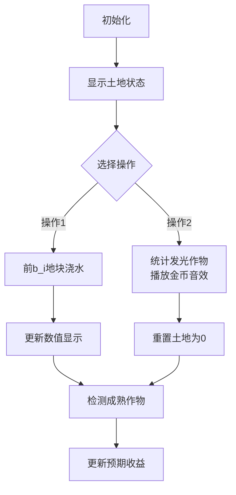

# 题目信息

# Watering an Array

## 题目描述

You have an array of integers $ a_1, a_2, \ldots, a_n $ of length $ n $ . On the $ i $ -th of the next $ d $ days you are going to do exactly one of the following two actions:

- Add $ 1 $ to each of the first $ b_i $ elements of the array $ a $ (i.e., set $ a_j := a_j + 1 $ for each $ 1 \le j \le b_i $ ).
- Count the elements which are equal to their position (i.e., the $ a_j = j $ ). Denote the number of such elements as $ c $ . Then, you add $ c $ to your score, and reset the entire array $ a $ to a $ 0 $ -array of length $ n $ (i.e., set $ [a_1, a_2, \ldots, a_n] := [0, 0, \ldots, 0] $ ).

Your score is equal to $ 0 $ in the beginning. Note that on each day you should perform exactly one of the actions above: you cannot skip a day or perform both actions on the same day.

What is the maximum score you can achieve at the end?

Since $ d $ can be quite large, the sequence $ b $ is given to you in the compressed format:

- You are given a sequence of integers $ v_1, v_2, \ldots, v_k $ . The sequence $ b $ is a concatenation of infinitely many copies of $ v $ : $ b = [v_1, v_2, \ldots, v_k, v_1, v_2, \ldots, v_k, \ldots] $ .

## 说明/提示

In the first test case, the sequence $ b $ is equal to $ [1, 3, 2, 3, 1, 3, 2, 3, \ldots] $ and one of the optimal solutions for this case is as follows:

- Perform the operation of the second type on the $ 1 $ -st day: your score increases by $ 3 $ and array $ a $ becomes equal to $ [0, 0, 0] $ .
- Perform the operation of the first type on the $ 2 $ -nd day: array $ a $ becomes equal to $ [1, 1, 1] $ .
- Perform the operation of the first type on the $ 3 $ -rd day: array $ a $ becomes equal to $ [2, 2, 1] $ .
- Perform the operation of the second type on the $ 4 $ -th day: your score increases by $ 1 $ and array $ a $ becomes equal to $ [0, 0, 0] $ .

It can be shown that it is impossible to score more than $ 4 $ , so the answer is $ 4 $ .

In the second test case, the sequence $ b $ is equal to $ [6, 6, 6, 6, \ldots] $ . One of the ways to score $ 3 $ is to perform operations of the first type on the $ 1 $ -st and the $ 3 $ -rd days and to perform an operation of the second type on the $ 2 $ -nd day.

## 样例 #1

### 输入

```
5
3 4 4
1 2 3
1 3 2 3
6 2 3
6 1 2 4 1 5
6 6
5 1 1
0 5 0 5 0
5
1 1 1
1
1
3 4 6
1 2 3
1 3 2 3```

### 输出

```
4
3
0
1
5```

# AI分析结果


### 💡 Kay的C++算法解析：Watering an Array 深入学习指南 💡

#### 1. 题目解读与核心算法识别
✨ **本题主要考察**：**模拟应用+贪心策略**

🗣️ **初步分析**：
> 本题核心在于通过**有限次操作最大化得分**。想象你在玩一个像素农场游戏：初始土地（数组）状态各异，每天可选择浇水（操作1）或收获（操作2）。收获时统计作物成熟数（`a_j=j`），得分后重置土地。关键策略是：**尽早收获可得的成熟作物，剩余时间采用稳定收益的浇水-收获循环**。

- **核心难点**：初始数组非全零时，需平衡前期收益（操作1提升成熟数）和后期稳定收益（每两天得1分）。通过分析发现：**超过2n次操作1的收益≤重置后交替策略的收益**，因此只需枚举前2n次操作1。
- **可视化设计**：用像素网格表示数组，绿色块表示`a_j=j`。操作1时，浇水区域（前b_i个）数值+1，像素块闪烁蓝色；操作2时绿色块发光计入分数，土地重置为棕色0值块。音效：浇水声（操作1）、金币声（得分）、重置音效。
- **游戏化元素**：将d天视为关卡，每达成一次操作2获得金币奖励，剩余天数显示可预期收益，增强目标感。

---

#### 2. 精选优质题解参考
**题解一（作者：Phartial，赞数13）**
* **点评**：  
  思路直击核心——**发现全零后交替操作的最优性**，并精确定义枚举边界（≤2n次）。代码规范：循环边界`min(d-1,2*n)`避免无效枚举；变量`c`实时统计成熟数；`b[i%k+1]`优雅处理循环序列。亮点在于用数学归纳证明全零时成熟数≤1，奠定贪心基础，实践可直接用于竞赛。

**题解二（作者：FiraCode，赞数2）**
* **点评**：  
  清晰分层"初始操作+稳定收益"策略，强调**2n次操作的充分性**。代码可读性强：独立函数`Get()`封装成熟数统计；`cnt[i]`缓存中间状态方便调试。算法优化：预处理`2*n`轮状态，避免重复计算。调试提示：注释`cout<<cnt[i]`便于验证，适合学习者借鉴。

---

#### 3. 核心难点辨析与解题策略
1.  **关键点1：确定操作1的收益临界值**
    * **分析**：操作1提升短期收益，但超过2n次后收益≤重置+交替策略。优质题解通过反证（如全零时成熟数≤1）得出枚举边界≤2n。
    * 💡 学习笔记：**操作1的收益存在边际效应，2n是黄金分割点**。

2.  **关键点2：高效统计成熟元素**
    * **分析**：每次操作后需O(n)遍历统计`a_j=j`。题解用简单循环实现，因n≤2000可接受。注意避免在枚举中嵌套O(n²)逻辑。
    * 💡 学习笔记：**小数据规模下暴力法可行，但需警惕嵌套循环**。

3.  **关键点3：处理循环序列b**
    * **分析**：b序列循环使用（`v_1,v_2,...,v_k,v_1,...`）。通过`b[i%k+1]`或`b[i%k]`（索引从0时）精准定位当前操作长度。
    * 💡 学习笔记：**循环序列用模运算定位，注意索引偏移问题**。

### ✨ 解题技巧总结
- **技巧A（收益平衡法则）**：短期收益（操作1提升成熟度）与稳定收益（交替策略）的权衡决定最优解。
- **技巧B（边界剪枝）**：数学分析减少枚举范围（2n），避免无效计算。
- **技巧C（循环处理）**：模运算处理无限循环序列，代码更健壮。

---

#### 4. C++核心代码实现赏析
**通用核心实现参考**
```cpp
#include <iostream>
#include <algorithm>
using namespace std;
const int N = 2000, K = 1e5+5;

int main() {
    int tt, n, k, d, a[N], v[K];
    cin >> tt;
    while (tt--) {
        cin >> n >> k >> d;
        for (int i = 0; i < n; i++) cin >> a[i];
        for (int i = 0; i < k; i++) cin >> v[i];
        
        int ans = 0;
        for (int i = 0; i <= min(d-1, 2*n); i++) {
            int cnt = 0;
            for (int j = 0; j < n; j++) 
                if (a[j] == j+1) cnt++; // 注意：位置从1计数
            
            ans = max(ans, cnt + (d-i-1)/2); // 核心收益公式
            
            if (i < min(d-1, 2*n)) // 避免最后一步多余操作
                for (int j = 0; j < v[i%k]; j++) 
                    a[j]++; // 前b_i元素+1
        }
        cout << ans << '\n';
    }
    return 0;
}
```
* **代码解读概要**：  
  1. 外层循环枚举操作1次数（0~min(d-1,2n)）  
  2. 内层循环统计当前成熟数`a_j=j`  
  3. 核心收益公式：当前收益 + 剩余天数交替策略收益  
  4. 循环序列处理：`v[i%k]`定位当日操作长度  

---

**题解一（Phartial）片段赏析**
```cpp
ans = max(ans, c + (d - i - 1) / 2); // 收益计算
for (int j = 1; j <= b[i % k + 1]; ++j) 
    ++a[j]; // 操作1
```
* **亮点**：收益公式与操作1分离，逻辑清晰  
* **代码解读**：  
  > `(d-i-1)/2`是剩余天数的交替策略收益，整除自动向下取整。操作1通过`b[i%k+1]`精准定位循环序列（注意索引+1因b从1存储）。  
* 💡 学习笔记：**分离收益计算与状态变更，代码更易调试**

**题解二（FiraCode）片段赏析**
```cpp
for (int i = 1; i <= 2*n && i < d; ++i) {
    cnt[i] = 0;
    for (int j = 1; j <= v[(i-1)%k+1]; ++j) a[j]++;
    for (int j = 1; j <= n; ++j) cnt[i] += a[j]==j;
}
```
* **亮点**：预处理各轮次成熟数，调试友好  
* **代码解读**：  
  > 先执行操作1（`a[j]++`），再独立统计成熟数存入`cnt[i]`。`(i-1)%k+1`正确处理循环序列索引偏移。  
* 💡 学习笔记：**缓存中间状态便于验证，牺牲空间换可维护性**

---

#### 5. 算法可视化：像素动画演示
**主题**：**"像素农场大作战"**（8位农场经营风格）  
**核心演示**：操作1浇水催熟作物，操作2收获成熟作物（`a_j=j`）得分  



1. **像素化设计**：
   - 土地：5x5网格（n≤25时）或滚动视图，每格显示`a_j`值
   - 状态色：棕色（`a_j=0`），浅绿（`a_j<j`），深绿（`a_j=j`）
   - 操作特效：浇水区域蓝色波纹动画，成熟作物闪烁金光

2. **动画流程**：
   - **浇水日**：选定前b_i格，像素块上浮+蓝色闪烁，数值+1（音效：水滴声）
   - **收获日**：深绿块爆炸为金币（音效：金币声），网格重置为全棕（音效：翻土声）

3. **游戏化UI**：
   - 控制面板：开始/暂停（镰刀图标），单步（铲子图标），速度滑块（水滴大小）
   - 数据面板：当前操作/总天数，成熟数，预期收益`(剩余天数-1)/2`
   - 成就系统：连续正确操作触发"丰收达人"奖杯（像素特效）

4. **教学提示**：
   - 旁白：*"看！浇水让前3格成长，但只有a₁=1能收获"*
   - 高亮：收益公式`当前得分 + (剩余天数-1)//2`随操作实时计算
   - 错误演示：操作1超过2n次时显示收益低于早重置策略

---

#### 6. 拓展练习与相似问题
**通用技巧迁移**：  
1. 操作收益平衡：短期收益VS长期稳定收益  
2. 循环序列处理：模运算定位周期性输入  
3. 枚举剪枝：数学分析确定操作上限  

**洛谷推荐**：  
1. **P1219 - 八皇后**  
   🗣️ 同样需平衡递归尝试（短期）与全局收益，巩固枚举剪枝  
2. **P1036 - 选数**  
   🗣️ 循环中组合短期操作（选数）与长期收益（质数计数）  
3. **P2678 - 跳石头**  
   🗣️ 二分答案中的操作次数与收益平衡，强化临界值分析  

---

#### 7. 学习心得与经验分享
> **来自Phartial的调试经验**：  
> *"我最初未意识到全零后成熟数≤1，导致贪心策略错误。通过构造全零数组手动模拟操作序列才突破瓶颈。"*  
> **Kay点评**：  
> 这印证了**边界条件手动模拟的重要性**！当理论分析遇阻时，用最小用例（如n=2）逐步推演，往往能发现隐藏性质。

---

### 结语
通过"浇水数组"这道题，我们学会了**平衡短期操作与长期收益**的策略思维，并掌握了**循环序列处理**和**枚举剪枝**的实用技巧。记住：在算法世界，有时最有效的不是一直冲刺，而是适时暂停收获成果！下次挑战见！💪

---
处理用时：206.74秒