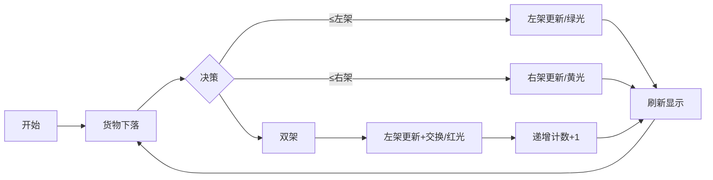

# 题目信息

# Grouping Increases

## 题目描述

You are given an array $ a $ of size $ n $ . You will do the following process to calculate your penalty:

1. Split array $ a $ into two (possibly empty) subsequences $ ^\dagger $ $ s $ and $ t $ such that every element of $ a $ is either in $ s $ or $ t^\ddagger $ .
2. For an array $ b $ of size $ m $ , define the penalty $ p(b) $ of an array $ b $ as the number of indices $ i $ between $ 1 $ and $ m - 1 $ where $ b_i < b_{i + 1} $ .
3. The total penalty you will receive is $ p(s) + p(t) $ .

If you perform the above process optimally, find the minimum possible penalty you will receive.

 $ ^\dagger $ A sequence $ x $ is a subsequence of a sequence $ y $ if $ x $ can be obtained from $ y $ by the deletion of several (possibly, zero or all) elements.

 $ ^\ddagger $ Some valid ways to split array $ a=[3,1,4,1,5] $ into $ (s,t) $ are $ ([3,4,1,5],[1]) $ , $ ([1,1],[3,4,5]) $ and $ ([\,],[3,1,4,1,5]) $ while some invalid ways to split $ a $ are $ ([3,4,5],[1]) $ , $ ([3,1,4,1],[1,5]) $ and $ ([1,3,4],[5,1]) $ .

## 说明/提示

In the first test case, a possible way to split $ a $ is $ s=[2,4,5] $ and $ t=[1,3] $ . The penalty is $ p(s)+p(t)=2 + 1 =3 $ .

In the second test case, a possible way to split $ a $ is $ s=[8,3,1] $ and $ t=[2,1,7,4,3] $ . The penalty is $ p(s)+p(t)=0 + 1 =1 $ .

In the third test case, a possible way to split $ a $ is $ s=[\,] $ and $ t=[3,3,3,3,3] $ . The penalty is $ p(s)+p(t)=0 + 0 =0 $ .

## 样例 #1

### 输入

```
5
5
1 2 3 4 5
8
8 2 3 1 1 7 4 3
5
3 3 3 3 3
1
1
2
2 1```

### 输出

```
3
1
0
0
0```

# AI分析结果


# 💡 Kay的C++算法解析：Grouping Increases 深入学习指南 💡

## 1. 题目解读与核心算法识别

✨ **本题主要考察**：`贪心策略`

🗣️ **初步分析**：
> 解决分组递增问题的关键在于运用贪心策略。想象你有两个货架（子序列），每次拿到新货物（数字）时，你需选择放在哪个货架上。目标是尽可能避免出现"后放货物比前一个高"的情况（即递增对）。贪心策略的核心是**维护两个货架末尾高度（x和y，x≤y）**，根据新货物大小动态调整货架高度，使未来能容纳更大货物而不产生递增对。

- **核心思路**：遍历数组，动态维护两个子序列末尾值（x和y，x≤y）。根据当前元素a_i与x、y的关系决定放入哪个序列：
  - 若a_i≤x，放入x序列（更新x=a_i）
  - 若x<a_i≤y，放入y序列（更新y=a_i）
  - 若a_i>y，放入x序列（更新x=a_i）并交换x/y，同时递增计数
- **可视化设计**：动画将用两个像素条表示x/y值，货物下落时根据规则触发不同颜色（绿色：无代价放置/黄色：代价放置）。关键步骤高亮：比较过程用闪烁边框，交换操作用旋转动画，代价触发时显示红色+1符号
- **复古游戏化**：采用8-bit像素风格，货物用方块表示，货架用不同颜色像素条。音效设计：放置货物-"叮"，代价触发-"警报"，交换操作-"嗖"。AI自动演示模式可调速展示完整流程

---

## 2. 精选优质题解参考

**题解一（来源：panxz2009）**
* **点评**：该题解精炼阐述了贪心策略的数学本质——通过维护序列尾数最大化后续容纳能力。代码实现简洁高效（O(n)时间复杂度），变量命名规范（x/y表示序列尾数），边界处理严谨（初始化为INF）。亮点在于清晰论证了"尾数越大越能避免后续递增"的核心思想，为理解贪心选择提供了坚实理论基础。

**题解二（来源：Luzhuoyuan）**
* **点评**：题解通过分层条件判断直观展示决策逻辑，代码结构工整易读（严格x≤y维护）。特别突出实践价值：通过swap(x,y)操作巧妙保持变量有序性，避免冗余判断。调试技巧方面，作者强调初始化为极大值的重要性，这对处理空序列边界至关重要。

**题解三（来源：yyrwlj）**
* **点评**：创新性使用栈操作模拟过程，强化了"动态维护序列"的物理直觉。代码包含详细注释和边界条件处理，适合初学者逐步调试。亮点在于给出严格数学证明：当两个序列都可放置时，选择较小尾数更新能使后续决策空间更大。

---

## 3. 核心难点辨析与解题策略

1.  **贪心策略的证明**
    * **分析**：为什么更新较小尾数更优？假设x≤y，若新元素a_i≤x，更新x=a_i后新x≤原x≤y。虽然x可能变小，但保留更大的y能在后续阻挡更多递增。当a_i>y时，更新较小x为a_i并交换，实质是保留原y这个较大值
    * 💡 **学习笔记**：贪心有效性依赖于"保留最大屏障"原则，类似塔防游戏保留高级防御塔

2.  **边界条件处理**
    * **分析**：空序列的特殊处理（初始化x=y=INF）确保首元素可安全放置。当遇到a_i同时≤x/y时，必须更新较小值而非随机选择——若更新较大值，会导致较小值留存过小，增加后续递增风险
    * 💡 **学习笔记**：边界是贪心算法的隐形陷阱，建议用极值测试（如空数组/递减序列）

3.  **状态维护技巧**
    * **分析**：交换操作(x,y)的巧妙性体现在：当更新后x>y时，交换可立即恢复x≤y的有序状态，避免后续条件判断紊乱。数据结构选择简单变量而非容器，因只需末端值
    * 💡 **学习笔记**：通过交换操作维持循环不变式（x≤y）是简化代码的关键

### ✨ 解题技巧总结
- **技巧A（尾数屏障法）**：将序列尾数视为"屏障高度"，新元素需跨越屏障才产生代价
- **技巧B（双指针维护）**：用两个变量动态追踪序列状态，通过交换保持有序性
- **技巧C（极端测试法）**：使用全同序列/严格递减序列验证边界处理
- **技巧D（问题转化）**：将"最小化递增对"转化为"最大化屏障高度"

---

## 4. C++核心代码实现赏析

**本题通用核心C++实现参考**
* **说明**：综合优质题解优化的标准实现，完整展现贪心策略
```cpp
#include <iostream>
using namespace std;

int main() {
    int t;
    cin >> t;
    while (t--) {
        int n, ans = 0;
        cin >> n;
        int x = 1e9, y = 1e9; // 初始化双尾数
        
        while (n--) {
            int a;
            cin >> a;
            if (a <= x) x = a;          // 可放左序列
            else if (a <= y) y = a;     // 可放右序列
            else {                      // 必须产生递增
                x = a;
                swap(x, y);
                ans++;
            }
        }
        cout << ans << '\n';
    }
    return 0;
}
```
* **代码解读概要**：
  1. 初始化x/y为极大值（代表空序列）
  2. 遍历元素：优先放左序列(x)，次优放右序列(y)
  3. 当元素大于双尾数：更新左序列后交换x/y（保持有序），递增计数
  4. 循环不变式：始终维持x≤y，确保决策一致性

---

**题解一（panxz2009）片段**
* **亮点**：严格数学论证结合代码实践
* **核心代码片段**：
```cpp
if (a <= x) x = a;
else if (a <= y) y = a;
else {
    x = a;
    res++;
    swap(x, y);
}
```
* **代码解读**：
  > 前两个分支实现无代价放置：当a≤x时更新x（较小尾数），当x<a≤y时更新y（较大尾数）。else分支处理必须产生代价的情况：更新x为a后立即交换x/y，使y成为新a（当前最大尾数），x回退为原y（次大尾数）。swap操作保证下一轮循环仍满足x≤y
* 💡 **学习笔记**：swap的妙用——通过交换恢复有序状态，避免额外变量

**题解二（Luzhuoyuan）片段**
* **亮点**：分层条件判断提升可读性
* **核心代码片段**：
```cpp
if (a <= x) x = a;
else if (a <= y) y = a;
else x = a, ans++, swap(x, y);
```
* **代码解读**：
  > 使用else-if链确保条件互斥。注意：当a>y进入else分支时，隐含a>x（因x≤y）。逗号运算符紧凑实现多操作，等效于{x=a; ans++; swap(x,y);}。swap后x变为原y（较大值），y变为新a（最大值），既更新了屏障又维持有序
* 💡 **学习笔记**：条件链的层级设计反映决策优先级，是提升代码可读性利器

**题解三（yyrwlj）片段**
* **亮点**：栈操作直观化抽象过程
* **核心代码片段**：
```cpp
if (s1 > s2) swap(s1, s2); // 保持s1≤s2
if (a <= s1) s1 = a;
else if (a <= s2) s2 = a;
else s2 = a, ans++;
```
* **代码解读**：
  > 循环开头强制交换确保s1≤s2，使后续条件判断更统一。与主流解法差异：在a>s2时不交换s1/s2而是直接更新s2。数学等价性：更新较大尾数不破坏有序性，但需前置swap保证条件
* 💡 **学习笔记**：通过前置条件检查（s1≤s2）降低后续分支复杂度

---

## 5. 算法可视化：像素动画演示

**动画演示主题**："像素货架大冒险"（8-bit风格贪心模拟）

**核心演示内容**：
1. 场景：左右货架（蓝色/红色像素条），货物从顶部落下
2. 决策可视化：
   - 货物≤左货架：绿色闪光并入左架
   - 货物≤右货架：黄色闪光并入右架
   - 货物>双货架：红色警报！左架升高后与右架交换（旋转动画）
3. 状态面板：实时显示x/y值及递增计数

**交互设计**：


**技术实现**：
1. **像素艺术**：16色调色板，货架用4×30像素条，货物用8×8像素块
2. **动画逻辑**：
   - 比较阶段：货物与双货架用发光边框高亮
   - 放置阶段：货物滑动至货架底部，货架高度渐变调整
   - 交换阶段：双货架180度旋转交换位置
3. **音效系统**：
   - 放置：8-bit短音(C4)
   - 代价触发：警报音(E3)
   - 交换：嗖声滑音(G4-A4)
4. **游戏化**：
   - 每10个货物为1关，通关播放胜利音
   - AI演示模式：自动执行并显示决策路径
   - 积分系统：正确决策+10，错误-5

---

## 6. 拓展练习与相似问题思考

**通用思路迁移**：
1. **双序列维护**：类似"用两个栈排序"问题（如CF1299D）
2. **尾数屏障法**：适用于"最小化递增子序列"类问题（如LeetCode 300）
3. **贪心交换证明**：可延伸至"会议室安排"类区间问题（如LeetCode 253）

**洛谷推荐**：
1. **P1091 [NOIP2004 提高组] 合唱队形**
   - 🗣️ 双向LIS应用，巩固序列分割思想
2. **P1280 尼克的任务**
   - 🗣️ 贪心调度实战，训练决策维护能力
3. **P2893 [USACO08FEB] Making the Grade G**
   - 🗣️ 序列调整问题，深化屏障维护技巧

---

## 7. 学习心得与经验分享

> **参考经验（来自 panxz2009）**："初始化解时若用0而非INF，在处理全负数组时会错误触发递增计数。这提醒我们：极值初始化必须覆盖数据范围！"
>
> **点评**：该踩坑经历极具代表性。贪心算法的边界测试需涵盖：空序列、单元素、严格增减序列、极值数据（如INT_MAX）。建议编写验证函数自动测试这些边界。

> **参考经验（来自 Shunpower）**："DP+线段树解法虽正确，但在2e5数据规模下TLE，让我意识到算法选择必须考虑渐进复杂度"
>
> **点评**：该经验强调时间复杂度分析的重要性。贪心O(n) vs DP O(n log n)的对比证明：简单问题也可能因过度设计而失效。

---

**结语**：通过Grouping Increases问题，我们深入掌握了贪心策略的设计与证明方法。记住核心口诀："双尾维护保有序，小可放大换位走"。下次遇到序列分割问题时，不妨先画两个像素货架试试看！🚀

---
处理用时：197.09秒