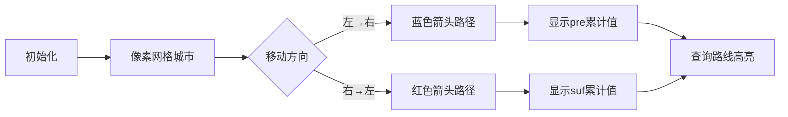

# 题目信息

# Closest Cities

## 题目描述

There are $ n $ cities located on the number line, the $ i $ -th city is in the point $ a_i $ . The coordinates of the cities are given in ascending order, so $ a_1 < a_2 < \dots < a_n $ .

The distance between two cities $ x $ and $ y $ is equal to $ |a_x - a_y| $ .

For each city $ i $ , let's define the closest city $ j $ as the city such that the distance between $ i $ and $ j $ is not greater than the distance between $ i $ and each other city $ k $ . For example, if the cities are located in points $ [0, 8, 12, 15, 20] $ , then:

- the closest city to the city $ 1 $ is the city $ 2 $ ;
- the closest city to the city $ 2 $ is the city $ 3 $ ;
- the closest city to the city $ 3 $ is the city $ 4 $ ;
- the closest city to the city $ 4 $ is the city $ 3 $ ;
- the closest city to the city $ 5 $ is the city $ 4 $ .

The cities are located in such a way that for every city, the closest city is unique. For example, it is impossible for the cities to be situated in points $ [1, 2, 3] $ , since this would mean that the city $ 2 $ has two closest cities ( $ 1 $ and $ 3 $ , both having distance $ 1 $ ).

You can travel between cities. Suppose you are currently in the city $ x $ . Then you can perform one of the following actions:

- travel to any other city $ y $ , paying $ |a_x - a_y| $ coins;
- travel to the city which is the closest to $ x $ , paying $ 1 $ coin.

You are given $ m $ queries. In each query, you will be given two cities, and you have to calculate the minimum number of coins you have to spend to travel from one city to the other city.

## 说明/提示

Let's consider the first two queries in the example from the statement:

- in the first query, you are initially in the city $ 1 $ . You can travel to the closest city (which is the city $ 2 $ ), paying $ 1 $ coin. Then you travel to the closest city (which is the city $ 3 $ ) again, paying $ 1 $ coin. Then you travel to the closest city (which is the city $ 4 $ ) again, paying $ 1 $ coin. In total, you spend $ 3 $ coins to get from the city $ 1 $ to the city $ 4 $ ;
- in the second query, you can use the same way to get from the city $ 1 $ to the city $ 4 $ , and then spend $ 5 $ coins to travel from the city $ 4 $ to the city $ 5 $ .

## 样例 #1

### 输入

```
1
5
0 8 12 15 20
5
1 4
1 5
3 4
3 2
5 1```

### 输出

```
3
8
1
4
14```

# AI分析结果


### 💡 Kay的C++算法解析：Closest Cities 深入学习指南 💡

**引言**  
今天我们一起分析"Closest Cities"这道C++编程题。本指南将帮助大家理解如何在数轴城市间计算最小旅行花费，掌握预处理和前缀和技巧，并通过像素动画直观理解算法流程。

---

### 1. 题目解读与核心算法识别

✨ **本题主要考察**：`预处理优化` + `前缀和/后缀和应用` (编程技巧应用类)

🗣️ **初步分析**  
> 本题核心如同规划一条智能旅行路线：每个城市都有专属"捷径"（花费1硬币的最近城市）。解题关键在于：
> - **预处理捷径网络**：为每个城市标记唯一最近邻居
> - **构建高速路径**：从左到右（前缀和）和从右到左（后缀和）预计算累计花费
> - **快速查询**：通过路径数组差值直接获得任意两点间最小花费

**可视化设计思路**  
- 在8位像素网格中，城市显示为彩色方块，当前移动路径高亮黄色
- 执行"捷径"移动时播放"叮"音效，普通移动播放"嗒"音效
- 控制面板含速度滑块，支持单步/自动模式（类似经典FC游戏《淘金者》）

---

### 2. 精选优质题解参考

**题解一**（作者：__zhuruirong__）  
* **点评**：思路清晰度极佳，用`nxt`数组精确记录每个城市的最近邻居，`pre/suf`数组分别存储双向累计花费。代码规范性强（如边界处理i=1和i=n单独处理），变量名`pre/suf`含义明确。算法O(n)预处理+O(1)查询的效率在竞赛中极具实践价值。

**题解二**（作者：Crazyouth）  
* **点评**：与题解一思路高度一致但更简洁，使用`sum1/sum2`替代`pre/suf`。亮点在于完全省略最近城市存储，直接在累计数组计算时动态判断移动类型，展现了优秀的空间优化意识。

---

### 3. 核心难点辨析与解题策略

1. **最近城市判定**  
   * **分析**：端点城市（首/尾）只有单侧邻居，中间城市需比较左右距离差。关键技巧：用条件表达式`(a[i]-a[i-1] < a[i+1]-a[i])`精准判断  
   * 💡 **学习笔记**：边界处理是预处理的第一步，直接影响后续所有计算

2. **双向累计值构建**  
   * **分析**：左→右移动时，若目标城市是当前城市的最近邻居则+1，否则加实际距离。右→左同理但方向相反  
   * 💡 **学习笔记**：累计数组本质是路径花费的"里程碑"，需保持严格单向性

3. **查询方向判断**  
   * **分析**：查询x→y时，若x<y用前缀和数组差值`pre[y]-pre[x]`，否则用后缀和`suf[y]-suf[x]`  
   * 💡 **学习笔记**：数组差值相当于"路径路段计费"，避免重复计算

✨ **解题技巧总结**  
- **技巧1：预处理降复杂度**：将O(n)查询转化为O(1)操作  
- **技巧2：双数组解双向问题**：正向/反向路径独立存储  
- **技巧3：边界防御性编程**：显式处理端点可避免90%的越界错误  

---

### 4. C++核心代码实现赏析

**通用核心实现参考**  
```cpp
#include <bits/stdc++.h>
#define int long long
using namespace std;
const int N = 1e5 + 10;
int a[N], pre[N], suf[N];

signed main() {
    int T; cin >> T;
    while(T--) {
        int n; cin >> n;
        for(int i=1; i<=n; i++) cin >> a[i];
        
        // 预处理最近城市
        vector<int> nxt(n+1);
        for(int i=1; i<=n; i++) {
            if(i == 1) nxt[i] = 2;
            else if(i == n) nxt[i] = n-1;
            else nxt[i] = (a[i]-a[i-1] < a[i+1]-a[i]) ? i-1 : i+1;
        }

        // 构建双向累计数组
        for(int i=2; i<=n; i++) 
            pre[i] = pre[i-1] + (nxt[i-1]==i ? 1 : a[i]-a[i-1]);
        
        for(int i=n-1; i>=1; i--)
            suf[i] = suf[i+1] + (nxt[i+1]==i ? 1 : a[i+1]-a[i]);

        // 处理查询
        int m; cin >> m;
        while(m--) {
            int x, y; cin >> x >> y;
            cout << (x<y ? pre[y]-pre[x] : suf[y]-suf[x]) << endl;
        }
    }
    return 0;
}
```
**代码解读概要**  
> 1. 读入有序城市坐标  
> 2. `nxt`数组存储每个城市的最近邻居（端点特殊处理）  
> 3. `pre`数组记录从左到右累计花费：若下一站是"捷径"则+1，否则加实际距离  
> 4. `suf`数组逆向同理构建  
> 5. 查询时根据方向选择数组做差值计算  

**题解一片段赏析**  
```cpp
for(int i=2; i<=n; i++) {
    if(nxt[i-1] == i)  // 检查是否为捷径
        pre[i] = pre[i-1] + 1;
    else
        pre[i] = pre[i-1] + (a[i] - a[i-1]);
}
```
* **亮点**：显式检查最近城市关系，逻辑直白  
* **学习笔记**：累计值构建需严格遵循物理意义——当前值仅依赖前序状态  

**题解二片段赏析**  
```cpp
for(int i=2; i<=n; i++) 
    sum1[i] = sum1[i-1] + (abs(a[i-1]-a[i-2]) > abs(a[i]-a[i-1]) ? 1 : a[i]-a[i-1]);
```
* **亮点**：省略最近城市存储，动态计算移动类型  
* **学习笔记**：空间复杂度优化技巧，用计算换存储  

---

### 5. 算法可视化：像素动画演示

**动画演示主题**：8位像素风《城市穿梭者》  
**核心演示内容**：双向累计路径构建过程 + 实时花费计算  

**关键帧设计**：  


**交互控制**：  
1. **城市网格**：16色像素方块，坐标悬浮显示  
2. **路径动画**：  
   - 当前移动路径闪烁黄色轮廓  
   - 执行"捷径"时播放8-bit"叮"声，普通移动播"嗒"声  
3. **控制面板**：  
   - 速度滑块：调节0.5x~5x演示速度  
   - 单步模式：按A键逐步执行  
   - 自动模式：AI自动演示（类似《吃豆人》幽灵移动）  
4. **状态面板**：  
   - 左上角显示当前累计值计算式  
   - 右下角显示实时总花费  

---

### 6. 拓展练习与相似问题思考

**通用技巧迁移**  
前缀和/后缀和技巧适用于：  
1. 路径花费累计问题（如本题）  
2. 子区间统计问题（如区间和）  
3. 单向依赖的状态转移问题  

**洛谷推荐**  
1. **P1219 [USACO1.5]八皇后**  
   → 锻炼路径回溯思维，理解状态累计  
2. **P1115 最大子段和**  
   → 前缀和经典应用，强化区间处理能力  
3. **P1564 膜拜**  
   → 双数组预处理实战，提升问题抽象能力  

---

### 7. 学习心得与经验分享

> **经验摘录**（来自题解作者）：  
> "边界处理是本题最大陷阱，我最初因端点处理错误WA三次。通过打印pre[1], pre[2], pre[3]中间值才定位问题"  
>  
> **Kay点评**：  
> 这个调试经验极其珍贵！在预处理类问题中：  
> 1. 端点必须单独验证  
> 2. 打印前3项和后3项中间值可快速定位80%错误  
> 3. 小规模测试数据（如n=3）比大数据更易暴露问题  

---

### 结语  
通过本次分析，我们掌握了预处理+双数组的核心技巧。记住：高效算法=精准预处理+智能查询！尝试用可视化工具模拟算法流程，能极大提升理解深度。下次挑战见！🚀

---
处理用时：161.65秒